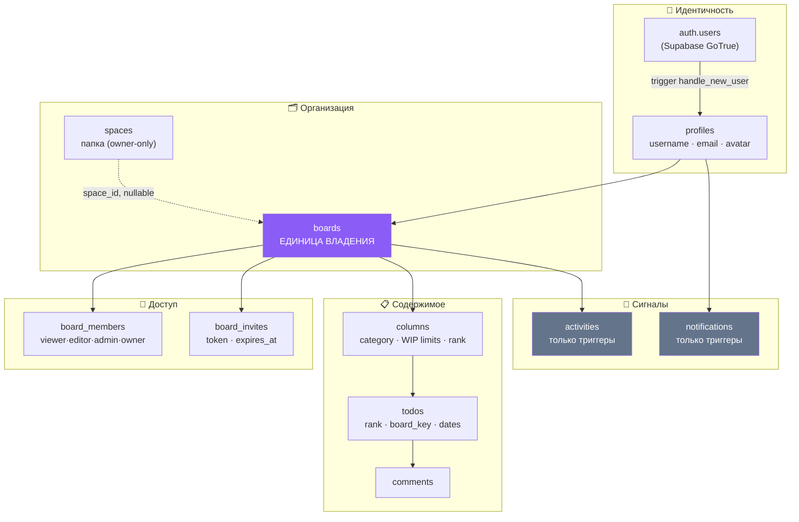

# 00 · Что такое Veylo

[← Оглавление](README.md) · [Далее: 01 · Архитектура →](01-architecture.md)

---

## 🧒 LEVEL 1 — Объясни ребёнку

> **Veylo — это цифровой офис.**

```
🏢 Veylo — это офисное здание
│
├── 🚪 Space — комната («Учёба», «Работа», «Стартап»)
│   │
│   └── 🪑 Board — стол в комнате («Курсовая», «Релиз 2.0»)
│       │
│       ├── 📋 Column — стопки на столе («Сделать», «В работе», «Готово»)
│       │   │
│       │   └── 🗒 Task — стикер в стопке («Написать введение»)
│       │
│       ├── 👥 Members — люди, которым разрешено подходить к столу
│       └── 📜 Activity — журнал: кто что двигал
│
├── 📬 Notifications — почтовый ящик у входа
└── ✉️ Invitations — приглашения зайти в комнату
```

Правила этого офиса:

- **Стикер нельзя положить на стол, к которому тебя не пускают.** Даже если ты
  знаешь, где стол стоит.
- **У каждого стикера есть номер** — `KAN-1`, `KAN-2` — и номера не
  переиспользуются. Выбросил `KAN-2`, следующий будет `KAN-4`, а не `KAN-2`.
- **Стол принадлежит одному хозяину.** Хозяина нельзя выгнать, понизить или
  заменить — это правило встроено в само здание, а не написано на бумажке у
  охранника.
- **Охранник стоит не у двери в офис, а у каждого стола.** Даже если ты
  залезешь в окно (в обход интерфейса), охранник у стола всё равно спросит
  пропуск.

Последний пункт — это **Row Level Security**, и это главная идея всего проекта.

---

## 👷 LEVEL 2 — Объясни разработчику

Veylo — это **collaborative work-management application**: Kanban-доски с
несколькими представлениями (Board, List, Summary, Calendar, Timeline),
ролевой моделью, приглашениями, комментариями, историей действий,
уведомлениями и realtime-синхронизацией между клиентами.

**Технически:**

```
Vite + React 19 + TypeScript (SPA)
        ↕ HTTPS / WebSocket
Supabase = PostgreSQL 17 + PostgREST + GoTrue (Auth) + Realtime + Storage
```

Нет собственного backend-сервера. **PostgreSQL — это и есть backend.**
Авторизация живёт в RLS-политиках, бизнес-инварианты — в триггерах и
constraint'ах, привилегированные операции — в `SECURITY DEFINER` RPC-функциях.

Фронтенд — «тонкий, но умный» клиент: TanStack Query держит весь серверный
state, мутации делают optimistic updates, а Realtime-канал патчит те же самые
кэш-записи, что и локальные мутации, — через **те же самые чистые функции**
(`src/services/todos/cache.ts`).

**Масштаб кодовой базы** (проверено):

| Метрика | Значение |
|---|---|
| Файлов `.ts` / `.tsx` в `src/` | 320 |
| React-компонентов (`.tsx` в `components/`) | 111 |
| Страниц (`src/pages/`) | 10 |
| Кастомных хуков (`src/hooks/`) | 19 (+ 2 файла тестов) |
| Сервисных папок (`src/services/`) | 16 |
| SQL-миграций | 58 |
| Таблиц в `public` | 10 |
| RPC в схеме `public` | 28 (+ служебная `graphql` в `graphql_public`) |
| Тестов Vitest | 47 файлов = 46 unit + 1 live |


---

## 🏛 LEVEL 3 — Объясни архитектору

### Какую проблему решает Veylo

Формально — ту же, что Jira, Trello и Linear: **сделать работу небольшой
команды видимой и упорядоченной**.

Но `docs/PRODUCT_SPEC.md` формулирует позицию точнее и это стоит цитировать
дословно на собеседовании:

> *«Jira — это **функциональный** референс. Это не UI-референс, не шаблон и не
> цель для подражания… Фича входит в scope, если она добавляет **возможность**.
> Она вне scope, если единственное её обоснование — что у Jira экран выглядит
> так.»*

Это редкий случай, когда у pet-проекта записан критерий отказа от фич. Он же
объясняет странности вроде «почему drag & drop написан руками, а не взят из
`@dnd-kit/sortable`».

### Что делает Veylo непохожим

| Решение | Почему это необычно |
|---|---|
| **Board — единица владения, не User** | `todos.user_id` **удалён** из схемы. Владение выражено через `boards.owner_id` + `board_members`. Это то, что делает коллаборацию возможной без переписывания схемы. |
| **Авторизация целиком в БД** | Ни одно правило доступа не существует только в React. Фронт лишь честно показывает, что доступно. |
| **Fractional ranks вместо dense positions** | Перемещение карточки — это запись **одной строки**, а не перенумерация всей колонки. Именно это делает одновременное перетаскивание двумя людьми безопасным. |
| **Клиент генерирует UUID задачи** | `crypto.randomUUID()` на клиенте → optimistic-строка **это и есть** реальная строка. Нет флага `isOptimistic`, нет «примирения» фейкового id с настоящим. |
| **Одна модель — пять представлений** | Board, List, Summary, Calendar, Timeline читают **один** кэш `["todos", boardId]` через **один** pipeline `useVisibleTodos`. |
| **Ровно одна поверхность пишет порядок** | `registry.test.ts` падает, если второе представление объявит `canReorder: true`. Инвариант защищён тестом, а не памятью. |

### Кто пользователь

Из `docs/PRODUCT_SPEC.md`: студенты, разработчики, фрилансеры, малые команды,
стартапы. То есть **не enterprise** — и это объясняет, почему PITR не включён,
почему нет observability и почему `docs/IMPLEMENTATION_PLAN.md` содержит целый
раздел «Calibration», объясняющий, что этот проект осознанно не покупает
страховку от потерь, которые пока не могут произойти.

Это очень сильный ответ на собеседовании: **«мы знаем, чего не сделали, знаем
почему, и знаем, что именно включит обратно эти работы».**

---

## 🎤 30-секундный питч для босса

> «Veylo — это Kanban-платформа для небольших команд. Пользователь заводит
> пространства, в них доски, на досках задачи, которые можно тащить между
> колонками, смотреть календарём или timeline-диаграммой, назначать на людей,
> комментировать и обсуждать.
>
> Технически это React-приложение поверх Supabase — то есть поверх PostgreSQL.
> Отдельного backend-сервера нет: вся авторизация выражена как Row Level
> Security-политики прямо в базе, поэтому даже если кто-то полностью обойдёт
> наш интерфейс и начнёт слать запросы напрямую, он не увидит ни одной чужой
> строки.
>
> Изменения синхронизируются между клиентами в реальном времени, а интерфейс
> обновляется оптимистично — карточка переезжает мгновенно, сеть догоняет
> потом. Если запись не прошла, карточка возвращается на место.»

Если спросят «а сколько человек это выдержит» → см.
[глава 23 · Performance](23-performance.md).

---

## 🗺 Визуальная карта продукта



**Читать так:** всё, что коллаборативно, висит на `boards`. Это единственное
архитектурное правило, которое `docs/ARCHITECTURE.md` формулирует как тест для
любой новой фичи:

> *«Принадлежит ли это доске? Если да — проектируй вокруг доски. Никогда не
> проектируй вокруг User, если ожидается коллаборация.»*

---

## Что уже работает, а чего нет

Честный список — он тебе понадобится, чтобы не пообещать лишнего.

### ✅ Работает (проверено по коду)

| Фича | Где живёт |
|---|---|
| Регистрация с username + подтверждение email | `services/auth/`, `20260821130000_handle_new_user_username.sql` |
| Вход по email **или** username | `authApi.signIn` + RPC `login_email_for` |
| Сброс пароля | `pages/auth/ForgotPasswordPage.tsx`, `ResetPasswordPage.tsx` |
| Spaces / Boards CRUD | `services/spaces/`, `services/boards/` |
| Kanban с DnD (мышь **и** клавиатура) | `hooks/useKanbanDnd.ts`, `hooks/keyboardDrag.ts` |
| List / Summary / Calendar / Timeline | `services/views/`, `components/{views,summary,calendar,timeline}/` |
| Фильтры, поиск, сортировка, группировка, swimlanes | `services/todos/view.ts`, `hooks/useBoardView.ts` |
| Роли и права (4 роли) | `services/members/permissions.ts` + RLS |
| Приглашения по ссылке и по email | `services/invites/`, RPC `create_invite`/`accept_invite`/`decline_invite` |
| Уведомления (invite, assigned) | `services/notifications/`, триггеры в БД |
| Комментарии + realtime | `services/comments/`, `20260818110000_realtime_comments.sql` |
| История действий (activities) | `services/activities/`, триггеры |
| Realtime + presence | `services/realtime/useBoardRealtime.ts` |
| For You (4 вкладки) | `services/forYou/`, `pages/forYou/ForYouPage.tsx` |
| i18n: en / ru / uz | `components/i18n/` |
| Тёмная / светлая тема | `providers/ThemeProvider.tsx`, `styles/global.css` |
| Загрузка аватара | `services/profile/uploadAvatars.ts` + storage-политики |

### ❌ Нет — и это осознанно

| Чего нет | Почему |
|---|---|
| **Starred / избранное в For You** | Было построено и **удалено**: единственная вкладка, которую нельзя вывести из существующих данных, требовала таблицы `todo_stars`, а миграцию не применили. Комментарий в `services/forYou/feed.ts` фиксирует решение дословно. |
| `attachments`, `labels`, `todo_labels` | Описаны в `docs/DATABASE.md` как **план**. В схеме их нет. |
| Передача владения доской | Инвариант I6: «сменить владельца — не операция членства». Операции просто не существует. |
| Point-in-Time Recovery | ~$125/мес ради фикстур. Отложено в Part V плана. |
| Архивация досок, обложки досок | Отложено (M8-03, M8-04). |
| Command palette, сохранённые фильтры | M12, не сделано. |
| React Testing Library / компонентные тесты | Осознанный отказ: риск в чистой логике, а не в разметке. |

---

## 🧪 Мини-квиз

<details>
<summary><b>1.</b> Почему в Veylo нет колонки <code>todos.user_id</code>?</summary>

Потому что владение выражено через доску, а не через пользователя. `user_id`
был удалён миграцией `20260807190500_drop_user_id.sql`. Если бы задача
принадлежала пользователю, любая коллаборация потребовала бы переписать схему,
все политики и все запросы. Авторство сохранилось как `todos.creator_id` —
но это факт о прошлом, а не право доступа.
</details>

<details>
<summary><b>2.</b> Что означает «Board — единица владения»?</summary>

Что `boards.owner_id` — единственная точка, где написано, чьё это. Все
дочерние таблицы (`columns`, `todos`, `comments`, `activities`) несут
`board_id NOT NULL`, и каждая RLS-политика на них сводится к одному предикату:
`board_id in (select accessible_board_ids())`. Расширение прав (например, на
`board_members` в M3) поменяло **одну функцию**, а не двадцать политик.
</details>

<details>
<summary><b>3.</b> Пользователь удалил задачу <code>KAN-2</code>. Какой номер получит следующая созданная задача?</summary>

`KAN-4` (если после `KAN-2` уже была `KAN-3`). Номера выдаёт `BEFORE INSERT`
триггер из счётчика `boards.next_key`, счётчик только растёт, номера **не
переиспользуются**. Это сознательно: переиспользованный ключ означал бы, что
ссылка «см. KAN-2» в чьём-то сообщении однажды начнёт указывать на другую
задачу.
</details>

<details>
<summary><b>4.</b> Есть ли в Veylo вкладка «Starred»?</summary>

**Нет.** Её построили и убрали. Она — единственная вкладка For You, которую
нельзя вывести из уже существующих данных: нужна таблица `todo_stars`, а
миграция не была применена. Вместо того чтобы показывать вкладку, которая
объясняет, почему не работает, фичу убрали до появления таблицы. Это записано
в `src/services/forYou/feed.ts`.
</details>

---

[← Оглавление](README.md) · [Далее: 01 · Big Picture Architecture →](01-architecture.md)
