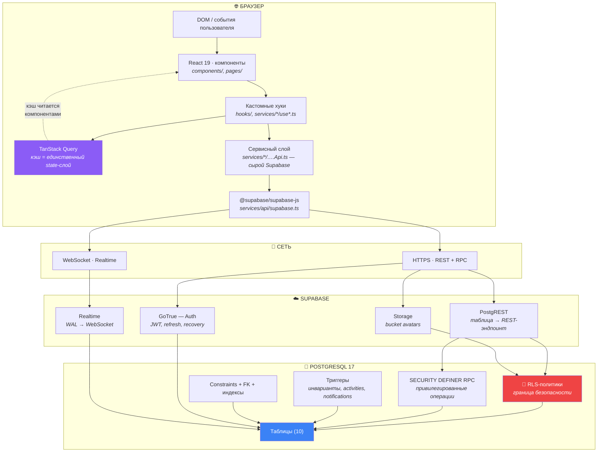
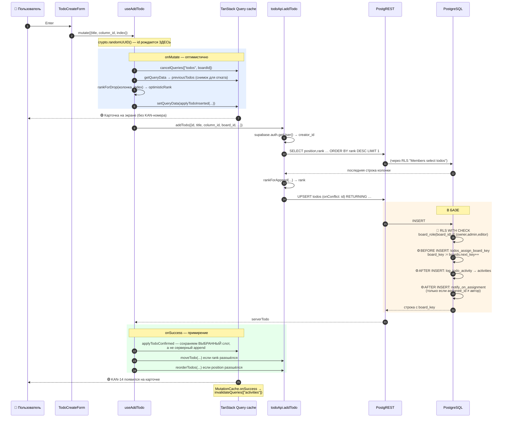
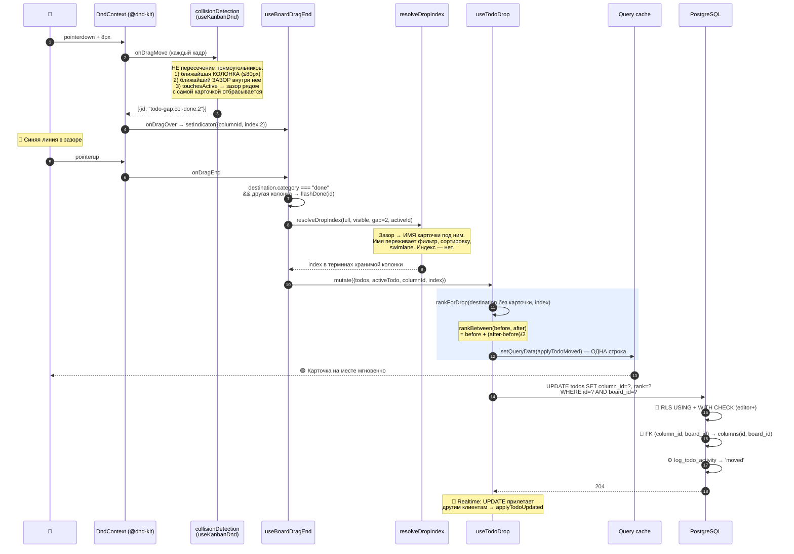
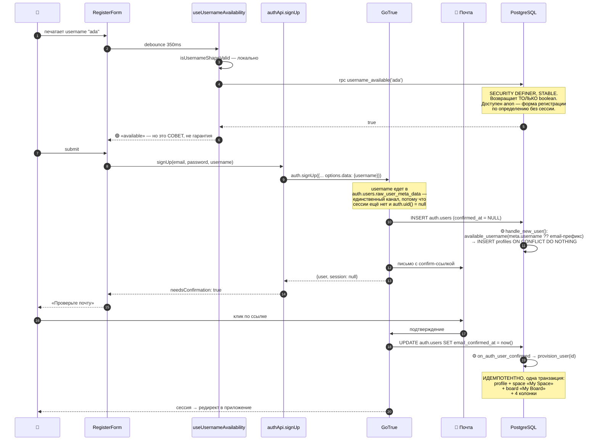
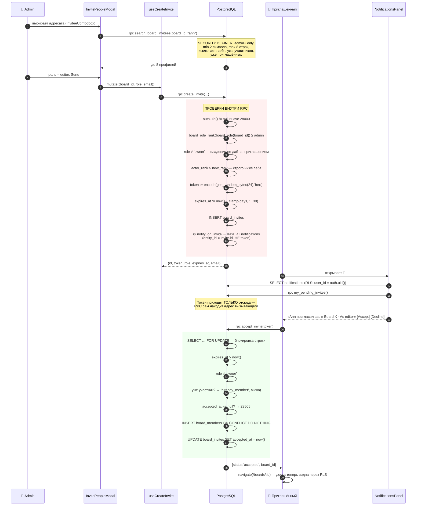
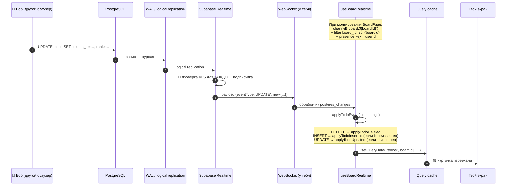

# 01 · Big Picture Architecture

[← 00 · Overview](00-overview.md) · [Оглавление](README.md) · [Далее: 02 · Структура →](02-project-structure.md)

---

## 🧒 LEVEL 1 — Объясни ребёнку

> Представь ресторан, в котором **нет официантов**.

Ты сидишь за столом (браузер) и заказываешь еду. Обычно между тобой и кухней
стоит официант — он записывает заказ, проверяет, можно ли тебе это заказать,
несёт на кухню, приносит обратно.

В Veylo официанта нет. Ты говоришь **прямо на кухню** (в базу данных). Но у
двери кухни стоит охранник, который знает про тебя всё: кто ты, к каким столам
приписан, что тебе можно трогать. Он не пропускает ничего лишнего — и он стоит
там всегда, даже если ты пришёл не через зал, а через окно.

Этот охранник — **Row Level Security**. Отсутствие официанта — **BaaS
(Backend-as-a-Service)**.

---

## 👷 LEVEL 2 — Слои системы



### Что делает каждый слой

| Слой | Файлы | Ответственность | Чего здесь **не должно** быть |
|---|---|---|---|
| **Компоненты** | `components/`, `pages/` | разметка, события, локальный UI-state | сетевые вызовы, бизнес-правила |
| **Хуки** | `hooks/`, `services/*/use*.ts` | склейка «данные ↔ UI», кэш-стратегия | JSX, разметка |
| **Сервисы** | `services/*/…Api.ts` | сырые вызовы Supabase, форма запроса | React, кэш, хуки |
| **Клиент** | `services/api/supabase.ts` | один типизированный синглтон | что угодно ещё |
| **PostgREST** | — | таблица → REST | — |
| **RLS** | `supabase/migrations/*.sql` | **вся авторизация** | — |
| **Триггеры** | миграции | инварианты, которые должны держаться для **любого** писателя | — |
| **RPC** | миграции | операции, требующие обхода RLS + собственной проверки | — |

**Правило, которое стоит запомнить дословно** (из `docs/FRONTEND.md`):

> *«Business logic should never live inside UI components.»*

и из плана (Part II, Enforcement rule 2):

> *«Frontend permission checks are UX only. They decide what to render. They are
> never a security control.»*

---

## 🏛 LEVEL 3 — Почему именно так

### Почему нет своего backend-сервера

| | Свой Node/Express API | Supabase (выбрано) |
|---|---|---|
| Кода писать | много (роуты, DTO, ORM, auth middleware) | почти нет |
| Где авторизация | в middleware — **и её можно забыть** | в RLS — **её нельзя обойти** |
| Realtime | ставить socket.io, писать fan-out | из коробки, через WAL |
| Типы | руками или через кодогенерацию | `supabase gen types` из живой схемы |
| Стоимость ошибки | забыл проверку → утечка | забыл политику → **таблица недоступна вообще** |
| Гибкость | любая | ограничена тем, что выражается в SQL |
| Vendor lock-in | нет | есть (но это PostgreSQL, миграции — обычный SQL) |

**Ключевой аргумент:** в middleware-подходе безопасность — это *действие*,
которое нужно не забыть совершить. В RLS-подходе безопасность — это *свойство
таблицы*: включил `enable row level security` без политик, и таблица не отдаёт
ничего вообще. **Дефолт стал безопасным.**

**Когда это решение было бы плохим:** если бы понадобилась тяжёлая серверная
логика (генерация PDF, интеграции с внешними API, фоновые задачи, ML).
Тогда — Edge Functions или отдельный сервис. Veylo этого не требует.

### Почему TanStack Query, а не Redux/Zustand для данных

Redux решает задачу «синхронизировать состояние **клиента**». Задача Veylo
другая: «показывать **чужие** данные, которые могут устареть».

Это разные проблемы. Серверный state:
- нельзя «просто изменить» — можно только попросить сервер и подождать
- устаревает сам по себе
- нуждается в дедупликации запросов, ретраях, инвалидации, фоновом обновлении

Redux всё это заставляет писать руками. TanStack Query это **и есть**.

Zustand в проекте **есть** (`src/stores/`), но используется ровно для двух
клиентских вещей: `toasts.ts` (очередь тостов) и `doneFlash.ts` (анимация
«карточка попала в Done»). Это правильное разделение: серверные данные — Query,
эфемерный UI-state — Zustand.

### Три «странных» решения, за которые стоит уметь ответить

1. **URL — это state.** Фильтры, сортировка, группировка, режим представления,
   открытая задача, открытая панель — всё в search params (`?view=`, `?task=`,
   `?panel=`, `?sort=`, …). Следствие: любое состояние доски шарится ссылкой,
   Back работает, refresh не теряет контекст. Цена: URL длинный, и всё, что
   приходит из него, — **недоверенный ввод** (см. `readOne`/`readList` в
   `hooks/useBoardView.ts`, которые валидируют против белого списка).

2. **Клиент генерирует UUID.** `crypto.randomUUID()` в `useAddTodo`.
   Optimistic-строка **является** реальной строкой. Нет флага `isOptimistic`,
   нет примирения id. `addTodo` делает `upsert` (не `insert`), поэтому гонка
   между созданием и перемещением не оставляет полузаписанную строку.

3. **Порядок хранится как `double precision`, а не как индекс.**
   См. [главу 12](12-kanban.md). Одно перетаскивание = запись **одной строки**.

---

## 🎬 «Что происходит, когда я нажимаю кнопку?» — 5 полных трассировок

Это самая ценная часть главы. Учись рассказывать их вслух.

---

### Трассировка 1 · Создание задачи

**Жест:** пользователь набирает заголовок в `TodoCreateForm` и жмёт Enter.



**Что здесь важно понимать:**

- `onMutate` **синхронный по эффекту**: карточка на экране до сети.
- Сервер всегда `append`-ит в конец колонки. Клиент помнит, в какой **зазор**
  пользователь вставил карточку, и после ответа **дописывает** правильный
  rank. Без этого карточка визуально прыгала бы вниз в момент ответа.
- `board_key` (номер `KAN-14`) клиент знать не может — его выдаёт триггер.
  Пока строка «в полёте», `board_key = null`, и это **и есть** индикатор
  pending-состояния. Отдельный флаг не нужен.

📖 Подробно: [05 · Data flow](05-data-flow.md), [12 · Kanban](12-kanban.md).

---

### Трассировка 2 · Перетаскивание карточки в другую колонку

**Жест:** пользователь тащит `KAN-7` из «To Do» в «Done», между двумя карточками.



**Если запись провалилась** (`onError`): восстанавливается снимок
`previousTodos`, карточка возвращается на место, `MutationCache` показывает
тост с текстом ошибки. Если снимка не было — запись кэша удаляется целиком,
и `useTodos` перезагружает правду.

**Если ранги «кончились»** (`rankBetween` вернул `null` — ≈50 подряд вставок
в один зазор): вызывается RPC `rebalance_column_ranks`, кэш перечитывается,
ранг вычисляется заново. Повтор ровно один: после ребаланса ранги снова кратны
1024, второй `null` означал бы, что ребаланс не сработал.

📖 Подробно: [12 · Kanban и DnD](12-kanban.md).

---

### Трассировка 3 · Регистрация нового пользователя



**Три вещи, которые тут стоит уметь объяснить:**

1. **Почему username едет через метаданные, а не INSERT в `profiles`?**
   Потому что подтверждение обязательно (`enable_confirmations = true` в
   `supabase/config.toml`), сессии нет, `auth.uid()` равен `null`, и RLS не
   пропустит запись. Метаданные переживают разрыв между регистрацией и
   подтверждением.

2. **Почему `provision_user` идемпотентен?** Потому что у него два вызывающих:
   триггер на подтверждении и RPC `provision_new_user` при каждом входе (как
   ремонтный путь). Первым делом он ищет существующую доску владельца и, если
   нашёл, возвращает её — второй запуск не создаёт второй аккаунт.

3. **Почему `handle_new_user` не имеет права падать?** Он выполняется **внутри**
   вставки в `auth.users`. Исключение откатило бы регистрацию целиком. Отсюда
   `on conflict (id) do nothing` и `available_username`, который не отказывает,
   а подбирает свободное имя.

📖 Подробно: [09 · Auth](09-auth.md), [10 · Usernames](10-usernames.md).

---

### Трассировка 4 · Приглашение коллеги и его принятие



**Ключевая деталь безопасности:** уведомление хранит **id приглашения**, а не
токен. Токен — это credential. Если бы он лежал в строке, которую клиент
получает обычным SELECT, инбокс превратился бы в место, откуда приглашение
может погасить любой, кто эту строку прочитает. Токен выдаёт только
`my_pending_invites()`, который сам определяет адрес вызывающего изнутри
функции — параметра «чей инбокс» просто не существует.

📖 Подробно: [15 · Invitations](15-invitations.md), [14 · Notifications](14-notifications.md).

---

### Трассировка 5 · Realtime — коллега двигает карточку, ты это видишь



**Три тонкости, которые отличают рабочий realtime от «почти рабочего»:**

1. **Те же самые чистые функции.** `applyTodoInserted` / `applyTodoUpdated` /
   `applyTodoDeleted` живут в `services/todos/cache.ts` — вне замыканий
   мутаций. Локальное перетаскивание и удалённое событие применяют **один и тот
   же код** к **одному и тому же массиву**. Иначе это были бы две реализации
   одного правила.

2. **Подавление эха.** `applyTodoEvent` проверяет, знает ли кэш этот `id`:
   `INSERT` для известной строки игнорируется (это эхо собственной мутации),
   `UPDATE` для неизвестной — тоже (значит `INSERT` был потерян, и починит это
   ресинк при переподписке, а не выдумывание строки из update-payload).

3. **Канал один и живёт на `BoardPage`.** Не в каждом представлении. Board,
   List, Summary, Calendar и Timeline читают те же записи кэша — они стали
   live одновременно, и ни одно из них не знает, что realtime существует.

📖 Подробно: [05 · Data flow](05-data-flow.md) § Realtime.

---

## 🧭 Правило, которое объясняет 80% решений

```
                 ┌─────────────────────────────┐
                 │  Появилась новая фича.      │
                 │  Где её место?              │
                 └────────────┬────────────────┘
                              │
              ┌───────────────┴───────────────┐
              │  Это ПРАВИЛО ДОСТУПА?         │
              └───────┬───────────────┬───────┘
                    да│               │нет
                      ▼               ▼
        ┌──────────────────┐   ┌──────────────────────────┐
        │ RLS / триггер /  │   │ Это ИНВАРИАНТ, который   │
        │ SECURITY DEFINER │   │ должен держаться для     │
        │ RPC              │   │ ЛЮБОГО писателя?         │
        │                  │   └──────┬──────────────┬────┘
        │ + зеркало в      │        да│              │нет
        │ permissions.ts   │          ▼              ▼
        │ ТОЛЬКО для UX    │   ┌────────────┐  ┌──────────────┐
        └──────────────────┘   │ CONSTRAINT │  │ Это ЗАПРОС   │
                               │ или TRIGGER│  │ или МУТАЦИЯ? │
                               └────────────┘  └──────┬───────┘
                                                      ▼
                                          ┌───────────────────────┐
                                          │ services/<feature>/   │
                                          │   <feature>Api.ts     │
                                          │   use<Thing>.ts       │
                                          │ + ключ в queryKeys.ts │
                                          │ + чистая логика в     │
                                          │   *.ts с *.test.ts    │
                                          └───────────────────────┘
```

---

## 🧪 Мини-квиз

<details>
<summary><b>1.</b> Пользователь отключил JS-проверки и отправил <code>UPDATE todos</code> на чужую доску напрямую в PostgREST. Что произойдёт?</summary>

Запрос дойдёт до PostgreSQL, там сработает политика
`"Editors and above update todos"` с предикатом
`board_role(board_id) in ('owner','admin','editor')`. Для не-участника
`board_role` вернёт `NULL`, `null in (...)` даст `NULL`, а `USING` трактует
`NULL` как отказ. Результат: **0 строк обновлено** (для `USING`) либо ошибка
`42501` (если нарушен `WITH CHECK`). Ни одна чужая строка не изменится.
</details>

<details>
<summary><b>2.</b> Почему <code>collisionDetection</code> в Veylo не использует пересечение прямоугольников?</summary>

Потому что на доске **ничего не переливается во время перетаскивания** — карточки
не раздвигаются. Значит, попадать курсором «внутрь» зазора нечем: зазоры
тонкие. Вместо этого detection ищет **ближайший к курсору зазор** по расстоянию
центров. Это даёт предсказуемое поведение независимо от того, насколько точно
человек попал.
</details>

<details>
<summary><b>3.</b> Почему клиент генерирует UUID задачи, а не база?</summary>

Чтобы optimistic-строка **была** реальной строкой. Раньше клиент ставил
фейковый `Date.now()`-id, который потом нужно было заменить на настоящий —
отсюда флаг `isOptimistic` и лишняя логика примирения. Плюс: `addTodo` делает
`upsert` по этому id, поэтому если параллельный `reorderTodos` дойдёт до сервера
первым, он не создаст «половинчатую» строку — оба запроса сойдутся на одной.
</details>

<details>
<summary><b>4.</b> Realtime-канал открывается в <code>BoardPage</code>, а не в <code>KanbanBoard</code>. Почему это важно?</summary>

Потому что `KanbanBoard` — только одно из пяти представлений. Если бы канал
жил там, List/Summary/Calendar/Timeline не были бы live, а переключение вкладки
рвало бы и переоткрывало сокет. Канал на уровне страницы = одна подписка на
доску, живущая ровно столько, сколько открыта доска, и все представления
становятся live «бесплатно», потому что читают те же записи кэша.
</details>

<details>
<summary><b>5. Predict:</b> что покажет экран между <code>onMutate</code> и ответом сервера при создании задачи?</summary>

Карточку с заголовком, назначенным (если выбрали) и датой (если выбрали) —
**но без номера `KAN-N`**. Потому что `board_key` выдаёт `BEFORE INSERT`
триггер из `boards.next_key`, и клиент физически не может его знать заранее.
Отсутствие ключа **и есть** индикатор «в полёте».
</details>

---

[← 00 · Overview](00-overview.md) · [Оглавление](README.md) · [Далее: 02 · Структура проекта →](02-project-structure.md)
