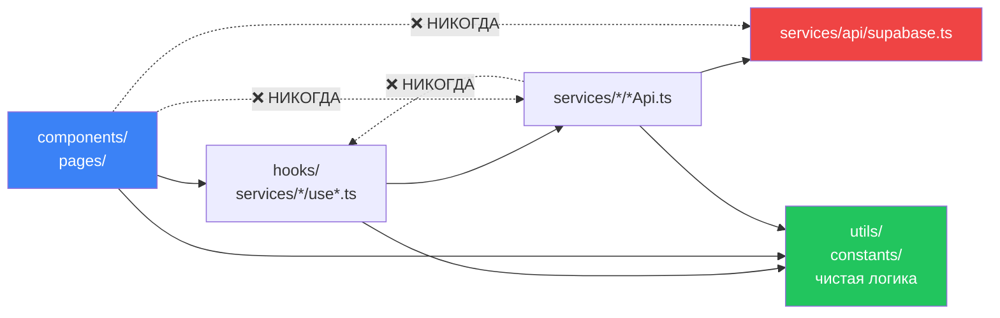

# 02 · Структура проекта

[← 01 · Архитектура](01-architecture.md) · [Оглавление](README.md) · [Далее: 03 · Стек →](03-stack.md)

---

## 🧒 LEVEL 1

> Репозиторий — это дом. У каждой комнаты своё назначение, и вещи не лежат где попало.

- `components/` — **гостиная**: то, что видно.
- `services/` — **кухня**: где готовят данные.
- `hooks/` — **проводка**: соединяет кухню с гостиной.
- `utils/` — **ящик с инструментами**: чистые функции без побочных эффектов.
- `supabase/migrations/` — **фундамент**: его нельзя переделать, можно только достроить.

Правило: **из гостиной нельзя лезть напрямую к плите.** Компонент не зовёт
Supabase — он зовёт хук, хук зовёт сервис, сервис зовёт Supabase.

---

## 👷 LEVEL 2 — Карта репозитория

```
TODO_app/
│
├── 📄 CLAUDE.md                    ← онбординг-документ для AI-ассистента и людей
├── 📄 README.md                    ← шаблон Vite + запись решения про React Compiler
├── 📄 package.json                 ← скрипты и зависимости
├── 📄 vite.config.ts               ← сборка (+ комментарий, почему нет React Compiler)
├── 📄 vitest.config.ts             ← быстрые offline-тесты (гейт CI)
├── 📄 vitest.live.config.ts        ← медленные тесты против ЖИВОЙ базы
├── 📄 tsconfig.app.json            ← strict, noUnusedLocals, alias @/
├── 📄 vercel.json                  ← SPA-rewrite: всё → /index.html
├── 📄 components.json              ← конфиг shadcn (алиасы указывают в ui/)
├── 📄 .env                         ← 🔴 gitignored: VITE_SUPABASE_URL, VITE_SUPABASE_PUBLISHABLE_KEY
│
├── 📁 .github/workflows/           ← CI: lint → build → test
├── 📁 public/                      ← статика (иконки, фоны тем, favicon)
├── 📁 backups/                     ← 🔴 gitignored: дампы БД (содержат данные)
├── 📁 scripts/                     ← SQL-харнессы верификации прав + seed
│
├── 📁 docs/                        ← проектная документация
│   ├── PRODUCT_SPEC.md             ← что мы строим и чего НЕ строим
│   ├── ARCHITECTURE.md             ← принципы (частично планы, не факты)
│   ├── DATABASE.md                 ← схема (частично планы)
│   ├── FRONTEND.md                 ← фронтовые соглашения
│   ├── API.md                      ← соглашения сервисного слоя
│   ├── RLS_AUDIT.md                ← аудит политик
│   ├── REALTIME_VERIFICATION.md    ← результаты проверки конкурентности
│   ├── IMPLEMENTATION_PLAN.md      ← 3226 строк: журнал + дорожная карта
│   └── 📁 learning/                ← ⬅️ ЭТОТ КУРС
│
├── 📁 supabase/
│   ├── config.toml                 ← локальная конфигурация (auth, realtime, storage)
│   └── 📁 migrations/              ← 58 файлов, forward-only, порядок = имя файла
│
└── 📁 src/
    ├── main.tsx                    ← точка входа: дерево провайдеров
    ├── 📁 types/
    │   ├── database.ts             ← 🤖 СГЕНЕРИРОВАН: npm run db:types
    │   └── data.ts                 ← ручные производные типы (Todo, TodoRow, …)
    ├── 📁 providers/               ← AuthProvider, ThemeProvider, ToastProvider (+ contexts)
    ├── 📁 services/                ← 16 папок: данные и сеть
    ├── 📁 hooks/                   ← 19 модулей (+2 теста): кросс-фичевая логика UI
    ├── 📁 components/              ← 111 .tsx: представление
    ├── 📁 pages/                   ← 10 .tsx: то, во что резолвится маршрут
    ├── 📁 stores/                  ← Zustand: toasts, doneFlash (клиентский state)
    ├── 📁 constants/               ← columns, priorities, workTypes
    ├── 📁 utils/                   ← чистые функции
    └── 📁 styles/global.css        ← Tailwind v4 + все design tokens
```

---

## 📂 `src/services/` — сервисный слой

**16 папок, одна на фичу.** Внутри каждой — одинаковый паттерн:

```
services/<feature>/
├── <feature>Api.ts     ← сырые вызовы supabase. Нет React. Нет кэша.
├── use<Thing>.ts       ← useQuery / useMutation. Знает про кэш.
├── <pureLogic>.ts      ← чистые функции (опционально)
└── <pureLogic>.test.ts ← его тест
```

Полный список:

| Папка | Что внутри | Ключевые файлы |
|---|---|---|
| `api/` | **исключение**: один клиент Supabase | `supabase.ts` |
| `queryClient/` | **исключение**: фабрика ключей + конфиг клиента | `queryKeys.ts`, `queryClient.ts`, `retryPolicy.ts` |
| `auth/` | регистрация, вход, выход, сброс пароля, доступность username | `authApi.ts`, `useLogin.ts`, `useRegister.ts`, `usePasswordReset.ts` |
| `boards/` | CRUD досок | `boardsApi.ts`, `useBoards.ts`, `useBoard.ts` |
| `spaces/` | CRUD пространств + группировка досок | `spacesApi.ts`, `groupBoards.ts` |
| `columns/` | CRUD колонок, лимиты, cache-функции | `columnsApi.ts`, `cache.ts`, `limitBreach.ts` |
| `todos/` | 🔥 сердце: CRUD задач, drag-drop, cache-функции, view-логика | `todoApi.ts`, `cache.ts`, `view.ts`, `dropIndex.ts`, `useTodoDrop.ts` |
| `members/` | ростер и права | `membersApi.ts`, `permissions.ts` |
| `invites/` | приглашения | `invitesApi.ts`, `useAcceptInvite.ts`, `inviteLink.ts` |
| `notifications/` | инбокс | `notificationsApi.ts`, `notifications.ts` |
| `comments/` | треды комментариев | `commentsApi.ts`, `cache.ts`, `commentDraft.ts` |
| `activities/` | история доски | `activitiesApi.ts`, `activityText.ts`, `activityGroups.ts` |
| `forYou/` | персональная лента | `forYouApi.ts`, `feed.ts`, `viewed.ts` |
| `profile/` | профиль + аватар | `profileApi.ts`, `uploadAvatars.ts` |
| `realtime/` | канал + presence | `useBoardRealtime.ts`, `events.ts`, `presence.ts` |
| `views/` | 🔥 чистая логика представлений | `registry.ts`, `calendar.ts`, `timeline.ts`, `summary.ts`, `scope.ts`, `trends.ts` |

### Правило импортов



| Разрешено | Запрещено |
|---|---|
| компонент → хук | компонент → `supabase` напрямую |
| хук → API-функция | API-функция → хук (сервис не знает про React) |
| кто угодно → `utils/`, `constants/` | `utils/` → сервис (utils чистые) |
| хук → `queryKeys` | ключ, написанный строкой в вызове |

**Как это проверить в реальном коде:**

```bash
# компоненты, импортирующие supabase напрямую (ожидаем: пусто или единичные случаи)
grep -rn "from \"@/services/api/supabase\"" src/components/ src/pages/

# ключи запросов, написанные руками вместо фабрики
grep -rn "queryKey: \[\"" src/ | grep -v queryKeys.ts
```

---

## 🔑 `queryKeys.ts` — почему это отдельный файл

Единственное место, где ключ запроса записан буквально. Комментарий в файле
формулирует причину:

> *«Keys are returned from functions, not held as constants, so a caller cannot
> mutate one that another query is already keyed by.»*

И главное решение — про `boardId`:

> *«`boardId` is a required argument even though it may be undefined. That is
> the point: making it required is what turned "find every place that reads the
> board" into a compiler error rather than a grep.»*

**Это отличный ответ на собеседовании про типобезопасность:** обязательный
аргумент, который может быть `undefined`, — не противоречие. `undefined` —
реальное состояние (параметр маршрута ещё не разрешён), и оно ключует запись,
чей запрос отключён (`enabled: Boolean(boardId)`), поэтому она никогда не
наполняется.

### Полная карта ключей

| Ключ | Форма | Board-scoped? |
|---|---|---|
| `todos(boardId)` | `["todos", boardId]` | ✅ плоский массив всей доски |
| `columns(boardId)` | `["columns", boardId]` | ✅ |
| `board(boardId)` | `["board", boardId]` | ✅ одна строка доски |
| `boards()` | `["boards"]` | ❌ индекс |
| `spaces()` | `["spaces"]` | ❌ |
| `members(boardId)` | `["members", boardId]` | ✅ из RPC `board_roster` |
| `invites(boardId)` | `["invites", boardId]` | ✅ |
| `inviteeSearch(boardId, q)` | `["invitee-search", boardId, q]` | ✅ |
| `myInvites()` | `["my-invites"]` | ❌ «что мне предлагают» |
| `activities(boardId)` | `["activities", boardId]` | ✅ |
| `todo(todoId)` | `["todo", todoId]` | ❌ полная строка для детали |
| `comments(todoId)` | `["comments", todoId]` | ❌ по задаче |
| `commentThreads()` | `["comments"]` | префикс для realtime DELETE |
| `forYou*()` | `["for-you", …]` | ❌ «что моё» |
| `notifications*()` | `["notifications", …]` | ❌ |
| `profile(userId)` | `["profile", userId]` | ❌ |
| `usernameAvailability(name)` | `["username-availability", name]` | ❌ глобально |

**Обрати внимание на асимметрию:** `todos(boardId)` — board-scoped, потому что
вопрос «что на доске». `forYouAssigned(userId)` — user-scoped, потому что
вопрос «что моё», и ответ определяет RLS, а не фильтр в запросе.

---

## 📁 `src/hooks/` vs `services/*/use*.ts`

Оба содержат хуки. Граница такая:

| `services/<feature>/use*.ts` | `src/hooks/` |
|---|---|
| привязан к **одной** фиче и её API | **кросс-фичевый** или чисто UI |
| знает про queryKey этой фичи | не обязательно знает про сеть |
| `useTodos`, `useAddTodo`, `useBoardMembers` | `useKanbanDnd`, `useBoardView`, `usePanel` |

Полный список `src/hooks/`:

| Хук | Что делает |
|---|---|
| `useBoardId` | читает `:boardId` из маршрута |
| `useBoardView` | 🔥 URL как store: режим, фильтры, поиск, сортировка, группировка |
| `useVisibleTodos` | 🔥 единый pipeline: scope → filter → search → sort |
| `useScopedTodos` | что попадает в scope (доска / пространство / всё) |
| `useTodosByColumns` | раскладывает задачи по колонкам (**не сортирует**) |
| `useKanbanDnd` | сенсоры, collision detection, индикаторы |
| `useBoardDragEnd` | вся логика `onDragEnd` |
| `useColumnReorder` | перестановка колонок (2 вызывающих: drag и меню) |
| `useTimelineDrag` | drag/resize/create на timeline |
| `useTimelineView` / `useCalendarView` | anchor + scale, тоже через URL |
| `usePermissions` | какие права у текущего пользователя на текущей доске |
| `useBoardModals` | какая модалка открыта и над каким объектом |
| `usePanel` | `?panel=` — открытая боковая панель |
| `useOpenTask` | `?task=` — открытая задача |
| `useTodoPatch` | точечный патч поля задачи |
| `useKeyPrefix` | префикс ключей доски (`KAN`) |
| `keyboardDrag` + `dragAnnouncements` | чистая логика DnD с клавиатуры + a11y-объявления |

---

## 📁 `src/components/` — 111 файлов, 20 папок

```
components/
├── ui/              ← вендоренные примитивы shadcn (button, input, dialog…)
│   └── SideBarUI/   ← ЭТО САЙДБАР, а не UI-кит: sidebar.tsx + use-sidebar.ts
├── layout/          ← Layout, ViewShell, Drawer, BoardIdentity, header/
├── routes/          ← Routes.tsx, ProtectedRoute, PublicRoute, lazyPages
├── kanban/          ← KanbanBoard, KanbanColumn, DropZone, ColumnDropZone, Swimlanes…
├── columns/         ← ColumnHeader, ColumnMenu, лимиты, удаление, категории
├── todo/            ← TodoCard, TodoItem/, TaskDetailModal, TodoForm
├── views/           ← ListView, ListRow, listGrid
├── summary/         ← SummaryView, StatusOverview, Breakdowns, TrendsChart, DueSoon
├── calendar/        ← CalendarView, CalendarGrid, DayCell, UndatedStrip
├── timeline/        ← TimelineView, TimelineGrid, TimelineRow, TimelineBar, timelineAxis
├── board/           ← ViewToolbar, ViewTabs, BoardFilters, BoardSearch, BoardSort, MemberStack, PresenceStack
├── boards/          ← BoardFormModal, DeleteBoardModal
├── spaces/          ← SpaceFormModal, DeleteSpaceModal
├── members/         ← MembersDrawer, MemberRow, MemberActions, roleStyles
├── invites/         ← InvitePeopleModal, InviteeCombobox, PendingInviteRow
├── notifications/   ← NotificationsButton, NotificationsPanel, InviteActions
├── forYou/          ← FeedList, FeedRow, ForYouTabs
├── comments/        ← CommentThread
├── activity/        ← ActivityDrawer, ActivityFeed
├── authForm/        ← LoginForm, RegisterForm, AuthField, AuthShell, PasswordInput
├── sideBar/         ← app-sidebar, BoardsSection, hooks/use-mobile
├── i18n/            ← настройка i18next + locales
└── ErrorBoundary.tsx
```

### Три вещи, которые легко перепутать

1. **`components/ui/SideBarUI/` — это не UI-кит.** Там ровно `sidebar.tsx` и
   `use-sidebar.ts`. Это **сам сайдбар**, вендоренный из shadcn. Настоящий
   сайдбар приложения — в `components/sideBar/`.

2. **`components/boards/` (множественное) vs `components/board/` (единственное).**
   - `boards/` — модалки CRUD **досок** (создать, удалить).
   - `board/` — панель инструментов **открытой доски** (табы, фильтры, поиск).

3. **`components/todo/TodoItem/` — это папка, а не файл.** Внутри — контролы
   карточки: `AssigneeControl`, `DueDateControl`, `PriorityControl`,
   `StatusControl`, `WorkTypeControl`, `TodoMenu`, `DatePanel`, `useCardPopover`.

---

## 🏛 LEVEL 3 — Почему границы именно такие

### Почему нет barrel-файлов (`index.ts` с реэкспортами)

`CLAUDE.md` фиксирует: *«Components consume the hooks and import them by path
— there is no barrel.»*

| За barrel | Против (и почему победило «против») |
|---|---|
| короткие импорты | ломает tree-shaking: импорт одного хука тянет модуль, который импортирует всё |
| одна «публичная поверхность» фичи | скрывает граф зависимостей: по импорту не видно, что реально используется |
| легче рефакторить | создаёт циклы: `A/index` → `B` → `A/index` |

На проекте с 320 файлами явные пути — это дешёвая цена за читаемый граф.

### Почему `providers/authContext.ts` отделён от `AuthProvider.tsx`

Не эстетика, а **правило линтера**: `react-refresh/only-export-components` не
может сделать fast refresh модулю, который экспортирует и компонент, и что-то
ещё. Тот же приём применён трижды:

- `providers/themeContext.ts` ← `ThemeProvider.tsx`
- `providers/authContext.ts` ← `AuthProvider.tsx`
- `components/routes/lazyPages.ts` ← `Routes.tsx` (экспортирует `router`, не компонент)

Это хороший пример того, как **инструментальное ограничение становится
архитектурным правилом** — и почему в комментарии написано, а не подразумевается.

### Почему чистая логика вынесена из хуков

Три примера, и в каждом причина разная:

| Модуль | Вынесен из | Причина |
|---|---|---|
| `services/todos/cache.ts` | замыканий `onMutate` | **realtime должен применять те же трансформации** — обработчик канала не может залезть в `onMutate` |
| `services/todos/dropIndex.ts` | `useBoardDragEnd` | off-by-one, который надо зафиксировать тестом |
| `services/members/permissions.ts` | компонентов | `role === "admin"`, разбросанные по компонентам, **расходятся**, и разошедшийся — тот, который никто не перечитывает |

Общий принцип: **вынеси в чистую функцию всё, у чего есть второй вызывающий или
что можно сломать незаметно.**

### Что НЕ должно попадать в каждую папку

| Папка | Не должно быть |
|---|---|
| `components/` | `supabase.`, `queryKeys.`, бизнес-правил, `role === "admin"` |
| `services/*/…Api.ts` | `useQuery`, `useState`, любых React-импортов |
| `utils/` | импортов из `services/` или `components/` — они чистые |
| `types/database.ts` | **ручных правок** — файл генерируется, правка исчезнет |
| `supabase/migrations/` | правок уже применённых файлов — миграции forward-only |

---

## 🧪 Мини-квиз

<details>
<summary><b>1.</b> Почему <code>services/api/</code> и <code>services/queryClient/</code> названы «исключениями»?</summary>

Потому что все остальные 14 папок в `services/` — это фичи (`todos`, `boards`,
`invites`…). Эти две — инфраструктура, общая для всех: один экземпляр клиента
Supabase и один конфиг QueryClient + фабрика ключей. Их «фича» — быть
единственными.
</details>

<details>
<summary><b>2.</b> Компонент нужно наделить доступом к данным доски. Какие файлы ты трогаешь и в каком порядке?</summary>

1. `services/queryClient/queryKeys.ts` — добавить ключ (если новый).
2. `services/<feature>/<feature>Api.ts` — функция запроса.
3. `services/<feature>/use<Thing>.ts` — хук с `useQuery`.
4. Компонент — вызывает **только** хук.

И **никогда** не импортировать `supabase` в компонент, даже «на минутку».
</details>

<details>
<summary><b>3.</b> Почему <code>useTodosByColumns</code> сознательно НЕ сортирует?</summary>

Потому что `useVisibleTodos` уже вернул массив **в порядке отображения**
(scope → filter → search → sort). Повторная сортировка сделала бы доску и
список двумя реализациями одного правила, и они бы разошлись. Задача
`useTodosByColumns` — только разложить по вёдрам колонок.
</details>

<details>
<summary><b>4.</b> Ты добавил файл <code>src/services/labels/labelsApi.ts</code>. Что ещё обязано появиться, прежде чем PR можно мержить?</summary>

Из Definition of Done в плане:
- миграция таблицы **с включённым RLS и хотя бы одной политикой в том же файле**;
- ключ в `queryKeys.ts`;
- `*.test.ts` для нетривиальной чистой логики;
- зелёные `npm run build` (единственный typecheck), `npm run lint`, `npm test`;
- обновление `CLAUDE.md` / `docs/*`, если поведение задокументировано там.
</details>

---

[← 01 · Архитектура](01-architecture.md) · [Оглавление](README.md) · [Далее: 03 · Технологический стек →](03-stack.md)
