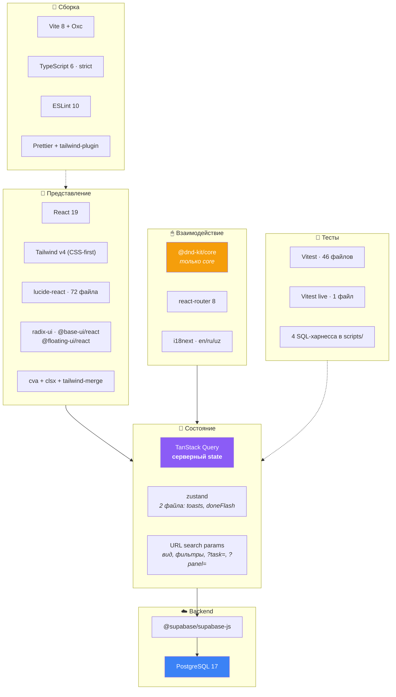

# 03 · Технологический стек

[← 02 · Структура](02-project-structure.md) · [Оглавление](README.md) · [Далее: 04 · React →](04-react.md)

---

## 🧒 LEVEL 1

> Стек — это набор инструментов на верстаке. Каждый решает **одну** задачу, и
> плохой мастер отличается тем, что берёт молоток там, где нужна отвёртка.

Правило Veylo (из Code Review Checklist): *«No new runtime dependency added
that a few lines of code would have covered.»* — новую зависимость нельзя
добавлять, если задача решается парой строк.

---

## 👷 LEVEL 2 — Полная таблица зависимостей

Версии — из `package.json` на текущем `main`.

### Runtime-зависимости

| Технология | Версия | Что делает | **Зачем именно в Veylo** | Альтернатива |
|---|---|---|---|---|
| **react** / **react-dom** | ^19.2.7 | UI-библиотека | Всё дерево интерфейса. React 19 нужен ради `use`, улучшенных transitions и совместимости с новым `@vitejs/plugin-react` | Vue, Svelte, SolidJS |
| **typescript** | ~6.0.2 | статические типы | `strict: true`. **`npm run build` = `tsc -b` — единственный typecheck в проекте**; `npm run dev` зелёный ничего не значит | JSDoc, Flow |
| **vite** | ^8.1.1 | dev-сервер + бандлер | HMR за миллисекунды, ESM-first. Заменяет CRA/webpack | webpack, Parcel, Rspack |
| **@vitejs/plugin-react** | ^6.0.3 | JSX + Fast Refresh | Использует **Oxc** (Rust), не Babel — поэтому Babel из проекта удалён целиком | plugin-react-swc |
| **tailwindcss** | ^4.3.3 | utility-first CSS | v4 **CSS-first**: нет `tailwind.config.js`, всё в `src/styles/global.css` через `@theme inline` | CSS Modules, styled-components, vanilla-extract |
| **@tailwindcss/vite** | ^4.3.3 | интеграция Tailwind v4 с Vite | Заменяет PostCSS-плагин | postcss + autoprefixer |
| **@supabase/supabase-js** | ^2.110.8 | клиент Supabase | **Единственный сетевой слой.** Auth + PostgREST + Realtime + Storage в одном SDK. Типизирован `Database` из `types/database.ts` | prisma + свой API, Firebase SDK |
| **@tanstack/react-query** | ^5.101.4 | server-state менеджер | 🔥 **Единственный реальный state-слой.** Кэш, optimistic updates, retry, дедупликация, инвалидация | SWR, RTK Query, Apollo |
| **react-router** | ^8.3.0 | маршрутизация | `createBrowserRouter`, `errorElement` на каждом маршруте, `useSearchParams` как хранилище состояния вида | TanStack Router, wouter |
| **@dnd-kit/core** | ^6.3.1 | примитивы drag & drop | 14 файлов. **Только `core`** — `@dnd-kit/sortable` сознательно не используется (см. ниже) | react-beautiful-dnd (архивирован), HTML5 DnD API |
| **zustand** | ^5.0.14 | клиентский state | Ровно 2 файла: `stores/toasts.ts` и `stores/doneFlash.ts`. Эфемерный UI-state, к серверу отношения не имеет | Context + useReducer, Jotai |
| **i18next** + **react-i18next** | ^26.3.6 / ^17.0.11 | локализация | 10 файлов. Три языка: `en`, `ru`, `uz`. Язык в `localStorage` | react-intl, Lingui |
| **lucide-react** | ^1.26.0 | иконки | **72 файла** — самая используемая UI-зависимость. Tree-shakable SVG | Heroicons, Phosphor, react-icons |
| **radix-ui** | ^1.6.5 | headless-примитивы | 3 файла. Доступность (ARIA, фокус, клавиатура) без навязанных стилей | Headless UI, Ark UI |
| **@base-ui/react** | ^1.6.0 | headless-примитивы (новое поколение) | 12 файлов. Часть вендоренных `ui/`-компонентов построена на нём | — |
| **@floating-ui/react** | ^0.27.20 | позиционирование поповеров | 9 файлов. Меню карточки, dropdown'ы, тултипы — «не вылезти за экран» | Popper.js |
| **class-variance-authority** | ^0.7.1 | варианты классов | Типобезопасные варианты `button`, `input` | ручные switch по props |
| **clsx** + **tailwind-merge** | ^2.1.1 / ^3.6.0 | склейка классов | `utils/cn.ts` = `twMerge(clsx(...))`. Разрешает конфликты (`p-2 p-4` → `p-4`) | `classnames` |
| **tw-animate-css** | ^1.4.0 | анимации-утилиты | Импортирован в `global.css` | ручные `@keyframes` |
| **shadcn** | ^4.18.0 | CLI + базовые стили | `@import "shadcn/tailwind.css"`. Компоненты **вендорятся** в `components/ui/`, а не остаются зависимостью | MUI, Chakra (обе — не headless) |
| **@fontsource-variable/geist** | ^5.3.0 | шрифт UI | Geist Variable — весь интерфейс. Self-hosted (нет запроса к Google Fonts) | Inter, system-ui |
| **@fontsource-variable/josefin-sans** | ^5.3.0 | шрифт логотипа | **Только** `.font-wordmark` — логотип. Раньше был шрифтом всего приложения, и это была ошибка | — |

### Dev-зависимости

| Технология | Версия | Роль |
|---|---|---|
| **vitest** | ^4.1.10 | 🔥 **единственный** тест-раннер. Два конфига: обычный (гейт CI) и live |
| **eslint** + **typescript-eslint** | ^10.6.0 / ^8.62.0 | линтер |
| **eslint-plugin-react-hooks** | ^7.1.1 | правила хуков (deps-массивы честные) |
| **eslint-plugin-react-refresh** | ^0.5.3 | 🔥 правило, из-за которого context'ы вынесены в отдельные файлы |
| **prettier** + **prettier-plugin-tailwindcss** | ^3.9.6 / ^0.8.1 | форматирование + сортировка Tailwind-классов |
| **supabase** (CLI) | ^2.114.0 | миграции, генерация типов, ключи |
| **@types/node**, **@types/react**, **@types/react-dom** | — | типы |

---

## 🏛 LEVEL 3 — Разбор нетривиальных выборов

### 1. Почему `@dnd-kit/core`, но **не** `@dnd-kit/sortable`

Это самое интересное решение стека, и его точно спросят.

`@dnd-kit/sortable` даёт «из коробки»: элементы **раздвигаются** при наведении,
`arrayMove` пересобирает массив, `SortableContext` держит стратегию.

Veylo от этого отказался. Причина зафиксирована в `CLAUDE.md`:

> *«Nothing in the board reflows while dragging; only the `DragOverlay` moves.»*

| | `@dnd-kit/sortable` | Ручной DnD Veylo |
|---|---|---|
| Что происходит при drag | карточки **раздвигаются**, layout прыгает | **ничего не двигается**, рисуется синяя линия в зазоре |
| Где цель дропа | вычисляется из reflow'нутого порядка | **всегда смонтированные** `DropZone` между карточками |
| Collision detection | `closestCenter` / `rectIntersection` | своя: ближайшая колонка (≤80px), затем ближайший зазор по вертикали |
| Стоимость на большой доске | reflow каждого кадра | zero — рисуется одна линия |
| Работает при фильтре/сортировке | ❌ индексы врут | ✅ `resolveDropIndex` переводит зазор в имя карточки |
| Клавиатура | базовая | своя (`keyboardDrag.ts`), сходится с мышью в одной точке |

**Плюс `DropZone` работает вдвойне:** в покое это ещё и affordance «создать
задачу здесь» — hover → `+` → форма открывается **в этом зазоре**.

UX-принцип 4 из плана: *«Drag and drop is a differentiator, not a checkbox. The
hand-rolled DnD exists because the library defaults were not good enough. Keep
that bar.»*

**Когда `sortable` был бы лучше:** простой список без фильтров, без нескольких
представлений и без требования «не дёргать layout». Тогда 30 строк вместо 400.

### 2. Почему React Compiler **выключен** — с числами

Единственный случай в проекте, где отказ от оптимизации **измерен**:

| Метрика | Без компилятора | С компилятором | Δ |
|---|---|---|---|
| Время сборки (медиана из 3) | 3.56 s | 9.70 s | **×2.7** |
| Чанк доски | 440 kB | 552 kB | **+25 %** |
| Экономия ре-рендеров | — | **не измерена** | ? |

Решение (M9-04): выключить, удалить `babel-plugin-react-compiler`,
`@rolldown/plugin-babel`, `@babel/core`, `@types/babel__core`. Причина —
`@vitejs/plugin-react` использует Oxc, поэтому Babel в сборке больше не нужен
вообще.

Триггер пересмотра записан: **M9-05** — профилирование рендеринга. *«Profile
first; memoise only what the profiler names.»* Если профайлер назовёт
ре-рендеры узким местом, компилятор — первое, к чему тянуться, но уже с
цифрами с обеих сторон.

**Это идеальный ответ на «расскажите про оптимизацию, которую вы НЕ сделали».**

### 3. Почему Tailwind v4 без конфиг-файла

В v4 конфигурация переехала в CSS:

```css
/* src/styles/global.css */
@theme inline {
  --color-canvas:  var(--canvas);
  --color-ink:     var(--ink);
  --text-micro:    0.625rem;   /* 10px — ключи карточек */
  --text-mini:     0.6875rem;  /* 11px — метаданные */
  --text-meta:     0.8125rem;  /* 13px — текст диалогов */
  --radius-card:   var(--radius-card-size);
}
```

Каждая такая переменная **становится утилитой**: `bg-canvas`, `text-ink-2`,
`text-mini`, `rounded-card`.

| Плюс | Минус |
|---|---|
| токены и утилиты — один источник | меньше примеров в интернете (v4 новая) |
| темизация через CSS-переменные работает без JS | нельзя написать сложную JS-логику генерации |
| нет «двух мест правды» (config + CSS) | нужен `@tailwindcss/vite` |

### 4. Три библиотеки headless-примитивов сразу — это нормально?

`radix-ui` (3 файла) + `@base-ui/react` (12) + `@floating-ui/react` (9).

**Честный ответ: это переходное состояние, а не архитектурное решение.**
Компоненты вендорятся через `shadcn` CLI, а shadcn мигрирует с Radix на Base UI.
Что уже добавлено — на Base UI, что осталось со старых времён — на Radix.
Floating UI решает другую задачу (позиционирование) и не конкурирует ни с чем.

Что бы сказал ревьюер: *«Направление — консолидация на Base UI. Пока их три,
это долг, а не дизайн. Он дешёвый: 3 файла на Radix — это меньше дня работы.»*

Это тот ответ, который на собеседовании ценится выше, чем «так надо».

### 5. Zustand используется на 2 файла — зачем он вообще

Строго по границе:

```
Серверные данные (устаревают, приходят из сети)  →  TanStack Query
Эфемерный UI-state (только в этой вкладке)        →  Zustand
```

Два случая:
- `stores/toasts.ts` — очередь тостов. Нужно писать в неё **из не-React кода**
  (`MutationCache.onError` в `queryClient.ts` — это не компонент). Context для
  этого не годится.
- `stores/doneFlash.ts` — «карточка попала в Done, мигни кольцом». Живёт
  меньше секунды, никого больше не касается.

**Ответ на «почему не Redux»:** Redux решал бы задачу, которой здесь нет.
Серверный state забрала Query, а два эфемерных флага не стоят store,
редьюсеров, экшенов и middleware.

---

## 📊 Стек одной картинкой



---

## 📚 Внешние ресурсы — что именно из них брать

Не список ссылок, а задание к каждой.

| Ресурс | Что оттуда нужно **конкретно для Veylo** |
|---|---|
| [react.dev — Reacting to Input with State](https://react.dev/learn/reacting-to-input-with-state) | Почему `useBoardView` держит вид в URL, а не в `useState`: состояние, которое должно переживать перезагрузку, не state компонента |
| [react.dev — You Might Not Need an Effect](https://react.dev/learn/you-might-not-need-an-effect) | Прочитай перед тем, как писать `useEffect`. В Veylo эффектов почти нет — все данные идут через Query |
| [TanStack Query — Optimistic Updates](https://tanstack.com/query/latest/docs/framework/react/guides/optimistic-updates) | Точный паттерн `onMutate` → snapshot → `onError` restore. Ровно то, что делают `useAddTodo` и `useTodoDrop` |
| [TanStack Query — Query Keys](https://tanstack.com/query/latest/docs/framework/react/guides/query-keys) | Почему ключ — массив, и почему префиксная инвалидация работает. Читать вместе с `queryKeys.ts` |
| [Supabase — Row Level Security](https://supabase.com/docs/guides/database/postgres/row-level-security) | Обязательно. `USING` vs `WITH CHECK`, `auth.uid()`, производительность политик |
| [PostgreSQL — CREATE POLICY](https://www.postgresql.org/docs/17/sql-createpolicy.html) | Первоисточник. Особенно: какие команды берут `USING`, какие — `WITH CHECK`, а `UPDATE` — обе |
| [PostgreSQL — Trigger Functions](https://www.postgresql.org/docs/17/plpgsql-trigger.html) | `BEFORE` vs `AFTER`, `NEW`/`OLD`, `TG_OP`. Нужно для `todos_assign_board_key` и `notify_on_*` |
| [dnd-kit — Collision detection](https://docs.dndkit.com/api-documentation/context-provider/collision-detection-algorithms) | Прочитай, а потом сравни с `useKanbanDnd.collisionDetection` — увидишь, почему ни один встроенный алгоритм не подошёл |
| [Figma — «Realtime editing of ordered sequences»](https://www.figma.com/blog/realtime-editing-of-ordered-sequences/) | Первоисточник идеи fractional indexing. Это ровно то, что делает `utils/rank.ts` |
| [Tailwind v4 — Theme variables](https://tailwindcss.com/docs/theme) | Как `@theme inline` превращает переменную в утилиту |
| [TypeScript — Utility Types](https://www.typescriptlang.org/docs/handbook/utility-types.html) | `Pick`, `Record`, `satisfies`. `types/data.ts` построен на них |
| [web.dev — Prefers-color-scheme](https://web.dev/articles/prefers-color-scheme) | Почему тема ставится инлайн-скриптом в `index.html` до React — иначе мигание |

---

## 🧪 Мини-квиз

<details>
<summary><b>1.</b> Почему React Compiler выключен, и что вернёт его обратно?</summary>

Измерено: ×2.7 время сборки и +25% размера чанка доски — против экономии
ре-рендеров, которую **никто не измерял**. Вернёт его задача M9-05:
профилирование рендеринга. Если профайлер назовёт ре-рендеры узким местом,
решение пересматривается — но уже с цифрами с обеих сторон, а не с одной.
</details>

<details>
<summary><b>2.</b> В чём практическая разница между <code>@dnd-kit/core</code> и <code>@dnd-kit/sortable</code> для Veylo?</summary>

`sortable` раздвигает элементы при перетаскивании и вычисляет цель из
переставленного порядка. Veylo ничего не двигает — только `DragOverlay` — и
целями служат постоянно смонтированные `DropZone` между карточками. При
включённом фильтре или сортировке индексы `sortable` соврали бы: видимый
список ≠ хранимый. `resolveDropIndex` решает это, переводя зазор в **имя**
карточки под ним.
</details>

<details>
<summary><b>3.</b> Что делает <code>utils/cn.ts</code> и зачем нужен <code>tailwind-merge</code>?</summary>

`cn(...)` = `twMerge(clsx(...))`. `clsx` собирает условные классы,
`tailwind-merge` разрешает конфликты внутри Tailwind: `cn("p-2", "p-4")` даёт
`p-4`, а не оба. Без него порядок в CSS-файле решал бы, кто победит, и
переопределение стиля через props работало бы через раз.
</details>

<details>
<summary><b>4.</b> Есть ли в проекте <code>tailwind.config.js</code>?</summary>

**Нет.** Tailwind v4 — CSS-first: тема, токены и утилиты объявлены в
`src/styles/global.css` через `@theme inline`. `components.json` (конфиг
shadcn) явно содержит `"tailwind": { "config": "" }`.
</details>

<details>
<summary><b>5.</b> Три библиотеки headless-примитивов сразу — как это защитить на code review?</summary>

Не защищать, а назвать честно: это переходное состояние. `shadcn` мигрирует с
Radix на Base UI, новые компоненты приходят на Base UI, старые остались на
Radix (3 файла). Floating UI — про другое (позиционирование), конфликта нет.
Направление — консолидация; долг мал и измерен.
</details>

---

[← 02 · Структура](02-project-structure.md) · [Оглавление](README.md) · [Далее: 04 · React →](04-react.md)
