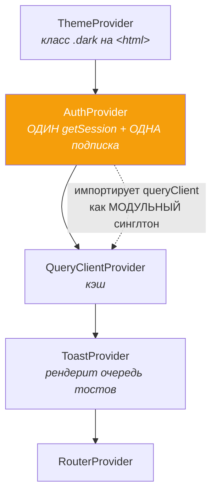

# 04 · React в Veylo

[← 03 · Стек](03-stack.md) · [Оглавление](README.md) · [Далее: 05 · Data flow →](05-data-flow.md)

---

## 🧒 LEVEL 1

> React — это **рецепт**, а не блюдо.

Ты не рисуешь экран. Ты пишешь функцию: «при таких данных экран выглядит так».
Меняются данные — React сам перерисовывает то, что изменилось.

- **Компонент** — один рецепт («карточка задачи»).
- **Props** — ингредиенты, которые дают сверху.
- **State** — то, что компонент помнит сам («форма сейчас открыта»).
- **Hook** — умение, которое компонент одалживает («уметь помнить», «уметь ходить в сеть»).
- **Context** — общая полка, до которой дотягивается всё дерево, минуя передачу из рук в руки.

---

## 👷 LEVEL 2 + 🏛 LEVEL 3 — на реальном коде Veylo

### 1. Дерево провайдеров — и почему порядок именно такой

```tsx
// src/main.tsx
createRoot(document.getElementById("root")!).render(
  <ThemeProvider>
    <AuthProvider>
      <QueryClientProvider client={queryClient}>
        <ToastProvider>
          <RouterProvider router={router} />
        </ToastProvider>
      </QueryClientProvider>
    </AuthProvider>
  </ThemeProvider>,
);
```

**Порядок — это архитектурное решение, а не случайность.**



**Почему `AuthProvider` **выше** `QueryClientProvider`?**

Потому что подписка на смену сессии обязана уметь **очищать кэш**:

```tsx
// src/providers/AuthProvider.tsx
if (event === "SIGNED_OUT") {
  queryClient.clear();
}
```

Но `useQueryClient()` здесь недоступен — контекста ещё нет, он ниже. Поэтому
`AuthProvider` импортирует **модульный синглтон** из
`services/queryClient/queryClient.ts`. Комментарий в коде это фиксирует:

> *«The module singleton, not `useQueryClient()`: this provider is mounted above
> `QueryClientProvider`, so there is no client in context to read.»*

**Почему кэш чистится на любой выход, а не только по кнопке?**
Потому что `SIGNED_OUT` прилетает и при истечении токена, и при выходе в другой
вкладке. Ключи board-scoped, но двум пользователям одного браузера может
достаться один и тот же `boardId` — и тогда в записи под ним лежали бы строки
предыдущего человека.

---

### 2. Context: почему **нет** значения по умолчанию

```ts
// src/providers/authContext.ts
export const AuthContext = createContext<AuthState | undefined>(undefined);
```

```ts
// src/services/auth/useAuth.ts
export function useAuth() {
  const auth = useContext(AuthContext);
  if (!auth) throw new Error("useAuth must be used inside an <AuthProvider>");
  return auth;
}
```

**LEVEL 3.** Соблазн — дать дефолт `{ user: null, loading: false }`. Комментарий
в коде объясняет, почему это ловушка:

> *«a plausible-looking default would hide it by bouncing the user to /login
> instead»*

То есть баг монтирования (компонент вне провайдера) превратился бы в
«загадочный разлогин»: пользователь залогинен, но его выкидывает, и никто не
понимает почему. `undefined` + бросок исключения = ошибка падает **там, где
она есть**, а не в трёх экранах от неё.

**Это общий принцип:** *fail loudly at the boundary*. Дефолт, который выглядит
правдоподобно, — худший вид дефолта.

---

### 3. Presentational vs container — `TodoCard` и `TodoItem`

Это **лучший пример композиции в проекте** и отличная история для собеседования,
потому что здесь есть «до» и «после».

**Было (до M5-02):** `TodoCard` держал состояние переименования и сам вызывал
`useUpdateTodo`. Компонент, который `docs/FRONTEND.md` приводил как пример
«только рендерит», был примером ровно обратного.

**Стало:**

```
┌─────────────────────────── TodoItem (container) ───────────────────────────┐
│  • useTodoPatch / useUpdateTodo — сеть                                     │
│  • useState для draft переименования                                       │
│  • useDraggable — регистрация в @dnd-kit                                   │
│  • строит <AssigneeControl> (нужен ростер) и <TodoMenu> (нужна вся строка)  │
│                                                                            │
│         ↓ передаёт вниз ТОЛЬКО значения и колбэки                          │
│                                                                            │
│  ┌──────────────────── TodoCard (presentational) ───────────────────────┐  │
│  │  props = TodoCardContent + TodoViewState + колбэки + ReactNode-слоты  │  │
│  │  НЕТ: useQuery, supabase, boardId, строки БД                         │  │
│  └──────────────────────────────────────────────────────────────────────┘  │
└────────────────────────────────────────────────────────────────────────────┘
```

Ключевой тип:

```ts
// src/types/data.ts
export interface TodoCardContent {
  title: string | null;
  taskKey: string | null;   // уже собранный "KAN-12", не две половинки
  workType: string | null;
  priority: string | null;
  dueDate: string | null;
}
```

Комментарий объясняет, почему это **не** `extends Todo`:

> *«The card used to take a whole database row as its props… so a column added
> to `todos` became a props change in a leaf component, and the card could not
> be rendered at all without a real row to hand it.»*

**LEVEL 3 — что это покупает:**

| Свойство | Почему |
|---|---|
| Тестируемость | карточку можно отрендерить из объекта, набранного руками — без БД, без QueryClient |
| Переиспользование | `DragOverlay` рендерит **ту же** карточку с `overlay: true` |
| Устойчивость к схеме | новая колонка в `todos` доходит до карточки только через `toCardContent()` — одну функцию |
| Понятные слоты | `assignee` и `menu` приходят как `ReactNode`, потому что им нужно то, чего у презентационной карточки быть не должно |

---

### 4. Кастомные хуки — четыре разных задачи

Хук в Veylo — не «функция с `use`». Каждый решает **свой класс** проблемы:

#### 4.1 Хук-адаптер к URL — `useOpenTask`

```ts
export function useOpenTask() {
  const [searchParams, setSearchParams] = useSearchParams();
  const taskId = searchParams.get("task") ?? undefined;

  const openTask = useCallback((todoId: string) =>
    setSearchParams(prev => { const n = new URLSearchParams(prev); n.set("task", todoId); return n; }),
  [setSearchParams]);

  const closeTask = useCallback(() =>
    setSearchParams(prev => { const n = new URLSearchParams(prev); n.delete("task"); return n; },
    { replace: true }),   // ⬅️ ЗАМЕТЬ: replace, не push
  [setSearchParams]);

  return { taskId, openTask, closeTask };
}
```

**Почему `openTask` пушит, а `closeTask` заменяет?**
Открытие задачи — навигация: Back должен закрыть её. Закрытие — не навигация:
если бы оно тоже пушило, Back после закрытия **снова открыл бы** задачу, и
пользователь застрял бы в цикле.

#### 4.2 Хук-pipeline — `useVisibleTodos`

Единственный ответ на вопрос «какие задачи показываем»:

```ts
const matching = searchTodos(filterTodos(all, filters, user?.id), query);
return sort === "manual" ? orderByBoard(matching, columns) : sortTodos(matching, sort, dir);
```

Комментарий:

> *«The single place any of that happens… Put the filter in `KanbanBoard` and
> the list disagrees with it the first time one of them changes.»*

**Порядок стадий — не произвольный:**
- filter и search **коммутируют** (независимые предикаты), но сортировать
  меньший массив дешевле;
- `sortTodos` обязан быть последним, иначе он сортирует строки, которые
  вот-вот выбросят.

**И `group` сюда сознательно НЕ входит:** группировка одна и та же, но *во что*
превращается группа — swimlane или заголовок секции — дело представления.
Pipeline заканчивается там, где заканчивается общий ответ.

#### 4.3 Хук-машина взаимодействия — `useKanbanDnd`

Держит сенсоры, свою `collisionDetection` и два индикатора. Возвращает 11
значений. Это нормально: он — единственный владелец состояния перетаскивания.

#### 4.4 Хук-производная — `usePermissions`

```ts
const role = members?.find(m => m.id === user?.id)?.role ?? null;
if (!id) return { ...NO_PERMISSIONS, isLoading: false };
return { ...permissionsFor(role), isLoading: isPending };
```

**Три решения в девяти строках:**

1. Роль берётся **из уже загруженного ростера**, не отдельным запросом.
   `useBoardMembers` и так в полёте на каждой странице доски. Отдельный
   self-read был бы вторым ответом на вопрос «какая у меня роль», способным
   разойтись со списком, отрисованным рядом.
2. Пока ростер грузится — **всё запрещено**. «Показать кнопку и отобрать» хуже,
   чем «показать позже».
3. Если доски в URL нет (страница профиля) — `isLoading: false`, а не
   вечное ожидание: `useBoardMembers` там отключён и никогда не резолвится.

---

### 5. Управляемые инпуты — где живёт draft

```tsx
// TodoItem (container)
const [draft, setDraft] = useState(todo.title ?? "");

<TodoCard
  draft={draft}
  editing={editing}
  onDraftChange={setDraft}
  onSave={() => patch({ title: draft })}
  onCancel={() => { setDraft(todo.title ?? ""); setEditing(false); }}
/>
```

**LEVEL 3 — почему draft отдельно от `todo.title`:**

`todo.title` — серверное значение, живёт в кэше Query. `draft` — то, что человек
печатает **прямо сейчас**. Если бы редактирование писало прямо в кэш:
- каждое нажатие клавиши было бы «оптимистичным обновлением»;
- отмена (Esc) не имела бы куда откатываться;
- прилетевшее realtime-обновление затёрло бы то, что человек набирает.

Правило: **серверное состояние и черновик — это две разные вещи, и они не
должны жить в одном месте.**

---

### 6. Error Boundary — единственный классовый компонент

```tsx
export default class ErrorBoundary extends Component<Props, State> {
  static getDerivedStateFromError(error: Error): State { return { error }; }
  reset = () => this.setState({ error: null });
  ...
}
```

**Почему класс?** Потому что у хуков **нет** эквивалента
`getDerivedStateFromError` / `componentDidCatch`. Это единственный случай в
React, где класс обязателен.

**Где он стоит** (два уровня, разная гранулярность):

```
Route errorElement (RouteErrorPage)  ← внешняя сеть: падение всей страницы
        └── ErrorBoundary вокруг списка карточек каждой колонки
                ← одна битая карточка стоит одного списка, а не доски
```

Из `CLAUDE.md`: *«wraps each column's card list so one bad card costs that list
and nothing else»*.

**Чего Error Boundary НЕ ловит** (спросят на собеседовании):
- ошибки в обработчиках событий (`onClick`) — они не в рендере;
- асинхронные ошибки (`setTimeout`, промисы);
- ошибки в самом Error Boundary.

Ошибки запросов и мутаций Veylo ловит другим механизмом — глобальными
`QueryCache.onError` / `MutationCache.onError`, см. [главу 22](22-errors.md).

---

### 7. `useSyncExternalStore` — правильный способ читать `matchMedia`

```ts
// src/components/sideBar/hooks/use-mobile.ts
export function useIsMobile() {
  return React.useSyncExternalStore(
    subscribe,                                     // подписка
    () => window.innerWidth < MOBILE_BREAKPOINT,   // снимок (клиент)
    () => false,                                   // снимок (сервер/гидрация)
  );
}
```

Комментарий в файле объясняет, что было до:

> *«The previous version subscribed in an effect and then called setState
> synchronously to seed the value — the cascading-render pattern the lint rule
> flags. This also removes the one-frame flash of the desktop layout.»*

**LEVEL 3.** Это канонический пример «внешнего хранилища»:
`window.matchMedia` — источник истины **вне** React. Классический
`useEffect + useState` даёт лишний рендер и один кадр неправильной вёрстки.
`useSyncExternalStore` читает реальное значение **уже на первом рендере**.

Тот же приём применим к: `localStorage`, `navigator.onLine`, `IntersectionObserver`.

---

### 8. Мемоизация — где она есть и почему

React Compiler выключен, значит мемоизация **ручная**. Правило проекта — не
мемоизировать всё подряд, а только там, где есть измеримая причина:

| Место | Что мемоизировано | Причина |
|---|---|---|
| `useVisibleTodos` | `useMemo` вокруг filter→search→sort | пробегает **весь** массив доски на каждый рендер |
| `useBoardView` | `useMemo`, ключ — `searchParams.toString()` | `useSearchParams` возвращает **новый** объект на каждую смену локации; объект фильтров с новой идентичностью перезапустил бы все memo ниже, включая группировку всей доски |
| `AuthProvider` | `useMemo({ user, loading })` | иначе новый объект контекста на каждый рендер = ре-рендер всего дерева |
| `useKanbanDnd` | `useCallback` на `collisionDetection`, `handleDragOver` | вызываются на каждый кадр перетаскивания |
| `useBoardDragEnd` | **сознательно НЕ мемоизирован** | `DndContext` не мемоизирован сам, стабильная идентичность ничего не купит, а замыкание держит почти всё состояние драга |

Последняя строка — самая ценная. Комментарий в коде:

> *«Deliberately not a `useCallback`: `DndContext` is not memoised, so a stable
> identity would buy nothing.»*

**Это то, что отличает понимание от карго-культа:** `useCallback` полезен, только
если получатель что-то делает со стабильностью ссылки.

---

## 📋 Шпаргалка: React-паттерны Veylo

| Паттерн | Где | Зачем |
|---|---|---|
| Provider composition | `main.tsx` | порядок = зависимости |
| Context без дефолта + throw | `authContext.ts`, `themeContext.ts` | баг падает там, где он есть |
| Presentational / container | `TodoCard` / `TodoItem` | тестируемость, устойчивость к схеме |
| Слоты через `ReactNode` | `assignee`, `menu` в `TodoCard` | дать детям то, чего у родителя быть не должно |
| URL как store | `useBoardView`, `usePanel`, `useOpenTask` | шарится ссылкой, переживает refresh |
| push vs replace | `openTask` / `closeTask` | Back ведёт себя ожидаемо |
| Чистое ядро + тонкий хук | `permissions.ts` + `usePermissions` | правило тестируется без React |
| `useSyncExternalStore` | `use-mobile.ts` | нет лишнего рендера и мигания |
| Класс только для Error Boundary | `ErrorBoundary.tsx` | у хуков нет аналога |
| `lazy` + `Suspense` | `lazyPages.ts` | тяжёлый `BoardPage` не в первом чанке |
| Хук выше ранних `return` | `BoardPage` разделён на два компонента | порядок хуков не меняется между рендерами |

Последний пункт стоит показать явно:

```tsx
export default function BoardPage() {
  const boardId = useBoardId();
  if (!isUuid(boardId)) return <NotFoundPage />;   // ранний return
  return <BoardView boardId={boardId} />;           // хуки — ниже, в другом компоненте
}

function BoardView({ boardId }: { boardId: string }) {
  const { data: board, isPending, error } = useBoard(boardId);
  const view = useBoardView();
  const { panel, closePanel } = usePanel();
  const viewers = useBoardRealtime(boardId);       // ⬅️ все хуки ДО ранних return
  if (isPending) return <Loading />;
  ...
}
```

Комментарий в коде: *«Validating the param and then calling `useBoard` in the
same component would mean an early return ahead of a hook, which changes the
hook order between renders.»* Это **Rules of Hooks**, применённое осознанно.

---

## 🧪 Мини-квиз

<details>
<summary><b>1.</b> Почему <code>AuthProvider</code> импортирует <code>queryClient</code> напрямую, а не через <code>useQueryClient()</code>?</summary>

Потому что он смонтирован **выше** `QueryClientProvider` — контекста ещё нет.
А доступ к клиенту ему нужен, чтобы вызвать `queryClient.clear()` на
`SIGNED_OUT`. Поменять порядок нельзя: тогда `QueryClientProvider` оказался бы
выше провайдера, чьё состояние определяет, что вообще можно запрашивать.
</details>

<details>
<summary><b>2. Predict:</b> что произойдёт при вызове <code>useAuth()</code> вне <code>AuthProvider</code>?</summary>

Бросится `Error("useAuth must be used inside an <AuthProvider>")`, и его поймает
ближайший Error Boundary. Это **намеренно**: с правдоподобным дефолтом
`{ user: null }` пользователя молча выкинуло бы на `/login`, и симптом оказался
бы в трёх экранах от причины.
</details>

<details>
<summary><b>3.</b> Почему <code>TodoCard</code> принимает <code>assignee</code> и <code>menu</code> как <code>ReactNode</code>, а не как данные?</summary>

Потому что этим двум узлам нужно то, чего у презентационной карточки быть не
должно: пикер исполнителя ходит за ростером доски (`useBoardMembers`), а меню
нужна полная строка `Todo` и мутации. Передавая их готовыми узлами,
`TodoItem` оставляет карточку свободной от `boardId`, строки БД и запросов.
</details>

<details>
<summary><b>4.</b> В <code>useBoardView</code> memo зависит от <code>searchParams.toString()</code>, а не от <code>searchParams</code>. Почему это критично?</summary>

`useSearchParams` возвращает **новый** объект `URLSearchParams` при каждой смене
локации. Мемо по объекту пересчитывался бы всегда, отдавая новый объект
`filters` с новой идентичностью, что каскадом перезапустило бы все memo ниже —
включая группировку всей доски. Строка же меняется ровно тогда, когда меняется
содержимое.
</details>

<details>
<summary><b>5.</b> Почему <code>useBoardDragEnd</code> НЕ обёрнут в <code>useCallback</code>, хотя вызывается из горячего пути?</summary>

`useCallback` полезен, только если получатель что-то делает со стабильностью
ссылки — мемоизирован сам или сравнивает пропсы. `DndContext` не мемоизирован,
поэтому стабильная идентичность ничего не даёт. Плюс замыкание держит почти всё
состояние драга, и массив зависимостей был бы длиной с сам обработчик.
</details>

<details>
<summary><b>6.</b> Почему <code>BoardPage</code> разбит на два компонента?</summary>

Чтобы валидация `boardId` (ранний `return <NotFoundPage />`) не оказалась
**выше** вызовов хуков. Ранний выход перед хуком меняет их порядок между
рендерами и нарушает Rules of Hooks. Разделение переносит все хуки во второй
компонент, который монтируется только при валидном id.
</details>

---

[← 03 · Стек](03-stack.md) · [Оглавление](README.md) · [Далее: 05 · TanStack Query и поток данных →](05-data-flow.md)
