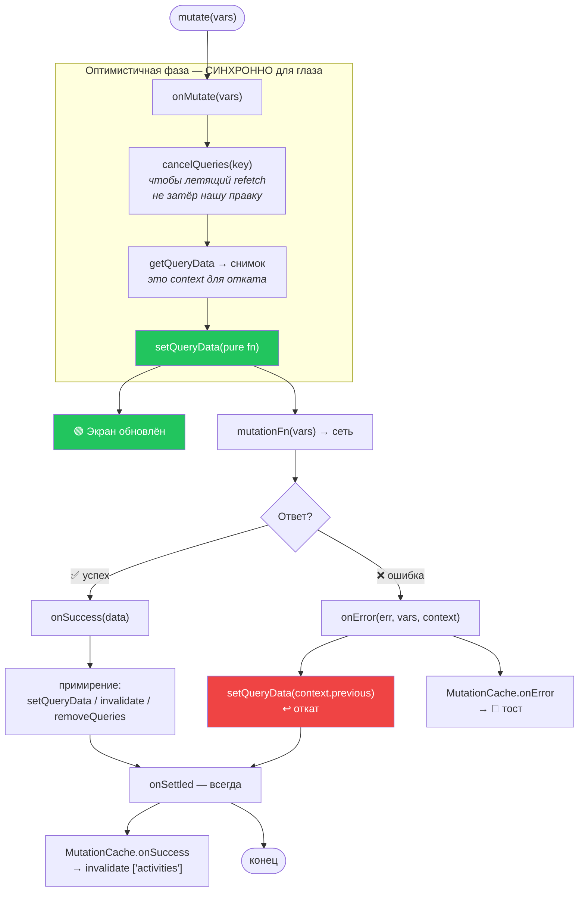
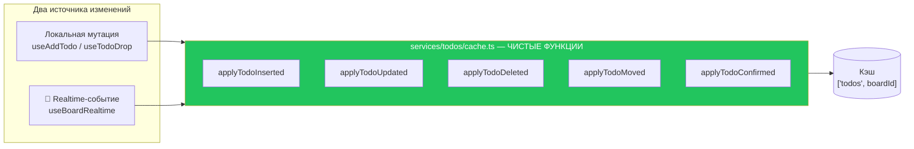
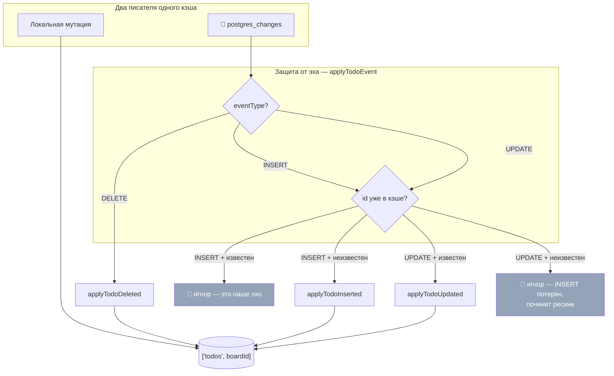
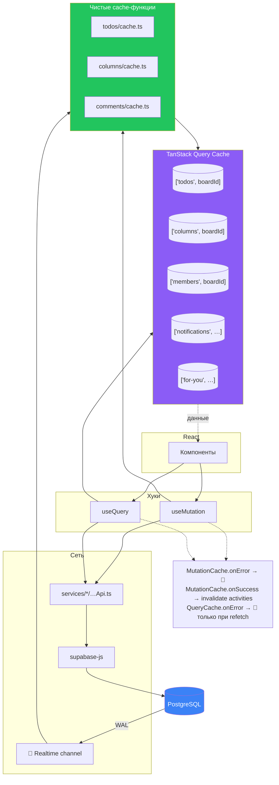

# 05 · TanStack Query и поток данных

[← 04 · React](04-react.md) · [Оглавление](README.md) · [Далее: 06 · Supabase →](06-supabase.md)

> 🔥 **Самая важная глава фронтенда.** Если ты понял её — ты понял, как Veylo
> работает.

---

## 🧒 LEVEL 1

> TanStack Query — это **секретарь**, который сидит между тобой и складом.

Ты просишь: «принеси задачи доски X».

Секретарь:
1. Смотрит на свою полку (**cache**). Есть? Отдаёт **сразу**.
2. Если полке больше 30 секунд (**staleTime**), всё равно отдаёт сразу — а сам
   тихо идёт на склад **проверить**, и подменяет, если изменилось.
3. Если десять человек одновременно просят одно и то же — секретарь идёт
   **один раз** (**deduplication**).
4. Если склад не ответил из-за обрыва связи — попробует ещё. Если склад
   ответил «тебе нельзя» — **не будет** пробовать: ответ не изменится.
5. Если ты **что-то меняешь** — секретарь сразу правит свою полку («да, готово»),
   отправляет запрос на склад, и **откатывает полку**, если склад отказал
   (**optimistic update**).

Вот и весь TanStack Query.

---

## 👷 LEVEL 2 — Словарь и как оно устроено в Veylo

### Query vs Mutation

```
QUERY  = чтение  = «какие задачи на доске?»   → useQuery
MUTATION = запись = «создай задачу»            → useMutation
```

| | Query | Mutation |
|---|---|---|
| Идемпотентна | ✅ | ❌ (создание дважды = две строки) |
| Кэшируется | ✅ по `queryKey` | ❌ |
| Автоматически запускается | ✅ при монтировании | ❌ только по `mutate()` |
| Retry по умолчанию в Veylo | `retryQuery` (до 2 раз, **только** транзиентные) | **`false`** |

Последняя строка — решение, а не дефолт:

```ts
mutations: {
  // TanStack's default, stated rather than assumed: addTodo is not
  // idempotent, so a retried create is a duplicate row.
  retry: false,
},
```

### Анатомия query — `useTodos`

```ts
export function useTodos() {
  const boardId = useBoardId();

  return useQuery({
    queryKey: queryKeys.todos(boardId),          // ⬅️ идентичность записи кэша
    queryFn: () => {                              // ⬅️ как достать данные
      if (!boardId) throw new Error("useTodos ran without a board");
      return fetchTodos(boardId);
    },
    enabled: Boolean(boardId),                    // ⬅️ не спрашивать, пока нечего
  });
}
```

Три вещи, за которые стоит уметь ответить:

1. **Ключ — `["todos", boardId]`, один плоский массив на всю доску.**
   Не `["todos", boardId, columnId]`. Почему — ниже, в LEVEL 3.
2. **`enabled`** — параметр маршрута резолвится не мгновенно. Пока `boardId`
   `undefined`, запись существует, но запрос отключён и она не наполняется.
3. **Фильтра по `user_id` нет.** Комментарий в коде:
   > *«RLS is the real boundary, and a user_id filter would hide a teammate's
   > cards once M3 shares boards.»*

### Анатомия mutation — полный цикл



**Почему `cancelQueries` — первая строка каждого `onMutate`.**
Сценарий без него: фоновый refetch стартовал секунду назад, ты перетаскиваешь
карточку, `setQueryData` пишет новый порядок, **приходит ответ старого
refetch'а** и затирает его старыми данными. Карточка прыгает назад. Отмена
убирает эту гонку.

---

### Три стратегии обновления кэша — и когда какая

Veylo использует все три, и **выбор каждый раз обоснован**.

#### A. `setQueryData` — «я знаю новое значение»

```ts
// useTodoDrop.onMutate
queryClient.setQueryData<Todo[]>(
  queryKeys.todos(boardId),
  applyTodoMoved(todos, activeTodo, columnId, rank),
);
```
Мгновенно, без сети. Используется, когда результат **предсказуем**.

#### B. `invalidateQueries` — «это устарело, перечитай если нужно»

```ts
// useUpdateTodo.onSuccess
queryClient.invalidateQueries({ queryKey: queryKeys.todo(updatedTodo.id) });
```
Комментарий объясняет, почему **не** `setQueryData`:

> *«the row this mutation returns is the narrowed board shape, so merging it
> into the full row would leave `description` showing its pre-edit value»*

То есть: у доски **узкая** проекция строки (12 колонок), у панели детали —
полная. Смёржить одно в другое — значит сохранить старое `description`.

**Важное свойство:** `invalidateQueries` на запрос **без смонтированного
наблюдателя** только помечает его устаревшим — **запроса не будет**. Поэтому
это бесплатно, когда панель закрыта.

#### C. `removeQueries` — «этой сущности больше нет»

```ts
// useDeleteTodo.onSuccess
queryClient.removeQueries({ queryKey: queryKeys.todo(id), exact: true });
```
Комментарий:

> *«a task deleted from the board behind an open panel leaves the panel
> rendering a ghost»*

Инвалидация здесь не помогла бы: она пометила бы запись устаревшей, но
**данные остались бы**, и панель продолжала бы рисовать призрак.

| Стратегия | Когда | Сеть? |
|---|---|---|
| `setQueryData` | результат известен | нет |
| `invalidateQueries` | результат неизвестен / форма не та | только если есть наблюдатель |
| `removeQueries` | сущности больше нет | нет |

---

## 🏛 LEVEL 3 — Решения, которые надо уметь защищать

### 1. Почему кэш — один плоский массив на доску, а не запись на колонку

```
❌ ["todos", boardId, columnId] → Todo[]     (по колонке)
✅ ["todos", boardId]           → Todo[]     (вся доска)
```

| Аргумент | За плоский массив |
|---|---|
| **Перетаскивание между колонками** | иначе это правка **двух** записей кэша, которые могут разойтись |
| **Пять представлений** | List, Summary, Calendar, Timeline не мыслят колонками вообще. Calendar группирует по дате, Timeline — по диапазону |
| **Фильтры и swimlanes** | «все просроченные по доске» — не вопрос про колонку |
| **Realtime** | payload несёт одну строку; найти её в одном массиве проще, чем угадать, в какой из N записей она лежит |

Цена: раскладка по колонкам делается на клиенте (`useTodosByColumns`). Для
доски в сотни карточек это ничто; для десятков тысяч — см.
[главу 23](23-performance.md).

### 2. Почему чистые cache-функции вынесены из `onMutate`

`src/services/todos/cache.ts` — пять функций вида `(todos, …) => todos`.

Причина названа прямо:

> *«M6's realtime handlers have to apply the same transformations to the same
> array when the change arrives from another client, and a channel callback
> cannot reach into an `onMutate`.»*



**Три правила, которым подчиняется каждая функция** (записаны в шапке файла):

1. `(todos, …) => todos` — вся доска на входе, вся на выходе.
2. **Ни одна не мутирует вход.** `onMutate` сохраняет закэшированный массив как
   снимок для отката, и кэш держит **те же самые объекты**. Правка на месте
   испортила бы снимок, и `onError` было бы нечего восстанавливать.
3. Нетронутые строки проходят **по ссылке** — React пропустит их ре-рендер.

Правило 2 — самая частая ошибка в реальных проектах, и она незаметна, пока
что-то не упадёт.

Одна из функций **не** переиспользуется realtime, и это записано явно:

> *«M6-B does not call [`applyTodoMoved`], and the prediction that it would was
> wrong. A remote move arrives as an UPDATE carrying the complete new row…
> so `applyTodoUpdated` is strictly more correct there: rebuilding the row from
> the cached copy would lose a rename that travelled with the move.»*

Ценность этого комментария в том, что он фиксирует **ошибку прогноза**, а не
прячет её.

### 3. Оптимистичное обновление, разобранное построчно

Разберём `useAddTodo` — самый сложный случай, потому что клиент и сервер
**расходятся во мнении о позиции**.

```ts
onMutate: async ({ id, title, column_id, index, ... }) => {
  if (!boardId) throw new Error("useAddTodo ran without a board");

  await queryClient.cancelQueries({ queryKey: queryKeys.todos(boardId) });

  const previousTodos =
    queryClient.getQueryData<Todo[]>(queryKeys.todos(boardId)) ?? [];

  const destination = previousTodos.filter(t => t.column_id === column_id);

  const optimisticRank =
    rankForDrop(destination, index ?? destination.length)
    ?? rankForAppend(destination);        // ⬅️ если зазор исчерпан — в конец

  const optimisticTodo: Todo = {
    id, title, column_id, board_id: boardId,
    rank: optimisticRank,
    board_key: null,                      // ⬅️ выдаст ТРИГГЕР, клиент не знает
    created_at: new Date().toISOString(),
    position: 0,
    assignee_id, type, priority: null, start_date, due_date, updated_at: null,
  };

  queryClient.setQueryData<Todo[]>(
    queryKeys.todos(boardId),
    applyTodoInserted(previousTodos, optimisticTodo, index),
  );

  return { previousTodos };               // ⬅️ context для onError
}
```

**Расхождение:** `addTodo` на сервере **всегда** добавляет в конец колонки. Но
пользователь мог вставить карточку в середину. Кто прав?

Ответ: **прав клиент**, потому что он знает жест. Поэтому:

```ts
onSuccess: (serverTodo) => {
  const todos = applyTodoConfirmed(current, serverTodo);
  // applyTodoConfirmed сохраняет position/rank ОПТИМИСТИЧНОЙ строки,
  // а не серверные — иначе карточка визуально прыгнула бы вниз

  const kept = todos.find(t => t.id === serverTodo.id);
  const rank = kept?.rank ?? serverTodo.rank;

  if (rank !== serverTodo.rank && serverTodo.column_id) {
    moveTodo({ id: serverTodo.id, boardId, columnId: serverTodo.column_id, rank })
      .catch(() => queryClient.invalidateQueries({ queryKey: queryKeys.todos(boardId) }));
  }
  ...
}
```

```
    Клиент видит          Сервер записал         После примирения
   ┌───────────┐         ┌───────────┐          ┌───────────┐
   │  KAN-1    │         │  KAN-1    │          │  KAN-1    │
   │ ★ НОВАЯ   │  ←жест  │  KAN-2    │          │ ★ KAN-14  │  ← moveTodo
   │  KAN-2    │         │  KAN-3    │          │  KAN-2    │     дописал rank
   │  KAN-3    │         │ ★ KAN-14  │  ←append │  KAN-3    │
   └───────────┘         └───────────┘          └───────────┘
```

**Почему не сделать сервер умнее?** Потому что «вставь между X и Y» — это
знание о **представлении**, которое может быть отфильтровано, отсортировано или
разбито на swimlane'ы. Сервер видит только хранимый порядок. Клиент вычисляет
ранг из того, что человек реально видел, — и это единственно верный источник.

### 4. Глобальная обработка ошибок — почему в `MutationCache`, а не в каждой мутации

```ts
const mutationCache = new MutationCache({
  onError: (error, _v, _c, mutation) => {
    if (mutation.meta?.silent) return;
    toast.error(messageOf(error));
  },
  onSuccess: () => {
    void queryClient.invalidateQueries({ queryKey: ["activities"] });
  },
});
```

Комментарий фиксирует, что было до:

> *«Not one mutation surfaced a failure before this, so a rejected write and a
> successful one looked identical — an RLS policy could deny every insert and
> the only symptom would be cards that vanish on refresh.»*

**Это очень сильная история для собеседования:** отказ RLS выглядел как успех,
а симптом проявлялся только после перезагрузки.

**Opt-out — через типизированный `meta`:**

```ts
declare module "@tanstack/react-query" {
  interface Register {
    mutationMeta: ErrorMeta;
    queryMeta: ErrorMeta;
  }
}
```

Тонкость, зафиксированная в коде: `ErrorMeta` объявлен **type alias**, а не
`interface`, потому что `Register` принимает только тип, удовлетворяющий
`Record<string, unknown>`, а у интерфейса нет неявной индексной сигнатуры —
и он бы молча откатился на нетипизированный meta.

**Асимметрия query/mutation:**

```ts
const queryCache = new QueryCache({
  onError: (error, query) => {
    if (query.meta?.silent) return;
    if (query.state.data === undefined) return;   // ⬅️ первая загрузка — НЕ тостим
    toast.error(messageOf(error));
  },
});
```

Провал **первой** загрузки уже отрисован компонентом («не удалось загрузить
доску»). Тост сказал бы то же самое дважды. А вот провал **refetch'а**, когда
на экране уже есть данные, — это тихий случай: доска показывает устаревшее и
никак об этом не сигналит. Его и тостим.

### 5. `MutationCache.onSuccess` → инвалидация `["activities"]`

Ленты активности пишутся **триггерами БД**, поэтому клиент никогда не узнаёт,
что появилась запись. Комментарий:

> *«Without this, a feed open on the Summary tab stays frozen while you work in
> front of it — the one place the log is guaranteed to be watched.»*

Почему это **не** в каждой мутации: тогда каждая мутация обросла бы
инвалидацией того, что она не пишет, а новая мутация её бы просто не получила.
Почему это **дёшево**: `invalidateQueries` без наблюдателя не делает запроса, а
`useActivities` смонтирован только на вкладке Summary и в панели
`?panel=activity`.

Почему это временно: правильный ответ — realtime-push (M6-B). Это записано.

### 6. Политика ретраев — почему TanStack-дефолт был бы вредным

Дефолт TanStack: 3 повтора. Для отказа RLS это значит, что пользователь узнает
об ошибке **после трёх идентичных провалов**.

```ts
export function isRetryableError(error: unknown): boolean {
  const status = statusOf(error);
  if (status !== null) {
    if ([408, 429].includes(status)) return true;
    return status >= 500;
  }
  const code = codeOf(error);
  if (code === null) return true;                        // голый TypeError — сеть
  if (["40001", "40P01"].includes(code)) return true;    // serialization / deadlock
  return code.length === 5 && ["08","53","57","58"].includes(code.slice(0, 2));
}
```

**Ключевой инсайт, ради которого этот файл существует:**

> *«PostgREST errors carry no status at all — only `code`… A predicate that read
> only `status` would never fire for the permission denial this exists to
> catch.»*

То есть: Supabase сообщает об ошибках **в двух разных формах**.
- Auth / Storage / Edge Functions → HTTP `status`
- PostgREST → **нет статуса**, только `code` (`PGRST301` или SQLSTATE `42501`)

Предикат, читающий только `status`, для отказа доступа никогда бы не сработал.

| Класс SQLSTATE | Что это | Повторять? |
|---|---|---|
| `08*` | connection exception | ✅ |
| `53*` | insufficient resources | ✅ |
| `57*` | operator intervention | ✅ |
| `58*` | system error | ✅ |
| `40001` | serialization failure | ✅ |
| `40P01` | deadlock detected | ✅ |
| `42501` | **insufficient privilege (RLS)** | ❌ — не изменится |
| `23505` | unique violation | ❌ |
| `PGRST301` | JWT expired | ❌ |

---

## 📡 Realtime как второй писатель кэша



**Почему `UPDATE` для неизвестной строки игнорируется, а не вставляется?**
Комментарий (для комментариев, но правило то же):

> *«it means the INSERT was missed, and the re-subscribe resync is what recovers
> that — inventing the row from an update payload would be a second convergence
> mechanism.»*

**Два механизма сходимости — хуже, чем один.** Второй сработает в редком случае,
никем не протестированном, и разойдётся с первым.

### Presence — кто сейчас смотрит на доску

```ts
supabase.channel(`board:${boardId}`, {
  config: {
    presence: {
      key: userId,        // ⬅️ ключ по человеку, не по сокету:
                          //    две вкладки = одна запись
      enabled: true,      // ⬅️ ЯВНО, не по наличию биндинга
    },
  },
})
```

Комментарий про `enabled` — это отладочная история, которую стоит прочитать:

> *«realtime-js turns presence on if a `presence` binding exists when
> `subscribe()` runs **or** if this flag is set… Relying on the binding alone
> makes a correct feature depend on the order two chained calls happen to be
> written in.»*

Без флага снапшот presence никогда не приходил, `presenceState()` оставался
пустым, и ни одно событие не срабатывало. Правильно работало только при
определённом порядке чейнинга.

---

## 📊 Полная карта потока данных



---

## ⚙️ Настройки клиента и что они означают

```ts
defaultOptions: {
  queries: {
    staleTime: 30_000,       // 30 сек
    gcTime: 10 * 60_000,     // 10 мин
    retry: retryQuery,
  },
  mutations: { retry: false },
}
```

| Параметр | Значение | Обоснование из кода |
|---|---|---|
| `staleTime: 30s` | «свежо 30 секунд» | *«a tab switch inside this window should cost nothing. Past it the focus refetch still runs — that is the staleness safety net»* |
| `gcTime: 10min` | сколько держать невостребованную запись | *«Long enough to visit the profile page and come back to a warm board»* |
| `retry: retryQuery` | только транзиентные | см. выше |
| `mutations.retry: false` | никогда | создание не идемпотентно |

**`staleTime` vs `gcTime` — частый вопрос:**

```
    mount                          unmount              gc
      │                               │                  │
      ├──── fresh (30s) ──┼── stale ──┤                  │
      │                   │           ├──── gcTime 10min ┤
      │                   │           │                  │
   отдаёт кэш      отдаёт кэш   нет наблюдателей    запись удалена
                   + фон.refetch
```

`staleTime` — «когда идти проверять». `gcTime` — «когда забыть совсем».

### Персистентность кэша — почему НЕ включена

```ts
// `@tanstack/query-persist-client` … installed but still deliberately not wired up.
// A board id is not a secret, and nothing about ["todos", boardId] is scoped to
// the *user*, so a persisted cache would still hand the next person to use this
// browser the rows of whoever was signed in before.
```

Условие включения записано: ключ персиста должен быть **namespaced по user id**
плюс осознанное решение, что переживает выход. Это отдельная задача, а не
побочный эффект board-scoping.

---

## 🧪 Мини-квиз

<details>
<summary><b>1.</b> Почему <code>cancelQueries</code> — первая строка каждого <code>onMutate</code>?</summary>

Иначе фоновый refetch, стартовавший до мутации, вернётся **после**
`setQueryData` и затрёт оптимистичную правку старыми данными. Карточка прыгнет
назад. Отмена убирает эту гонку.
</details>

<details>
<summary><b>2.</b> Что возвращает <code>onMutate</code> и зачем?</summary>

Объект-контекст — обычно `{ previousTodos }`, снимок кэша **до** правки.
TanStack передаёт его в `onError` и `onSettled`. Без него откат был бы
невозможен: единственный способ вернуть прежнее состояние — перезапросить сеть,
а это и медленно, и может не сработать.
</details>

<details>
<summary><b>3. Predict:</b> <code>onError</code> сработал, но <code>context.previousTodos</code> — <code>undefined</code>. Что делает <code>useTodoDrop</code>?</summary>

```ts
queryClient.removeQueries({ queryKey: queryKeys.todos(boardId), exact: true });
```
Потому что `setQueryData(key, undefined)` — **no-op**, и оптимистичный порядок
пережил бы провал. Запись удаляется целиком, `useTodos` перезагружает правду.
</details>

<details>
<summary><b>4.</b> Почему <code>useUpdateTodo</code> инвалидирует <code>todo(id)</code>, а не патчит её?</summary>

Потому что мутация возвращает **узкую** проекцию строки (12 колонок доски), а
запись `todo(id)` держит полную строку с `description`. Мёрдж оставил бы
`description` в состоянии «до правки» — а это ровно то поле, ради которого
панель детали существует. Инвалидация же бесплатна, когда панель закрыта:
запроса без наблюдателя не будет.
</details>

<details>
<summary><b>5.</b> RLS отклонила запись (код <code>42501</code>). Сколько раз TanStack повторит запрос?</summary>

**Ноль.** Для мутаций `retry: false` глобально. Для запросов `isRetryableError`
вернёт `false`: `42501` не входит ни в транзиентные классы (`08/53/57/58`), ни в
`40001`/`40P01`. Пользователь увидит тост немедленно, а не после трёх
одинаковых провалов.
</details>

<details>
<summary><b>6.</b> Почему первая неудачная загрузка не показывает тост, а неудачный refetch — показывает?</summary>

Провал первой загрузки уже нарисован компонентом, который держит запрос («не
удалось загрузить»). Тост дублировал бы сообщение. Провал refetch'а, когда
данные на экране уже есть, — это **тихая** ошибка: доска показывает устаревшее
и никак об этом не говорит. Отсюда проверка `if (query.state.data === undefined) return;`.
</details>

<details>
<summary><b>7.</b> Почему <code>applyTodoMoved</code> НЕ используется realtime-обработчиком?</summary>

Потому что удалённое перемещение приходит как `UPDATE` с **полной новой
строкой** — новая колонка, ранг отправителя и все остальные поля.
`applyTodoUpdated` строго корректнее: пересборка строки из закэшированной копии
потеряла бы, например, переименование, которое ехало вместе с перемещением.
Это записано в коде как исправленный прогноз.
</details>

<details>
<summary><b>8.</b> Как realtime отличает эхо собственной мутации от чужого изменения?</summary>

По наличию `id` в кэше. `INSERT` для **известной** строки — эхо своей же
мутации, игнорируется. `UPDATE` для **неизвестной** — значит `INSERT` был
потерян; тоже игнорируется, потому что восстановление — это ресинк при
переподписке, а не выдумывание строки из update-payload. Два механизма
сходимости хуже одного.
</details>

---

[← 04 · React](04-react.md) · [Оглавление](README.md) · [Далее: 06 · Supabase →](06-supabase.md)
