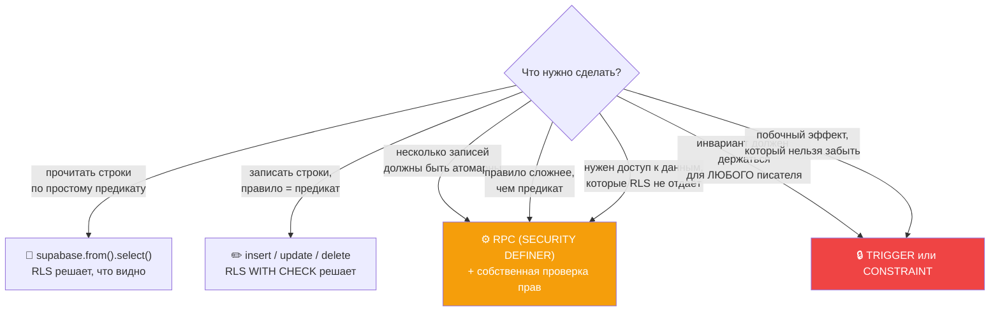
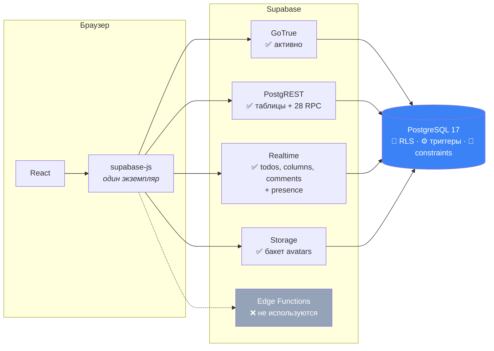

# 06 · Supabase

[← 05 · Data flow](05-data-flow.md) · [Оглавление](README.md) · [Далее: 07 · База данных →](07-database.md)

---

## 🧒 LEVEL 1

> Supabase — это **PostgreSQL, которому приделали двери**.

У тебя есть база данных. Обычно к ней ходит сервер, который ты написал сам.
Supabase убирает этого посредника и вешает на базу набор дверей:

| 🚪 Дверь | Кто за ней | Зачем |
|---|---|---|
| **Auth (GoTrue)** | охранник на входе | выдаёт пропуск (JWT), проверяет пароль, шлёт письма |
| **PostgREST** | автоматический переводчик | превращает каждую таблицу в HTTP-эндпоинт |
| **Realtime** | наблюдатель | смотрит журнал изменений БД и кричит в WebSocket |
| **Storage** | кладовщик | файлы, но права описаны **той же самой** системой |
| **Edge Functions** | мастерская | свой серверный код, когда SQL не хватает |

И — главное — **охранник у каждой полки внутри**: Row Level Security. Он стоит
за всеми дверями сразу.

---

## 👷 LEVEL 2 — Что Veylo реально использует

| Сервис | Использует? | Где |
|---|---|---|
| **Auth (GoTrue)** | ✅ активно | `services/auth/`, `providers/AuthProvider.tsx` |
| **PostgREST (таблицы)** | ✅ активно | все `*Api.ts` через `supabase.from(...)` |
| **PostgREST (RPC)** | ✅ активно | 28 функций, `supabase.rpc(...)` |
| **Realtime (postgres_changes)** | ✅ | `services/realtime/useBoardRealtime.ts` — `todos`, `columns`, `comments` |
| **Realtime (presence)** | ✅ | тот же канал, `PresenceStack` |
| **Realtime (broadcast)** | ❌ | не используется |
| **Storage** | ✅ узко | один бакет `avatars`, `services/profile/uploadAvatars.ts` |
| **Edge Functions** | ❌ | не используются. Логика — в SQL |
| **Vector / pgvector** | ❌ | нет |

---

### 1. Инициализация клиента

```ts
// src/services/api/supabase.ts
import { createClient } from "@supabase/supabase-js";
import type { Database } from "@/types/database";

const supabaseUrl = import.meta.env.VITE_SUPABASE_URL;
const supabaseKey = import.meta.env.VITE_SUPABASE_PUBLISHABLE_KEY;

if (!supabaseUrl)  throw new Error("Missing environment variable VITE_SUPABASE_URL — …");
if (!supabaseKey)  throw new Error("Missing environment variable VITE_SUPABASE_PUBLISHABLE_KEY — …");

export const supabase = createClient<Database>(supabaseUrl, supabaseKey);
```

**Три решения в двадцати строках:**

1. **`createClient<Database>`** — дженерик из сгенерированного типа. Отсюда
   автодополнение имён таблиц, колонок и RPC, и ошибка компиляции при опечатке.
2. **Броски на уровне модуля.** Комментарий: *«so a missing variable fails the
   app at startup with a named cause instead of surfacing as an opaque error on
   the first query»*.
3. **Ровно один экземпляр.** Второй `createClient` завёл бы вторую сессию,
   второй сокет и второй набор токенов в `localStorage`.

**Про ключ:** `VITE_SUPABASE_PUBLISHABLE_KEY` — **публичный** ключ. Он уходит в
браузер, его видно в DevTools, и это нормально. Он не даёт никаких прав сам по
себе — все права выдаёт RLS по JWT пользователя. Секретный `service_role`-ключ
**обходит RLS** и в клиентском коде не появляется никогда.

Как это устроено в тестах: `vitest.live.config.ts` **достаёт** service-role
через Supabase CLI в момент запуска и передаёт через `test.env` **без**
префикса `VITE_`, поэтому он физически не может попасть в бандл.

---

### 2. PostgREST — «таблица как REST»

```ts
await supabase
  .from("todos")
  .select("id, title, rank")
  .eq("board_id", boardId)
  .order("rank", { ascending: true, nullsFirst: false });
```

превращается в

```http
GET /rest/v1/todos?select=id,title,rank&board_id=eq.<uuid>&order=rank.asc.nullslast
Authorization: Bearer <JWT пользователя>
apikey: <publishable key>
```

а на сервере — в

```sql
SELECT id, title, rank FROM todos
 WHERE board_id = '<uuid>'
   AND /* ← сюда PostgreSQL сам подставляет RLS-политику */
 ORDER BY rank ASC NULLS LAST;
```

**Ключевой момент:** RLS-предикат добавляет **PostgreSQL**, а не PostgREST. Его
нельзя выключить параметром запроса, потому что он не часть запроса.

#### Почему Veylo всё равно фильтрует `.eq("board_id", …)`

Из Code Review Checklist:

> *«Any new query is scoped in the client (`.eq("board_id", …)`) as well as
> enforced in RLS. Defense in depth: RLS is the boundary, the client filter is
> the correctness aid.»*

| Фильтр | Роль |
|---|---|
| `.eq("board_id", …)` | **корректность**: «я хочу именно эту доску» + попадание в индекс |
| RLS-политика | **безопасность**: «тебе можно только это» |

Уберёшь клиентский фильтр — получишь задачи **всех** доступных досок
(корректность сломана, безопасность цела). Уберёшь RLS — получишь чужие
(безопасность сломана).

Обратное тоже показательно: `notificationsApi.ts` **не** добавляет
`.eq("user_id", …)`:

> *«Adding `.eq("user_id", …)` on top would be a second definition of "mine"
> that could disagree with the policy — and the policy is the one that is
> enforced.»*

Разница в том, что «доска» — параметр вопроса, а «мои уведомления» — **и есть**
политика. Второе определение «моего» было бы дублированием правила.

#### Выбор колонок — не косметика

```ts
export const TODO_LIST_FIELDS =
  "id, board_id, column_id, position, rank, board_key, title, type, priority, start_date, due_date, assignee_id, created_at, updated_at";
```

12 колонок вместо `select("*")`. Не берутся: `description`, `estimate`,
`archived`, `creator_id`, `status`, `previous_status`.

Тонкость TypeScript, из-за которой это **две** константы, а не одна:

> *«`supabase-js` infers the returned row from the select's literal type, and a
> derived string collapses every query result to `GenericStringError[]`.»*

Поэтому `TODO_FIELDS` (массив в `types/data.ts`) и `TODO_LIST_FIELDS` (строка в
`todoApi.ts`) живут раздельно, а `todoApi.test.ts` **утверждает их согласие** —
то, что раньше было комментарием «не забудь».

---

### 3. RPC — когда таблицы недостаточно

```ts
const { data, error } = await supabase.rpc("accept_invite", { p_token: token });
```

**Четыре причины, по которым в Veylo появляется RPC:**

| Причина | Пример | Почему таблица не подошла |
|---|---|---|
| **Атомарность** | `provision_user` | профиль + space + доска + 4 колонки — одна транзакция или ничего |
| **Нужен обход RLS** | `board_roster` | `profiles` self-only; RPC — узкое окно, а не дыра в политике |
| **Правило сложнее, чем предикат** | `set_member_role` | «строго ниже своего ранга и никогда не владелец» — арифметика, не выражение над строкой |
| **Скрыть данные, оставив ответ** | `username_available` | возвращает `boolean`, а не строку `profiles` |

### `SECURITY DEFINER` vs `SECURITY INVOKER` — обязательно понимать

```
SECURITY INVOKER (по умолчанию)
    функция выполняется от имени ВЫЗЫВАЮЩЕГО
    → RLS применяется как обычно
    → пример: delete_column — он и должен подчиняться политикам

SECURITY DEFINER
    функция выполняется от имени ВЛАДЕЛЬЦА функции
    → RLS ОБХОДИТСЯ
    → значит, функция ОБЯЗАНА проверить права сама
```

Правило проекта (Enforcement rule 5):

> *«Every privileged RPC checks the caller's role itself. `SECURITY DEFINER`
> bypasses RLS; a function that forgets its own check is an open door.»*

Так это выглядит на практике:

```sql
create or replace function public.create_invite(...)
returns table (...)
language plpgsql
security definer            -- ⬅️ RLS обойдена
set search_path = ''        -- ⬅️ защита от подмены схемы
as $$
begin
  v_actor := (select auth.uid());
  if v_actor is null then
    raise exception 'create_invite requires an authenticated session' using errcode = '28000';
  end if;

  v_actor_rank := public.board_role_rank(public.board_role(p_board_id));
  if v_actor_rank is null then                       -- не участник
    raise exception 'not a member of this board' using errcode = '42501';
  end if;
  if v_actor_rank < public.board_role_rank('admin') then
    raise exception 'only an admin or the owner may invite people' using errcode = '42501';
  end if;
  if v_actor_rank <= v_new_rank then                 -- строго ниже себя
    raise exception 'cannot invite someone at or above your own role' using errcode = '42501';
  end if;
  ...
end;
$$;

revoke all on function public.create_invite(...) from public, anon;
grant execute on function public.create_invite(...) to authenticated;
```

**Шесть проверок до первой записи.** И `revoke`/`grant` в конце — потому что по
умолчанию функция исполняема для `PUBLIC`.

### Почему `set search_path = ''`

Без этого злоумышленник с правом создавать таблицы мог бы завести
`myschema.profiles` и поставить `myschema` первой в `search_path` — функция
`SECURITY DEFINER` обратилась бы к **подложной** таблице **с правами
владельца**. Это классическая эскалация привилегий.

Пустой `search_path` заставляет писать полные имена (`public.profiles`,
`extensions.gen_random_bytes`) и делает подмену невозможной.

В проекте есть **отдельная миграция ровно про это**:
`20260814102000_handle_new_user_search_path.sql`.

📖 Подробно: [08 · Security](08-security.md).

---

### 4. Auth (GoTrue)

| Что делает Veylo | API |
|---|---|
| регистрация с метаданными | `auth.signUp({ email, password, options: { data: { username } } })` |
| вход | `auth.signInWithPassword({ email, password })` |
| выход | `auth.signOut()` |
| текущая сессия | `auth.getSession()` |
| подписка на смену | `auth.onAuthStateChange(cb)` |
| сброс пароля (шаг 1) | `auth.resetPasswordForEmail(email, { redirectTo })` |
| сброс пароля (шаг 2) | `auth.updateUser({ password })` |
| кто я сейчас | `auth.getUser()` |

Конфигурация из `supabase/config.toml`:

```toml
[auth]
jwt_expiry = 3600                       # access token живёт 1 час
enable_refresh_token_rotation = true    # refresh одноразовый
refresh_token_reuse_interval = 10       # 10 сек на гонку двух вкладок
minimum_password_length = 6

[auth.email]
enable_confirmations = true             # 🔑 подтверждение ОБЯЗАТЕЛЬНО
double_confirm_changes = true           # смена почты подтверждается с обеих сторон
max_frequency = "1m0s"                  # не чаще письма в минуту
```

**`enable_confirmations = true` — это решение, которое формирует всю
регистрацию.** Из-за него `signUp` возвращает пользователя **без сессии**,
`auth.uid()` равен `null`, и клиент физически не может записать в `profiles`.
Отсюда — username через метаданные и провижининг триггером на подтверждении.

`enable_refresh_token_rotation` + `refresh_token_reuse_interval = 10` — защита
от кражи refresh-токена: каждый использованный токен инвалидируется, а
10-секундное окно нужно, чтобы две вкладки, обновившиеся одновременно, не
выкинули друг друга.

📖 Подробно: [09 · Auth](09-auth.md).

---

### 5. Realtime

Механика:

```
Клиент пишет  →  PostgreSQL  →  WAL  →  logical replication
                                              ↓
                            Realtime-сервер читает поток
                                              ↓
                    для КАЖДОГО подписчика проверяет RLS
                                              ↓
                                    WebSocket → браузер
```

**Публикация — это отдельный шаг.** Таблица не «в realtime» просто потому, что
существует:

```sql
alter publication supabase_realtime add table public.todos;
alter publication supabase_realtime add table public.columns;
-- и в 20260818110000_realtime_comments.sql — comments
```

Миграция обёрнута в проверку `pg_publication_tables`, потому что повторное
добавление — ошибка, а миграции должны переигрываться на чистой БД.

**Что подписано в Veylo:** `todos`, `columns`, `comments`.
**Чего нет:** `activities` и `notifications` — их обновление держится на
`MutationCache.onSuccess` и на инвалидации. Это записано как временное решение,
а не как дизайн.

**Фильтр на уровне канала:**

```ts
const boardFilter = `board_id=eq.${boardId}`;
```

Это оптимизация, а не безопасность: она сокращает трафик, но границей всё равно
остаётся RLS, которую Realtime проверяет для каждого подписчика.

---

### 6. Storage — один бакет, узкий сценарий

```ts
const path = `${userId}/avatar.${fileExt}`;
await supabase.storage.from("avatars").upload(path, file, { upsert: true });
const { data } = supabase.storage.from("avatars").getPublicUrl(path);
```

**Путь — это и есть модель прав.** Политики читают первую папку пути:

```sql
create policy "Users upload their own avatar"
  on storage.objects for insert to authenticated
  with check (
    bucket_id = 'avatars'
    and (storage.foldername(name))[1] = (select auth.uid())::text
  );
```

То есть в папку `<чужой-uuid>/` записать нельзя — независимо от того, что
прислал клиент.

Ограничения бакета выставлены **той же миграцией**:

```sql
update storage.buckets
   set file_size_limit = 2097152,                                    -- 2 MB
       allowed_mime_types = array['image/png','image/jpeg','image/webp']
 where id = 'avatars';
```

Проверка типа и размера **на сервере**, а не в `<input accept="...">`.
`accept` — подсказка для диалога выбора файла, а не контроль.

**Почему имя файла фиксированное, а не хэш:**

> *«a person has one avatar, and `upsert` replacing it is what keeps the bucket
> from accumulating an object per upload with nothing to clean them up»*

Цена — кэширование CDN: новый аватар может показываться со старым URL. Для
портфолио-проекта приемлемо; продовое решение — версионный query-параметр.

---

## 🏛 LEVEL 3 — Границы модели

### Что такое запрос, RPC, триггер и прямая операция — и когда что



**Разница между RPC и триггером — самая важная граница.**

Из Enforcement rule 6:

> *«Invariants that must hold for every writer go in triggers or constraints,
> not in one RPC's body.»*

Пример: `board_key` (номер `KAN-14`) выдаёт **триггер** `todos_assign_board_key`,
а не `addTodo`. Потому что задача может быть создана из любого места — API,
SQL-консоли, будущего мобильного клиента, — и номер должна получить в каждом.
Если бы нумерация жила в одной функции, второй путь записи создал бы задачу без
номера.

Тот же принцип — почему `activities` и `notifications` пишутся **только**
триггерами:

> *«A client cannot forge, backdate, delete or omit an entry, because the
> triggers are on the tables themselves rather than in the API layer.»*

Запись в журнале — **свидетельство**, а не заявление клиента.

### Компромиссы Supabase — честно

| Плюс | Минус |
|---|---|
| нет backend-кода — нет мест, где забыли проверку | сложную логику приходится выражать на PL/pgSQL |
| RLS невозможно обойти из клиента | политики трудно отлаживать: отказ выглядит как «пустой результат» |
| типы генерируются из живой схемы | сгенерированный файл нужно не забывать регенерировать |
| Realtime без своего fan-out | контроль над масштабированием ограничен |
| Auth с письмами, ротацией, восстановлением | привязка к GoTrue |
| дешёвый старт | vendor lock-in — правда, миграции остаются обычным SQL |

**Как отвечать про lock-in:** «Схема, политики, функции и триггеры — обычный
PostgreSQL. Съезд с Supabase — это написать свой auth-слой и свой REST/realtime,
но **данные и правила доступа переезжают как есть**. Это принципиально дешевле,
чем съезд, например, с Firestore.»

---

## 📊 Карта сервисов Supabase в Veylo



---

## 🧪 Мини-квиз

<details>
<summary><b>1.</b> Ключ Supabase виден в исходниках фронтенда. Это утечка?</summary>

Нет — если это **publishable/anon** ключ, а в Veylo именно он
(`VITE_SUPABASE_PUBLISHABLE_KEY`). Он лишь идентифицирует проект; права даёт JWT
пользователя через RLS. Утечкой был бы `service_role` — он **обходит RLS**. В
Veylo он никогда не попадает в бандл: live-тесты достают его через CLI и
передают без префикса `VITE_`.
</details>

<details>
<summary><b>2.</b> Что означает <code>SECURITY DEFINER</code> и почему это опасно?</summary>

Функция выполняется от имени **владельца**, а не вызывающего, поэтому RLS
обходится. Опасно тем, что функция обязана проверить права **сама** — забытая
проверка это открытая дверь. Отсюда правило: каждая привилегированная RPC
начинается с проверки `auth.uid()` и ранга роли, и в конце —
`revoke ... from public, anon`.
</details>

<details>
<summary><b>3.</b> Зачем <code>set search_path = ''</code> в функциях?</summary>

Чтобы предотвратить эскалацию привилегий через подмену схемы: без него
пользователь мог бы создать `myschema.profiles` и поставить свою схему первой,
и `SECURITY DEFINER`-функция обратилась бы к подложной таблице с правами
владельца. Пустой путь заставляет писать `public.profiles` полностью.
</details>

<details>
<summary><b>4.</b> Почему запросы задач фильтруют по <code>board_id</code>, а запросы уведомлений НЕ фильтруют по <code>user_id</code>?</summary>

Потому что «доска» — параметр вопроса («покажи **эту** доску»), а «мои
уведомления» — **и есть** политика (`user_id = auth.uid()`). Клиентский фильтр
по доске — помощь корректности и индексу. Клиентский фильтр по пользователю был
бы **вторым определением** «моего», которое может разойтись с политикой, а
исполняется всё равно политика.
</details>

<details>
<summary><b>5.</b> Таблицу добавили, а realtime по ней не приходит. Что забыли?</summary>

Добавить её в публикацию:
`alter publication supabase_realtime add table public.<table>;`
Наличие таблицы не делает её реплицируемой. Плюс проверить, что политика SELECT
пропускает подписчика: Realtime проверяет RLS для **каждого** получателя, и без
права чтения события просто не доедут.
</details>

<details>
<summary><b>6.</b> Почему <code>board_key</code> выдаёт триггер, а не функция <code>addTodo</code>?</summary>

Потому что инвариант «у каждой задачи есть номер доски» должен держаться для
**любого** писателя — API, SQL-консоли, будущего мобильного клиента. Логика
внутри одной функции защищает только один путь записи; триггер на таблице —
все.
</details>

---

[← 05 · Data flow](05-data-flow.md) · [Оглавление](README.md) · [Далее: 07 · База данных →](07-database.md)
