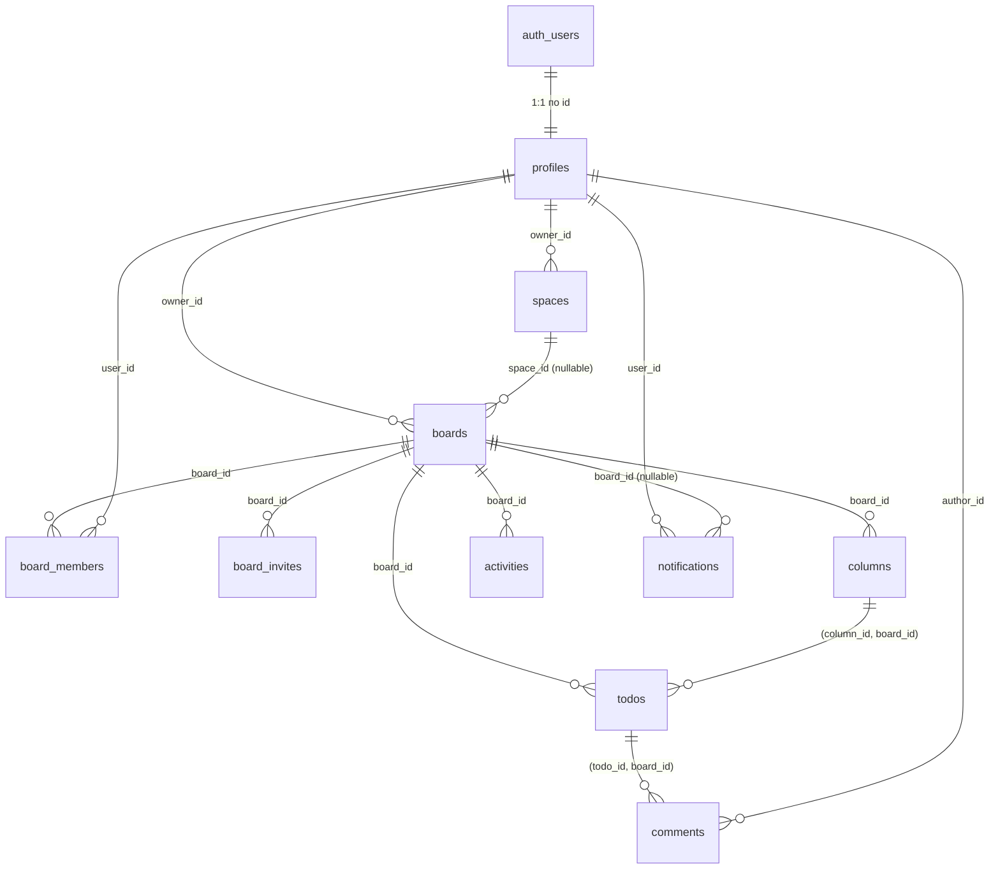
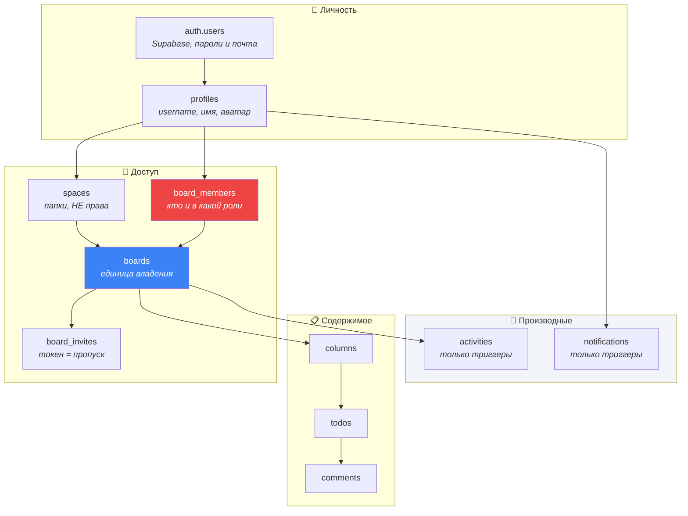
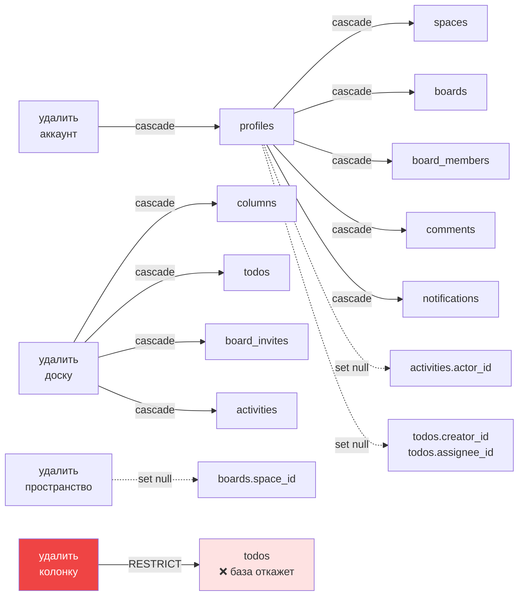
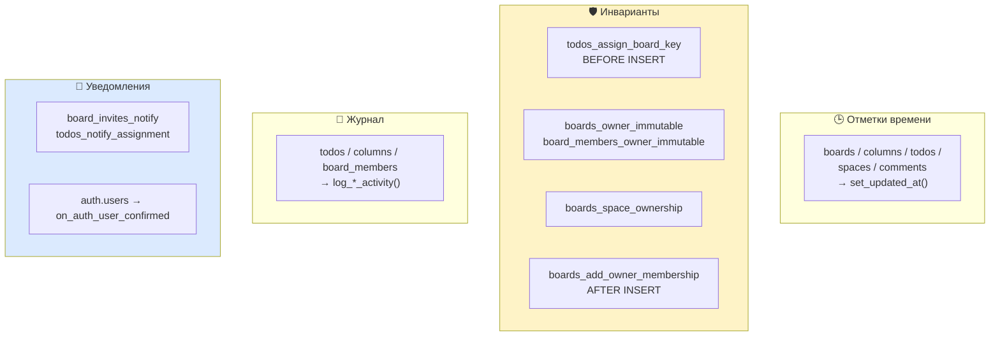
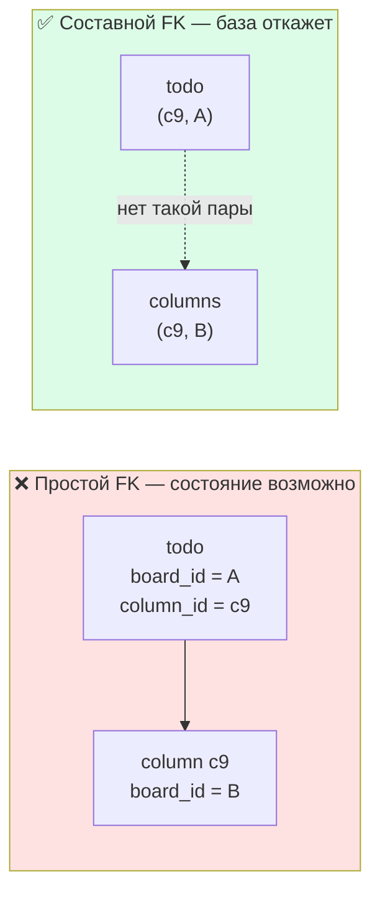

# 07 · База данных

[← 06 · Supabase](06-supabase.md) · [Оглавление](README.md) · [Далее: 08 · RLS и безопасность →](08-security.md)

---

## 🧒 LEVEL 1

> База данных Veylo — это **картотека с встроенными правилами**, а не коробка с бумажками.

Представь архив. В обычном архиве ты кладёшь папку куда попало, и порядок держится
только потому, что все договорились. Один невнимательный человек — и папка «Задачи
доски А» лежит в ящике доски Б. Никто не заметит, пока не начнут искать.

PostgreSQL устроен иначе. Там ящик **физически не принимает** чужую папку:

| Правило картотеки | Как называется в БД |
|---|---|
| «У каждой папки свой номер, и он не повторяется» | **primary key** |
| «Эта папка ссылается на ящик — ящик обязан существовать» | **foreign key** |
| «Выкинули ящик — папки внутри тоже выкидываем» | `ON DELETE CASCADE` |
| «Ящик нельзя выкинуть, пока в нём что-то лежит» | `ON DELETE RESTRICT` |
| «Приоритет бывает только один из пяти» | **check constraint** |
| «Оглавление, чтобы не листать весь архив» | **index** |
| «Кладёшь папку — секретарь сам ставит на неё штамп» | **trigger** |

Главная мысль главы: **всё, что должно быть правдой всегда, записано в базе, а не в
коде.** Код — это один посетитель архива. Правило в базе действует и для него, и для
второго клиента, и для консоли, и для скрипта, который напишут через год.

---

## 🗺 Схема целиком

10 таблиц в `public` плюс `auth.users`, которую даёт Supabase.



Три слоя, если смотреть по смыслу:



Синяя `boards` — центр схемы. Красная `board_members` — центр **безопасности**:
все политики на `columns`, `todos`, `comments` и `activities` в итоге спрашивают
именно её. Подробно — [глава 08](08-security.md).

---

## 👷 LEVEL 2 — Таблицы по одной

### 1. `profiles` — публичное лицо аккаунта

```sql
id         uuid primary key references auth.users (id) on delete cascade
username   text not null            -- уникально по lower(username)
full_name  text
email      text
avatar_url text
bio        text
created_at timestamptz
```

**Почему это отдельная таблица, а не колонки в `auth.users`.** `auth.users` —
схема Supabase, её нельзя менять и, что важнее, из неё **нельзя читать чужие
строки**. А отображать автора комментария надо. `profiles` — это ровно та часть
аккаунта, которую можно показать другим.

Связь один-к-одному через общий `id`: у профиля нет своего идентификатора, он
**и есть** пользователь. Отсюда `on delete cascade` — удалили аккаунт, профиль
уходит следом.

**Username — три правила в трёх местах:**

| Правило | Где живёт |
|---|---|
| форма `^[a-z0-9][a-z0-9_]{2,29}$` | `check constraint profiles_username_shape` |
| уникальность без учёта регистра | `create unique index profiles_username_lower_key on profiles (lower(username))` |
| нормализация перед записью | `src/utils/username.ts` + SQL-хелперы |

Индекс по **выражению** `lower(username)`, а не по колонке: иначе `Neo` и `neo`
считались бы разными людьми. Подробный разбор гонки — [глава 10](10-usernames.md).

---

### 2. `spaces` — папка, а не права

```sql
id         uuid primary key
owner_id   uuid not null references profiles (id) on delete cascade
title      text not null   -- check: 1..60 символов после trim
created_at timestamptz
updated_at timestamptz
```

Комментарий к таблице в миграции говорит всё:

> *«A personal folder for boards. **NOT a permission scope**: owner-only RLS, no
> membership, and `boards.space_id` grants nothing.»*

Это важнее, чем кажется. Если бы пространство давало права, появилась бы вторая
модель доступа рядом с `board_members` — и два ответа на вопрос «можно ли мне
сюда». Пространство отвечает только на вопрос «где это лежит у **меня** в
списке».

Отсюда `boards.space_id` — **nullable** и `on delete set null`. Удаление папки не
удаляет доски: они просто перестают быть разложенными.

---

### 3. `boards` — единица владения

```sql
id          uuid primary key
owner_id    uuid not null references profiles (id) on delete cascade
space_id    uuid references spaces (id) on delete set null
title       text
description text
icon        text
cover_color text
visibility  text not null   -- check: 'private' | 'team'
key_prefix  text not null default 'KAN'  -- check: ^[A-Z][A-Z0-9]{1,9}$
next_key    integer not null default 1
created_at  timestamptz
updated_at  timestamptz
```

Две колонки здесь — не данные, а **механизмы**.

**`next_key`** — счётчик номеров задач этой доски. Не последовательность
(`sequence`), потому что нумерация должна быть **своя у каждой доски**: KAN-1
существует на каждой доске отдельно. Как он работает — в разборе триггера ниже.

**`key_prefix`** — буквенная часть ярлыка. Была строковым литералом `"KAN"` в трёх
React-компонентах, пока у аккаунта была ровно одна доска. Миграция M14 перенесла
её в базу — с обоснованием, которое стоит запомнить:

> *«A task key is an identifier people paste into messages and rely on, so the
> prefix has to be settled before the keys multiply, not after.»*

Формат зажат `check`-ом не из педантизма: пустая строка, эмодзи или двести
символов — это баг рендеринга в листовом компоненте, который **не может** от
него защититься, и TypeScript его не поймает, потому что знает только `string`.

---

### 4. `board_members` — таблица прав

```sql
board_id  uuid not null references boards   (id) on delete cascade
user_id   uuid not null references profiles (id) on delete cascade
role      text not null   -- check: 'owner' | 'admin' | 'editor' | 'viewer'
joined_at timestamptz not null default now()
primary key (board_id, user_id)
```

**Составной первичный ключ** вместо суррогатного `id` — и это осмысленный выбор.
`(board_id, user_id)` уже уникальна по смыслу: человек состоит в доске один раз.
Отдельный `id` разрешил бы две строки «Neo в доске X», с разными ролями, и
вопрос «какая настоящая» не имел бы ответа. Первичный ключ по паре делает это
состояние **непредставимым**.

Два индекса, потому что таблицу читают с двух сторон:

| Индекс | Вопрос, на который отвечает |
|---|---|
| PK `(board_id, user_id)` | «есть ли этот человек в этой доске» |
| `board_members_user_id_idx (user_id)` | «в каких досках состою **я**» ← каждый вызов RLS |
| `board_members_board_id_idx (board_id)` | «кто состоит в этой доске» ← экран участников |

Первичный ключ покрывает первый и (как префикс) второй столбец пары — но не
запрос по одному `user_id`, потому что `user_id` в PK стоит **вторым**. Отсюда
отдельный индекс, и он самый горячий в базе: [глава 08](08-security.md) покажет,
что через него проходит каждая проверка доступа.

---

### 5. `board_invites` — токен как пропуск

```sql
id          uuid primary key
board_id    uuid not null references boards (id) on delete cascade
email       text
token       text not null unique
role        text not null   -- check: 'admin' | 'editor' | 'viewer'
expires_at  timestamptz not null
created_by  uuid references profiles (id) on delete set null
accepted_at timestamptz
created_at  timestamptz
```

Три детали:

1. **В `role` нет `'owner'`.** Проверка не даёт пригласить владельца — владелец у
   доски один и назначается не приглашением. Ограничение шире, чем UI: форма и не
   предлагает такой вариант, но форма — не единственный писатель.
2. **`created_by` → `set null`, а не `cascade`.** Приглашение переживает
   удаление того, кто его выписал: оно всё ещё действительно, просто «от кого» —
   неизвестно.
3. **Принятая строка не удаляется**, у неё проставляется `accepted_at`. Удаление
   строки — это **отзыв**. Разные события не должны выглядеть одинаково.

Пишется таблица только через RPC (`create_invite`, `accept_invite`,
`decline_invite`): клиентской политики на запись нет, `grant` даёт только
`select`. Жизненный цикл — [глава 15](15-invitations.md).

---

### 6. `columns` — колонки доски

```sql
id         uuid primary key
board_id   uuid not null references boards (id) on delete cascade
title      text
category   text            -- check: 'todo' | 'in_progress' | 'done'
position   integer         -- легаси-зеркало
rank       double precision
min_limit  integer
max_limit  integer
created_at timestamptz
updated_at timestamptz
unique (id, board_id)      -- columns_id_board_id_key
```

**`category` — это `check`, а не таблица-справочник.** Три значения, которые
пользователь выбирает и никогда не определяет сам. Справочник добавил бы join
ради трёх строк, которые не меняются. А вот **палитра** этих категорий лежит не
в базе, а в `src/constants/columns.ts` — цвет это представление, и перекрасить
его должно быть правкой, а не миграцией.

**Лимиты — совещательные.** `check` следит только за здравым смыслом:

```sql
(min_limit is null or min_limit >= 0) and
(max_limit is null or max_limit >= 0) and
(min_limit is null or max_limit is null or min_limit <= max_limit)
```

То есть «не отрицательные и не перевёрнутые». Превышение лимита база **не
запрещает** — ни один триггер не считает карточки. Это осознанно: лимит должен
предупреждать, а не мешать закончить работу.

**`unique (id, board_id)`** выглядит бессмысленно — `id` и так первичный ключ,
пара с ним уникальна автоматически. Но PostgreSQL требует уникальный индекс на
колонки, на которые ссылается внешний ключ. Эта строка существует только для
того, чтобы стал возможен составной FK из `todos`. Разбор — в LEVEL 3.

---

### 7. `todos` — главная таблица

```sql
id              uuid primary key          -- генерирует КЛИЕНТ
board_id        uuid not null references boards (id) on delete cascade
column_id       uuid
board_key       integer                   -- номер: KAN-{board_key}
title           text
description     text
type            text not null             -- check: Bug | Task | Story | Feature
priority        text                      -- check: lowest..highest
start_date      timestamptz
due_date        timestamptz
estimate        numeric
assignee_id     uuid references profiles (id) on delete set null
creator_id      uuid references profiles (id) on delete set null
position        integer                   -- легаси-зеркало
rank            double precision
archived        boolean
status          text                      -- легаси
previous_status text                      -- легаси
created_at      timestamptz
updated_at      timestamptz

unique (id, board_id)                     -- todos_id_board_id_key
unique (board_id, board_key)              -- todos_board_key_unique
check (start_date is null or due_date is null
       or start_date <= due_date)        -- todos_date_range_check
foreign key (column_id, board_id)
    references columns (id, board_id) on delete restrict
```

Четыре решения, каждое стоит отдельного абзаца.

**`id` генерирует клиент** — `crypto.randomUUID()`, не `gen_random_uuid()` в
базе. Из-за этого оптимистичная строка в кеше и сохранённая строка — **одна и та
же строка**, и не нужен флаг `isOptimistic`. `addTodo` делает `upsert`, а не
`insert`, чтобы гонка с `reorderTodos` не оставила полузаписанную строку.

**`column_id` ссылается парой.** Не `column_id → columns.id`, а
`(column_id, board_id) → columns (id, board_id)`. Это делает состояние «задача
доски А лежит в колонке доски Б» невозможным на уровне базы. Разбор — LEVEL 3.

**`on delete restrict` у колонки.** Удалить колонку, в которой лежат задачи,
база не даст. Поэтому `deleteColumn` в `columnsApi.ts` сначала **переселяет**
задачи, и поэтому модалка удаления всегда заставляет выбрать, куда, а при
единственной колонке пункт удаления просто скрыт. UI следует за ограничением, а
не наоборот.

**`creator_id` и `assignee_id` → `set null`.** Удалили аккаунт — задача остаётся.
Сравни с `comments.author_id`, у которого `cascade`: комментарий — это **слова
автора**, а авторство на задаче — это пометка на чужой строке. Разные вещи,
разное поведение при удалении.

**Чего в таблице больше нет.** `user_id` удалён в M2: владение переехало на
доску. `completed` удалён тогда же — «сделано» выводится из `category` колонки, и
второго источника правды нет.

---

### 8. `comments` — обсуждение задачи

```sql
id         uuid primary key
board_id   uuid not null
todo_id    uuid not null
author_id  uuid not null references profiles (id) on delete cascade
content    text not null   -- check: length(btrim(content)) > 0
created_at timestamptz
updated_at timestamptz
foreign key (todo_id, board_id) references todos (id, board_id) on delete cascade
```

`board_id` здесь **денормализован** — его можно было бы достать джойном через
`todo_id`. Причина в комментарии миграции:

> *«Denormalised from the work item so every policy is one hop. Cannot drift from
> `todos.board_id` — the composite foreign key refuses it.»*

Это ключевой приём всей схемы: денормализация опасна тем, что копия расходится с
оригиналом — и составной внешний ключ **физически не даёт им разойтись**.
Денормализация без риска.

`check (length(btrim(content)) > 0)` — пустой комментарий отвергает база, а не
только форма.

---

### 9. `activities` — история доски

```sql
id          uuid primary key
board_id    uuid not null references boards (id) on delete cascade
actor_id    uuid references profiles (id) on delete set null
entity_type text not null
entity_id   uuid              -- БЕЗ внешнего ключа, намеренно
action      text not null
payload     jsonb not null default '{}'
created_at  timestamptz
check ((entity_type, action) in (
  ('todo','created'), ('todo','moved'), ('todo','assigned'),
  ('todo','retitled'), ('todo','deleted'),
  ('column','created'), ('column','renamed'), ('column','deleted'),
  ('member','added'), ('member','role_changed'), ('member','removed')
))
```

**Check на пару, а не на две колонки по отдельности.** `('member', 'moved')` —
бессмыслица, и два независимых списка её бы пропустили. Проверка кортежа
описывает **словарь событий**, а не алфавит.

**У `entity_id` нет внешнего ключа — и это самая интересная строка таблицы:**

> *«`entity_id` deliberately carries no foreign key: an entry must still explain
> itself after the row it points at is deleted, which is what `payload` is for.»*

Внешний ключ здесь сломал бы саму задачу таблицы. `cascade` стирал бы историю
вместе с задачей — именно ту запись «удалил KAN-12», ради которой всё и
писалось. `restrict` запрещал бы удалять задачи. Поэтому ссылка «мягкая», а
`payload` хранит достаточно снимка (заголовки, ключи, имена ролей — не одни
идентификаторы), чтобы запись читалась и без строки, на которую указывает.

Пишется таблица **только триггерами**: политики на запись нет, `insert`-грант не
выдан. Это и делает запись свидетельством, а не утверждением клиента.

---

### 10. `notifications` — личный ящик

```sql
id          uuid primary key
user_id     uuid not null references profiles (id) on delete cascade
type        text not null           -- check: 'invite' | 'assigned'
board_id    uuid references boards (id) on delete cascade
entity_type text                    -- check: 'todo' | 'invite'
entity_id   uuid                    -- тоже без FK
actor_id    uuid references profiles (id) on delete set null
payload     jsonb not null default '{}'
read_at     timestamptz             -- null = непрочитано
created_at  timestamptz
```

**`read_at timestamptz` вместо `is_read boolean`.** Одна колонка вместо двух:
факт прочтения и его время — это `read_at is null` и `read_at`. Булево поле
потребовало бы второго `read_at` в тот день, когда понадобится «когда именно».

**Частичный индекс — самое элегантное место схемы:**

```sql
create index notifications_user_unread_idx
  on notifications (user_id)
  where read_at is null;
```

Счётчик непрочитанных на колокольчике — запрос, который выполняется постоянно.
Индексируются только непрочитанные строки. Прочитанные — а их со временем
подавляющее большинство — в индекс просто **не попадают**: он остаётся маленьким
навсегда, независимо от того, сколько уведомлений накопил аккаунт.

---

## 🔑 Ключи одной таблицей

| Таблица | Первичный ключ | Дополнительные уникальные |
|---|---|---|
| `profiles` | `id` (= `auth.users.id`) | `lower(username)` |
| `spaces` | `id` | — |
| `boards` | `id` | — |
| `board_members` | **`(board_id, user_id)`** | — |
| `board_invites` | `id` | `token` |
| `columns` | `id` | `(id, board_id)` ← для FK |
| `todos` | `id` (минтит клиент) | `(id, board_id)` ← для FK, `(board_id, board_key)` |
| `comments` | `id` | — |
| `activities` | `id` | — |
| `notifications` | `id` | — |

---

## 🗑 Каскады: что происходит при удалении



Три поведения, три разных смысла:

| Поведение | Значение | Где |
|---|---|---|
| `cascade` | «эта строка не существует без родителя» | содержимое доски, комментарии, членство |
| `set null` | «строка переживёт родителя, ссылка — нет» | авторство, исполнитель, папка |
| `restrict` | «сначала разберись» | `todos.column_id` |

Один `restrict` во всей схеме — и он ровно там, где автоматическое решение было
бы неверным: удаление колонки не должно молча уносить задачи.

---

## 📇 Индексы

| Индекс | Колонки | Кто его использует |
|---|---|---|
| `boards_owner_id_idx` | `(owner_id)` | список моих досок |
| `boards_space_id_idx` | `(space_id)` | боковая панель, доски внутри папки |
| `spaces_owner_id_idx` | `(owner_id)` | список папок |
| `board_members_user_id_idx` | `(user_id)` | 🔥 **каждая проверка RLS** |
| `board_members_board_id_idx` | `(board_id)` | экран участников |
| `board_invites_board_id_idx` | `(board_id)` | список приглашений доски |
| `columns_board_id_rank_idx` | `(board_id, rank)` | загрузка колонок в порядке |
| `columns_board_id_position_idx` | `(board_id, position)` | легаси-порядок |
| `todos_board_id_idx` | `(board_id)` | 🔥 загрузка всей доски одним запросом |
| `todos_column_id_rank_idx` | `(column_id, rank)` | порядок внутри колонки |
| `todos_column_id_position_idx` | `(column_id, position)` | легаси-порядок |
| `todos_board_key_unique` | `(board_id, board_key)` unique | номера KAN-*, и заодно поиск по ключу |
| `comments_todo_created_idx` | `(todo_id, created_at)` | лента комментариев задачи |
| `activities_board_created_idx` | `(board_id, created_at desc)` | история доски, свежее сверху |
| `activities_board_entity_idx` | `(board_id, entity_id)` | история одной задачи |
| `notifications_user_created_idx` | `(user_id, created_at desc)` | ящик уведомлений |
| `notifications_user_unread_idx` | `(user_id) where read_at is null` | 🔥 счётчик непрочитанных |
| `profiles_username_lower_key` | `(lower(username))` unique | проверка занятости, поиск людей |

Три закономерности, которые стоит унести из таблицы:

1. **Порядок колонок в составном индексе — это не стиль.** `(board_id, created_at desc)`
   отвечает на «история этой доски, свежее сверху». `(created_at, board_id)` на
   тот же вопрос не отвечает: пришлось бы просмотреть всю историю всех досок.
   Слева — то, по чему **равенство**; справа — то, по чему **диапазон или порядок**.
2. **`desc` в индексе экономит сортировку.** Ленты читаются от новых к старым,
   и индекс уже лежит в этом направлении.
3. **Уникальный индекс делает две работы.** `todos_board_key_unique` создавался,
   чтобы номера не повторялись, но им же обслуживается поиск задачи по ключу.

---

## ⚙️ Триггеры

16 триггеров, четыре группы.



### `set_updated_at()` — самый скучный и самый нужный

```sql
create or replace function public.set_updated_at()
returns trigger language plpgsql set search_path = '' as $$
begin
  new.updated_at = now();
  return new;
end;
$$;
```

Висит на пяти таблицах. Почему не `default now()` на колонке: `default`
срабатывает **только при вставке**. `updated_at` должен меняться при каждом
`UPDATE`, а надеяться, что каждый писатель не забудет проставить его сам, —
значит однажды получить строку с враньём в метке времени.

### `assign_todo_board_key()` — номера KAN

Самый содержательный триггер в схеме. Он `BEFORE INSERT` на `todos` и делает три
проверки прежде, чем выдать номер:

```sql
-- 1. Номер прислали явно (восстановление из дампа) — не трогаем.
if new.board_key is not null then return new; end if;

-- 2. Это upsert, который на самом деле UPDATE.
if exists (select 1 from public.todos t where t.id = new.id) then
  return new;
end if;

-- 3. Аллокация под блокировкой строки доски.
update public.boards
   set next_key = next_key + 1
 where id = new.board_id
returning next_key - 1 into new.board_key;
```

**Пункт 2 — реальный баг, пойманный до релиза.** PostgREST превращает upsert в
`INSERT ... ON CONFLICT DO UPDATE`, а `BEFORE INSERT`-триггер срабатывает
**раньше**, чем обнаружен конфликт. Без этой проверки `reorderTodos`, который
делает upsert целой колонки на каждом перетаскивании, сжигал бы по номеру на
карточку за каждый драг. Пять карточек, десять перетаскиваний — и следующая
новая задача получает KAN-51.

**Пункт 3 — почему это безопасно при гонке.** `UPDATE` берёт блокировку строки
доски. Два одновременных создания задач сериализуются на ней и не могут получить
один номер. `RETURNING` отдаёт значение **после** инкремента, поэтому выданный
номер — предыдущий.

**Номера не переиспользуются.** Удалили KAN-2 — следующая задача всё равно
KAN-4. Комментарий к функции фиксирует это как решение, а не как побочный
эффект: ключ, который люди вставляют в переписку, не должен однажды начать
указывать на другую карточку.

**И главное — почему это триггер, а не код `addTodo`.** Инвариант «у каждой
задачи есть номер» должен держаться для любого писателя: API, SQL-консоли,
будущего мобильного клиента, скрипта импорта. Логика внутри одной функции
защищает один путь записи. Триггер на таблице — все.

### Триггеры-инварианты

| Триггер | Что запрещает |
|---|---|
| `boards_owner_immutable` | сменить `owner_id` у доски через `UPDATE` |
| `board_members_owner_immutable` | удалить или понизить строку владельца в `board_members` |
| `boards_space_ownership` | положить доску в чужую папку (`errcode 42501`) |
| `boards_add_owner_membership` | обратное: `AFTER INSERT` **создаёт** членство владельца |

Пара `boards_add_owner_membership` + `board_members_owner_immutable` вместе
обеспечивают инвариант, который иначе жил бы в клиентском коде: **у доски всегда
есть ровно один владелец, и он всегда есть в `board_members`.** Одна половина
создаёт строку, вторая не даёт её убрать.

### Триггеры-журналы и уведомления

`log_todo_activity`, `log_column_activity`, `log_member_activity` — `AFTER INSERT
OR UPDATE OR DELETE`, пишут в `activities`. `notify_on_invite` (`AFTER INSERT` на
`board_invites`) и `notify_on_assignment` (`AFTER INSERT OR UPDATE OF
assignee_id` на `todos`) — пишут в `notifications`.

Обрати внимание на `UPDATE OF assignee_id`: триггер просыпается **только** когда
меняется именно эта колонка. Переименование задачи не будит его вообще.

Отдельно стоит `on_auth_user_confirmed` — единственный триггер на схеме `auth`:

```sql
after update of email_confirmed_at on auth.users
for each row
when (old.email_confirmed_at is null and new.email_confirmed_at is not null)
execute function public.handle_user_confirmed();
```

`WHEN`-условие ловит ровно один переход: почта подтверждена. Профиль, доска и
четыре колонки создаются именно в этот момент, одной транзакцией. Подробно —
[глава 09](09-auth.md).

---

## 🏛 LEVEL 3 — Решения и их цена

### Решение 1. Составной внешний ключ `(column_id, board_id)`

Обычная схема написала бы `column_id → columns.id`, и этого достаточно, чтобы
колонка существовала. Но не достаточно, чтобы она была **на той же доске**.



Задача с `board_id = A` в колонке доски B **не видна нигде**: запрос доски A её
отфильтрует по `column_id`, запрос доски B — по `board_id`. Строка есть, интерфейса
для неё нет. Это худший вид порчи данных — тихий.

Цена решения — три вещи:

1. В `columns` нужен формально избыточный `unique (id, board_id)`, иначе FK не
   создать.
2. `board_id` обязан лежать в `todos`, хотя выводится через колонку.
3. Каждый писатель обязан проставлять оба поля.

Что за это куплено — **невозможность** состояния, а не его маловероятность.

**И миграция это проверила перед тем, как включить:**

```sql
select count(*) into v_bad
  from todos t join columns c on c.id = t.column_id
 where c.board_id is distinct from t.board_id;
if v_bad > 0 then raise exception '... % work items point at a column on a
  different board. These are invisible in every interface. ...'; end if;
```

Правило, которое стоит унести: **ограничение, добавляемое к живым данным,
начинается с проверки этих данных.** Иначе `ALTER TABLE` упадёт с «violates
constraint» и не скажет ни сколько строк виноваты, ни какие.

### Решение 2. `rank double precision` вместо позиции

Порядок карточек хранится не как «первая, вторая, третья», а как число между
соседями. Перемещение пишет **одну строку**.

| Схема | Запись при драге | Что ломается при конкуренции |
|---|---|---|
| плотные целые `position` | вся колонка | два клиента перезаписывают карточки, которых не трогали |
| `rank double precision` | одна строка | ничего: разные карточки — разные строки |

Цена: у double кончается место между соседями (примерно после 50 вставок в одно и
то же место). Тогда `rankBetween` возвращает `null`, и вызывающий перебалансирует
колонку. Плата за редкую тяжёлую операцию вместо постоянной тяжёлой.

`position` остался как лениво обновляемое зеркало — ничего не читает его для
порядка, кроме резервного пути в `byRank`. Полный разбор алгоритма —
[глава 12](12-kanban.md).

### Решение 3. Что база гарантирует, а TypeScript — нет

`src/types/database.ts` сгенерирован из схемы, но переносит **не всё**:

| Знает база | Знает TypeScript |
|---|---|
| `priority in ('lowest'…'highest')` | `string \| null` |
| `type in ('Bug','Task','Story','Feature')` | `string` |
| `username ~ '^[a-z0-9]…'` | `string` |
| `(entity_type, action)` — 11 допустимых пар | два независимых `string` |
| `min_limit <= max_limit` | два `number \| null` |
| `start_date <= due_date` | две независимые `string \| null` |

`check`-ограничения в типы **не превращаются**. Отсюда практический вывод:
компилятор не поймает `priority: "urgent"` — поймает база, в рантайме, отказом
записи. Поэтому в `src/types/data.ts` живут отдельные union-типы, которые
дублируют словари вручную. Дублирование сознательное: альтернатива — узнавать об
опечатке от пользователя.

### Решение 4. Чего в схеме нет

| Нет | Почему |
|---|---|
| `attachments`, `labels`, `todo_labels` | описаны в `docs/DATABASE.md` как **план**, в схеме отсутствуют |
| таблицы-справочника ролей | 4 значения, которые не меняются: `check` дешевле join-а |
| таблицы-справочника категорий | то же самое, 3 значения |
| `is_read boolean` | заменён на `read_at timestamptz` — одна колонка вместо двух |
| FK у `activities.entity_id` / `notifications.entity_id` | запись должна пережить то, о чём рассказывает |
| `todos.completed` | выводится из `category` колонки; второго источника правды нет |
| `todos.user_id`, `columns.user_id` | владение переехало на доску в M2 |

Последние две строки — не «удалили лишнее», а **удалили второй ответ на вопрос,
у которого должен быть один**.

### Решение 5. Форма схемы = форма политик

Почему `board_id` есть в `columns`, `todos`, `comments`, `activities` — даже там,
где выводится джойном. Потому что каждая RLS-политика на этих таблицах выглядит
одинаково:

```sql
board_id in (select public.accessible_board_ids())
```

Один хоп до ответа. Если бы `comments` не носил `board_id`, политика делала бы
join к `todos` — **на каждой строке, при каждом чтении**. Денормализация здесь
куплена не ради удобства запросов, а ради стоимости проверки прав. И, как
показано выше, оплачена составным FK, который не даёт копии разойтись.

Это и есть связь этой главы со следующей: схема спроектирована так, чтобы
[глава 08](08-security.md) могла описать всю безопасность одним предикатом.

---

## 🧪 Мини-квиз

<details>
<summary><b>1.</b> Почему <code>board_members</code> имеет составной первичный ключ, а не <code>id</code>?</summary>

Потому что `(board_id, user_id)` уже уникальна по смыслу: человек состоит в доске
ровно один раз. Суррогатный `id` разрешил бы две строки про одного человека в
одной доске с разными ролями — и вопрос «какая роль настоящая» не имел бы
ответа. Составной PK делает это состояние непредставимым.
</details>

<details>
<summary><b>2.</b> Зачем в <code>columns</code> есть <code>unique (id, board_id)</code>, если <code>id</code> и так первичный ключ?</summary>

Формально она избыточна. Она существует потому, что PostgreSQL требует уникальный
индекс на колонки, на которые ссылается внешний ключ, а `todos` ссылается парой
`(column_id, board_id)`. Без этой строки составной FK нельзя создать.
</details>

<details>
<summary><b>3.</b> Что именно предотвращает составной FK, чего не предотвратил бы обычный?</summary>

Состояние «задача доски A лежит в колонке доски B». Обычный FK проверяет только
существование колонки. Такая задача невидима в обоих интерфейсах — запрос доски A
отфильтрует её по `column_id`, запрос доски B по `board_id` — то есть строка есть,
а увидеть и починить её через UI нельзя.
</details>

<details>
<summary><b>4.</b> Почему у <code>todos.column_id</code> стоит <code>RESTRICT</code>, а не <code>CASCADE</code>?</summary>

Потому что удаление колонки не должно молча удалять задачи. `RESTRICT` заставляет
решить, куда их переселить, — и именно поэтому `deleteColumn` сначала переносит
задачи, модалка удаления всегда просит выбрать назначение, а при единственной
колонке пункт удаления скрыт. UI следует за ограничением.
</details>

<details>
<summary><b>5.</b> Почему у <code>activities.entity_id</code> нет внешнего ключа?</summary>

Потому что запись истории должна объяснять себя и после удаления строки, о которой
рассказывает. `CASCADE` стёр бы запись «удалил KAN-12» вместе с задачей — ровно ту,
ради которой журнал и ведётся. `RESTRICT` запретил бы удалять задачи. Ссылка
мягкая, а `payload` хранит достаточно снимка, чтобы запись читалась без джойна.
</details>

<details>
<summary><b>6.</b> Почему <code>assign_todo_board_key</code> проверяет, существует ли строка с таким <code>id</code>?</summary>

Потому что PostgREST превращает upsert в `INSERT ... ON CONFLICT DO UPDATE`, а
`BEFORE INSERT`-триггер срабатывает раньше, чем обнаружен конфликт. Без этой
проверки каждый upsert-апдейт сжигал бы номер: `reorderTodos` жёг бы по номеру на
карточку за каждое перетаскивание.
</details>

<details>
<summary><b>7.</b> Почему <code>read_at timestamptz</code>, а не <code>is_read boolean</code>?</summary>

Потому что одна колонка отвечает на оба вопроса: прочитано ли (`read_at is null`)
и когда именно. Булево поле потребовало бы второй колонки в тот день, когда
понадобится время прочтения, — и тогда появилась бы возможность рассогласования
между ними.
</details>

<details>
<summary><b>8.</b> Что такое частичный индекс и почему он здесь уместен?</summary>

Индекс с `WHERE`, покрывающий только часть строк. `notifications_user_unread_idx`
индексирует только `read_at is null`. Счётчик непрочитанных читается постоянно, а
прочитанные со временем составляют почти всю таблицу — и в индекс они не попадают,
поэтому он остаётся маленьким независимо от объёма истории.
</details>

<details>
<summary><b>9.</b> Ты добавляешь <code>check</code> к таблице с живыми данными. Что сделать до этого?</summary>

Посчитать строки, которые его нарушают, и упасть с осмысленным сообщением, если
они есть. Иначе `ALTER TABLE` упадёт с «violates constraint» и не скажет ни
сколько строк виноваты, ни какие. Именно так устроена миграция
`todo_column_same_board`: сначала `do $$ … raise exception … $$`, потом сам
constraint.
</details>

<details>
<summary><b>10.</b> Почему <code>updated_at</code> ставит триггер, а не <code>default now()</code>?</summary>

`DEFAULT` срабатывает только при вставке. `updated_at` должен меняться при каждом
`UPDATE`, а полагаться на то, что каждый писатель проставит его сам, — значит
однажды получить строку, метка времени в которой врёт.
</details>

---

[← 06 · Supabase](06-supabase.md) · [Оглавление](README.md) · [Далее: 08 · RLS и безопасность →](08-security.md)
