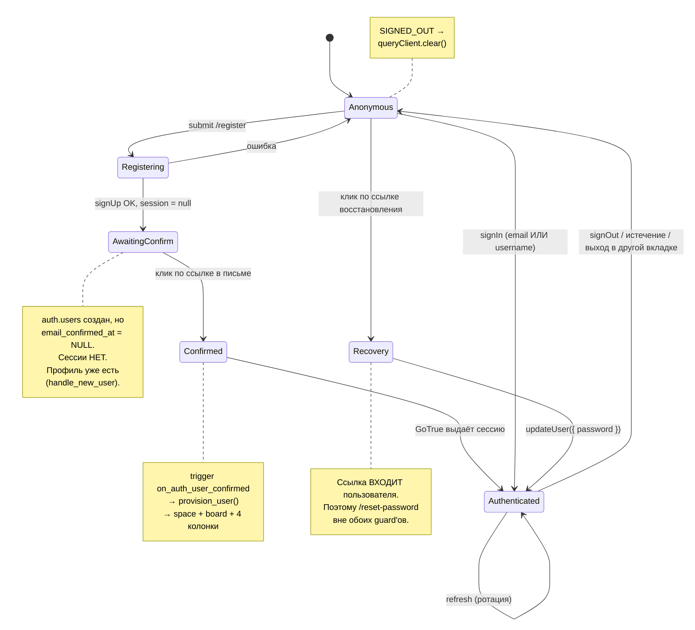
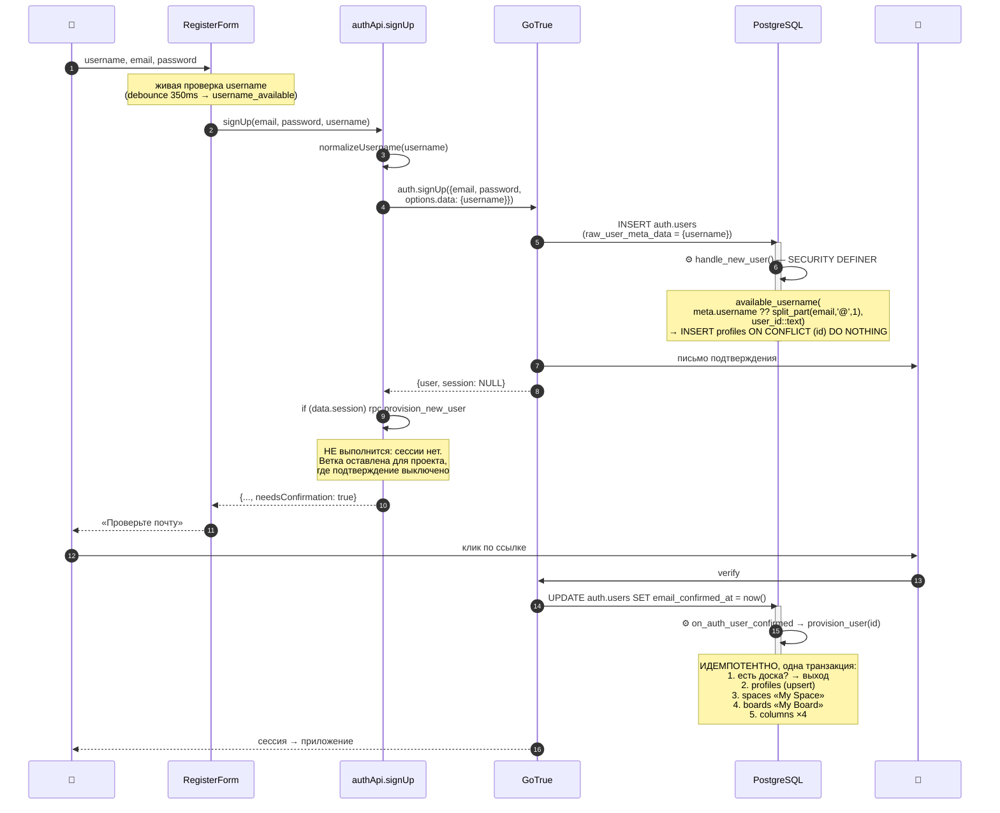
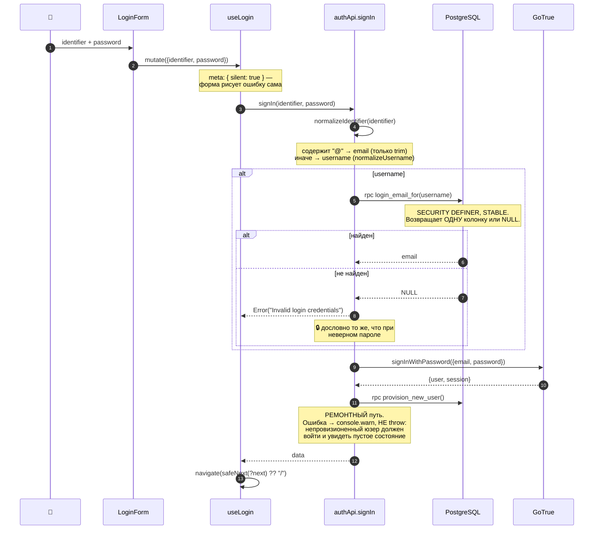
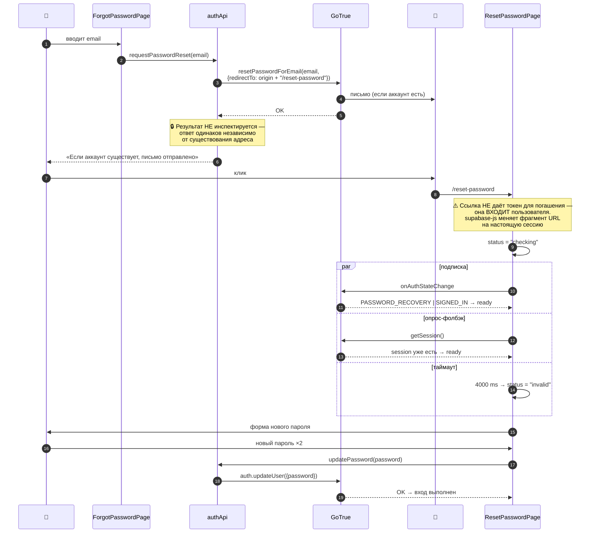
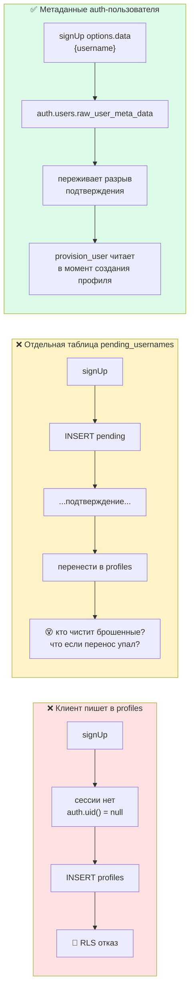

# 09 · Аутентификация

[← 08 · Безопасность](08-security.md) · [Оглавление](README.md) · [Далее: 10 · Username →](10-usernames.md)

---

## 🧒 LEVEL 1

> **Аутентификация — «кто ты». Авторизация — «что тебе можно».** Это разные вещи.

- Паспорт на входе в здание = **аутентификация** (глава 09, эта).
- Пропуск, который открывает только твои комнаты = **авторизация** ([глава 08](08-security.md)).

Как это работает в Veylo:

1. Ты называешь **имя** (email или username) и **пароль**.
2. Охранник проверяет и выдаёт **браслет** — JWT. На браслете написано, кто ты,
   и он «протухает» через час.
3. Ещё тебе дают **талон на новый браслет** — refresh token. Когда браслет
   протухнет, талон меняется на свежий, и никого не будят.
4. Каждый раз, когда ты что-то просишь, ты показываешь браслет. Не носишь его —
   ничего не получаешь.

---

## 👷 LEVEL 2 — Полная карта состояний



---

### Файлы, отвечающие за auth

| Файл | Роль |
|---|---|
| `providers/AuthProvider.tsx` | **единственный** владелец состояния сессии |
| `providers/authContext.ts` | контекст (отдельно из-за react-refresh) |
| `services/auth/useAuth.ts` | чтение контекста + throw вне провайдера |
| `services/auth/authApi.ts` | `signUp`, `signIn`, `signOut`, `requestPasswordReset`, `updatePassword` |
| `services/auth/useLogin.ts` / `useRegister.ts` / `useLogout.ts` | мутации |
| `services/auth/usePasswordReset.ts` | две мутации сброса |
| `services/auth/useUsernameAvailability.ts` | проверка занятости с debounce |
| `components/routes/ProtectedRoute.tsx` / `PublicRoute.tsx` | guard'ы |
| `utils/nextPath.ts` | 🔒 защита от open redirect |
| `utils/identifier.ts` | email или username — одно поле |
| `pages/auth/*` | 4 страницы |

---

### `AuthProvider` — одна подписка на всё приложение

```tsx
useEffect(() => {
  let mounted = true;

  async function init() {
    const { data: { session } } = await supabase.auth.getSession();
    if (!mounted) return;
    setUser(session?.user ?? null);
    setLoading(false);
  }
  init();

  const { data: { subscription } } = supabase.auth.onAuthStateChange((event, session) => {
    if (!mounted) return;
    if (event === "SIGNED_OUT") queryClient.clear();   // 🔑
    setUser(session?.user ?? null);
    setLoading(false);
  });

  return () => { mounted = false; subscription.unsubscribe(); };
}, []);
```

**Четыре решения:**

1. **Один `getSession()` и одна подписка на загрузку страницы**, сколько бы
   компонентов ни звали `useAuth()`. Иначе каждый вызов открывал бы свою
   подписку.
2. **Флаг `mounted`** — защита от `setState` после размонтирования (React 18
   StrictMode монтирует эффекты дважды в dev).
3. **`queryClient.clear()` на любой `SIGNED_OUT`**, не только по кнопке:
   истечение токена и выход в другой вкладке приходят сюда же.
4. **`useMemo({ user, loading })`** — иначе новый объект контекста на каждый
   рендер перерисовывал бы всё дерево.

---

### Guard'ы маршрутов

```
                     ┌──────────────────┐
                     │   loading?       │──да──▶ <Loading />
                     └────────┬─────────┘
                              │нет
  ProtectedRoute              ▼
  ┌────────────────────────────────────────────┐
  │ !user            → /login                  │
  │ !isConfirmed(u)  → /login?unconfirmed=1    │
  │ иначе            → <Outlet />              │
  └────────────────────────────────────────────┘

  PublicRoute
  ┌────────────────────────────────────────────┐
  │ user  → safeNext(?next) ?? "/"             │
  │ иначе → <Outlet />                         │
  └────────────────────────────────────────────┘
```

#### `isConfirmed` — три поля, а не одно

```ts
function isConfirmed(user: User) {
  return Boolean(
    user.email_confirmed_at ?? user.phone_confirmed_at ?? user.confirmed_at,
  );
}
```

> *«`email_confirmed_at` is the one email/password signup sets, but an OAuth
> account is confirmed by the provider and a phone account by an SMS code.
> Checking only the email field would lock both of those out of an app they can
> legitimately use.»*

Это пример хорошего проектирования: проверка написана так, чтобы **не ломать
способы входа, для которых её не писали**.

#### И это **defence in depth**, а не enforcement

> *«The real rule is `enable_confirmations` in `supabase/config.toml`: with it
> on, Supabase issues no session for an unconfirmed account at all, so this
> branch should be unreachable through the sign-up form.»*

Ветка нужна для случаев, которые через форму не идут: сессия, выданная до
включения настройки, или будущий способ её получить. *«"unreachable" is not a
property worth betting the whole authenticated app on.»*

#### 🔒 `safeNext` — защита от open redirect

```ts
export function safeNext(raw: string | null | undefined): string | null {
  if (!raw) return null;
  if (!raw.startsWith("/")) return null;                      // не абсолютный URL
  if (raw.startsWith("//") || raw.startsWith("/\\")) return null;  // не хост
  return raw;
}
```

**Атака, которую это ломает:**

| Вход | Результат | Почему |
|---|---|---|
| `/boards/abc` | ✅ пропущен | обычный путь |
| `https://evil.com` | ❌ `null` | не начинается с `/` |
| `//evil.com` | ❌ `null` | **protocol-relative URL** — браузер поймёт как хост |
| `/\evil.com` | ❌ `null` | некоторые браузеры нормализуют `\` в `/` |

Без этого ссылка `https://veylo.app/login?next=//evil.com` после успешного входа
отправила бы пользователя на фишинговую страницу — **с настоящего домена, после
настоящего входа**. Классический open redirect.

---

## 🔐 Три sequence-диаграммы

### A · Регистрация



**Почему `needsConfirmation` читается из ответа, а не из конфига:**

> *«Read off the response rather than assumed from configuration, so the UI
> tells the truth whichever way the project is set.»*

**Почему `handle_new_user` использует `ON CONFLICT (id) DO NOTHING`, а
`provision_user` — `DO UPDATE`:**
- `handle_new_user`: второй запуск не должен **переименовать** человека.
- `provision_user`: должен уметь **починить** отсутствующий email/username.

### B · Вход (email **или** username)



**Почему провижининг повторяется на каждом входе:**

> *«Provisioning normally happens at confirmation; if it failed there, this
> fixes it on the next sign-in. Idempotent and one indexed lookup when there is
> nothing to do, which is every sign-in after the first.»*

Это и есть причина, по которой триггеру **разрешено** проглатывать ошибки: у
сбоя есть путь восстановления.

**Почему `resolveError` бросается, а «не найден» — нет:**

> *«A failure here is the function being absent (the migration has not been
> applied) or unreachable. Reporting it as bad credentials would send someone to
> reset a password that is perfectly fine.»*

То есть: **ошибка инфраструктуры и ошибка пользователя различаются**, хотя
«username не найден» и «пароль неверный» — нет.

### C · Сброс пароля



**Почему `/reset-password` вне обоих guard'ов** — цитата из `Routes.tsx`:

> *«A Supabase recovery link does not hand this page a token to redeem — it
> **signs the user in**… So `PublicRoute` would see that session and redirect to
> `/` before the password could be changed, which is precisely the screen the
> link exists to reach.»*

**Почему три параллельных механизма готовности:**

| Механизм | Случай, который он покрывает |
|---|---|
| `onAuthStateChange` | обмен завершился **после** монтирования — обычный путь |
| `getSession()` | обмен завершился **до** подписки — полная перезагрузка на медленном рендере, повторный визит |
| `setTimeout(4000)` | обмен не произошёл вообще — просроченная/битая ссылка |

Без второго был бы вечный спиннер на повторном визите. Без третьего —
вечный спиннер на битой ссылке. Флаг `settled` гарантирует, что победит первый.

**Почему `redirectTo` строится из `window.location.origin`:**

> *«so the same build works on localhost and on the deployed domain without an
> environment variable to keep in step.»*

⚠️ **Подводный камень деплоя:** Supabase honors `redirectTo` **только** если URL
в allow-list проекта. Оба origin должны быть добавлены, иначе ссылка молча
приводит на корень сайта. См. [главу 24](24-deployment.md).

---

## 🏛 LEVEL 3

### JWT — что внутри и почему это работает

```
eyJhbGciOiJIUzI1NiIsInR5cCI6IkpXVCJ9  .  eyJzdWIiOiI4NGY...  .  4Adcj3UFYzP...
└──────── header ────────┘               └──── payload ────┘     └─ signature ─┘
   алгоритм подписи                    claims (sub, role, exp)     HMAC секретом
                                                                    ПРОЕКТА
```

Ключевые claims:

| Claim | Значение | Кто читает |
|---|---|---|
| `sub` | uuid пользователя | 🔑 **`auth.uid()` в каждой RLS-политике** |
| `role` | `authenticated` \| `anon` | `TO authenticated` в политиках |
| `exp` | истечение | GoTrue и PostgREST |
| `email` | адрес | иногда триггеры |

**Почему JWT нельзя подделать:** подпись сделана секретом проекта, который есть
**только у сервера**. Изменил `sub` — подпись не сходится — PostgREST отвергает
до того, как запрос дойдёт до SQL.

**Почему `auth.uid()` — это не «доверие клиенту»:** значение берётся из
проверенного JWT в заголовке запроса, а не из тела. Клиент не может его
«прислать».

### Access + refresh: зачем два токена

```
access token   — 1 час, ходит в КАЖДОМ запросе
refresh token  — долгий, ходит ТОЛЬКО при обновлении
```

| Если утечёт | Access | Refresh |
|---|---|---|
| Окно эксплуатации | ≤ 1 час | до отзыва |
| Как часто передаётся | постоянно | редко |

Ротация (`enable_refresh_token_rotation = true`) делает каждый refresh
**одноразовым**: при использовании он инвалидируется и выдаётся новый. Если
украденный токен применят после легитимного обновления — GoTrue увидит повтор.

`refresh_token_reuse_interval = 10` — 10-секундное окно, чтобы две вкладки,
обновившиеся одновременно, не выкинули друг друга.

### Где живёт сессия

`supabase-js` по умолчанию хранит её в `localStorage` и обновляет сама.

| | localStorage (по умолчанию) | httpOnly cookie |
|---|---|---|
| Уязвим к XSS | ✅ да | ❌ нет |
| Уязвим к CSRF | ❌ нет | ✅ да (нужен SameSite) |
| Работает в SPA без SSR | ✅ просто | требует серверного слоя |

**Позиция Veylo:** SPA без SSR, поэтому `localStorage`. Это значит, что **XSS
эквивалентен компрометации сессии** — и потому дисциплина против XSS (React
экранирует по умолчанию, никакого `dangerouslySetInnerHTML`) не косметика, а
часть модели безопасности.

**Repository evidence is insufficient to determine this:** явной Content
Security Policy в репозитории нет — ни в `index.html`, ни в `vercel.json`. Для
продакшена это стоило бы добавить.

### Регистрация: почему username едет метаданными



Комментарий в `authApi.ts`:

> *«Metadata rides on `auth.users.raw_user_meta_data`, survives the confirmation
> gap, and is read back by `provision_user()` at the moment the profile is
> actually created. **No second table, nothing pending to reconcile.**»*

Последнее предложение — суть. Второй стол = второе состояние = вопрос «кто
убирает мусор» = ещё один способ сломаться.

### Что происходит при выходе

```
signOut()
   ↓
GoTrue инвалидирует refresh, чистит хранилище
   ↓
onAuthStateChange("SIGNED_OUT")
   ↓
queryClient.clear()          ← весь кэш выброшен
   ↓
setUser(null)
   ↓
ProtectedRoute → <Navigate to="/login" replace />
```

**Почему `replace`, а не push:** иначе Back после выхода вернул бы на страницу,
которая тут же снова выбросит на `/login`. Пользователь застрял бы.

**Почему кэш чистится обязательно:** ключи board-scoped, но не user-scoped. Два
человека за одним браузером могут получить один и тот же `boardId`, и запись под
ним содержала бы строки предыдущего.

---

## 🧪 Мини-квиз

<details>
<summary><b>1.</b> Почему при регистрации username передаётся в <code>options.data</code>, а не пишется в <code>profiles</code>?</summary>

Потому что подтверждение почты обязательно, а значит `signUp` не возвращает
сессию: `auth.uid()` равен `null`, и RLS отвергнет любую запись в `profiles`.
Метаданные едут на `auth.users.raw_user_meta_data`, переживают разрыв между
регистрацией и подтверждением и читаются `provision_user()` в момент создания
профиля. Альтернатива — таблица `pending_usernames` — добавила бы второе
состояние и вопрос, кто убирает брошенные записи.
</details>

<details>
<summary><b>2.</b> Почему «неизвестный username» даёт то же сообщение, что «неверный пароль»?</summary>

Иначе форма входа становится **оракулом существования аккаунта**, который
перебирать дешевле, чем RPC за ней. `INVALID_CREDENTIALS` — дословная формулировка
GoTrue, переиспользованная намеренно, чтобы два случая были неразличимы.
</details>

<details>
<summary><b>3.</b> Почему <code>/reset-password</code> вне обоих guard'ов?</summary>

Потому что ссылка восстановления **входит пользователя** — supabase-js меняет
фрагмент URL на настоящую сессию до рендера. `PublicRoute` увидел бы эту сессию
и увёл на `/` ровно с того экрана, ради которого ссылка существует.
`ProtectedRoute` не подошёл бы по другой причине — он предполагает уже
установленную сессию и правильные редиректы для её отсутствия.
</details>

<details>
<summary><b>4.</b> Как <code>safeNext</code> предотвращает open redirect? Приведи вход, который он режет.</summary>

Он пропускает только строки, начинающиеся с одного `/` и **не** с `//` или `/\`.
Опасный вход — `//evil.com`: это protocol-relative URL, и браузер прочитает его
как **хост**, а не путь. Без проверки ссылка
`https://veylo.app/login?next=//evil.com` увела бы пользователя на фишинг
**после успешного входа с настоящего домена**.
</details>

<details>
<summary><b>5.</b> Зачем <code>ResetPasswordPage</code> три механизма определения готовности?</summary>

Каждый закрывает свой случай: `onAuthStateChange` — обмен завершился **после**
монтирования (обычный путь); `getSession()` — завершился **до** подписки (полная
перезагрузка, повторный визит); таймаут 4 сек — не завершился вообще (битая или
просроченная ссылка). Без второго — вечный спиннер при повторном визите, без
третьего — вечный спиннер на битой ссылке.
</details>

<details>
<summary><b>6.</b> Почему <code>isConfirmed</code> проверяет три поля?</summary>

`email_confirmed_at` ставит только email/password-регистрация. OAuth-аккаунт
подтверждает провайдер, телефонный — SMS-код. Проверка одного поля заблокировала
бы оба способа входа в приложении, которым они вправе пользоваться.
`confirmed_at` — общий roll-up Supabase, страховка для всего, что появится
позже.
</details>

<details>
<summary><b>7. Predict:</b> <code>provision_new_user</code> упала при входе. Что увидит пользователь?</summary>

Он **войдёт**. `signIn` логирует `console.warn` и не бросает:
*«a user who cannot be provisioned should still get into the app and see the
empty-board state, rather than being unable to sign in at all»*. Провижининг
идемпотентен, поэтому следующая попытка может починить состояние.
</details>

<details>
<summary><b>8.</b> Сессия лежит в <code>localStorage</code>. Какой класс атак это открывает и что с этим делать?</summary>

**XSS**: скрипт, выполнившийся на странице, читает `localStorage` и забирает
сессию. Смягчения: React экранирует вывод по умолчанию, `dangerouslySetInnerHTML`
не используется, зависимости обновляются. Полноценно закрывается **Content
Security Policy** — и её в репозитории **нет** ни в `index.html`, ни в
`vercel.json`. Это честный пункт «что бы я добавил перед продом».
</details>

---

[← 08 · Безопасность](08-security.md) · [Оглавление](README.md) · [Далее: 10 · Система username →](10-usernames.md)
