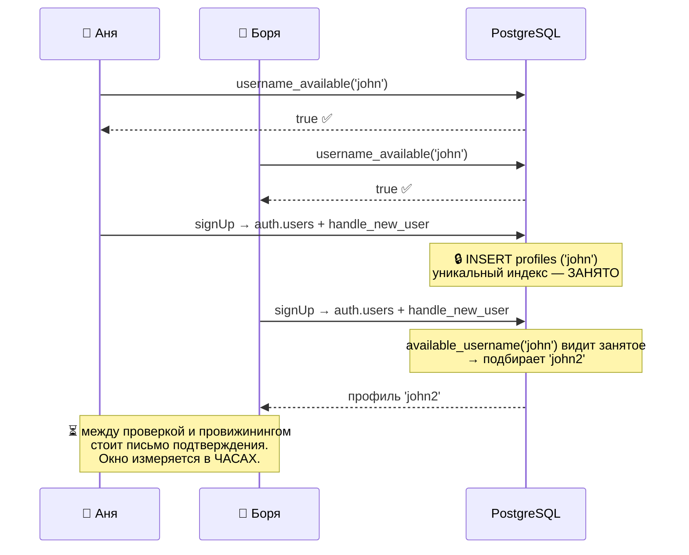
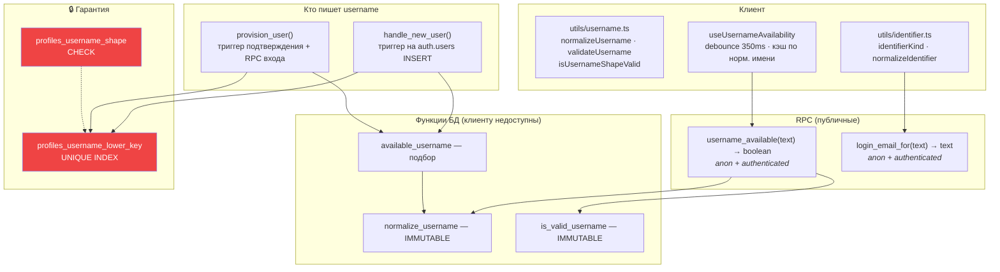

# 10 · Система username

[← 09 · Аутентификация](09-auth.md) · [Оглавление](README.md) · [Далее: 11 · Spaces / Boards / Tasks →](11-spaces-boards-tasks.md)

---

## 🧒 LEVEL 1

> Username — это **позывной**, а не подпись.

Позывной нужен, чтобы его **говорили друг другу**: «позови ada», «это задача
ada». Поэтому он:
- короткий и без пробелов;
- пишется одинаково, как бы ты его ни набрал: `Ada`, `ADA`, ` ada ` — **один и
  тот же человек**;
- уникален: двух `ada` быть не может.

А красивое имя с заглавными буквами и пробелами — это `full_name`, отдельное
поле. Позывной и подпись — разные вещи.

### Гонка, которую нельзя предотвратить на фронте

```
    Аня                          Боря
     │                            │
     ├─ «свободен ли john?» ──────┼──────────▶ БД: свободен ✅
     │                            ├─ «свободен ли john?» ──▶ БД: свободен ✅
     │                            │
     ├─ отправляет форму          ├─ отправляет форму
     │                            │
     ▼                            ▼
    ??? кто-то должен проиграть — и решает это БАЗА, а не фронт
```

Проверка «свободен?» — это **совет**, а не гарантия. Гарантию даёт
`unique index`: он атомарен, второй `INSERT` получит ошибку.

---

## 👷 LEVEL 2 — Полная реализация

### Правила, и где они записаны **дважды**

| Правило | В базе | На клиенте |
|---|---|---|
| длина 3..30 | `profiles_username_shape` | `USERNAME_MIN_LENGTH` / `MAX` |
| только `a-z0-9_` | тот же CHECK | `USERNAME_SHAPE` regex |
| первый символ — буква или цифра | тот же CHECK | `/^[a-z0-9]/` |
| уникальность (регистронезависимо) | `profiles_username_lower_key` | ❌ **невозможно** |
| каноническая форма — lowercase | `normalize_username()` | `normalizeUsername()` |

**Один и тот же regex в двух местах:**

```sql
-- 20260821120000_username_rules.sql
check (username ~ '^[a-z0-9][a-z0-9_]{2,29}$')
```
```ts
// src/utils/username.ts
const USERNAME_SHAPE = /^[a-z0-9][a-z0-9_]{2,29}$/;
```

Дублирование **осознанное**, и в коде записано, кто главный:

> *«This file is the client's copy of a rule the database owns… **When the two
> disagree the database wins**, and the UI's job is to report that gracefully
> rather than to argue.»*

Клиентская копия существует ради одного: остановить отправку формы, которая
не может пройти, и **сказать словами почему** — чего `23505` сделать не умеет.

### Нормализация — почему lowercase на входе, а не при сравнении

```ts
export function normalizeUsername(value: string): string {
  return value.trim().toLowerCase();
}
```

Есть два способа сделать username регистронезависимым:

| A. Хранить как набрали + индекс по `lower()` | B. Складывать регистр на входе (**выбрано**) |
|---|---|
| `Ada` хранится как `Ada` | `Ada` хранится как `ada` |
| каждое сравнение **обязано** помнить про `lower()` | `username` и `lower(username)` — одна строка **навсегда** |
| политики, RPC, join'ы, фронт — каждое место может забыть | забыть негде |
| `Ada` рендерится как `Ada` | `Ada` рендерится как `ada` |

Обоснование в коде:

> *«Keeping the typed casing would mean every comparison anywhere — policies,
> RPCs, joins, this file — has to remember to fold case, and **the one that
> forgets is a bug nobody sees until two accounts collide**. The cost is that
> `Ada` renders as `ada`, which is what `full_name` is for.»*

Обрати внимание: **цена решения названа прямо**. Это то, что отличает
инженерное решение от догмы.

### Четыре SQL-функции

```sql
-- 1. Каноническая форма. IMMUTABLE — значит, годится в индекс.
create function public.normalize_username(p_username text) returns text
language sql immutable set search_path = '' as $$
  select nullif(btrim(lower(coalesce(p_username, ''))), '');
$$;

-- 2. Форма имени. Тот же regex, что в CHECK и на клиенте.
create function public.is_valid_username(p_username text) returns boolean
language sql immutable set search_path = '' as $$
  select p_username is not null and p_username ~ '^[a-z0-9][a-z0-9_]{2,29}$';
$$;

-- 3. Публичный вопрос «свободно?». Возвращает ТОЛЬКО boolean.
create function public.username_available(p_username text) returns boolean
language sql security definer stable set search_path = '' as $$
  select public.is_valid_username(public.normalize_username(p_username))
     and not exists (
       select 1 from public.profiles p
        where p.username = public.normalize_username(p_username)
     );
$$;
revoke all on function public.username_available(text) from public;
grant execute on function public.username_available(text) to anon, authenticated;

-- 4. Подобрать свободное. НЕ доступна клиенту вообще.
create function public.available_username(p_wanted text, p_seed text default '')
returns text language plpgsql security definer set search_path = '' as $$ ... $$;
revoke all on function public.available_username(text, text) from public, anon, authenticated;
```

**Почему `username_available` доступна `anon`:** форма регистрации по
определению без сессии. Комментарий фиксирует, что именно раскрывается:

> *«Returns a boolean only, and is callable by anon because registration is
> signed out.»*

Функция отвечает «занято/свободно», а **не** отдаёт строку `profiles`. RLS на
`profiles` остаётся self-only.

**Почему `available_username` отозвана у всех:** она нужна только триггеру и
`provision_user`, которые сами `SECURITY DEFINER`. Клиенту генератор имён ни к
чему.

### `available_username` — алгоритм подбора

```sql
v_base := public.normalize_username(p_wanted);

-- Вместо отказа — вычистить запрещённое. Это выполняется для людей,
-- которые имя не выбирали (email-префикс с точкой внутри).
v_base := regexp_replace(coalesce(v_base, ''), '[^a-z0-9_]', '_', 'g');
v_base := regexp_replace(v_base, '^[^a-z0-9]+', '', 'g');

-- Слишком коротко → добавить хэш от seed (user id)
if length(v_base) < 3 then
  v_base := v_base || 'u' || substr(md5(coalesce(nullif(p_seed,''), v_base)), 1, 8);
  v_base := regexp_replace(v_base, '^[^a-z0-9]+', '', 'g');
end if;

v_base := left(v_base, 30);
v_try  := v_base;

-- Занято → добавлять числовой суффикс
while exists (select 1 from public.profiles p where p.username = v_try) loop
  v_suffix := v_suffix + 1;
  v_try := left(v_base, 30 - length(v_suffix::text)) || v_suffix::text;
end loop;

return v_try;
```

Примеры:

| Вход | Почему | Результат |
|---|---|---|
| `ada` (свободно) | — | `ada` |
| `ada` (занято) | суффикс | `ada2` |
| `Ada.Lovelace@x.com` → `ada.lovelace` | точка запрещена | `ada_lovelace` |
| `jo` | короче 3 | `jou3f2a91b8` (`'u'` + 8 hex от seed) |
| очень длинное | обрезка | 30 символов, суффикс **влезает внутрь** лимита |

**Три детали, за которые стоит уметь ответить:**

1. **Функция не отказывает, а подбирает.**
   > *«a raise here would be the failure mode M6-14 taught us to avoid»*
   Она вызывается **внутри вставки в `auth.users`**. Исключение откатило бы
   регистрацию целиком.

2. **Префикс `'u'` перед хэшем.**
   > *«so the result always starts with a letter, whatever the hash begins with,
   > and so a generated name is recognisable as one»*
   MD5 может начаться с цифры — это допустимо по regex, но `u`-префикс делает
   имя опознаваемо сгенерированным.

3. **`left(v_base, 30 - length(suffix))`.** Суффикс не выталкивает имя за 30
   символов, а вписывается внутрь — иначе `CHECK` отверг бы результат.

### Клиентская проверка занятости

```ts
const DEBOUNCE_MS = 350;

export type UsernameStatus =
  "idle" | "invalid" | "checking" | "available" | "taken" | "error";

export function useUsernameAvailability(input: string): UsernameAvailability {
  const settled = useDebounced(input, DEBOUNCE_MS);
  // 1. форма проверяется ЛОКАЛЬНО и первой
  // 2. запрос — только если форма валидна
  // 3. queryKey — НОРМАЛИЗОВАННОЕ имя
}
```

Три оптимизации, каждая со своей причиной:

| Приём | Что даёт |
|---|---|
| **debounce 350 мс** | один запрос на имя, а не на нажатие клавиши |
| **сначала локальная проверка формы** | *«A name that cannot be valid is never sent — there is nothing for the server to tell us, and asking would mint a cache entry per keystroke of a name that will be rejected anyway.»* |
| **ключ = нормализованное имя** | `Ada` и `ada` делят одну запись кэша и один запрос — ровно как делят одну строку в `profiles`. Стирание назад отвечается из кэша **без сети** |

**Хук про себя знает, что он — совет:**

> *«An advisory answer, and the UI must treat it as one. Between this returning
> `available` and the account actually being provisioned there is a
> confirmation email and however long it takes someone to open it, so the name
> can be taken in the meantime by anyone. The guarantee lives in
> `profiles_username_lower_key`.»*

---

## 🏛 LEVEL 3 — Гонка, разобранная по шагам

### Почему окно гонки в Veylo **особенно широкое**

В обычном приложении окно — миллисекунды между проверкой и вставкой. Здесь —
**минуты или часы**:



**Ключевой момент:** Боря **не получает ошибку**. Он получает `john2`.

Потому что имя занимает не форма регистрации, а `handle_new_user` /
`provision_user`, которые вызывают `available_username` — а она **подбирает**,
а не отказывает.

### Три уровня, и что делает каждый

```
┌─────────────────────────────────────────────────────────────────┐
│ 1. КЛИЕНТ (utils/username.ts + useUsernameAvailability)          │
│    • форма имени — синхронно                                     │
│    • «свободно?» — debounced, кэшируемый совет                   │
│    ⚠️ НЕ гарантия. Может устареть за миллисекунду.                │
├─────────────────────────────────────────────────────────────────┤
│ 2. ФУНКЦИИ БД (available_username)                               │
│    • детерминированный подбор                                    │
│    • цикл while по существующим именам                           │
│    ⚠️ Тоже НЕ гарантия: между SELECT и INSERT есть промежуток     │
├─────────────────────────────────────────────────────────────────┤
│ 3. UNIQUE INDEX (profiles_username_lower_key)  🔒 ЕДИНСТВЕННАЯ    │
│    • атомарен внутри транзакции                                  │
│    • второй INSERT получает 23505                                │
│    ✅ ЭТО и есть гарантия                                         │
└─────────────────────────────────────────────────────────────────┘
```

**Вопрос на собеседовании: «А цикл `while` в `available_username` — он же тоже
может проиграть гонку?»**

Да, может. Между `select 1 from profiles where username = v_try` и
последующим `INSERT` другая транзакция может вставить то же имя. Тогда
`INSERT` упрётся в уникальный индекс и вернёт `23505`.

Практически это не наблюдается: `handle_new_user` выполняется внутри вставки в
`auth.users`, окно — микросекунды, а два человека должны попасть в него с
**одинаковым** базовым именем. Промышленное усиление — `INSERT ... ON CONFLICT
DO NOTHING` в цикле с повтором. **Repository evidence: такого цикла-ретрая в
коде нет.**

### Почему уникальный индекс — по `lower(username)`, хотя всё и так lowercase

```sql
create unique index profiles_username_lower_key on public.profiles (lower(username));
```

На первый взгляд избыточно: `normalize_username` уже кладёт lowercase.

**Но `CHECK` и индекс защищают от разного:**
- `profiles_username_shape` гарантирует форму **для новых записей**;
- строки, вставленные до миграции, или строки, вставленные `service_role` в
  обход нормализации, могли бы содержать `Ada`;
- индекс по `lower()` ловит коллизию **даже тогда**.

Это **defence in depth на уровне схемы**: уникальность не зависит от того,
сработала ли нормализация.

### Вход по username и цена этой фичи

Чтобы войти по username, нужно резолвить его в email — GoTrue аутентифицирует
только по адресу.

```sql
create function public.login_email_for(p_username text) returns text
language sql security definer stable set search_path = '' as $$
  select p.email from public.profiles p
   where p.username = public.normalize_username(p_username)
   limit 1;
$$;
grant execute on function public.login_email_for(text) to anon, authenticated;
```

**Что это раскрывает:** для существующего username — его email. Это
**записанный, принятый компромисс**, а не недосмотр.

Три смягчения:

| Смягчение | Как реализовано |
|---|---|
| функция максимально узкая | одна колонка, `limit 1`, `STABLE` |
| сообщения неразличимы | `INVALID_CREDENTIALS` — дословная формулировка GoTrue, переиспользована для «нет такого username» |
| rate limit | `sign_in_sign_ups = 30` в `config.toml` |

Комментарий в `authApi.ts`:

> *«A distinct "unknown username" would turn the login form into an
> account-existence oracle that is cheaper to walk than the RPC behind it.»*

**Ключевая мысль для собеседования:** *«Мы не сделали фичу и потом обнаружили
дыру. Мы приняли решение, записали, что оно раскрывает, и сузили поверхность до
минимума. Полное устранение = отказ от входа по username.»*

### Одно поле вместо переключателя

```ts
export function identifierKind(value: string): IdentifierKind {
  return value.includes("@") ? "email" : "username";
}
```

**Почему `@` — исчерпывающий тест:**

> *«A username cannot contain one: `USERNAME_SHAPE` permits letters, digits and
> underscores only… So "contains an @" partitions the space exactly, with no
> ambiguous middle, and it does not need to agree with `EMAIL_SHAPE` about what
> a valid address is — that check happens afterwards, on the branch that
> cares.»*

Разделение **точное**, потому что множества не пересекаются по построению.

**Почему одно поле, а не радиокнопка:**

> *«Asking someone to declare which kind of identifier they are about to type is
> asking them to do work the string already answers — and it doubles the states
> the form can be in.»*

**Асимметрия нормализации:**

```ts
value: kind === "email" ? value.trim() : normalizeUsername(value)
```

Email только `trim()`, регистр сохраняется: **локальная часть адреса
регистрозависима по RFC**, и складывать её — дело Supabase, а не наше. Username
проходит через **ту же** `normalizeUsername`, что и форма регистрации — и
разделение этой функции и есть смысл:

> *«if the canonical form ever changes, login and registration cannot disagree
> about it.»*

---

## 📊 Полная карта



---

## 🧪 Мини-квиз

<details>
<summary><b>1.</b> Почему валидация на фронте не может гарантировать уникальность?</summary>

Потому что между проверкой и вставкой проходит время, за которое другой клиент
может занять то же имя. В Veylo это окно особенно широкое: между
`username_available` и созданием профиля стоит **письмо подтверждения** — часы,
а не миллисекунды. Гарантию даёт `profiles_username_lower_key`, атомарный
внутри транзакции.
</details>

<details>
<summary><b>2.</b> Аня и Боря одновременно регистрируются как <code>john</code>. Что получит каждый?</summary>

Аня получит `john`, Боря — `john2`. Ошибки **не будет ни у кого**: имя занимает
не форма, а `handle_new_user` → `available_username`, а она **подбирает**
свободное, а не отказывает. Это намеренно: функция выполняется внутри вставки в
`auth.users`, и исключение откатило бы регистрацию целиком.
</details>

<details>
<summary><b>3.</b> Почему username хранится lowercase, а не «как набрали + индекс по <code>lower()</code>»?</summary>

Потому что при хранении регистра **каждое** сравнение — в политиках, RPC,
join'ах, на фронте — обязано помнить про свёртку регистра, и то место, которое
забудет, даст баг, невидимый до коллизии двух аккаунтов. Свёртка один раз на
входе делает `username` и `lower(username)` одной строкой навсегда. Цена —
`Ada` рендерится как `ada`, для чего и существует `full_name`.
</details>

<details>
<summary><b>4.</b> Зачем уникальный индекс по <code>lower(username)</code>, если всё уже lowercase?</summary>

Defence in depth на уровне схемы. `CHECK` гарантирует форму только для новых
строк; данные, вставленные до миграции или `service_role` в обход нормализации,
могли бы содержать `Ada`. Индекс по `lower()` ловит коллизию **независимо от
того, сработала ли нормализация**.
</details>

<details>
<summary><b>5.</b> Почему <code>available_username</code> отозвана у <code>authenticated</code>?</summary>

Потому что она нужна только двум `SECURITY DEFINER`-функциям
(`handle_new_user`, `provision_user`), и клиенту генератор имён не нужен ни для
чего. `revoke all ... from public, anon, authenticated` — применение принципа
минимальных привилегий: доступно только то, у чего есть вызывающий.
</details>

<details>
<summary><b>6. Predict:</b> пользователь вводит <code>jo</code>. Пойдёт ли запрос к серверу?</summary>

**Нет.** `isUsernameShapeValid` проверяется локально и первым, `jo` короче трёх
символов → статус `invalid`, запрос не отправляется. Спрашивать нечего: сервер
не может сообщить ничего нового про имя, которое всё равно будет отвергнуто, а
запрос мял бы кэш записью на каждое нажатие клавиши.
</details>

<details>
<summary><b>7.</b> Почему <code>identifierKind</code> различает email и username по одному символу <code>@</code>?</summary>

Потому что множества не пересекаются **по построению**: `USERNAME_SHAPE`
разрешает только буквы, цифры и `_`, и та же форма закреплена в
`profiles_username_shape`. Значит, «содержит @» делит пространство точно, без
неоднозначной середины, и не обязано соглашаться с проверкой валидности адреса
— та выполняется позже, на ветке, которой это важно.
</details>

<details>
<summary><b>8.</b> Что раскрывает <code>login_email_for</code> и как это смягчено?</summary>

Для существующего username — его email. Смягчения: функция возвращает **одну
колонку** с `limit 1` и ничего больше; неизвестный/кривой/пустой username и
неверный пароль дают **дословно одинаковое** сообщение `Invalid login
credentials`; действует rate limit GoTrue (`sign_in_sign_ups = 30`).
Полное устранение потребовало бы отказаться от входа по username — компромисс
записан в заголовке миграции, а не обнаружен постфактум.
</details>

---

[← 09 · Аутентификация](09-auth.md) · [Оглавление](README.md) · [Далее: 11 · Spaces / Boards / Tasks →](11-spaces-boards-tasks.md)
