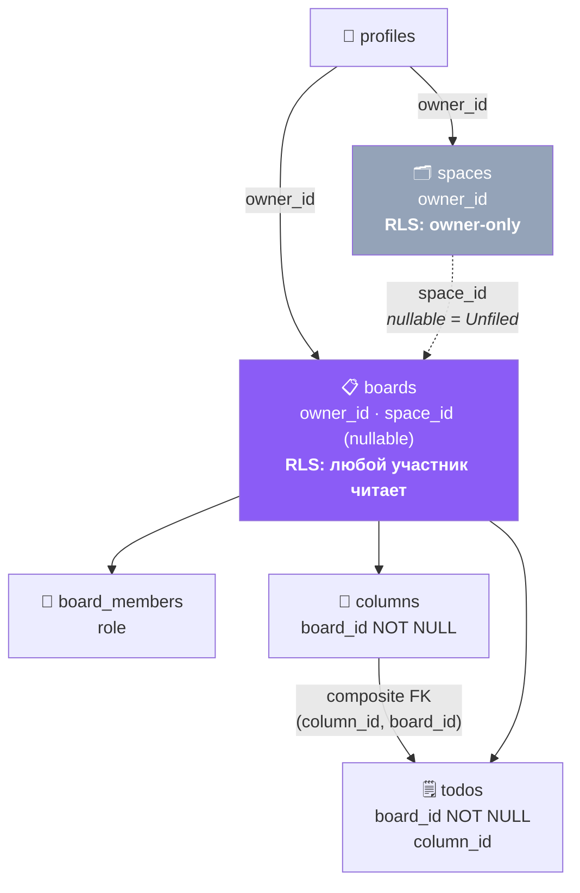
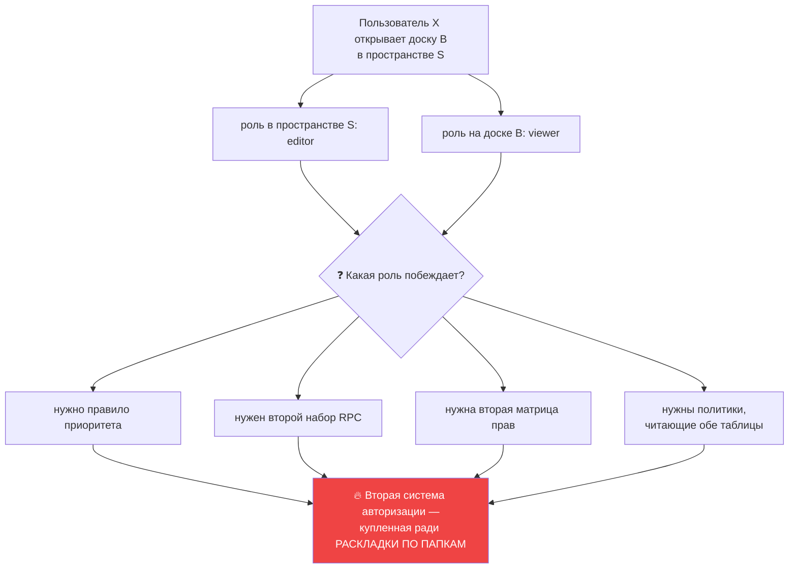

# 11 · Spaces / Boards / Tasks

[← 10 · Username](10-usernames.md) · [Оглавление](README.md) · [Далее: 12 · Kanban и DnD →](12-kanban.md)

---

## 🧒 LEVEL 1

```
🗂 Space   — папка на столе («Учёба», «Работа»)
   │         Личная. Никого в неё не пускают — это твой способ разложить своё.
   ▼
📋 Board   — сама доска («Курсовая»)
   │         ЕЁ можно расшарить. Это единица, у которой есть хозяин и гости.
   ▼
📑 Column  — стопка на доске («Сделать», «В работе», «Готово»)
   │
   ▼
🗒 Task    — стикер в стопке
```

**Самое важное и самое неочевидное:** папка **не** даёт доступ.

Ты можешь положить доску в папку «Работа». Твой коллега, которого ты пригласил
на доску, **не увидит** папку — он вообще не узнает, что она существует. Для
него доска лежит «без папки».

> Папка — это **как ТЫ разложил**, а не **кому что можно**.

---

## 👷 LEVEL 2 — Модель данных



Обрати внимание на асимметрию цветов: **фиолетовая** `boards` — единица
владения и разграничения; **серая** `spaces` — вспомогательная, вне модели
прав.

### Что где

| Сущность | Таблица | RLS | Кто создаёт |
|---|---|---|---|
| Space | `spaces` | **owner-only** | пользователь; первую — `provision_user` |
| Board | `boards` | участники читают, admin+ пишут, owner удаляет | пользователь; первую — `provision_user` |
| Column | `columns` | editor+ пишет | пользователь; четыре — `provision_user` |
| Task | `todos` | editor+ пишет | пользователь |

---

### Создание нового пользователя = одна транзакция

```sql
-- provision_user(p_user_id), последняя версия: 20260824120000_default_space_name.sql
select b.id into v_board_id from public.boards b
 where b.owner_id = p_user_id order by b.created_at, b.id limit 1;
if v_board_id is not null then return v_board_id; end if;   -- 🔑 идемпотентность

-- profile (upsert — чинит отсутствующий email/username)
insert into public.profiles as p (id, email, username) values (...)
on conflict (id) do update
   set email = excluded.email,
       username = coalesce(p.username, excluded.username);

insert into public.spaces (owner_id, title) values (p_user_id, 'My Space')
returning id into v_space_id;

insert into public.boards (owner_id, title, space_id)
values (p_user_id, 'My Board', v_space_id) returning id into v_board_id;

insert into public.columns (board_id, title, position, category) values
  (v_board_id, 'To Do',       0, 'todo'),
  (v_board_id, 'In Progress', 1, 'in_progress'),
  (v_board_id, 'In Review',   2, 'in_progress'),
  (v_board_id, 'Done',        3, 'done');
```

**Четыре свойства этой функции:**

| Свойство | Как достигнуто | Почему нужно |
|---|---|---|
| **Атомарность** | одна функция = одна транзакция | пользователь без доски или доска без колонок — это состояния, из которых нет выхода в UI |
| **Идемпотентность** | первый `select` возвращает существующую доску | два вызывающих: триггер подтверждения и RPC на каждом входе |
| **Ремонтопригодность** | `on conflict do update` на профиле | чинит частично созданный аккаунт |
| **Осмысленный дефолт** | 4 колонки, а не 0 | пустая доска без колонок — тупик: некуда положить задачу |

**Почему «In Review» имеет категорию `in_progress`, а не свою?** Потому что
категорий ровно три, и они — не названия колонок. Категория отвечает на вопрос
«это уже работа или уже готово», а название — на «как мы это называем». Две
колонки могут иметь одну категорию.

**История имени «My Space».** Миграция `20260824120000_default_space_name.sql`
переименовала пространства с `Unfiled` на `My Space`:

```sql
update public.spaces set title = 'My Space'
 where lower(btrim(title)) = 'unfiled';
raise notice 'M23-02: renamed % space(s) from Unfiled to My Space', v_renamed;
```

Почему: «Unfiled» — это **отсутствие папки**, а не имя папки. Называть так
реальное пространство означало путать два разных состояния на одном экране.

---

### «Unfiled» — состояние, а не сущность

```ts
export function groupBoardsBySpace(boards: IBoard[], spaces: ISpace[]): SpaceGroup[] {
  const known = new Set(spaces.map(s => s.id));

  const groups: SpaceGroup[] = spaces.slice().sort(byTitle)
    .map(space => ({ space, boards: inSpace(space.id) }));

  const unfiled = boards.filter(
    b => b.space_id === null || !known.has(b.space_id)    // 🔑 два случая
  ).sort(byTitle);

  if (unfiled.length) groups.push({ space: null, boards: unfiled });
  return groups;
}
```

**`space: null` — это и есть «Unfiled».** Отдельной строки в БД нет.

**🔥 Два условия попадания в Unfiled — и второе интереснее первого:**

| Условие | Что означает |
|---|---|
| `space_id === null` | владелец не разложил доску по папкам |
| `!known.has(space_id)` | 🔑 **доска в папке, которую я не вижу** |

Второй случай — прямое следствие решения «space не является областью прав».
Меня пригласили на доску Ани; Аня положила её в своё пространство «Клиенты»;
RLS на `spaces` — owner-only, значит эта строка мне **не возвращается**.
`space_id` у доски заполнен, но соответствующего пространства в моём списке нет
— и доска честно показывается как Unfiled.

**Без этой проверки** доска просто **исчезла бы** из сайдбара: она не попала бы
ни в одну группу пространств (их нет), и не прошла бы условие `space_id === null`.

**И группа отображается последней, всегда:**

> *«it is where a board sits until someone decides otherwise, so it reads as the
> remainder rather than as a peer of the named folders»*

---

### Триггер, который делает «space не даёт доступ» безопасным

M3-17 разрешил **любому админу** обновлять доску. Значит, админ мог бы записать
`space_id` пространства, которого не видит. Отсюда:

```sql
create or replace function public.boards_space_ownership() returns trigger
language plpgsql set search_path = '' as $$
begin
  -- Срабатывает ТОЛЬКО когда space_id меняется. Обычные админские
  -- обновления других колонок не затрагиваются.
  if tg_op = 'UPDATE' and new.space_id is not distinct from old.space_id then
    return new;
  end if;
  if new.space_id is null then return new; end if;

  -- Нет сессии — серверный провижининг и миграции. Пропускаем:
  -- эскалировать не с кого.
  if (select auth.uid()) is null then return new; end if;

  if new.owner_id is distinct from (select auth.uid()) then
    raise exception 'Only a board''s owner may file it into a space' using errcode = '42501';
  end if;
  if not public.owns_space(new.space_id) then
    raise exception 'A board can only be filed into a space you own' using errcode = '42501';
  end if;
  return new;
end;
$$;
```

**Три ранних выхода — каждый со своей причиной:**

1. `space_id` не менялся → это обычное обновление доски, не наше дело.
2. `space_id` стал `null` → «вынуть из папки» разрешено всегда.
3. `auth.uid()` равен `null` → выполняется провижининг или миграция. Пропускаем,
   потому что **эскалировать не с кого**: нет актора — нет и повышения прав.

Третий пункт особенно поучителен. Наивная реализация упала бы на
`provision_user`, который создаёт доску **внутри** транзакции подтверждения
почты, где сессии ещё нет.

---

## 🗑 Удаление: три разных ответа

### 1. Удаление Space → доски **выживают**

```sql
boards.space_id → spaces.id  ON DELETE SET NULL
```

```
До:                          После DELETE spaces:
🗂 Работа                     (нет папки)
  ├── 📋 Клиент А              📋 Клиент А  → Unfiled
  └── 📋 Клиент Б              📋 Клиент Б  → Unfiled
```

Логика: папка — организационная, не содержащая. Выбросить папку не значит
выбросить бумаги. И это **обратимо** — доски можно разложить заново.

### 2. Удаление Board → каскад по всему

```
DELETE boards
  ├─ board_members   CASCADE
  ├─ board_invites   CASCADE
  ├─ columns         CASCADE
  ├─ todos           CASCADE
  │   └─ comments    CASCADE
  └─ activities      CASCADE
```

Необратимо, поэтому **только владелец** (`canDeleteBoard: rank >= RANK.owner`
и DELETE-политика с M2-01).

И поэтому же есть подтверждение вводом:

```ts
// src/services/boards/deleteConfirm.ts + deleteConfirm.test.ts
```

Ввести имя доски — то же трение, что у GitHub при удалении репозитория:
операция, у которой нет отмены, требует действия, которое нельзя совершить
случайно.

### 3. 🔥 Удаление Column → задачи **переселяются**, а не удаляются

Это единственная связь в схеме, где каскад **не** используется, — и намеренно.

```sql
create or replace function public.delete_column(
  p_column_id uuid, p_move_to_column_id uuid
) returns void
language plpgsql
security invoker          -- ⬅️ ЗАМЕТЬ: INVOKER, а не DEFINER
...
```

**Почему `SECURITY INVOKER`?** Потому что здесь нечего обходить: политики M3-05
уже говорят «editor+ может менять и удалять колонки этой доски». Функция нужна
не ради привилегий, а ради **атомарности**.

Комментарий фиксирует ещё и то, что она чинит:

> *«the zero-row DELETE check turns a silent RLS denial into 42501»*

То есть: без функции viewer, попытавшийся удалить колонку, получил бы «0 строк
удалено» и **никакой ошибки** — `USING` фильтрует молча. Функция проверяет
число удалённых строк и превращает молчание в явный `42501`.

**UI следует из схемы, а не наоборот:**

```
DeleteColumnModal:
  ├─ колонок > 1  →  обязательный выбор «куда перенести задачи»
  └─ колонок = 1  →  вариант удаления скрыт вообще
```

Нельзя удалить последнюю колонку, потому что задачам некуда деться.

⚠️ **Честная деталь из плана:** RPC `delete_column` **применена и проверена**
(M3-11, §10 матрицы), но клиент, по записи в плане, всё ещё использовал путь
из четырёх round-trip'ов. В текущем коде `columnsApi.deleteColumn` вызывает
именно RPC — то есть замена выполнена. План в этой части устарел.

---

## 🏛 LEVEL 3

### Почему Space — не область прав: решение M14 целиком

Это лучший пример «архитектурного решения с посчитанной ценой» во всём проекте.

**Вопрос:** является ли Space областью действия ролей?

**Что было бы, если да:**



Цитата из плана:

> *«The alternative is a space role and a board role that can disagree, a
> precedence rule between them, a second set of RPCs and a second matrix in
> this section — a whole second authorization system, **bought for filing**.»*

**Что было решено вместо этого:**

| Решение | Следствие |
|---|---|
| `spaces.owner_id` + owner-only RLS | пространство видит только владелец |
| `boards.space_id` — решение владельца о раскладке | не влияет на права |
| член, не владеющий пространством, видит доску как Unfiled | без специального кода — просто `!known.has(space_id)` |
| `boards.space_id` можно ставить только в своё пространство | триггер `boards_space_ownership` |

**И самое важное — решение обратимо:**

> *«**Reversible without a rewrite:** if spaces later need sharing, `spaces`
> gains its own membership and `boards.space_id` is unchanged.»*

Это ответ на вопрос «а если бизнес передумает». Не «мы угадали», а «мы выбрали
ту дверь, которая открывается в обе стороны».

**Почему это решали ДО того, как появились пространства:** Appendix B откладывал
вопрос *«until workspaces become real»*, а M15 делал их реальными. Значит,
ответить нужно было **до** создания таблицы `spaces`, а не после. Решение,
принятое после появления данных, стало бы миграцией данных.

### Почему счётчик ключей — на доске

Вторая «односторонняя дверь» M14:

```sql
alter table public.boards add constraint boards_key_prefix_format
  check (key_prefix ~ '^[A-Z][A-Z0-9]{1,9}$');
-- + next_key integer
```

> *«`boards.key_prefix` has to be settled before a user can create a second
> board, or two boards both hand out `KAN-1`.»*

```
Board «Учёба»  (KAN)          Board «Работа»  (WRK)
  KAN-1  Прочитать главу        WRK-1  Починить деплой
  KAN-2  Сдать эссе             WRK-2  Ревью PR
```

Ключ читаем **и** уникален в пределах доски — а доска и есть контекст, в
котором люди о нём говорят.

**Номера не переиспользуются** (удалил `KAN-2`, следующий будет `KAN-4`), потому
что «см. KAN-2» в чьём-то сообщении не должно однажды начать указывать на
другую задачу.

Сборка ключа — на **границе**, а не в листовом компоненте:

```ts
// src/utils/taskKey.ts + toCardContent.ts
taskKey(board.key_prefix ?? DEFAULT_KEY_PREFIX, todo.board_key)
```

Комментарий в `types/data.ts`:

> *«The card composed `KAN-{boardKey}` from a literal back then, which is a
> presentational component holding a fact about the board it is not given.»*

### `visibility` — колонка, которая пока ничего не делает

`boards.visibility` — `CHECK (visibility in ('private','team'))`, по умолчанию
`private`.

**Repository evidence:** ни одна RLS-политика на `boards`, `columns` или
`todos` не читает `visibility`. Доступ решается исключительно через
`accessible_board_ids()` (владение ∪ членство). То есть колонка сейчас —
**задел**, а не работающая настройка. Публичные доски в Appendix E значатся вне
scope v1.

Это стоит знать, чтобы не пообещать функциональность, которой нет.

### Почему `space_id` nullable, а `board_id` — NOT NULL

Разница фундаментальная и объясняет всю модель:

| | `boards.space_id` | `todos.board_id` |
|---|---|---|
| nullable | ✅ | ❌ `NOT NULL` |
| Что означает `null` | «не разложено» — валидное состояние | ничего: задача **не может** существовать без доски |
| Что если пропадёт родитель | `SET NULL`, доска цела | `CASCADE`, задача исчезает |
| Роль в правах | никакой | 🔑 **ключ каждой политики** |

Из `docs/ARCHITECTURE.md`:

> *«Everything should be scoped to a Board… This avoids permission problems.»*

`board_id NOT NULL` — не про валидацию данных. Это про то, что **у каждой
строки всегда есть ответ на вопрос «кому это можно видеть»**. Nullable
`board_id` означал бы строки-сироты, у которых политика неопределена.

### Клиентское создание: одинаковая форма у трёх сущностей

```ts
// spaces / boards — один и тот же паттерн
export async function createBoard({ id = crypto.randomUUID(), title, spaceId = null }) {
  const { data: { user } } = await supabase.auth.getUser();
  if (!user) throw new Error("Not authenticated");

  const { data, error } = await supabase
    .from("boards")
    .insert({ id, title, owner_id: user.id, space_id: spaceId })
    .select().single();

  if (error) throw error;
  return data;
}
```

Клиент минтит uuid и здесь — по той же причине, что для задач: оптимистичная
строка **является** строкой.

⚠️ **Тот же честный пункт, что в [главе 08](08-security.md):** `owner_id`
присылается клиентом, хотя мог бы быть `default auth.uid()`. Здесь риск ещё
ниже, чем с `creator_id`: доска, созданная с чужим `owner_id`, стала бы **чужой**
— автор потерял бы к ней доступ. Плюс триггер `boards_add_owner_membership`
сделал бы участником указанного владельца, а не создателя. То есть это
самонаказуемо. Но `default auth.uid()` + отзыв гранта на колонку всё равно
были бы правильнее.

---

## 🧪 Мини-квиз

<details>
<summary><b>1.</b> Меня пригласили на доску. Владелец положил её в своё пространство «Клиенты». Что я увижу в сайдбаре?</summary>

Доску в группе **Unfiled**. RLS на `spaces` — owner-only, значит строка
пространства мне не возвращается. У доски `space_id` заполнен, но
`!known.has(space_id)` истинно, поэтому `groupBoardsBySpace` относит её к
остатку. Без этой проверки доска **исчезла бы** из сайдбара совсем: она не
попала бы ни в одну группу и не прошла бы условие `space_id === null`.
</details>

<details>
<summary><b>2.</b> Почему удаление Space не удаляет доски?</summary>

`boards.space_id → spaces.id ON DELETE SET NULL`. Папка — организационная, а не
содержащая сущность: выбросить папку не значит выбросить бумаги. Доски уходят в
Unfiled, и операция полностью обратима — их можно разложить заново.
</details>

<details>
<summary><b>3.</b> Почему <code>delete_column</code> — <code>SECURITY INVOKER</code>, а не <code>DEFINER</code>?</summary>

Потому что обходить нечего: политики M3-05 уже дают editor+ право менять и
удалять колонки своей доски. Функция нужна ради **атомарности** (переселить
задачи и удалить колонку одной транзакцией), а не ради привилегий.
`SECURITY DEFINER` здесь был бы лишним обходом RLS без причины — то есть новой
поверхностью атаки бесплатно.
</details>

<details>
<summary><b>4.</b> Что делает <code>delete_column</code> с проверкой числа удалённых строк?</summary>

Превращает молчаливый отказ RLS в явную ошибку `42501`. Без неё viewer,
пытающийся удалить колонку, получил бы «0 строк удалено» и **никакого**
сообщения — `USING` фильтрует невидимо. Проверка `get diagnostics` делает
отказ различимым.
</details>

<details>
<summary><b>5.</b> Почему решение «Space — не область прав» принимали ДО создания таблицы <code>spaces</code>?</summary>

Потому что после появления данных это перестало бы быть решением и стало бы
миграцией данных плюс переписыванием политик. Appendix B откладывал вопрос
«пока workspaces не станут реальными», а M15 делал их реальными — значит,
момент ответа был прямо перед созданием таблицы. И ответ выбрали **обратимый**:
если пространствам понадобится шаринг, у них появится своё членство, а
`boards.space_id` не меняется.
</details>

<details>
<summary><b>6. Predict:</b> админ (не владелец) пытается положить доску в своё пространство. Результат?</summary>

`42501 'Only a board''s owner may file it into a space'`. Триггер
`boards_space_ownership` требует, чтобы `new.owner_id` совпадал с `auth.uid()`.
Админ может менять доску (политика M3-17), но `space_id` — исключение: это
раскладка **владельца**, и она не делится.
</details>

<details>
<summary><b>7.</b> Почему <code>boards_space_ownership</code> пропускает случай <code>auth.uid() IS NULL</code>?</summary>

Потому что это серверный контекст: `provision_user` создаёт доску внутри
транзакции подтверждения почты, где сессии ещё нет, и миграции тоже выполняются
без актора. Пропуск безопасен, потому что **эскалировать не с кого** — нет
пользователя, который повысил бы себе права. Наивная реализация без этой ветки
сломала бы регистрацию.
</details>

<details>
<summary><b>8.</b> Делает ли <code>boards.visibility</code> что-нибудь сегодня?</summary>

**Нет.** Ни одна политика на `boards`, `columns` или `todos` её не читает —
доступ решается только через `accessible_board_ids()` (владение ∪ членство).
Колонка существует как задел; публичные доски значатся в Appendix E как вне
scope v1.
</details>

---

[← 10 · Username](10-usernames.md) · [Оглавление](README.md) · [Далее: 12 · Kanban и Drag & Drop →](12-kanban.md)
