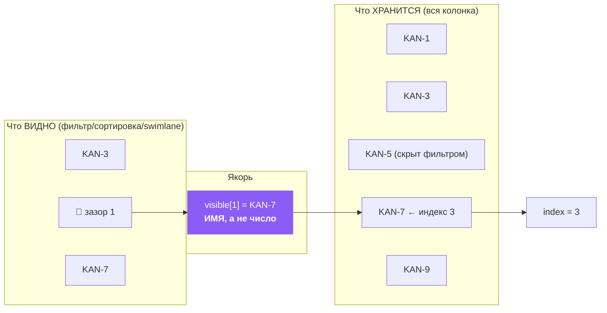
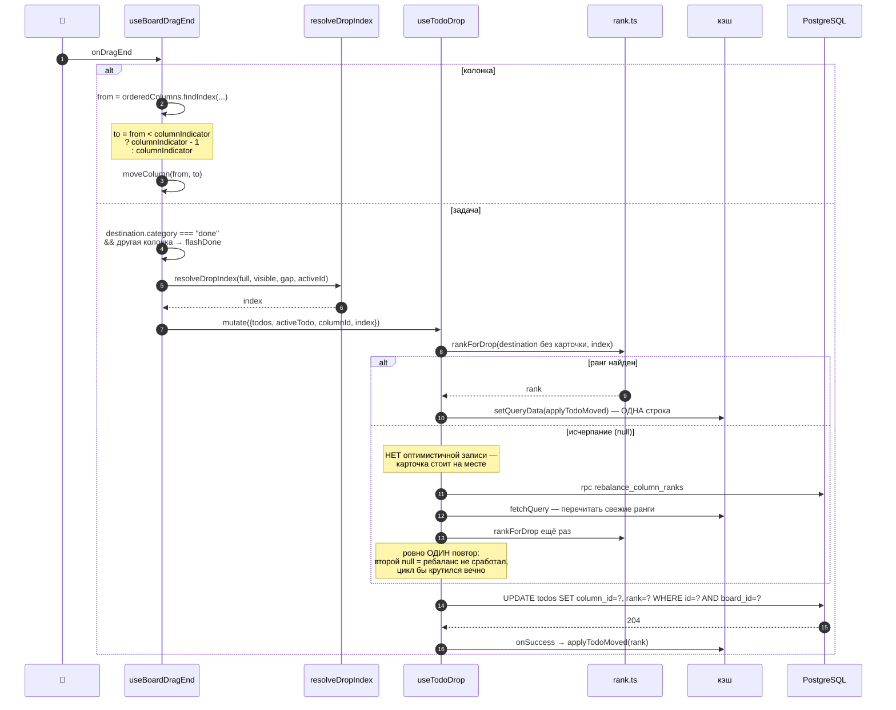
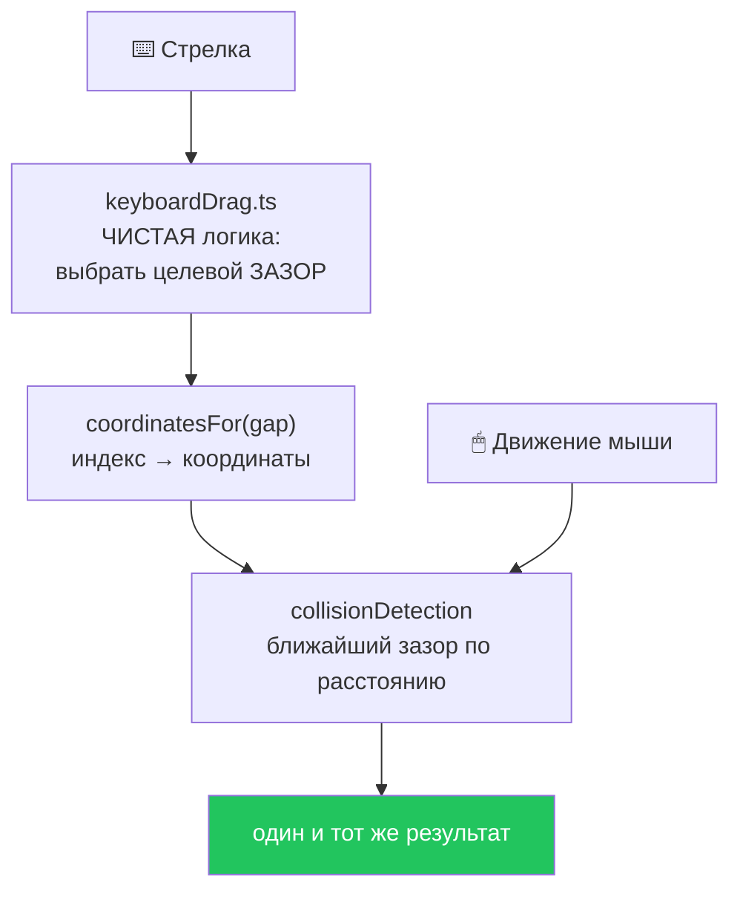

# 12 · Kanban и Drag & Drop

[← 11 · Spaces/Boards/Tasks](11-spaces-boards-tasks.md) · [Оглавление](README.md) · [Далее: 13 · Timeline →](13-timeline.md)

> 🔥 Самая техничная глава. Здесь живёт лучший алгоритм проекта.

---

## 🧒 LEVEL 1

### Проблема порядка — объясняем на книжной полке

У тебя полка с книгами, и порядок важен. Как его записать?

**Способ 1 — пронумеровать: 1, 2, 3, 4, 5.**

Вставляешь книгу между 2 и 3 → приходится **перенумеровать всё справа**:
3→4, 4→5, 5→6. Пять исправлений ради одной книги.

А теперь двое делают это **одновременно**:

```
Полка:  [A=1] [B=2] [C=3]

Аня  вставляет X между A и B:   A=1, X=2, B=3, C=4   ← пишет ВСЕ 4
Боря вставляет Y между B и C:   A=1, B=2, Y=3, C=4   ← пишет ВСЕ 4

Записи ушли одновременно. Побеждает последняя.
Результат: A, B, Y, C.  ← 💥 Книга Ани ПРОПАЛА.
```

Обрати внимание: Боря не трогал книгу X. Он даже не знал о ней. Но его запись
её стёрла, потому что он записал **весь массив** со своего устаревшего снимка.

**Способ 2 — дробные номера: 1024, 2048, 3072.**

Вставляешь между 1024 и 2048 → берёшь середину: **1536**. Меняется **одна**
книга. Остальные не трогаются.

```
Полка:  [A=1024] [B=2048] [C=3072]

Аня  вставляет X между A и B: X = 1536   ← пишет ОДНУ строку
Боря вставляет Y между B и C: Y = 2560   ← пишет ОДНУ строку

Результат: A(1024), X(1536), B(2048), Y(2560), C(3072)  ✅ обе на месте
```

Конфликт возможен **только** если двое двигают **одну и ту же** книгу.

Это и есть **fractional indexing**, и `src/utils/rank.ts` — его реализация.

### Единственная проблема дробных чисел

Половинить бесконечно нельзя: `1024 → 1536 → 1280 → 1152 → …`. Примерно через
50 делений компьютер перестаёт различать соседние числа. Тогда полка
**переразмечается** заново (`1024, 2048, 3072…`), и деление продолжается.

---

## 👷 LEVEL 2 — `utils/rank.ts` целиком

```ts
export const RANK_GAP = 1024;
```

**Почему 1024, а не 1?**

> *«it buys ten midpoint insertions before the fractional part starts consuming
> mantissa at all»*

`1024 = 2¹⁰`. Десять делений пополам проходят **в целых числах** — дробная
часть `double` вообще не начинает расходоваться.

И то же значение зашито в `20260814121000_backfill_ranks.sql` и в
RPC-ребалансировках:

> *«a client appending after a backfilled row computes `last + RANK_GAP`, and a
> rebalance the server performs has to leave the board in the same shape the
> client would have»*

### `byRank` — компаратор с обратной совместимостью

```ts
export function byRank(a: Ranked, b: Ranked): number {
  return rankOf(a) - rankOf(b);
}

function rankOf(row: Ranked): number {
  return row.rank ?? (row.position ?? 0) * RANK_GAP;
}
```

**Умножение на `RANK_GAP` — не косметика.** Оно переводит старую шкалу в новую:

```
position 0, 1, 2  →  0, 1024, 2048  ← ровно то, что записал бы backfill
```

> *«a row written by an older client, or read between the migration and the
> backfill, still sorts where it belongs instead of jumping to the front»*

Смешанная колонка сортируется **правильно**, а не просто «не падает». Это то,
что делает порядок деплоя неважным.

### `rankBetween` — четыре случая

```ts
export function rankBetween(before: number | null, after: number | null): number | null {
  if (before === null && after === null) return RANK_GAP;        // 1. пустая колонка

  if (before === null) {                                          // 2. в начало
    const next = after! / 2;
    return next > 0 && next < after! ? next : null;
  }

  if (after === null) return before + RANK_GAP;                   // 3. в конец

  if (before >= after) return null;                               // 4a. баг вызывающего

  const middle = before + (after - before) / 2;                   // 4b. середина
  return middle > before && middle < after ? middle : null;
}
```

| Случай | Формула | Почему именно так |
|---|---|---|
| пустая колонка | `RANK_GAP` | стартовое значение = шаг сетки |
| **в начало** | `after / 2` | 🔑 **не** `after - RANK_GAP` — иначе колонка, в которую многократно вставляют сверху, уходит в отрицательные. Половинение держит всё положительным |
| **в конец** | `before + RANK_GAP` | единственное место, где ранги растут — и растут **на константу**, а не удвоением, поэтому долгоживущая колонка не приближается к 2⁵³ |
| середина | `before + (after-before)/2` | **не** `(before+after)/2` — это устойчивее к переполнению при больших значениях |

**Проверка исчерпания — `>`/`<`, а не `!==`:**

> *«what matters is that the result is **strictly** between, not that it differs
> from one particular endpoint»*

```ts
return middle > before && middle < after ? middle : null;
```

`null` — **не ошибка**. Это «здесь больше нет места, переразметь колонку». И
это возвращается **до записи**, а не после — иначе две карточки получили бы
один ранг, то есть ровно ту неопределённость порядка, ради устранения которой
всё затевалось.

### `neighboursAt` — off-by-one, который стоит понять

```ts
export function neighboursAt(ordered: Ranked[], index: number) {
  const at = Math.max(0, Math.min(index, ordered.length));    // 🔑 clamp
  const before = at > 0 ? (ordered[at - 1] ?? null) : null;
  const after = ordered[at] ?? null;
  ...
}
```

**`index` — это ЗАЗОР, а не элемент:**

```
        зазор 0
   ┌──────────────┐
   │              │
   ├─ карточка 0 ─┤  ← ordered[0]
   │   зазор 1    │
   ├─ карточка 1 ─┤  ← ordered[1]
   │   зазор 2    │
   ├─ карточка 2 ─┤  ← ordered[2]
   │   зазор 3    │
   └──────────────┘

зазор N:  before = ordered[N-1],  after = ordered[N]
```

**Зачем clamp:**

> *«a gap index past the end means the bottom, not "no neighbours at all".
> Without this, an index of 99 into a three-card column reads as an empty column
> and the card lands at the top — reachable from a filtered board, where the
> visible gap index can exceed the stored column»*

То есть без clamp'а на **отфильтрованной** доске карточка при дропе вниз
улетала бы наверх.

---

## 🎯 Механика перетаскивания

### Почему DnD написан руками

```
┌──── @dnd-kit/sortable ────┐        ┌──── Veylo ────────────────┐
│                           │        │                           │
│  [A]                      │        │  [A]      ← не двигается  │
│  [B] ← карточки           │        │  ━━━━━━   ← синяя линия   │
│  ╱╲    РАЗДВИГАЮТСЯ       │        │  [B]      ← не двигается  │
│  [C]                      │        │  [C]      ← не двигается  │
│                           │        │                           │
│  layout прыгает           │        │  двигается только         │
│  каждый кадр              │        │  DragOverlay              │
└───────────────────────────┘        └───────────────────────────┘
```

Из `CLAUDE.md`: *«Nothing in the board reflows while dragging; only the
`DragOverlay` moves.»*

### `DropZone` — постоянно смонтированный зазор

```tsx
const { setNodeRef } = useDroppable({
  id: `todo-gap:${columnId}:${index}`,
  data: { type: "todo-gap", columnId, index, beforeId, afterId },
});
```

**Четыре роли одного элемента:**

| Роль | Как |
|---|---|
| измеряемая цель | `useDroppable` регистрирует rect, который читает collision detection |
| индикатор | рисует синюю линию при `active` |
| **создание задачи** | в покое: hover → `+` → форма открывается **в этом зазоре** |
| знание о соседях | `beforeId`/`afterId` — чтобы отбросить зазоры вокруг самой карточки |

Про две линии в одном зазоре — деталь дизайна, записанная в коде:

> *«Held at 40% so the two purple lines this gap can draw are told apart: full
> strength means "the card lands here", faint means "you could make one here".»*

И: `const showAdd = canAdd && !!onAdd && !dragging;` — во время перетаскивания
зазор означает «положить сюда», поэтому affordance создания уходит.

### `collisionDetection` — двухфазный поиск

```ts
// ---- фаза 1: ближайшая КОЛОНКА (не дальше 80px) --------------------
const column = pickNearest(columns, rect => distanceToRect(rect, x, y), COLUMN_HOVER_DISTANCE);
if (!column) return [];

// ---- фаза 2: ближайший ЗАЗОР внутри неё, только по вертикали -------
const gaps = droppableContainers.filter(c =>
  typeOf(c) === "todo-gap" && c.data.current?.columnId === column.container.id);

if (!gaps.length) return toCollisions(column);      // пустая колонка

const hit = pickNearest(gaps, rect => Math.abs(rect.top + rect.height / 2 - y));

if (touchesActive(hit, active.id)) return [];       // зазор у самой карточки → нет цели
return toCollisions(hit);
```

```
     Колонка A          Колонка B          Колонка C
   ┌───────────┐      ┌───────────┐      ┌───────────┐
   │           │      │           │      │           │
   │           │      │  ▁▁▁▁▁▁▁  │◀── 1. какая колонка ближе
   │           │      │  ┃  🖱   ┃  │       к курсору? (≤80px)
   │           │      │  ▔▔▔▔▔▔▔  │
   │           │      │           │◀── 2. какой ЗАЗОР в ней
   └───────────┘      └───────────┘      └───────────┘   ближе по Y?
```

**Три решения:**

1. **Расстояние, а не пересечение.** Ничего не переливается, зазоры тонкие —
   попадать «внутрь» нечем.
2. **`COLUMN_HOVER_DISTANCE = 80`.** Курсор может быть на 80px **снаружи**
   колонки и всё ещё целиться в неё. Иначе дроп у самого края промахивался бы.
3. **`touchesActive` → пустой массив.**
   > *«A gap that touches the dragged item is where it already sits — dropping
   > there changes nothing, so we offer no target at all instead of drawing a
   > line around the item itself.»*

### 🔥 `resolveDropIndex` — самый тонкий алгоритм проекта

**Проблема.** `DropZone` нумерует зазоры над тем, что **отрисовано**, включая
перетаскиваемую карточку. `applyTodoMoved` вставляет в колонку **после
удаления** этой карточки, по **всем** её строкам. Эти два списка совпадали
только пока доска рисовала все карточки в хранимом порядке.

**И даже тогда не совпадали:**

```
Колонка [A, B, C]. Тащим A в зазор между B и C → index = 2

Без карточки A колонка = [B, C]
splice(2) → вставка в КОНЕЦ:  [B, C, A]   ❌ ожидали [B, A, C]
```

> *«The last gap only ever worked because `Array.prototype.splice` clamps an
> index past the end.»*

**Решение: перестать считать и начать называть.**

```ts
export function resolveDropIndex(full: Todo[], visible: Todo[], gap: number, activeId: string): number {
  const anchorId = visible[gap]?.id ?? null;          // 1. кто под зазором
  const rest = full.filter(t => t.id !== activeId);   // 2. убрать перетаскиваемую
  const at = anchorId ? rest.findIndex(t => t.id === anchorId) : -1;
  return at === -1 ? rest.length : at;                // 3. -1 = добавить в конец
}
```



**Почему имя работает, а число — нет:** идентичность карточки переживает любую
фильтрацию, сортировку и разбиение на дорожки. Индекс — нет.

> *«There is nothing left to keep in step.»*

`-1` покрывает **два** случая, и добавление в конец верно для обоих: якоря нет
вообще (зазор за последней карточкой) и якорь — сама перетаскиваемая карточка
(недостижимо с доски благодаря `touchesActive`, но функция, которая отвечает и
на это, не ломается при изменении подавления).

### Полный путь дропа



**Сдвиг индекса для колонок** — единственная арифметика, которую стоит увидеть:

```ts
const to = from < columnIndicator ? columnIndicator - 1 : columnIndicator;
```

> *«The gap index counts the dragged column itself while it sits to the left of
> the target, so shift by one.»*

```
Колонки: [A, B, C, D],  тащим A (from=0) в зазор 3 (между C и D)

Зазоры считаются ПО ТЕКУЩЕМУ списку, где A ещё присутствует:
  0  [A]  1  [B]  2  [C]  3  [D]  4

Без A список = [B, C, D]. Нужен индекс 2, не 3.  →  from(0) < 3 → to = 2 ✅
```

---

## ⌨️ Клавиатурный drag & drop (M9-01)

Полноценный, а не «галочка доступности».

```
Space / Enter  →  начать / завершить (дефолты dnd-kit)
Escape         →  отменить (дефолт)
Стрелки        →  собственная логика — вот она и нужна
```

**Ключевая архитектурная идея:**

```ts
const point = pointerCoordinates ?? (collisionRect && centreOf(collisionRect));
```

Одна строка в `collisionDetection`. У клавиатурного драга нет курсора, поэтому
`pointerCoordinates` равен `null`, и раньше коллизий не возвращалось вообще.
Честная замена — **центр самой перетаскиваемой карточки**.



> *«the keyboard and the pointer converge on one code path rather than two —
> which is what makes "keyboard and pointer produce identical results" **true by
> construction instead of by testing**.»*

Клавиатура «отвечает в координатах, но **решает в индексах**»: `keyboardDrag`
выбирает зазор, а координатный getter переводит его центр в трансляцию.

**Чистая логика вынесена и покрыта тестами:** `hooks/keyboardDrag.ts` +
`keyboardDrag.test.ts`, `hooks/dragAnnouncements.ts` + тест (объявления для
скринридеров).

Обрати внимание на `stepFrom`: перебирая зазоры, он **пропускает** те, что
касаются перетаскиваемой карточки, — та же логика `touchesActive`, что у мыши.

---

## 🏛 LEVEL 3

### Что именно чинил переход на ранги — со сценарием

**Было (dense integer `position`):**

```
Колонка: A(0) B(1) C(2) D(3)

Аня: тащит D наверх          Боря: тащит A вниз
     считает: D0 A1 B2 C3         считает: B0 C1 A2 D3
     UPSERT все 4                 UPSERT все 4

Побеждает последняя запись → результат Бори.
Перемещение Ани пропало. И перемещение D — карточки,
которую Боря не трогал — тоже.
```

**Стало (fractional `rank`):**

```
Колонка: A(1024) B(2048) C(3072) D(4096)

Аня: D → в начало   →  UPDATE todos SET rank=512  WHERE id=D
Боря: A → в конец   →  UPDATE todos SET rank=5120 WHERE id=A

Разные строки. Обе записи применяются. Порядок: D, B, C, A ✅
```

Из шапки `rank.ts`:

> *«With one editor that is wasteful; with two it is **silent data loss**,
> because each client renumbers from its own snapshot and the whole array is
> last-write-wins — B's drag does not conflict with A's, it **overwrites** it,
> including cards B never touched.»*

**Слово «silent» ключевое.** Никакой ошибки. Никакого конфликта. Просто карточка
однажды оказывается не там.

### Почему `position` всё ещё существует

| | `rank` (double) | `position` (integer) |
|---|---|---|
| Чем является | реальный порядок | зеркало, обновляемое лениво |
| Кто читает | всё, через `byRank` | только fallback в `rankOf` |
| Кто пишет | `moveTodo`, `addTodo`, ребалансировки | `addTodo`, `reorderTodos` |

Удаление `position` — задача **M6-05**, и она **сознательно не сделана**: это
Tier B (`DROP COLUMN` может потерять данные), значит нужен дамп и «отлёжка».

**Это правильная осторожность, а не забывчивость.** Пока `position` есть,
откат к старой схеме — это деплой старого кода, а не восстановление из бэкапа.

`reorderTodos` выжила ровно для одной работы: `useAddTodo` поправляет
`position` колонки после вставки в середину.

### Ребалансировка — когда и как

**Когда:** `rankBetween` вернул `null` — примерно 50 подряд вставок **в один и
тот же** зазор.

```
1024 ─── 2048
   └─ 1536
      └─ 1280
         └─ 1152
            └─ 1088
               ... ≈50 шагов ...
                  └─ мантисса double исчерпана → null
```

**Как:**

```ts
const rank = rankForDrop(destination, index);
if (rank !== null) return rank;

await rebalanceColumnRanks(columnId);      // RPC: переразметить всю колонку

const fresh = await queryClient.fetchQuery<Todo[]>({ queryKey: queryKeys.todos(boardId) });
const retried = rankForDrop(fresh.filter(...), index);

if (retried === null) throw new Error("Could not find room for the card after rebalancing");
return retried;
```

**Три решения:**

1. **Перечитать, а не пересчитать.**
   > *«the server has just rewritten every rank in this column, and the old
   > numbers would produce a rank between two values that no longer exist»*
2. **Ровно один повтор.**
   > *«after a rebalance the column's ranks are whole multiples of the gap
   > again, so a second null would mean the rebalance did not happen, and
   > looping on it would spin»*
3. **Нет оптимистичной записи на этом пути.** `onMutate` считает ранг
   синхронно; при `null` карточка **остаётся на месте** на время round-trip'а, и
   `onSuccess` ставит её туда, куда она села. Альтернатива — показать позицию,
   которую сервер может не подтвердить.

Есть и `rebalance_board_column_ranks(board_id)` — то же самое для порядка
колонок.

### Почему ровно одна поверхность пишет порядок

```ts
// src/services/views/registry.ts
export interface ViewCapabilities {
  canReorder: boolean;   // «дроп здесь меняет ХРАНИМЫЙ порядок»
  canGroup: boolean;
  canSort: boolean;
}
```

> *«`registry.test.ts` asserts that exactly one view reorders, so adding a
> second is a failing test rather than a discovery in production.»*

**Инвариант защищён тестом, а не памятью.** Это редкость и отличный пример для
собеседования: «мы не полагаемся на то, что следующий разработчик прочитает
комментарий».

Второй механизм — `useBoardView.dndDisabled`: под сортировкой представления или
внутри swimlane перетаскивание отключается.

> *«A drop means "put it here", and "here" is only answerable while the board is
> showing stored order in its own columns.»*

Ты видишь «по приоритету», значит зазор между двумя карточками ничего не
говорит о хранимом порядке. Честный ответ — не давать тащить.

### Мелочи, которые складываются в ощущение продукта

| Деталь | Где | Зачем |
|---|---|---|
| `activationConstraint: { distance: 8 }` | `useKanbanDnd` | клик ≠ драг. Без порога открытие карточки превращалось бы в микроперетаскивание |
| `flashDone(id)` | `useBoardDragEnd` | кольцо при попадании в Done. **Срабатывает до мутации**, чтобы ехать на оптимистичном перемещении, а не на сетевом round-trip |
| `DropZone` — `memo` | компонент | их десятки на доске, перерисовываются каждый кадр драга |
| `transition` / `isDragSource` | `useBoardDragEnd` | смена заголовков при межколоночном драге. Для внутриколоночного `transition` остаётся `null` — это просто переупорядочивание |

Про `flashDone` стоит сказать отдельно: «награда только за настоящий переход».
Переупорядочивание **внутри** Done ничего не празднует.

---

## 🧪 Мини-квиз

<details>
<summary><b>1.</b> Почему dense integer positions теряют данные при двух редакторах?</summary>

Потому что перемещение одной карточки требует перенумеровать всю колонку, и
каждый клиент считает новую нумерацию **со своего снимка**, а затем записывает
**весь массив**. Побеждает последняя запись — и она затирает не только чужое
перемещение, но и карточки, которых второй редактор вообще не касался.
Ошибки при этом нет: потеря молчаливая.
</details>

<details>
<summary><b>2.</b> Почему <code>RANK_GAP = 1024</code>, а не 1 или 1000?</summary>

`1024 = 2¹⁰`: десять последовательных делений пополам проходят в **целых**
числах, дробная часть `double` не начинает расходоваться вообще. То же значение
зашито в backfill-миграцию и в RPC-ребалансировки — иначе клиент, добавляющий
после backfill'нутой строки, и сервер после ребаланса оставляли бы доску в
разных состояниях.
</details>

<details>
<summary><b>3.</b> Что означает <code>null</code> из <code>rankBetween</code> и почему он возвращается ДО записи?</summary>

Исчерпание точности: между соседями больше нет `double`. Возврат до записи —
единственный способ не допустить, чтобы две карточки получили один ранг, то
есть ровно ту неопределённость порядка, ради устранения которой вводились ранги.
Вызывающий делает ребаланс и **один** повтор.
</details>

<details>
<summary><b>4.</b> Почему вставка в начало — <code>after / 2</code>, а не <code>after - RANK_GAP</code>?</summary>

Потому что колонка, в которую многократно вставляют сверху, при вычитании
ушла бы в отрицательные значения. Половинение оставляет ранги положительными
всегда и упирается в тот же ребаланс, что и любой другой зазор.
</details>

<details>
<summary><b>5. Predict:</b> колонка <code>[A, B, C]</code>, тащим <code>A</code> в зазор между <code>B</code> и <code>C</code>. Что вернёт <code>resolveDropIndex</code>?</summary>

`1`. Зазор номер 2 в видимом списке; `visible[2]` — это `C`, значит якорь — `C`.
Список без `A` = `[B, C]`, `findIndex(C)` = `1`. Правильно. Прямая передача
`gap = 2` привела бы к `splice(2)` в двухэлементный массив, то есть к добавлению
в конец — карточка села бы вниз вместо середины.
</details>

<details>
<summary><b>6.</b> Почему <code>collisionDetection</code> отбрасывает попадание, если зазор касается перетаскиваемой карточки?</summary>

Потому что такой дроп ничего не меняет — карточка уже там. Рисовать синюю линию
вокруг самой карточки означало бы предлагать операцию-пустышку. Пустой массив
коллизий = «здесь цели нет», индикатор гаснет. Ту же проверку делает
`stepFrom` в клавиатурной логике.
</details>

<details>
<summary><b>7.</b> Как получилось, что клавиатура и мышь дают идентичный результат?</summary>

Они сходятся в одной точке. `keyboardDrag` выбирает целевой **зазор**,
`coordinatesFor` переводит его центр в трансляцию, а дальше работает та же
`collisionDetection` — только вместо курсора она берёт центр перетаскиваемой
карточки (`pointerCoordinates ?? centreOf(collisionRect)`). Совпадение
результатов гарантировано **конструкцией**, а не тестами.
</details>

<details>
<summary><b>8.</b> Почему при активной сортировке представления drag отключается?</summary>

Потому что дроп означает «положи сюда», а «сюда» имеет смысл, только пока доска
показывает **хранимый** порядок. Под сортировкой по приоритету зазор между двумя
карточками ничего не сообщает о хранимом порядке, и любая интерпретация была бы
догадкой. `useBoardView.dndDisabled` честно отключает перетаскивание и
объясняет причину (`dndReason`).
</details>

<details>
<summary><b>9.</b> Почему <code>position</code> до сих пор в схеме, если порядок задаёт <code>rank</code>?</summary>

Потому что удаление колонки — Tier B миграция (может потерять данные), значит
нужны дамп и «отлёжка» (M6-05, сознательно не сделано). Пока `position` есть,
откат — это деплой старого кода, а не восстановление из бэкапа. Читается он
только как fallback в `rankOf`, где `position * RANK_GAP` переводит старую
шкалу в новую.
</details>

<details>
<summary><b>10.</b> Как проект гарантирует, что второе представление не начнёт писать порядок?</summary>

`registry.test.ts` утверждает, что ровно одно представление имеет
`canReorder: true`. Объявление второго — **падающий тест**, а не открытие в
продакшене. Инвариант защищён автоматикой, а не расчётом на то, что следующий
разработчик прочитает комментарий.
</details>

---

[← 11 · Spaces/Boards/Tasks](11-spaces-boards-tasks.md) · [Оглавление](README.md) · [Далее: 13 · Timeline →](13-timeline.md)
