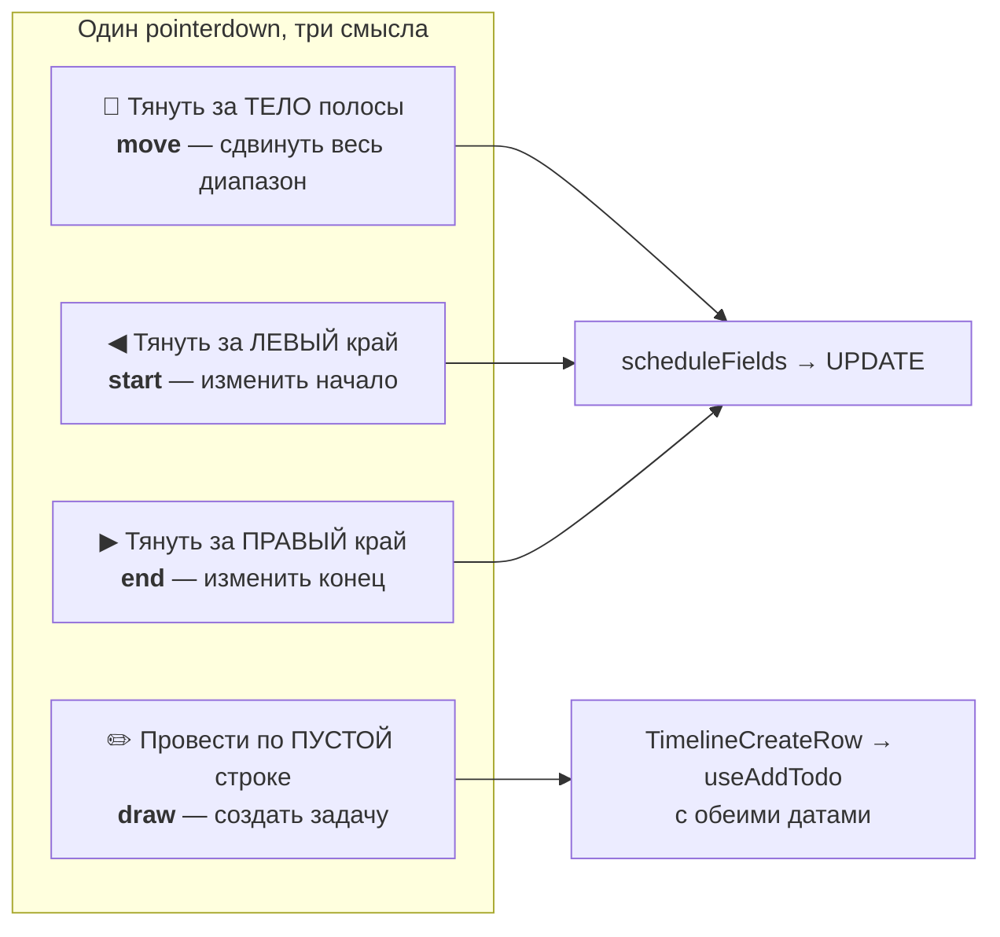
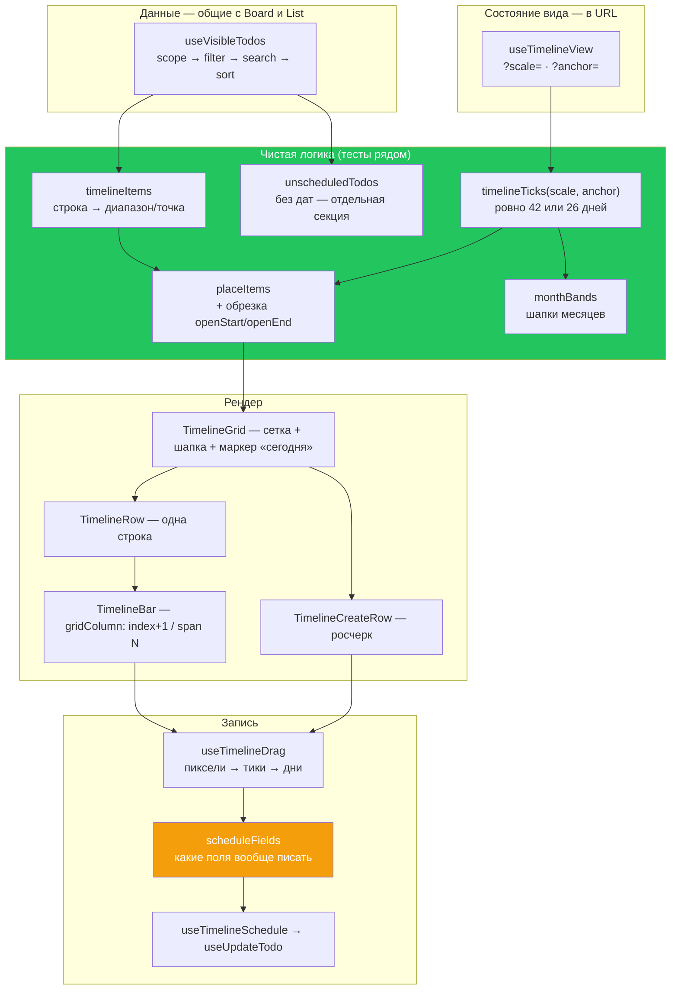

# 13 · Timeline

[← 12 · Kanban и DnD](12-kanban.md) · [Оглавление](README.md) · [Далее: 14 · Уведомления →](14-notifications.md)

---

## 🧒 LEVEL 1

> Timeline — это **линейка времени**, на которой задачи нарисованы полосками.

```
              авг                          сен
        17 18 19 20 21 22 23 24 25 26 27 28 29 30 31  1  2
       ┌──┬──┬──┬──┬──┬──┬──┬──┬──┬──┬──┬──┬──┬──┬──┬──┬──┐
KAN-1  │  ████████████                                    │  ← начало + конец = ПОЛОСА
KAN-4  │              ▮                                   │  ← только дедлайн = ТОЧКА
KAN-7  │◀═════════════════════════════════▶               │  ← вылезает за экран = ОБРЕЗАНА
       └──┴──┴──┴──┴──┴──┴──┴──┴──┴──┴──┴──┴──┴──┴──┴──┴──┘
```

Три состояния задачи и почему они разные:

| Что известно | Как выглядит | Почему |
|---|---|---|
| начало **и** конец | **полоса** | известен диапазон работы |
| только одна дата | **точка** | известен момент, а не длительность. Рисовать полосу нулевой ширины было бы враньём про знание |
| ни одной даты | **не на линейке** | нет честной колонки, куда её поставить. Но она попадает в отдельный список «без дат» внизу — не пропадает |

Отдельно: **обе даты в один день = полоса на один день, а не точка.**
Различие не про ширину, а про **сколько известно**.

---

## 👷 LEVEL 2 — Математика

Вся арифметика — в `src/services/views/timeline.ts` (чистая, тесты в
`timeline.test.ts`) и `src/components/timeline/timelineAxis.ts` (размеры).

### Шаг 1 · Два масштаба

```ts
export const TIMELINE_WINDOW: Record<TimelineScale, { ticks: number; span: number }> = {
  weeks:  { ticks: 42, span: 1 },   // 42 колонки × 1 день  = 6 недель
  months: { ticks: 26, span: 7 },   // 26 колонок × 7 дней  = ~полгода
};
```

**Почему ровно два, и почему такие:**

| Масштаб | Обоснование из кода |
|---|---|
| `weeks` = 42 дня | *«the same 42-day span as the calendar's month grid, deliberately, so switching between the two views is not also a change of period»* |
| `months` = 26 недель | *«the horizon a quarter's planning needs and the point at which a day column would be two pixels wide»* |

И почему не слайдер зума: M20 явным списком исключает *«zoom levels beyond what
the shell contract supports»*. Два уровня — это ответ, который продукт уже дал
в календаре (месяц/неделя), и timeline повторяет его, а не изобретает свой.

### Шаг 2 · Якорь → массив дней

```ts
export function timelineTicks(scale: TimelineScale, anchor: string): string[] {
  const { ticks, span } = TIMELINE_WINDOW[scale];

  const first = scale === "weeks"
    ? startOfWeek(anchor)                    // 42 дня от понедельника
    : startOfWeek(startOfMonth(anchor));     // 26 недель от понедельника месяца

  return Array.from({ length: ticks }, (_, i) => addDays(first, i * span));
}
```

**Два инварианта:**

1. **Всегда ровно `ticks` элементов.**
   > *«so the axis never changes width as you page — the same fixed-grid rule
   > that makes the calendar's month always six rows, and for the same reason:
   > a header that reflows moves every bar under the pointer»*

2. **Оба масштаба начинаются с понедельника.**
   > *«so `index % 7` is a weekday at the `weeks` scale and no separate weekday
   > calculation is needed anywhere»*

### Шаг 3 · День → индекс колонки

```ts
export function tickIndexOf(day: string, ticks: string[], scale: TimelineScale): number | null {
  if (ticks.length === 0) return null;
  if (day < ticks[0]) return null;                          // до окна
  if (day >= windowEnd(ticks, scale)) return null;          // после окна

  for (let i = ticks.length - 1; i >= 0; i -= 1) {          // скан СПРАВА
    if (ticks[i] <= day) return i;
  }
  return null;
}
```

**Почему линейный скан, а не деление?**

Арифметика была бы `Math.floor(daysBetween(first, day) / span)`. Но:

> *«the ticks are ascending and there are at most 42 of them, so this is cheaper
> than the arithmetic it replaces and **cannot disagree with the array it is
> indexing**»*

Второе важнее первого. Формула может **разойтись** с массивом при смене правил
формирования окна; скан по массиву — не может по определению.

**И заметь: все сравнения — строковые.** `"2026-08-13" < "2026-08-17"` работает
корректно, потому что формат фиксированной ширины и big-endian.

### Шаг 4 · Диапазон → размещение

```ts
export function placeItem(
  item: Pick<TimelineItem, "start" | "end">,
  ticks: string[], scale: TimelineScale,
): { index: number; span: number; openStart: boolean; openEnd: boolean } | null {
  const first = ticks[0];
  const end = windowEnd(ticks, scale);

  if (item.end < first || item.start >= end) return null;   // вообще не пересекается

  const openStart = item.start < first;                     // обрезано слева
  const openEnd   = item.end >= end;                        // обрезано справа

  const startIndex = openStart ? 0 : (tickIndexOf(item.start, ticks, scale) ?? 0);
  const endIndex   = openEnd ? ticks.length - 1 : (tickIndexOf(item.end, ticks, scale) ?? ticks.length - 1);

  return { index: startIndex, span: Math.max(1, endIndex - startIndex + 1), openStart, openEnd };
}
```

```
Окно: 17 авг ─────────────────────── 27 сен

Задача A:  01 июн ══════════════════════════ 31 окт
           └─ openStart: true, openEnd: true → полоса на всё окно с зарубками

Задача B:              20 авг ═══ 25 авг
           └─ openStart: false, openEnd: false → обычная полоса

Задача C:  01 мар ═══ 15 мар
           └─ placeItem вернёт null — строки на экране нет
```

**Почему обрезка, а не пропуск:**

> *«an item that began in June and ends in October is genuinely part of what is
> on screen in August, and hiding it would make a busy quarter look empty»*

`openStart` / `openEnd` рисуются как **плоский, зазубренный край** — визуальный
сигнал «продолжается за краем».

**И тонкость сигнатуры:** `placeItem` принимает `Pick<TimelineItem, "start" |
"end">`, а не целый `TimelineItem`:

> *«so a range that has no row yet — a create sweep, an undated item being drawn
> on — is placed by the same rule a stored one is, rather than by a second copy
> of the clipping logic or by a fake `Todo` cast into the shape of one»*

То есть черновик, который пользователь **рисует прямо сейчас**, позиционируется
той же функцией, что и сохранённая задача.

### Шаг 5 · Индекс → пиксели (CSS Grid, а не абсолютное позиционирование)

```ts
// timelineAxis.ts
export function trackColumns(count: number, scale: TimelineScale): string {
  return `repeat(${count}, minmax(${TICK_MIN[scale]}, 1fr))`;
}
export function trackMinWidth(count: number, scale: TimelineScale): string {
  return `calc(${RAIL_WIDTH} + ${count} * ${TICK_MIN[scale]})`;
}
```

```tsx
// TimelineBar.tsx
<div style={{ gridColumn: `${place.index + 1} / span ${place.span}` }} />
```

**🔑 Позиция в пикселях не вычисляется вообще.** Полоса объявляет, с какой
колонки начинается и сколько занимает, а раскладку делает браузер.

| | Абсолютное позиционирование | CSS Grid (выбрано) |
|---|---|---|
| Нужно знать ширину контейнера | ✅ → `ResizeObserver` | ❌ |
| Реакция на ресайз | пересчёт в JS | бесплатно |
| Заголовок и полосы совпадают | нужно синхронизировать | одна и та же сетка |
| Адаптивность | вручную | `minmax(min, 1fr)` |

`minmax(TICK_MIN, 1fr)` — колонки **растягиваются** на широком экране и держат
минимум на узком, после чего вся сетка скроллится **как одно целое**. Ничего не
переливается ни в том, ни в другом случае.

Константы собраны в одном файле по той же причине, что `listGrid.ts`:

> *«the header, the rows and the today marker all have to agree about where the
> axis starts and how wide a column is, and three components each holding their
> own copy of `15rem` is three chances for the header to stop lining up»*

**Курьёз про имя файла:**
> *«Named `timelineAxis` rather than `timelineGrid` because TypeScript treats
> `timelineGrid.ts` and `TimelineGrid.tsx` as the same module on a
> case-insensitive filesystem, and refuses the program outright (TS1149).»*

### Шаг 6 · Порядок строк

```ts
function compareItems(a: TimelineItem, b: TimelineItem): number {
  if (a.start !== b.start) return a.start < b.start ? -1 : 1;   // 1. начало
  if (a.end !== b.end)     return a.end < b.end ? -1 : 1;       // 2. конец
  const ak = a.todo.board_key ?? Number.MAX_SAFE_INTEGER;        // 3. ключ
  const bk = b.todo.board_key ?? Number.MAX_SAFE_INTEGER;
  if (ak !== bk) return ak - bk;
  return a.todo.id < b.todo.id ? -1 : a.todo.id > b.todo.id ? 1 : 0;  // 4. id
}
```

**🔥 Порядок строк выводится и НИГДЕ не хранится.** Это не эстетика:

> *«a timeline whose rows can be dragged into an arbitrary order is a **second
> surface that writes order**, which would reopen M3-10 and pull M6-A forward on
> the day it ships. `todos.position` still has exactly one writer, and this
> module is why.»*

Прямая связь с [главой 12](12-kanban.md): ровно одна поверхность пишет порядок.

Четыре уровня tie-break делают сортировку **тотальной и стабильной**. Карточка
без `board_key` (только что создана, ключ ещё не выдан) сортируется в конец, а
не прыгает наверх.

---

## 🖱 Взаимодействие: три жеста



### Пиксели → дни

```ts
// services/views/timelineDrag.ts — чисто, с тестами
export function tickAtOffset(offsetX: number, trackWidth: number, tickCount: number): number {
  if (tickCount <= 0 || trackWidth <= 0) return 0;
  const index = Math.floor((offsetX / trackWidth) * tickCount);
  return Math.min(tickCount - 1, Math.max(0, index));      // clamp
}

export function ticksMoved(deltaX: number, trackWidth: number, tickCount: number): number {
  if (tickCount <= 0 || trackWidth <= 0) return 0;
  return Math.round(deltaX / (trackWidth / tickCount));     // 🔑 round, не floor
}
```

**Разница `floor` / `round` — это разница между «где я» и «насколько сдвинул»:**

| Функция | Вопрос | Округление | Почему |
|---|---|---|---|
| `tickAtOffset` | «над какой колонкой курсор» | `floor` | принадлежность к ячейке: 1.9 колонки = всё ещё колонка 1 |
| `ticksMoved` | «на сколько колонок сдвинул» | `round` | ближайшее намерение: сдвиг на 1.6 колонки = хотел на 2 |

Обе клампятся: жест может уйти за пределы дорожки.

### Операции над диапазоном

```ts
export function moveRange(range: DayRange, deltaDays: number): DayRange {
  if (deltaDays === 0) return range;                        // та же ссылка
  return { start: addDays(range.start, deltaDays), end: addDays(range.end, deltaDays) };
}

export function resizeStart(range: DayRange, day: string): DayRange {
  return { start: day > range.end ? range.end : day, end: range.end };   // 🔒 не перепрыгнуть
}

export function resizeEnd(range: DayRange, day: string): DayRange {
  return { start: range.start, end: day < range.start ? range.start : day };
}
```

`resizeStart` / `resizeEnd` **клампят у противоположного конца** — начало не
может уехать за конец. Это то же правило, что `todos_date_range_check` в БД, но
применённое **до** записи, чтобы жест не мог сформировать запрос, который база
отвергнет.

**Три уровня одного правила:**

| Уровень | Механизм |
|---|---|
| жест | `resizeStart` / `resizeEnd` клампят |
| чтение | `timelineItems` меняет местами, если `start > end` |
| БД | `todos_date_range_check` |

Второй нужен для строк, записанных до появления констрейнта:

> *«a row written before the constraint existed would otherwise render a bar of
> negative width, and defending here costs one comparison»*

### 🔥 `scheduleFields` — какие поля вообще писать

Самое тонкое место всего Timeline:

```ts
export function scheduleFields(hasStart: boolean, hasEnd: boolean) {
  // Ни одной даты: диапазон новый, оба конца — ответ пользователя.
  if (!hasStart && !hasEnd) return { writeStart: true, writeEnd: true };

  return { writeStart: hasStart, writeEnd: hasEnd };
}
```

| Что было | Что пишем | Смысл |
|---|---|---|
| обе даты | обе | двигаем/растягиваем диапазон |
| только `due_date` | **только `due_date`** | 🔑 точка остаётся точкой |
| только `start_date` | **только `start_date`** | то же зеркально |
| ни одной | **обе** | пользователь **рисует** новый диапазон |

**Почему это правильно.** У задачи есть только дедлайн — это «точка». Перетащив
её, пользователь говорит «дедлайн другой», а **не** «а ещё у неё теперь есть
дата начала». Запись обоих полей **выдумала бы знание**, которого никто не
сообщал.

**Защита от лишней записи:**

```ts
const storedStart = todo.start_date ? toCalendarDay(todo.start_date) : null;
const storedEnd   = todo.due_date   ? toCalendarDay(todo.due_date)   : null;
...
if (nextStart === storedStart && nextEnd === storedEnd) return Promise.resolve();
```

Комментарий фиксирует **обе** причины:

> *«A `timestamptz` compared to a `YYYY-MM-DD` would never be equal and every
> gesture would write.»*
> *«It also absorbs the common case of a click that crossed the drag threshold
> by a pixel.»*

Первое — реальная ловушка: без приведения к дням `"2026-08-13T00:00:00+00:00"`
никогда не равно `"2026-08-13"`, и **каждый** жест писал бы в БД.

`MOVE_THRESHOLD = 8` в `useTimelineDrag` плюс `consumeClick()` — то же
разделение «клик против драга», что `activationConstraint: { distance: 8 }` на
доске.

### Создание задачи росчерком (M20-B)

Единственная поверхность, где **диапазон и есть жест**:

```
Пустая строка «Create»:

     17 18 19 20 21 22 23
    ┌──┬──┬──┬──┬──┬──┬──┐
    │  │▓▓▓▓▓▓▓▓▓│  │  │  │  ← провёл от 18 до 21
    └──┴──┴──┴──┴──┴──┴──┘
              ↓
    открывается форма с уже заполненными
    start_date = 18, due_date = 21
```

И `useAddTodo` несёт обе даты **в оптимистичной строке**:

> *«What changed is that there is now one surface where the range **is** the
> gesture: drawing a bar on the axis supplies both ends before the row exists,
> and carrying them here is what makes the new bar appear at the range that was
> drawn rather than jumping there when the server answers.»*

---

## 🏛 LEVEL 3

### Даты: `Date` под карантином

**Правило:** `Date` существует **только внутри форматтера**, строится через
`Date.UTC` и читается с `timeZone: "UTC"`. Наружу не выходит.

```ts
// ✅ так
export function toCalendarDay(value: string): string {
  return value.slice(0, 10);          // СРЕЗ, не парсинг
}

// ✅ и так — Date только чтобы отформатировать
function utc(day: string): Date {
  const [year, month, date] = day.split("-").map(Number);
  return new Date(Date.UTC(year, month - 1, date));
}
```

**Почему парсинг — баг:**

```
Хранится: "2026-08-13T00:00:00+00:00"

new Date(...)  в Нью-Йорке (UTC-4)  →  12 августа, 20:00
.getDate()                          →  12   ❌

Задача «на 13-е» отрисуется «на 12-е».
```

Из `docs/DATABASE.md`:

> *«both are read back by slicing the leading `YYYY-MM-DD` — never by parsing to
> a local `Date`, which would move a task due the 13th to the 12th for a reader
> west of Greenwich»*

Арифметика — тоже строковая, в `services/views/calendar.ts`:

```ts
export function addDays(day: string, n: number): string {
  return format(new Date(instant(day).getTime() + n * 86_400_000));
}

export function addMonths(day: string, n: number): string {
  const [year, month, date] = parts(day)!;
  const target = new Date(Date.UTC(year, month - 1 + n, 1));
  // день 0 следующего месяца = последний день этого
  ...
}
```

`addMonths` отдельно обрабатывает клампинг: 31 января + 1 месяц = 28/29
февраля, а не 3 марта.

### Почему Timeline построен ПОСЛЕ Calendar

Порядок сборки в плане — не вкусовщина:

> *«Needs `todos.start_date`, and needs Calendar to have already surfaced
> whatever M16 got wrong about dates. **Both paid off exactly as predicted:**
> M19 found that `due_date` is a `timestamptz` rather than the `date` this plan
> assumed, and that discovery decided this milestone's column type before a
> line of it was written.»*

То есть Calendar — дешёвое представление **без миграции** — обнаружил ошибку в
предположениях о типах. Timeline, у которого миграция **есть**, получил готовый
ответ до первой строки кода.

**Это лучший пример «порядка сборки как управления риском» в проекте.**

### Что Timeline читает и чего он не делает

```
useVisibleTodos (scope → filter → search → sort)
        ↓  тот же массив, что у Board и List
timelineItems(todos)         ← чистая функция
        ↓
timelineTicks(scale, anchor) ← чистая функция
        ↓
placeItems(items, ticks, scale)
        ↓
CSS Grid
```

**Никакого своего запроса.** `start_date` попал в `TODO_FIELDS` вместе с
`due_date`:

> *«the plan named `start_date` at M16 for exactly this moment: "adding
> `start_date` for M20 widens it once, here, rather than per view" — so the
> Timeline is a **renderer over the row every view already holds**, not a query
> of its own»*

Следствие: фильтр, поиск и scope работают на Timeline **бесплатно** — это тот
же pipeline.

И `unscheduledTodos` / `unscheduledCount` — задачи без дат перечисляются
отдельной секцией:

> *«It is still part of the board, so it is listed in a section of its own
> beneath the rows rather than reduced to a number. **Inventing a date to make
> it drawable is the one thing that would be worse than either.**»*

### Что Timeline не умеет — и почему это нормально

| Нет | Почему |
|---|---|
| перетаскивание строк | это была бы вторая поверхность записи порядка |
| зависимости между задачами (Gantt-стрелки) | нет таблицы связей; M10 (Work Item Depth) — роадмап |
| произвольный зум | два уровня — ответ продукта; слайдер в M20 «explicitly not» |
| критический путь | требует зависимостей |

**Repository evidence: статус M20 в плане — 🔶 «Built 2026-08-17, browser
verification owed»**, то есть ручная проверка в браузере записана как
невыполненная. Это стоит знать, если кто-то спросит «всё ли проверено».

---

## 📊 Полный конвейер



---

## 🧪 Мини-квиз

<details>
<summary><b>1.</b> У задачи только <code>due_date</code>. Пользователь перетаскивает её на другой день. Какие поля запишутся?</summary>

**Только `due_date`.** `scheduleFields(hasStart: false, hasEnd: true)` вернёт
`{ writeStart: false, writeEnd: true }`. Запись обоих полей выдумала бы знание:
пользователь сказал «дедлайн другой», а не «а ещё теперь есть дата начала».
Точка остаётся точкой.
</details>

<details>
<summary><b>2.</b> Почему <code>tickAtOffset</code> использует <code>floor</code>, а <code>ticksMoved</code> — <code>round</code>?</summary>

Они отвечают на разные вопросы. `tickAtOffset` — «над какой колонкой курсор»,
это принадлежность к ячейке: 1.9 колонки — всё ещё колонка 1, значит `floor`.
`ticksMoved` — «на сколько колонок сдвинул», это намерение: сдвиг на 1.6
колонки означает «хотел на 2», значит `round`.
</details>

<details>
<summary><b>3.</b> Почему <code>toCalendarDay</code> — срез строки, а не <code>new Date(...).getDate()</code>?</summary>

Потому что парсинг переводит значение в локальный часовой пояс.
`"2026-08-13T00:00:00+00:00"` в Нью-Йорке (UTC-4) станет 12 августа 20:00, и
`.getDate()` вернёт **12**. Задача «на 13-е» отрисуется «на 12-е» для всех
западнее Гринвича. Срез первых 10 символов не зависит ни от какого пояса.
</details>

<details>
<summary><b>4.</b> Почему порядок строк Timeline не хранится и не редактируется?</summary>

Потому что это была бы **вторая поверхность, пишущая порядок**. `todos.position`
имеет ровно одного писателя, и это то, что делает конкурентное перетаскивание
безопасным. Перетаскиваемые строки timeline вернули бы задачу M3-10 и
потребовали бы M6-A прямо в день релиза. Порядок выводится: начало → конец →
ключ → id.
</details>

<details>
<summary><b>5.</b> Задача идёт с 1 июня по 31 октября, окно — 17 авг…27 сен. Что отрисуется?</summary>

Полоса **на всё окно** с `openStart: true` и `openEnd: true` — оба края плоские
и зазубренные, показывая продолжение за экраном. Не пропускается, потому что
задача действительно является частью того, что происходит в августе, и её
сокрытие сделало бы загруженный квартал пустым.
</details>

<details>
<summary><b>6.</b> Почему <code>placeItem</code> принимает <code>Pick&lt;TimelineItem, "start" | "end"&gt;</code>, а не весь объект?</summary>

Чтобы диапазон, у которого **ещё нет строки в БД** — росчерк создания,
перетаскиваемый черновик — позиционировался **той же** функцией. Альтернативы:
вторая копия логики обрезки (разойдётся) или фейковый `Todo`, приведённый
кастом (соврёт компилятору).
</details>

<details>
<summary><b>7. Predict:</b> убрали проверку <code>if (nextStart === storedStart && nextEnd === storedEnd) return</code>. Что сломается?</summary>

**Каждый** жест начнёт писать в БД — включая клик, случайно перешедший порог в
8 пикселей. Причина: `storedStart` приводится к дню (`toCalendarDay`), а
`todo.start_date` — это `timestamptz`. Без приведения сравнение
`"2026-08-13T00:00:00+00:00" === "2026-08-13"` **никогда** не истинно, и защита
от лишней записи не срабатывает вообще.
</details>

<details>
<summary><b>8.</b> Почему Timeline не считает пиксели, а объявляет <code>gridColumn</code>?</summary>

Потому что раскладку тогда делает браузер. Не нужен `ResizeObserver`, ресайз
окна бесплатен, а шапка и полосы гарантированно совпадают — они лежат в **одной
и той же** сетке. `minmax(TICK_MIN, 1fr)` даёт растяжение на широком экране и
горизонтальный скролл всей сетки как целого на узком, без переливки в обоих
случаях.
</details>

---

[← 12 · Kanban и DnD](12-kanban.md) · [Оглавление](README.md) · [Далее: 14 · Уведомления →](14-notifications.md)
