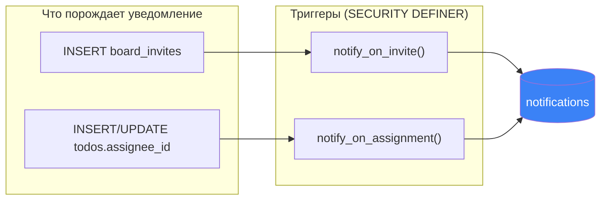
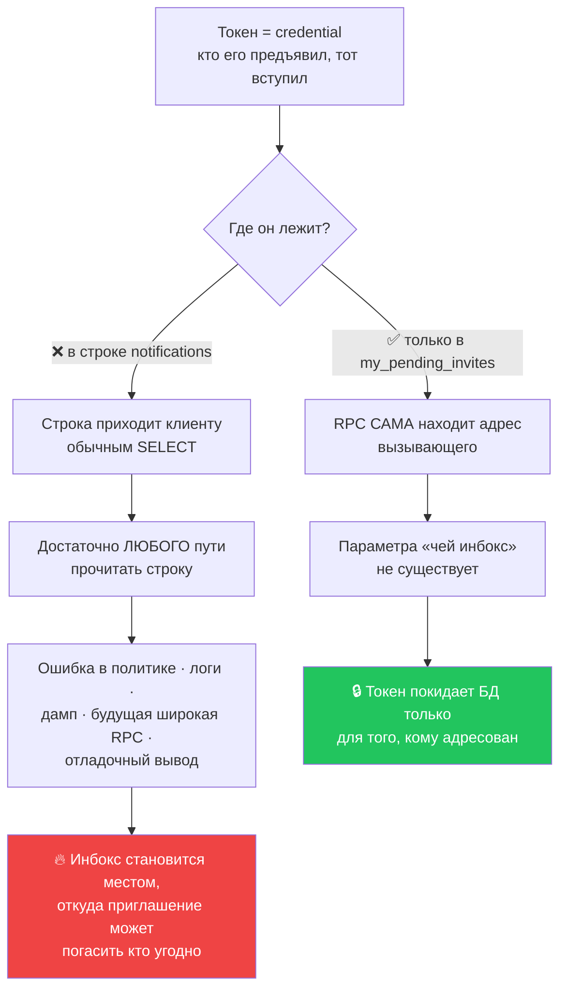
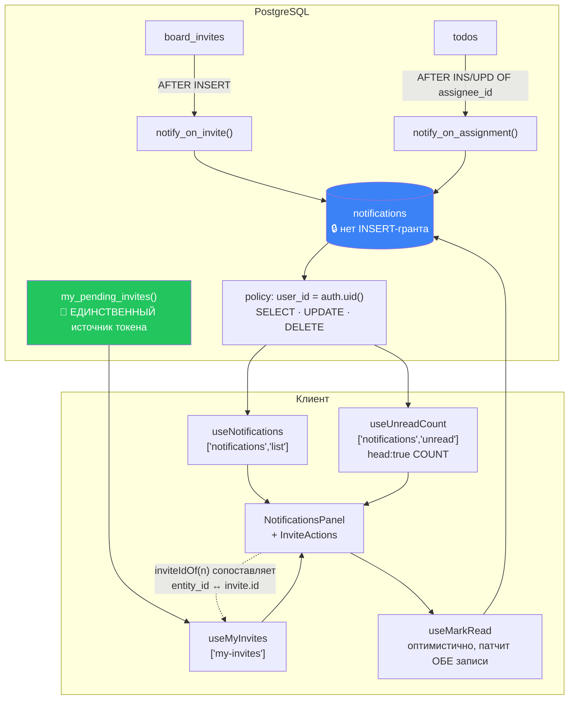

# 14 · Уведомления

[← 13 · Timeline](13-timeline.md) · [Оглавление](README.md) · [Далее: 15 · Приглашения →](15-invitations.md)

---

## 🧒 LEVEL 1

> Уведомления — это **почтовый ящик у твоей двери**.

Три правила этого ящика:

1. **Класть в него может только почтальон, не жильцы.** Никто — даже ты сам —
   не может подбросить туда письмо вручную. Письма кладёт база данных, когда
   что-то реально произошло.
2. **Открыть ящик может только его хозяин.** Не «UI показывает только твои», а
   физически: ключ подходит к одному ящику.
3. **В письме не лежит ключ от квартиры.** Письмо говорит «тебя пригласили» —
   но сам пропуск лежит в другом месте, и его выдают, только когда ты
   представишься.

Третье правило — самое важное, и мы его подробно разберём.

---

## 👷 LEVEL 2

### Таблица

```sql
create table public.notifications (
  id          uuid primary key default gen_random_uuid(),
  user_id     uuid not null references public.profiles (id) on delete cascade,
  type        text not null check (type in ('invite', 'assigned')),
  board_id    uuid references public.boards (id) on delete cascade,
  entity_type text check (entity_type in ('todo', 'invite')),
  entity_id   uuid,                                    -- ❌ БЕЗ FK, намеренно
  actor_id    uuid references public.profiles (id) on delete set null,
  payload     jsonb not null default '{}'::jsonb,
  read_at     timestamptz,                             -- null = непрочитано
  created_at  timestamptz not null default now()
);
```

Комментарий на таблице — краткая формулировка всей главы:

> *«Per-recipient inbox (M22). Trigger-written only: there is no insert grant,
> **which is what makes an entry evidence rather than a claim**. RLS is
> self-only.»*

### Два индекса

```sql
create index notifications_user_created_idx on public.notifications (user_id, created_at desc);
create index notifications_user_unread_idx  on public.notifications (user_id) where read_at is null;
```

| Индекс | Обслуживает |
|---|---|
| составной `(user_id, created_at desc)` | список: `WHERE user_id = ? ORDER BY created_at DESC` — **сортировка бесплатна**, узла сортировки нет |
| **частичный** `(user_id) WHERE read_at is null` | бейдж: `COUNT(*) WHERE read_at is null` |

Частичный индекс содержит **только непрочитанные строки**. Прочитал — строка из
него выпала. Инбокс растёт, непрочитанных всегда мало → индекс остаётся
крошечным.

### Политики

```sql
create policy "Own notifications are selectable" on public.notifications
  for select to authenticated using (user_id = (select auth.uid()));

create policy "Own notifications are markable" on public.notifications
  for update to authenticated
  using      (user_id = (select auth.uid()))
  with check (user_id = (select auth.uid()));

create policy "Own notifications are deletable" on public.notifications
  for delete to authenticated using (user_id = (select auth.uid()));

grant select, update, delete on public.notifications to authenticated;
--     ⬆️ НЕТ insert
```

**Два уровня одного запрета на подделку:**
- нет INSERT-политики;
- нет INSERT-**гранта**.

Даже если политику однажды добавят по ошибке, грант всё равно отсутствует.

**`WITH CHECK` на UPDATE не даёт передать уведомление:**
`UPDATE notifications SET user_id = '<чужой>'` пройдёт `USING` (строка моя) и
упрётся в `WITH CHECK` → `42501`.

### Два триггера



#### `notify_on_invite` — три ранних выхода

```sql
if new.email is null then return new; end if;              -- 1. link-инвайт: адресата нет

select p.id into v_user_id from public.profiles p
 where lower(p.email) = lower(new.email) limit 1;
if v_user_id is null then return new; end if;              -- 2. ещё не зарегистрирован

if v_user_id = new.created_by then return new; end if;     -- 3. пригласил сам себя

-- снимок фактов
select b.title into v_board from public.boards b where b.id = new.board_id;
select coalesce(p.full_name, p.username) into v_actor
  from public.profiles p where p.id = new.created_by;

insert into public.notifications
  (user_id, type, board_id, entity_type, entity_id, actor_id, payload)
values (v_user_id, 'invite', new.board_id, 'invite', new.id, new.created_by,
  jsonb_build_object('board_title', coalesce(v_board,'a board'),
                     'actor_name', v_actor, 'role', new.role));
```

**🔑 `entity_id` = `new.id` — идентификатор приглашения. НЕ токен.** Об этом
целиком LEVEL 3.

#### `notify_on_assignment` — три ранних выхода

```sql
declare v_actor uuid := auth.uid();
begin
  if new.assignee_id is null or new.assignee_id = v_actor then return new; end if;
  --   ⬆️ 1. сняли исполнителя   ⬆️ 2. назначил сам себе

  if tg_op = 'UPDATE'
     and new.assignee_id is not distinct from old.assignee_id then return new; end if;
  --   ⬆️ 3. UPDATE, но исполнитель НЕ менялся
```

**Третья проверка — самая ценная.** Триггер объявлен как
`after insert or update of assignee_id`, но `UPDATE OF` в PostgreSQL срабатывает,
когда колонка **упомянута** в `SET`, даже если значение не изменилось. Без
`is not distinct from` любое сохранение формы с тем же исполнителем слало бы
новое уведомление.

`is not distinct from` вместо `=` — потому что `NULL = NULL` даёт `NULL`, а
`NULL is not distinct from NULL` даёт `true`. Это корректная проверка «то же
самое, включая отсутствие».

### Клиент: чистая логика

```ts
export const NOTIFICATION_TYPES = ["invite", "assigned"] as const;
export const NOTIFICATION_TABS  = ["all", "invite", "assigned"] as const;

export function filterNotifications(list: Notification[], tab: NotificationTab) {
  if (tab === "all") return list;
  return list.filter(item => item.type === tab);
}

export function unreadCount(list: Notification[]): number {
  return list.reduce((total, item) => (item.read_at === null ? total + 1 : total), 0);
}

export function notificationTarget(n: Notification): string | null {
  if (!n.board_id) return null;
  if (n.type === "assigned" && n.entity_id) return `/boards/${n.board_id}?task=${n.entity_id}`;
  if (n.type === "invite") return `/boards/${n.board_id}`;
  return null;
}
```

**`notificationTarget` возвращает `null`, и это не забытая ветка:**

> *«Returns null when there is nothing to open: a notification whose entity has
> since been deleted, or whose board has. The row still renders — **it is a
> record of something that happened** — it just does not pretend to be a link.»*

**Назначение открывается через тот же `?task=`:**

> *«there is no notification-owned detail view to keep in step with the real
> one»*

### Запросы: две записи кэша, один корень

```ts
notifications:      () => ["notifications"],
notificationList:   () => ["notifications", "list"],
notificationUnread: () => ["notifications", "unread"],
```

> *«Under one root so marking something read can drop the list and the badge
> together — **they are two views of one table and must never disagree about
> it**.»*

Обе — `retry: false` и `meta: { silent: true }`, с разными обоснованиями:

| Запрос | Почему `silent` |
|---|---|
| список | *«The panel renders its own failure… and it toasts failed refetches, which on window focus would mean one toast every time the tab is re-entered.»* |
| счётчик | *«this one runs on every page for every signed-in user, so a toast here would follow them around the product»* |

И счётчик деградирует беззвучно:

```ts
return query.data ?? 0;
```
> *«A failed count is not worth a red badge or an error anywhere — the bell
> simply shows nothing, and opening it surfaces the real reason.»*

**Это хороший урок про UX ошибок:** ошибка показывается там, где пользователь
может с ней что-то сделать, а не там, где она случилась.

`useMarkRead` — оптимистичная мутация, которая патчит **обе** записи разом:
проставляет `read_at` в списке и пересчитывает бейдж, снимая снимки обеих для
отката.

---

## 🏛 LEVEL 3

### 🔥 Почему токен приглашения НЕ хранится в уведомлении

**Это ключевой вопрос главы и отличный ответ на собеседовании.**

Наивная реализация:

```sql
-- ❌ payload: { "token": "a3f9...", "board_title": "Проект X" }
```

Тогда UI сделал бы просто: прочитал строку, взял токен, нажал Accept. Один
запрос вместо двух. Соблазнительно.

**Почему так нельзя:**



Комментарий в `notifications.ts` формулирует это в двух предложениях:

> *«The inbox stores the invite's **id** in `entity_id` and never its token — a
> token is a credential, and putting one in a row every client fetches would
> make the inbox a place invitations could be redeemed from by anyone who could
> read it. The token comes from `my_pending_invites`, which is scoped to the
> caller by their own address inside the RPC; this is the id to match it on.»*

**Как эти два источника соединяются в UI:**

```
notifications (SELECT)          my_pending_invites() (RPC)
  entity_id: "b7f3-..."   ◀────▶  { id: "b7f3-...", token: "a3f9...", ... }
       │                                      │
       └──────── inviteIdOf(n) ───────────────┘
                      ↓
              InviteActions [Accept] [Decline]
```

```ts
export function inviteIdOf(notification: Notification): string | null {
  if (notification.type !== "invite") return null;
  return notification.entity_id ?? null;
}
```

**Общий принцип, который стоит уметь сформулировать:**

> **Не храните credential там, где хранится уведомление о нём.**
> Уведомление — это широковещательный факт. Credential — узкий, адресный.
> Смешивать их — значит дать факту область видимости credential'а.

Тот же принцип: письмо о сбросе пароля содержит ссылку, но запись о том, что
письмо отправлено, — нет.

### Почему `entity_id` без внешнего ключа

Ровно та же причина, что у `activities`:

```ts
// Null для инвайт-уведомления с отсутствующим entity_id — «that is possible
// because `entity_id` is deliberately not a foreign key, so the row outlives
// the invitation it describes.»
```

FK дал бы два варианта, и оба плохи:
- `ON DELETE CASCADE` — отозвал приглашение, и запись «Аня пригласила вас»
  **исчезла из истории**;
- `ON DELETE RESTRICT` — приглашение нельзя отозвать, пока не удалено
  уведомление.

Вместо ссылки — снимок в `payload`.

### Почему `payload` денормализован

```json
{ "board_title": "Проект X", "actor_name": "Аня Петрова", "role": "editor" }
```

Это **сознательное** нарушение «не дублируй данные»:

> *«`payload` carries the titles as they were when the event happened,
> denormalised by the trigger, so a notification stays legible after the board
> is renamed or the card deleted.»*

| | Join'ить при чтении | Снимок в `payload` (выбрано) |
|---|---|---|
| Доску переименовали | уведомление задним числом «переписывает историю» | показывает имя на момент события |
| Задачу удалили | нечего показать | «Аня назначила вам "Починить деплой"» |
| Доступ к доске отозвали | join вернёт NULL → пустая строка | текст читается |
| Стоимость чтения | N join'ов на страницу | 0 |

**Ключевое различие:** нормализация хороша для **текущего состояния**.
Уведомление — это **исторический факт**, и факт не должен меняться, когда
меняется мир вокруг него.

Тот же принцип в `activities.payload`, и по той же причине.

### Почему нет realtime на уведомлениях

**Repository evidence:** `notifications` **не входит** в публикацию
`supabase_realtime` (в публикации только `todos`, `columns`, `comments`).
Инбокс обновляется обычным поведением TanStack Query — refetch по фокусу окна
после `staleTime` 30 секунд.

**Честный вывод:** это не «сделано так специально», а «не сделано ещё».
Realtime — задача M6-B в общем виде. Добавить `notifications` в публикацию и
подписаться было бы прямолинейно, но у канала должен быть **владелец жизненного
цикла**: `useBoardRealtime` живёт на `BoardPage`, а инбокс существует на каждой
странице, значит его канал жил бы в другом месте.

Это ровно тот пункт, который стоит назвать самому: «вот что бы я сделал
следующим».

### Расширение: как добавить третий тип

```sql
-- 1. Расширить CHECK
alter table public.notifications drop constraint notifications_type_check;
alter table public.notifications add constraint notifications_type_check
  check (type in ('invite', 'assigned', 'mentioned'));
```
```ts
// 2. Union на клиенте
export const NOTIFICATION_TYPES = ["invite", "assigned", "mentioned"] as const;
export const NOTIFICATION_TABS  = ["all", "invite", "assigned", "mentioned"] as const;
```
```sql
-- 3. Триггер-источник (например, на comments)
create function public.notify_on_mention() returns trigger
language plpgsql security definer set search_path = '' as $$ ... $$;
```
```ts
// 4. Текст и цель
notificationText() → добавить ветку
notificationTarget() → `/boards/${board_id}?task=${entity_id}`
```

**Порядок обязателен: сначала CHECK, потом триггер.** Триггер, пишущий тип,
которого нет в CHECK, упадёт с `23514` — и упадёт **внутри** вставки
комментария, то есть сломает комментарии.

Из плана: *«The types the CHECK constraint permits. Widening means a
migration.»* — то есть это записано как ожидаемая цена.

Это упражнение уровня Expert в [главе 31](31-exercises.md).

---

## 📊 Полная карта



---

## 🧪 Мини-квиз

<details>
<summary><b>1.</b> Почему токен приглашения не лежит в <code>notifications.payload</code>?</summary>

Потому что токен — это **credential**: кто его предъявил, тот вступил в доску.
Строка уведомления приходит клиенту обычным SELECT, значит любой путь, дающий
чтение строки — ошибка в политике, логи, дамп, будущая широкая RPC, — стал бы
путём **погашения** приглашения. Токен выдаёт только `my_pending_invites()`,
которая находит адрес вызывающего **внутри себя**: параметра «чей инбокс» не
существует.
</details>

<details>
<summary><b>2.</b> Как UI связывает уведомление с приглашением, если токена в нём нет?</summary>

По `entity_id`: триггер кладёт туда `board_invites.id`. `inviteIdOf(n)`
достаёт его, а `useMyInvites()` (RPC `my_pending_invites`) отдаёт список с
токенами. Совпадение по id соединяет строку инбокса с кнопками Accept/Decline.
</details>

<details>
<summary><b>3.</b> Почему <code>payload</code> хранит названия, хотя их можно получить join'ом?</summary>

Потому что уведомление — **исторический факт**, а не окно в текущее состояние.
Переименовали доску — join задним числом переписал бы историю. Удалили задачу —
показывать стало бы нечего. Отозвали доступ — join вернул бы NULL и строка
осталась бы пустой. Снимок в момент события читается всегда и стоит ноль
join'ов.
</details>

<details>
<summary><b>4.</b> Может ли пользователь создать себе уведомление?</summary>

Нет. У `notifications` **нет ни INSERT-политики, ни INSERT-гранта** для
`authenticated`. Пишут только два `SECURITY DEFINER`-триггера, и они привязаны к
таблицам, а не к API-слою. Именно поэтому запись в инбоксе — **свидетельство**,
а не заявление клиента.
</details>

<details>
<summary><b>5.</b> Зачем в <code>notify_on_assignment</code> проверка <code>is not distinct from</code>?</summary>

`AFTER UPDATE OF assignee_id` срабатывает, когда колонка **упомянута** в `SET`,
даже если значение не изменилось. Без этой проверки любое сохранение формы с тем
же исполнителем слало бы новое уведомление. `is not distinct from` вместо `=`
нужен потому, что `NULL = NULL` даёт `NULL`, а не `true` — а «был null и остался
null» это тоже «не изменилось».
</details>

<details>
<summary><b>6.</b> Почему бейдж считается отдельным запросом с <code>head: true</code>?</summary>

`head: true` с `count: "exact"` — это `COUNT(*)` **без тела ответа**,
обслуживаемый частичным индексом `notifications_user_unread_idx`. Альтернатива —
считать непрочитанные в уже загруженной странице — молча упёрлась бы в потолок
`NOTIFICATION_PAGE = 50`, и после сотого уведомления бейдж врал бы.
</details>

<details>
<summary><b>7. Predict:</b> уведомление о задаче, которую с тех пор удалили. Что покажет UI?</summary>

Строка **отрисуется** с текстом из `payload` («Аня назначила вам "Починить
деплой"»), но **не будет ссылкой**: `notificationTarget` вернёт `null`, потому
что `entity_id` больше ни на что не указывает. Запись — это факт о случившемся,
и она не притворяется работающей ссылкой.
</details>

<details>
<summary><b>8.</b> Есть ли realtime у уведомлений?</summary>

**Нет.** `notifications` не входит в публикацию `supabase_realtime` (там только
`todos`, `columns`, `comments`). Инбокс обновляется обычным refetch'ем TanStack
Query по фокусу окна после `staleTime` 30 секунд. Это не решение «так лучше», а
незакрытая часть M6-B: у канала для инбокса пока нет владельца жизненного цикла,
потому что `useBoardRealtime` живёт на `BoardPage`, а инбокс — на каждой
странице.
</details>

---

[← 13 · Timeline](13-timeline.md) · [Оглавление](README.md) · [Далее: 15 · Приглашения →](15-invitations.md)
