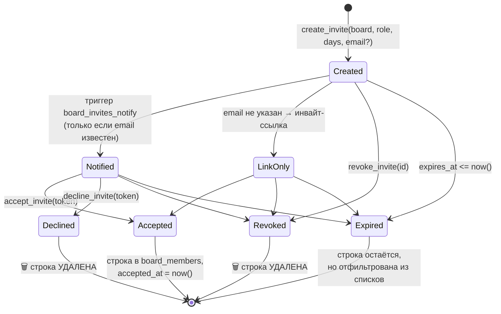
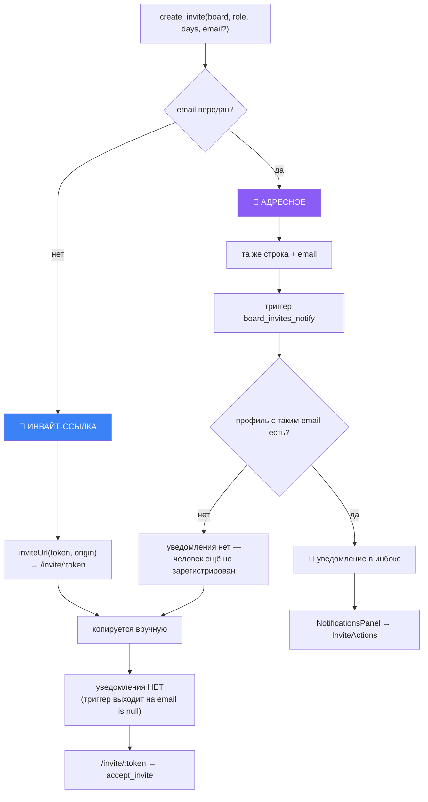
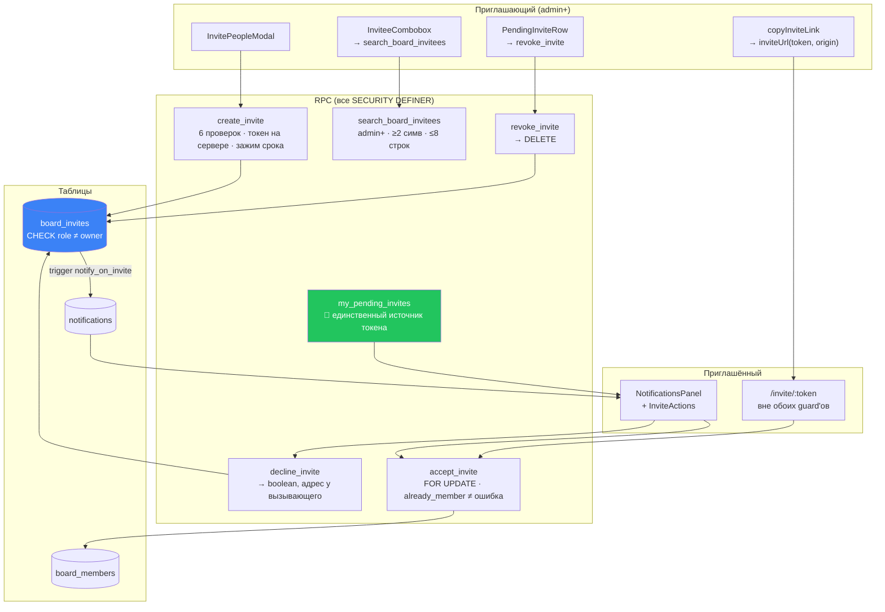

# 15 · Приглашения

[← 14 · Уведомления](14-notifications.md) · [Оглавление](README.md) · [Далее: 16 · For You →](16-for-you.md)

---

## 🧒 LEVEL 1

> Приглашение — это **одноразовый пропуск с датой сгорания**.

```
┌───────────────────────────────────────┐
│  🎟  ПРОПУСК                          │
│                                       │
│  Куда:  доска «Проект X»              │
│  Кем:   editor                        │
│  Код:   a3f9c2e1…  (48 символов)      │
│  Сгорит: через 7 дней                 │
│  Выдал: Аня                           │
└───────────────────────────────────────┘
```

Правила:

1. **Код придумывает охрана, а не гость.** Клиент не может сказать «сделай мне
   пропуск с кодом 1234».
2. **Пропуск нельзя выписать выше своего уровня.** Админ не выпишет пропуск
   админа. Владельца не выпишет никто и никогда.
3. **Одноразовый.** Использовали — сгорел.
4. **Есть срок.** От 1 до 30 дней, границу ставит охрана, а не проситель.
5. **Пропуск можно отозвать** до использования.
6. **Гость может отказаться** — и отказ уничтожает пропуск.

---

## 👷 LEVEL 2 — Жизненный цикл



**Асимметрия финалов — намеренная:**

| Финал | Что со строкой | Почему |
|---|---|---|
| Accepted | остаётся, `accepted_at` заполнен | доказательство, как появилось членство |
| Declined | **удаляется** | отказ окончателен; висящая строка предлагала бы принять снова |
| Revoked | **удаляется** | отзыв должен немедленно обесценить токен |
| Expired | остаётся, но фильтруется | нет процесса очистки; фильтр в запросе |

### Таблица

```sql
create table public.board_invites (
  id          uuid primary key,
  board_id    uuid not null references public.boards (id) on delete cascade,
  token       text not null unique,
  email       text,                                   -- null = инвайт-ссылка
  role        text not null check (role in ('admin','editor','viewer')),
  --                                          ⬆️ 'owner' невозможен НА УРОВНЕ СХЕМЫ
  expires_at  timestamptz not null,
  accepted_at timestamptz,
  created_by  uuid references public.profiles (id)
);
create index board_invites_board_id_idx on public.board_invites (board_id);
```

**`CHECK (role in ('admin','editor','viewer'))` — первая из трёх защит от
выдачи владения.** Даже `service_role` не запишет сюда `owner`.

---

### `create_invite` — шесть проверок до первой записи

```sql
v_actor := (select auth.uid());
if v_actor is null then
  raise exception 'create_invite requires an authenticated session' using errcode = '28000';
end if;                                                          -- 1️⃣ сессия

v_actor_rank := public.board_role_rank(public.board_role(p_board_id));
if v_actor_rank is null then
  raise exception 'not a member of this board' using errcode = '42501';
end if;                                                          -- 2️⃣ участник

v_new_rank := public.board_role_rank(p_role);
if v_new_rank is null then
  raise exception 'unrecognised role: %', p_role using errcode = '22023';
end if;                                                          -- 3️⃣ роль известна

if p_role = 'owner' then
  raise exception 'ownership cannot be granted by invitation' using errcode = '42501';
end if;                                                          -- 4️⃣ не владелец

if v_actor_rank < public.board_role_rank('admin') then
  raise exception 'only an admin or the owner may invite people' using errcode = '42501';
end if;                                                          -- 5️⃣ admin+

if v_actor_rank <= v_new_rank then
  raise exception 'cannot invite someone at or above your own role' using errcode = '42501';
end if;                                                          -- 6️⃣ СТРОГО ниже

v_days       := least(greatest(coalesce(p_expires_in_days, 7), 1), 30);   -- зажим
v_expires_at := now() + (v_days * interval '1 day');
v_token      := encode(extensions.gen_random_bytes(24), 'hex');           -- 🔑 сервер
```

**Проверка 6 — та же «строго ниже своего ранга», что в матрице членства:**

| Приглашающий | Может выдать |
|---|---|
| owner (4) | admin, editor, viewer |
| admin (3) | editor, viewer |
| editor (2) | ❌ ничего (провалит проверку 5) |
| viewer (1) | ❌ ничего |

**Токен генерируется на сервере, и это не мелочь:**

```sql
v_token := encode(extensions.gen_random_bytes(24), 'hex');
```

24 криптографически случайных байта → 48 hex-символов → **192 бита** энтропии.
Пространство ≈ 6.3 × 10⁵⁷. Перебор не рассматривается как атака.

Если бы токен присылал клиент, он мог бы прислать `1`, `2`, `3` — и приглашения
стали бы перебираемыми.

**Срок зажимается на сервере:**

```sql
least(greatest(coalesce(p_expires_in_days, 7), 1), 30)
```
`null → 7`, `0 → 1`, `999 → 30`. Клиент **предлагает**, сервер **решает**.
`p_expires_in_days: 36500` не создаст вечный пропуск.

### `accept_invite` — блокировка и порядок проверок

```sql
select * into v_invite from public.board_invites i
 where i.token = p_token
   for update;                          -- 🔒 блокировка строки

if not found then raise exception 'invitation not found' using errcode = 'P0002'; end if;
if v_invite.expires_at <= now() then raise exception 'invitation has expired' using errcode = '22023'; end if;
if v_invite.role = 'owner' then raise exception 'this invitation cannot be accepted' using errcode = '42501'; end if;

if public.board_role(v_invite.board_id) is not null then
  return query select 'already_member'::text, v_invite.board_id;    -- ✅ не ошибка
  return;
end if;

if v_invite.accepted_at is not null then
  raise exception 'invitation has already been used' using errcode = '23505';
end if;

insert into public.board_members (board_id, user_id, role)
values (v_invite.board_id, v_actor, v_invite.role)
on conflict (board_id, user_id) do nothing;

update public.board_invites i set accepted_at = now() where i.id = v_invite.id;
return query select 'accepted'::text, v_invite.board_id;
```

**🔑 `FOR UPDATE` — защита от одновременного погашения.**

```
Без FOR UPDATE:                      С FOR UPDATE:
  A: SELECT (accepted_at = null)       A: SELECT ... FOR UPDATE  🔒 блокировка
  B: SELECT (accepted_at = null)       B: SELECT ... FOR UPDATE  ⏳ ждёт
  A: INSERT member                     A: INSERT member, UPDATE accepted_at, COMMIT
  B: INSERT member                     B: продолжает → видит accepted_at ≠ null → 23505
  💥 два членства                      ✅ одно членство
```

Комментарий фиксирует: *«The invite row is locked FOR UPDATE, so concurrent
redemption cannot produce two memberships.»*

**🔑 «Уже участник» — это НЕ ошибка.** Проверка стоит **до** проверки
`accepted_at`, и это порядок с умыслом:

> *«Accepting while already a member is a no-op that changes nothing in either
> direction; a second acceptance by anyone else is refused.»*

Сценарий: Аня приняла приглашение, потом снова открыла ту же ссылку из письма.
Она уже участник. Порядок проверок даёт ей `already_member` и ведёт на доску —
а не пугает ошибкой «приглашение уже использовано».

**🔑 Третья защита от владения:** роль проверяется и **при приёме**, хотя CHECK
уже не даёт её записать. Defence in depth.

**Аргумент функции — только токен.**

> *«The token is the only argument — the caller cannot name a board, a user or a
> role.»*

Всё остальное берётся из строки приглашения и из `auth.uid()`. Приглашение —
**capability**: оно само несёт всё, на что даёт право.

### `decline_invite` — адрес берётся у вызывающего

```sql
select p.email into v_email from public.profiles p where p.id = auth.uid();
if v_email is null then return false; end if;

delete from public.board_invites bi
 where bi.token = p_token
   and bi.accepted_at is null
   and bi.expires_at > now()
   and lower(bi.email) = lower(v_email);       -- 🔑 адрес НЕ параметр

get diagnostics v_deleted = row_count;
return v_deleted > 0;
```

**Возвращает `boolean`, а не бросает:**

> *«Deletes the row and returns whether anything was deleted; **false for
> unknown, foreign, accepted and expired alike**. The address is read from the
> caller, never passed in.»*

Единообразный `false` — не лень, а анти-oracle: различающиеся ответы позволили
бы выяснять, существует ли приглашение и кому оно адресовано.

### `my_pending_invites` — единственный источник токена

```sql
if (select auth.uid()) is null then
  raise exception 'my_pending_invites requires an authenticated session' using errcode = '28000';
end if;

-- The caller's address is read from their own profile rather than taken as
-- an argument. An argument would let anyone list invitations sent to anyone.
select lower(p.email) into v_email from public.profiles p where p.id = (select auth.uid());
```

**Комментарий в самой миграции говорит всё:** аргумент «чей инбокс» превратил бы
функцию в способ читать чужие приглашения. Его просто не существует.

### `search_board_invitees` — кого можно пригласить

```sql
if public.board_role_rank(public.board_role(p_board_id))
   < public.board_role_rank('admin') then
  raise exception 'only an admin or the owner may invite people' using errcode = '42501';
end if;

v_needle := btrim(coalesce(p_query, ''));
if length(v_needle) < 2 then return; end if;      -- 🔒 минимум 2 символа

select p.id, p.email, p.full_name, p.username, p.avatar_url
  from public.profiles p
 where p.id <> v_actor                                        -- не себя
   and (p.email ilike '%'||v_needle||'%'
     or p.full_name ilike '%'||v_needle||'%'
     or p.username ilike '%'||v_needle||'%')
   and not exists (select 1 from public.board_members m
                    where m.board_id = p_board_id and m.user_id = p.id)   -- не участник
   and not exists (select 1 from public.board_invites i
                    where i.board_id = p_board_id
                      and lower(i.email) = lower(p.email)
                      and i.accepted_at is null and i.expires_at > now()) -- не приглашён
 order by (lower(p.email) = lower(v_needle)) desc, p.email
 limit 8;                                                     -- 🔒 максимум 8
```

**Четыре ограничения поверхности:** admin+, минимум 2 символа, максимум 8
строк, пять колонок. Точное совпадение email поднимается наверх сортировкой.

⚠️ **Честный пункт (как в [главе 08](08-security.md)):** поиск по email через
`ilike '%…%'` — это всё же перечисление, пусть и суженное. Строже было бы искать
только по `username`. Компромисс: пригласить человека, зная его адрес, — базовый
сценарий продукта.

---

## 📧 Ссылка vs email — два пути



**Ключ:** это **одна** строка `board_invites` и **один** механизм погашения.
Разница только в том, есть ли адресат — и, следовательно, есть ли уведомление.

Отсюда решение M23, вынесенное в название коммита «move invitations into
notifications»: приглашения перестали быть отдельным списком в сайдбаре и
стали типом записи в инбоксе. Одна поверхность вместо двух.

### `/invite/:token` — маршрут вне обоих guard'ов

```tsx
// Routes.tsx
{
  path: "/invite/:token",
  element: deferred(<InvitePage />),
  errorElement: <RouteErrorPage />,
}
```

> *«Outside both guards on purpose: it has to work signed in AND signed out.
> `ProtectedRoute` would bounce a signed-out visitor to /login and lose the
> token; `PublicRoute` would bounce a signed-in one to /. The page gates itself
> and carries the token through login via `?next=`.»*

```
Незалогиненный по ссылке /invite/a3f9…
      ↓
InvitePage видит отсутствие сессии
      ↓
→ /login?next=/invite/a3f9…
      ↓
useLogin: navigate(safeNext(?next) ?? "/")    ← safeNext проверяет путь
      ↓
обратно на /invite/a3f9… уже с сессией
      ↓
accept_invite(token)
```

**Здесь `safeNext` из [главы 09](09-auth.md) работает по прямому назначению** —
и заодно защищает от подмены `next` на внешний хост.

### Ошибки: SQLSTATE → человеческий текст

```ts
const MESSAGES: Record<string, string> = {
  "28000": "Please sign in to accept this invitation.",
  P0002:   "This invitation link is not valid. It may have been revoked.",
  "22023": "This invitation link has expired. Ask for a new one.",
  "23505": "This invitation has already been used.",
  "42501": "This invitation cannot be accepted.",
};

export function inviteErrorMessage(error: unknown): string {
  ...
  // Unmapped code → это баг RPC, а не плохое приглашение
  console.error("[invite] unmapped acceptance failure:", error);
  return FALLBACK;
}
```

**`console.error` в ветке fallback — след реального инцидента:**

> *«`accept_invite` shipped raising 42702 on EVERY call, and the only symptom
> anywhere was this sentence, with the SQLSTATE discarded here.»*

`42702` — `ambiguous_column`. Функция была сломана **полностью**, а
пользователь видел вежливое «попробуйте ещё раз». Исправление — коммит
`159869a` + миграция `20260814093000_fix_accept_invite_ambiguity.sql`.

**Урок:** обобщённое сообщение для пользователя — это правильно, но
**необработанный код должен попасть в лог**, иначе полностью сломанная функция
выглядит как «неудачная попытка».

📖 Развёрнуто: [22 · Обработка ошибок](22-errors.md).

---

## 🏛 LEVEL 3

### Три независимых слоя, запрещающих выдачу владения

```
1. СХЕМА      check (role in ('admin','editor','viewer'))
              → 'owner' физически не хранится
2. СОЗДАНИЕ   if p_role = 'owner' then raise 42501
              → отказ до записи, с внятным сообщением
3. ПРИЁМ      if v_invite.role = 'owner' then raise 42501
              → даже если строка каким-то образом появилась
```

Плюс это же правило в трёх других местах: `add_board_member` и
`set_member_role` отвергают `owner`, а `assignableRoles` на клиенте никогда его
не предлагает.

Всё это — инвариант **I6**: *«Changing who the Owner is, is not a membership
operation… Until [ownership transfer] exists, the Owner of a board never
changes.»*

**Почему не одного слоя достаточно.** Каждый слой отказывает по своей причине:
CHECK — потому что значение невозможно; RPC создания — потому что это не
разрешено вызывающему; RPC приёма — потому что данным нельзя доверять. Три
разных предположения, три независимых отказа.

### Отзыв vs истечение: почему разное обращение

| | Revoke | Expire |
|---|---|---|
| Действие | `DELETE` строки | ничего |
| Момент | явный, по команде | пассивный, по времени |
| Токен после | не существует → `P0002` | существует → `22023` |
| Сообщение | «недействительна, возможно отозвана» | «истекла, попросите новую» |

**Почему истёкшие не удаляются?** Потому что удаление потребовало бы фонового
процесса (`pg_cron`), а фильтрация в запросе — бесплатна:

```ts
.is("accepted_at", null)
.gt("expires_at", new Date().toISOString())
```

И **сообщение остаётся точным**: пользователь узнаёт «истекла», а не
«недействительна». Если бы истёкшие удалялись, оба случая слились бы в `P0002`.

Комментарий в `queryKeys` фиксирует, что кэш держит «что ещё можно скопировать
или отозвать», а не все строки приглашений.

**Цена:** таблица растёт. Для портфолио-проекта приемлемо; в проде это был бы
`pg_cron`-джоб вроде `prune_activities`.

### Почему приглашения не пишутся напрямую в `board_members`

Соблазн: пригласил → сразу добавил в участники, «pending» флагом.

**Почему нет:**

| Прямая запись | Через приглашение (выбрано) |
|---|---|
| нужна write-политика на `board_members` | 🔒 таблица остаётся вообще незаписываемой клиентом |
| человек в доске, не согласившись | согласие — явный акт |
| «отменить» = удалить членство | отзыв не трогает членство |
| нет срока | срок встроен |
| приглашение по email незарегистрированному — некуда писать | строка ждёт регистрации |

Последняя строка — решающая. Приглашение по адресу человека, у которого ещё нет
аккаунта, **не имеет** `user_id`, который можно было бы записать. Отдельная
таблица решает это естественно: строка ждёт, пока адресат появится.

### Что происходит при регистрации приглашённого

```
1. Аня приглашает bob@example.com   → board_invites (email = bob@…)
2. Триггер ищет profiles по email   → не находит → уведомления НЕТ
3. Боб регистрируется               → profiles (email = bob@…)
4. Боб входит                       → my_pending_invites() находит по его email
5. Инбокс показывает приглашение    → Accept
```

**Пятый шаг работает без единой доработки**, потому что `my_pending_invites`
сопоставляет по **email**, а не по `user_id`. Приглашение «нашло» человека, как
только у него появился профиль с этим адресом.

⚠️ **Repository evidence: письмо приглашённому не отправляется.** Триггер
создаёт запись в инбоксе, но никакой отправки почты в миграциях нет. Название
`email_invites_stage1` подтверждает: это **этап 1** — адресация. Отправка
письма (этап 2) потребовала бы Edge Function или SMTP-хука и **не реализована**.

Практически: пока адресат не зарегистрируется и не войдёт, единственный способ
до него достучаться — **скопировать ссылку и переслать вручную**.

### Приглашение как capability

```
❌ ACL-модель: «Боб имеет право на доску X»
   → нужно знать, кто такой Боб, ДО выдачи права

✅ Capability-модель: «этот токен даёт роль editor на доске X»
   → предъявитель получает право; кто он — выясняется в момент предъявления
```

Следствия, которые все видны в коде:

| Свойство capability | Как проявляется |
|---|---|
| несёт всё нужное | единственный аргумент `accept_invite` — токен |
| не нужно знать получателя заранее | link-инвайт работает |
| передаваемо | ссылку можно переслать — **это фича, а не баг** |
| отзываемо | `revoke_invite` |
| ограничено во времени | `expires_at`, зажат сервером |
| не поднимает права | роль зафиксирована при создании и проверена при приёме |

**Про «передаваемо» стоит сказать прямо на собеседовании:** инвайт-ссылка
намеренно работает для любого, кто её открыл. Именно поэтому у неё
криптографический токен, срок жизни и возможность отзыва. Адресное приглашение
(с `email`) — более узкий вариант **уведомления**, но сам токен всё равно
универсален: сужение здесь в том, **кому его показывают**
(`my_pending_invites`), а не в том, кто может его предъявить.

---

## 📊 Полная карта



---

## 🧪 Мини-квиз

<details>
<summary><b>1.</b> Админ пытается пригласить кого-то как admin. Что произойдёт?</summary>

`42501 'cannot invite someone at or above your own role'` — проверка 6:
`v_actor_rank <= v_new_rank`. Ранг админа 3, ранг приглашаемого админа тоже 3,
и требуется **строго** больше. Это та же «строго ниже своего ранга», что во всей
матрице членства: минт админов — отличительная власть владельца.
</details>

<details>
<summary><b>2.</b> Зачем <code>SELECT ... FOR UPDATE</code> в <code>accept_invite</code>?</summary>

Чтобы одновременное погашение не создало два членства. Без блокировки обе
транзакции прочитали бы `accepted_at = null` и обе вставили бы строку в
`board_members`. С `FOR UPDATE` вторая ждёт коммита первой, затем видит
заполненный `accepted_at` и получает `23505`.
</details>

<details>
<summary><b>3.</b> Почему «вы уже участник» — не ошибка, и почему проверка стоит ДО <code>accepted_at</code>?</summary>

Потому что типичный сценарий — человек принял приглашение и снова открыл ту же
ссылку из письма. Он действительно участник; правильный ответ — отвести на
доску, а не пугать «приглашение уже использовано». Порядок проверок именно это
и обеспечивает: `already_member` возвращается раньше, чем срабатывает проверка
повторного использования, которая предназначена для **другого** человека.
</details>

<details>
<summary><b>4.</b> Сколько независимых слоёв запрещают выдать владение приглашением?</summary>

Три в этом пути: `CHECK (role in ('admin','editor','viewer'))` в схеме, отказ в
`create_invite`, отказ в `accept_invite`. Плюс `add_board_member` и
`set_member_role` отвергают `owner`, а `assignableRoles` его не предлагает.
Каждый слой отказывает по **своему** предположению: значение невозможно /
вызывающему не разрешено / данным нельзя доверять.
</details>

<details>
<summary><b>5.</b> Почему истёкшие приглашения не удаляются?</summary>

Потому что фильтрация в запросе (`.gt("expires_at", now)`) бесплатна, а удаление
потребовало бы фонового процесса. Плюс сохранённая строка даёт **точное**
сообщение: `22023` «истекла, попросите новую» вместо `P0002` «недействительна».
Цена — рост таблицы; в проде это был бы `pg_cron`-джоб, как `prune_activities`.
</details>

<details>
<summary><b>6.</b> Почему <code>decline_invite</code> возвращает <code>false</code>, а не бросает?</summary>

Чтобы неизвестный, чужой, уже принятый и истёкший токен были **неразличимы**.
Различающиеся ответы позволили бы выяснять, существует ли приглашение и кому оно
адресовано. По той же причине адрес читается из профиля вызывающего, а не
принимается параметром.
</details>

<details>
<summary><b>7. Predict:</b> приглашение отправлено на email, аккаунта с ним ещё нет. Что случится?</summary>

Строка `board_invites` создастся, а уведомление — **нет**: триггер выходит
рано, не найдя профиль с таким адресом. Когда человек зарегистрируется и войдёт,
`my_pending_invites()` найдёт приглашение **по его email**, и оно появится в
инбоксе — без единой доработки, потому что сопоставление идёт по адресу, а не по
`user_id`. Но письма ему **никто не отправит**: отправка почты — этап 2, в
репозитории её нет.
</details>

<details>
<summary><b>8.</b> Почему <code>/invite/:token</code> вне обоих guard'ов?</summary>

Потому что маршрут должен работать в обоих состояниях. `ProtectedRoute` увёл бы
незалогиненного на `/login` и **потерял бы токен**. `PublicRoute` увёл бы
залогиненного на `/`. Страница гейтит себя сама и проносит токен через вход
параметром `?next=`, который проверяется `safeNext`.
</details>

<details>
<summary><b>9.</b> Зачем <code>console.error</code> в ветке fallback у <code>inviteErrorMessage</code>?</summary>

Потому что это уже стоило инцидента: `accept_invite` уехала в релиз, бросая
`42702` (`ambiguous_column`) на **каждом** вызове, а единственным симптомом было
вежливое обобщённое сообщение — SQLSTATE отбрасывался здесь. Обобщение для
пользователя правильно, но необработанный код обязан попасть в лог, иначе
полностью сломанная функция выглядит как «неудачная попытка».
</details>

---

[← 14 · Уведомления](14-notifications.md) · [Оглавление](README.md) · [Далее: 16 · For You →](16-for-you.md)
