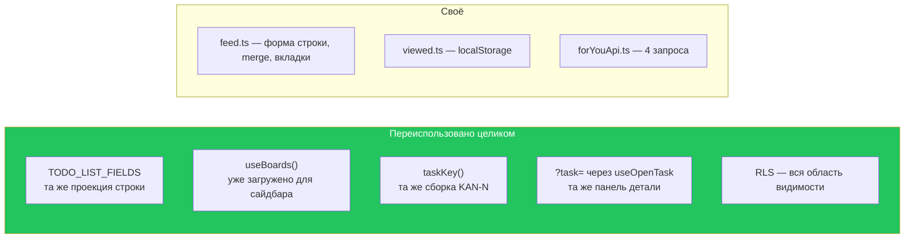
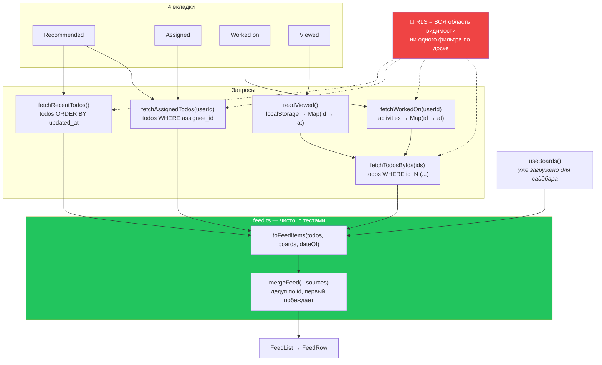

# 16 · For You

[← 15 · Приглашения](15-invitations.md) · [Оглавление](README.md) · [Далее: 17 · Роутинг →](17-routing.md)

---

## 🧒 LEVEL 1

> For You — это **твоя личная тумбочка**, а не общий стол.

Все остальные экраны отвечают на вопрос **«что на этой доске?»**.
For You отвечает на **«что моё?»** — по всем доскам сразу.

```
🏠 /  (For You)
│
├── ⭐ Recommended  — «что вообще происходит вокруг меня»
├── 👤 Assigned     — «что мне поручили»
├── ✍️ Worked on    — «что я недавно трогал»
└── 👀 Viewed       — «что я недавно открывал»
```

**Важно:** этот экран **ничего не фильтрует по доске**. Он показывает всё, до
чего ты вообще допущен, — и решает это не код, а RLS в базе.

---

## 👷 LEVEL 2

### Четыре вкладки, одна форма строки

```ts
export interface FeedItem {
  todo: Todo;
  at: string;         // ИНСТАНТ, которым датирована строка — у каждой вкладки свой
  boardName: string | null;
  key: string | null; // "KAN-12", собран здесь
}
```

> *«Recommended, Assigned, Worked on and Viewed differ in **which** work items
> they return and **which timestamp** dates them… Everything after that is
> identical, so the tabs converge here and the list, the grouping and the row
> renderer are written once. **A per-tab item shape would be four renderers
> drifting apart.**»*

| Вкладка | Источник | Чем датируется | Запрос |
|---|---|---|---|
| **Recommended** | `todos` (последние) ∪ `todos` (назначенные мне) | `updated_at` | 2 |
| **Assigned** | `todos WHERE assignee_id = me` | `updated_at` | 1 |
| **Worked on** | `activities WHERE actor_id = me` → id → `todos` | `activities.created_at` | 2 |
| **Viewed** | `localStorage` → id → `todos` | момент просмотра | 1 |

### Запросы

```ts
export const FEED_PAGE = 25;

export async function fetchRecentTodos(limit = FEED_PAGE) {
  const { data, error } = await supabase
    .from("todos")
    .select(TODO_LIST_FIELDS)          // 🔑 тот же список полей, что у доски
    .order("updated_at", { ascending: false, nullsFirst: false })
    .limit(limit);
  if (error) throw error;
  return data;
}
```

**🔑 Ни одного фильтра по доске или пользователю.** Комментарий в
`forYouApi.ts`:

> *«RLS is the whole of the scoping.»*

`accessible_board_ids()` уже отвечает на вопрос «какие доски мне доступны».
Добавить `.in("board_id", myBoards)` означало бы **второе определение** того,
что уже определено политикой — и способное с ней разойтись.

Сравни с доской: там `.eq("board_id", boardId)` **нужен**, потому что «эта
доска» — параметр вопроса. Здесь параметра нет: вопрос **и есть** политика.

### `fetchWorkedOn` — дедупликация на клиенте

```ts
export async function fetchWorkedOn(userId: string, limit = FEED_PAGE * 4) {
  const { data, error } = await supabase
    .from("activities")
    .select("entity_id, created_at")
    .eq("actor_id", userId)
    .eq("entity_type", "todo")
    .order("created_at", { ascending: false })
    .limit(limit);

  const newest = new Map<string, string>();
  for (const row of data ?? []) {
    // Строки идут новейшими первыми, поэтому ПЕРВОЕ появление id —
    // его последняя активность, а всё остальное — история.
    if (row.entity_id && !newest.has(row.entity_id)) {
      newest.set(row.entity_id, row.created_at);
    }
  }
  return newest;
}
```

**Почему `limit = FEED_PAGE * 4` (100), а не 25?** Потому что одна задача могла
получить десяток записей активности. Ста строк журнала хватает, чтобы набрать
25 **различных** задач.

**Почему `Map`, а не `DISTINCT ON` в SQL?** PostgREST не выражает `DISTINCT ON`
напрямую, а первое появление в уже отсортированном потоке — это ровно то же
самое, только на клиенте и без RPC.

### Двухшаговое разрешение (Worked on и Viewed)

```
ШАГ 1: получить id + инстанты        ШАГ 2: получить строки задач
┌──────────────────────────┐        ┌──────────────────────────────┐
│ activities → Map<id, at> │        │ fetchTodosByIds(ids)         │
│ или                      │───────▶│ .in("id", ids)               │
│ localStorage → Map<id,at>│        │ 🔐 RLS решает, что вернётся   │
└──────────────────────────┘        └──────────────────────────────┘
```

Ключ кэша устроен интересно:

```ts
forYouByIds: (ids: string[]) =>
  [...FOR_YOU_ROOT, "by-ids", [...ids].sort().join(",")] as const,
```

> *«Keyed by the ids themselves, sorted and joined, so the entry changes exactly
> when the set does and two tabs asking for the same rows share one request.
> **Sorted because the set is the question**; the caller re-orders by its own
> timestamps afterwards.»*

То есть `[a,b,c]` и `[c,b,a]` — **одна** запись кэша, потому что это один и тот
же вопрос. Порядок восстанавливается позже, из `Map` с инстантами.

И `enabled: ids.length > 0`:
> *«issuing `in.()` for it is a request PostgREST rejects»*

### `mergeFeed` — union без дубликатов

```ts
export function mergeFeed(...sources: FeedItem[][]): FeedItem[] {
  const seen = new Set<string>();
  const merged: FeedItem[] = [];
  for (const source of sources) {
    for (const item of source) {
      if (seen.has(item.todo.id)) continue;
      seen.add(item.todo.id);
      merged.push(item);
    }
  }
  return merged.sort((a, b) => (a.at < b.at ? 1 : a.at > b.at ? -1 : 0));
}
```

Recommended — объединение двух источников, и задача может быть в обоих.
**Побеждает первое вхождение**, поэтому вызывающий передаёт самый осмысленный
источник первым:

```ts
// useForYou: assigned первым
// «work assigned to you is the strongest signal it has»
```

### Экономия запроса, которую стоит заметить

```ts
const assigned = useQuery({
  queryKey: queryKeys.forYouAssigned(userId),
  queryFn: () => fetchAssignedTodos(userId!),
  enabled: Boolean(userId) && (tab === "assigned" || tab === "recommended"),
  //                            ⬆️ ОДИН ключ на две вкладки
});
```

> *«Recommended leans on this too… so it runs for both tabs rather than being
> fetched twice under two keys.»*

Переключение Recommended ↔ Assigned **не делает запроса**: данные уже в кэше
под тем же ключом.

### Название доски — бесплатно

```ts
export function toFeedItems(todos: Todo[], boards: IBoard[], dateOf = ...): FeedItem[] {
  const byId = new Map(boards.map(b => [b.id, b]));
  for (const todo of todos) {
    const board = todo.board_id ? byId.get(todo.board_id) : undefined;
    if (!board) continue;                       // 🔒 см. ниже
    items.push({
      todo, at,
      boardName: board.title,
      key: taskKey(board.key_prefix ?? DEFAULT_KEY_PREFIX, todo.board_key),
    });
  }
}
```

`boards` — это `useBoards()`, **уже загруженный для сайдбара** и уже
отфильтрованный RLS. Поэтому имя доски и префикс ключа не стоят ни одного
дополнительного запроса.

**Строка без доски выбрасывается, и это защита, а не уборка:**

> *«Defence in depth, not a normal path. Every query behind this is filtered by
> RLS to boards the caller can reach, so a row whose board is absent from their
> own board list is an anomaly — and the safe reading of an anomaly is to omit
> it, **never to render it without saying where it is from**.»*

---

## 💾 «Viewed» — localStorage как осознанный потолок

**Repository evidence:** серверной истории просмотров нет. Вкладка Viewed
целиком работает на `localStorage`.

```ts
const KEY = "kan:viewed";
export const VIEWED_LIMIT = 50;

export interface ViewedEntry {
  id: string;
  boardId: string;
  at: string;
}
```

### Почему не таблица `todo_views`

> *«The server-side alternative is a `todo_views` table written on **every**
> task open — a row per navigation, on a table with no natural bound, to power
> one tab. That is the speculative schema the brief rules out, and the write
> amplification is real: opening ten cards while reading a board would be ten
> inserts.»*

| | Таблица `todo_views` | localStorage (выбрано) |
|---|---|---|
| Запись | INSERT на **каждое** открытие | одна запись в JSON |
| Рост | без естественной границы | обрезка до 50 |
| Работает между устройствами | ✅ | ❌ **нет** |
| Переживает очистку данных | ✅ | ❌ **нет** |
| Стоимость | миграция + RLS + retention | ноль |

**Цена названа прямо:**

> *«**the list is per-browser.** Viewing a task on a laptop does not put it in
> the phone's Viewed tab, and clearing site data clears it. That is the same
> contract a browser's own history has, which is why it is a defensible answer
> for this particular question and would not be for "assigned to me".»*

Последняя фраза — критерий. «Что я недавно смотрел» **уместно** быть
пер-браузерным, потому что так же ведёт себя история браузера. «Что мне
поручили» — нет.

### 🔒 Хранятся id, а не заголовки

Это важнее, чем кажется:

> *«A cached title would go stale the moment somebody renamed the card, and —
> the part that matters — **a work item you have since lost access to would keep
> rendering its name out of the browser's own storage**, with no server round
> trip to stop it. Ids are resolved through `fetchTodosByIds`, so RLS decides
> what comes back and a revoked board simply yields nothing.
> **Local storage can be stale; it cannot leak.**»*

```
❌ Хранить {id, title}:
   доступ отозвали → заголовок всё равно рисуется из localStorage
   → 🔥 утечка без единого запроса

✅ Хранить {id}:
   доступ отозвали → fetchTodosByIds не вернёт строку (RLS)
   → строка просто исчезает
```

**Правило, которое стоит запомнить:** клиентское хранилище может держать
**ссылки**, но не **содержимое**, к которому применяются права.

### Чистота через инъекцию `Storage`

```ts
function defaultStorage(): Storage | null {
  try {
    return typeof localStorage === "undefined" ? null : localStorage;
  } catch { ... }
}
```

> *«Pure over an injected `Storage`, so the boundary cases — a full quota, a
> private window that throws on read, a hand-edited value — are testable
> without a browser.»*

Три граничных случая, и все три реальны: приватное окно может **иметь**
свойство `localStorage` и **бросать** при обращении; квота переполняется;
значение можно отредактировать руками через DevTools. Всё это — «истории нет»,
легитимное состояние, а не ошибка, которую надо показывать.

Тесты — `viewed.test.ts`.

---

## ❌ Про «Starred»

**Вкладки Starred в Veylo НЕТ.** Она была построена и **удалена**. Из
`services/forYou/feed.ts`:

> *«**There is no Starred tab.** It was built and then removed: a star is the
> one thing on this page that cannot be derived from existing data, so it
> needed a `todo_stars` table, and that migration was never applied. Rather
> than ship a tab that explains why it does not work, the feature is out until
> the table is. Everything else here reads columns the schema already had.»*

Это важно **не** как отсутствие фичи, а как **принцип**:

```
Assigned    → todos.assignee_id      ← колонка уже была
Worked on   → activities.actor_id    ← таблица уже была
Viewed      → localStorage           ← инфраструктура не нужна
Recommended → todos.updated_at       ← колонка уже была
Starred     → todo_stars             ← 🔴 НУЖНА НОВАЯ ТАБЛИЦА
```

Четыре вкладки — производные от существующих данных. Пятая требовала бы схемы.
И решение было: **не показывать вкладку, которая объясняет, почему не работает.**

---

## 🏛 LEVEL 3

### Почему For You — не board-scoped

```ts
forYou:           () => ["for-you"],
forYouRecent:     () => ["for-you", "recent"],
forYouAssigned:   (userId) => ["for-you", "assigned", userId],
forYouWorkedOn:   (userId) => ["for-you", "worked-on", userId],
forYouByIds:      (ids)    => ["for-you", "by-ids", ids.sort().join(",")],
```

> *«**Not board-scoped, and that is the whole shape of this page.** Every other
> key here answers "what is on this board"; these answer "what is mine", across
> every board RLS lets the caller reach. Keying them by board would be
> meaningless — the query has no board filter, **because the policy already is
> one**.»*

**Асимметрия аргументов внутри самой группы:**

| Ключ | Аргумент | Почему |
|---|---|---|
| `forYouRecent()` | **нет** | ответ уже «мой» — решает RLS, фильтра нет |
| `forYouAssigned(userId)` | есть | id ушёл в **запрос** (`.eq("assignee_id", userId)`) |
| `forYouWorkedOn(userId)` | есть | то же |

И причина, по которой userId в ключе вообще нужен:

> *«so signing in as somebody else on the same tab cannot read the previous
> person's feed out of the cache»*

Это тот же класс защиты, что `queryClient.clear()` на `SIGNED_OUT` — на случай,
если очистка не сработала или не успела.

### Почему For You — стартовая страница

```tsx
{ path: "/", element: <ForYouPage /> },       // eager, НЕ lazy
```

> *«`/` is the personal hub as of M21. It used to redirect to the oldest board,
> which meant **the app had no home** — the first thing you saw was one
> arbitrary board rather than your own work.»*

И почему **не** lazy:

> *«`ForYouPage` is the first paint for a signed-in one (M21)… deferring the
> landing screen buys nothing and costs a spinner on the one route that should
> feel instant. It is also small — a list, a segmented control and three states
> — and reaches **none** of the board's heavy dependencies.»*

Два критерия «оставить eager»: это **первый экран** и он **не тянет тяжёлые
зависимости**. `BoardPage` подходит под второй критерий с точностью до наоборот
— он тянет `@dnd-kit`, пять рендереров представлений, тред комментариев,
панель активности и все модалки доски.

### Что For You переиспользует и чего не изобретает



**Из нового — только то, чего действительно не было.** Панель детали задачи —
та же самая, через тот же `?task=`; отдельного просмотра «из ленты» нет.

### Ограничения, которые стоит назвать честно

| Ограничение | Значение | Что было бы дальше |
|---|---|---|
| `FEED_PAGE = 25`, пагинации нет | видишь 25 последних | `useInfiniteQuery` + курсор по `updated_at` |
| Viewed — пер-браузерный | не синхронизируется | таблица `todo_views` + retention |
| Recommended — не ранжирование | это union + сортировка по времени | скоринг: срок, приоритет, упоминания |
| Worked on упирается в retention `activities` | `prune_activities` по умолчанию 180 дней | отдельная таблица «последнее касание» |
| Нет realtime | обновляется по фокусу окна | часть M6-B |

**Про Recommended важно не преувеличивать.** Никакого ML и никакого скоринга
там нет: это объединение «назначено мне» и «недавно обновлено», отсортированное
по времени, с дедупликацией. Название вкладки продуктовое, реализация —
честный union.

**Про Worked on есть неочевидная связь:** он читает `activities`, у которых
есть `prune_activities(p_keep_days default 180)`. Значит, вкладка ограничена
сроком хранения журнала. Сейчас неважно, но это настоящая зависимость между
двумя фичами.

---

## 📊 Полная карта



---

## 🧪 Мини-квиз

<details>
<summary><b>1.</b> Почему запросы For You не фильтруют по доске, а запрос доски — фильтрует?</summary>

Потому что вопросы разные. «Покажи **эту** доску» — у вопроса есть параметр,
и `.eq("board_id", …)` его выражает (плюс попадание в индекс). «Покажи, что
**моё**» — параметра нет: ответ **и есть** политика
`board_id in (select accessible_board_ids())`. Клиентский фильтр был бы вторым
определением «моего», способным разойтись с политикой, а исполняется всё равно
политика.
</details>

<details>
<summary><b>2.</b> Почему Viewed хранит только id, а не заголовки?</summary>

Потому что заголовок, сохранённый в браузере, продолжал бы рисоваться **после
отзыва доступа** — без единого запроса, который мог бы это остановить. Это
утечка. Id разрешаются через `fetchTodosByIds`, где решает RLS: отозвали доступ
— строка просто не вернулась. Формулировка из кода: «Local storage can be
stale; it cannot leak.» Плюс заголовок устарел бы при переименовании.
</details>

<details>
<summary><b>3.</b> Есть ли вкладка Starred?</summary>

**Нет.** Её построили и убрали. Звёздочка — единственное на этой странице, что
нельзя вывести из существующих данных: нужна таблица `todo_stars`, а миграцию
не применили. Вместо вкладки, которая объясняет, почему не работает, фичу убрали
до появления таблицы. Остальные четыре вкладки читают колонки, которые в схеме
уже были.
</details>

<details>
<summary><b>4.</b> Почему <code>forYouByIds</code> сортирует id перед склейкой в ключ?</summary>

Потому что вопрос — это **множество**, а не последовательность. `[a,b,c]` и
`[c,b,a]` — один и тот же запрос, и сортировка делает их одной записью кэша,
то есть одним сетевым запросом. Нужный порядок восстанавливается позже, из
`Map` с инстантами, которую держит вызывающий.
</details>

<details>
<summary><b>5.</b> Почему <code>fetchWorkedOn</code> берёт лимит 100, если лента показывает 25?</summary>

Потому что одна задача может иметь много записей в `activities` — создание,
перемещение, переименование. Ста строк журнала хватает, чтобы после
дедупликации осталось 25 **различных** задач. Дедупликация — на клиенте, через
`Map` с правилом «первое появление в потоке, отсортированном по убыванию, — это
последняя активность».
</details>

<details>
<summary><b>6.</b> Recommended открыт, переключаемся на Assigned. Сколько запросов?</summary>

**Ноль.** Запрос назначенных объявлен с
`enabled: Boolean(userId) && (tab === "assigned" || tab === "recommended")` и
**одним** ключом `forYouAssigned(userId)`. Recommended уже опирается на него —
«назначено тебе» это его сильнейший сигнал, — поэтому данные лежат в кэше под
тем же ключом.
</details>

<details>
<summary><b>7. Predict:</b> строка из ленты, доски которой нет в <code>useBoards()</code>. Что произойдёт?</summary>

Она будет **пропущена** (`if (!board) continue`). Это defence in depth, а не
обычный путь: все запросы за этим отфильтрованы RLS до доступных досок, значит
строка с отсутствующей доской — аномалия. Безопасное прочтение аномалии —
опустить её, но **никогда** не рисовать, не сообщив, откуда она.
</details>

<details>
<summary><b>8.</b> Почему <code>ForYouPage</code> загружается eager, а <code>BoardPage</code> — lazy?</summary>

Два критерия. `ForYouPage` — **первый экран** залогиненного пользователя, и
откладывание landing-страницы ничего не покупает, зато добавляет спиннер туда,
где всё должно быть мгновенно; плюс она маленькая и не тянет ни одной тяжёлой
зависимости. `BoardPage` — наоборот: тянет `@dnd-kit`, пять рендереров
представлений, тред комментариев, панель активности и все модалки доски, то
есть основную массу бандла.
</details>

---

[← 15 · Приглашения](15-invitations.md) · [Оглавление](README.md) · [Далее: 17 · Роутинг →](17-routing.md)
