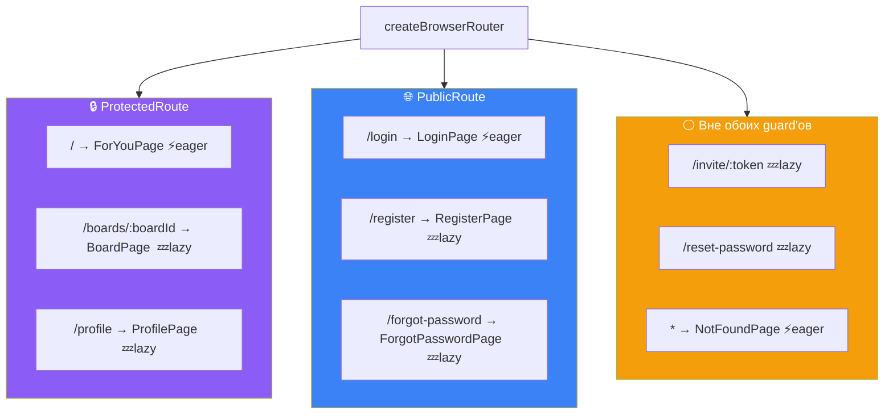
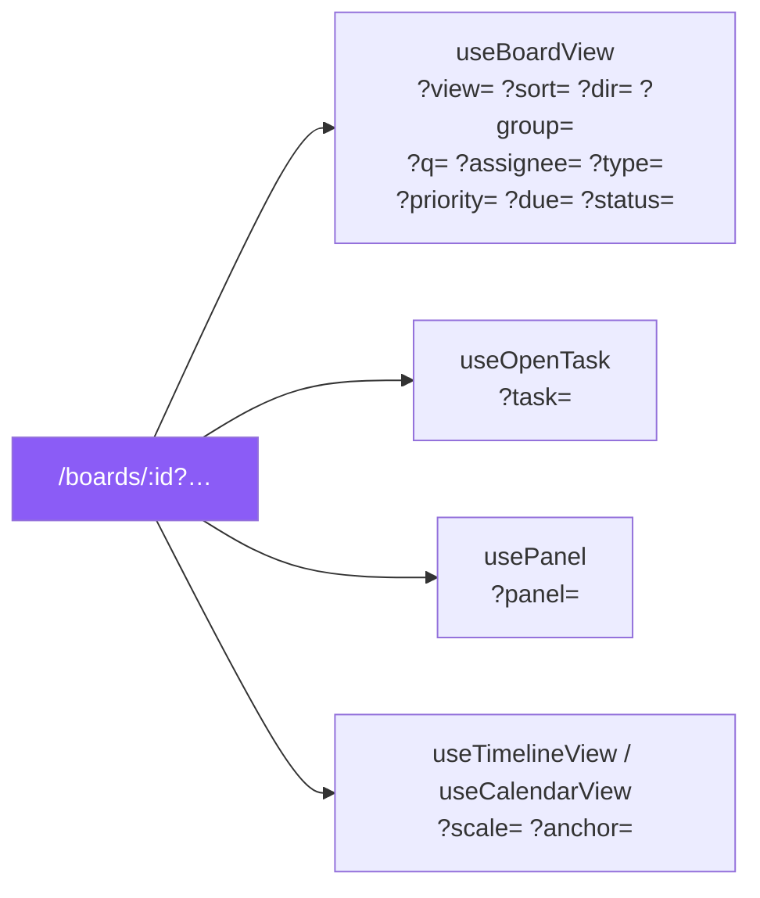

# 17 · Роутинг

[← 16 · For You](16-for-you.md) · [Оглавление](README.md) · [Далее: 18 · Дизайн-система →](18-design-system.md)

---

## 🧒 LEVEL 1

> URL — это **адрес**, а не просто путь.

Хороший адрес обладает тремя свойствами:
1. **Отправляемый.** Скинул коллеге — он увидит **то же самое**.
2. **Возвращаемый.** Нажал Back — вернулся туда, где был.
3. **Переживающий перезагрузку.** F5 не теряет контекст.

В Veylo это доведено до принципа: **почти всё состояние экрана живёт в URL.**

```
/boards/abc-123?view=timeline&sort=due&priority=high,highest&task=xyz&panel=activity
        └──┬──┘ └────┬─────┘ └──┬───┘ └──────────┬────────┘ └──┬──┘ └─────┬──────┘
        какая      какое      как         что показывать      что       что открыто
        доска      представл. сортир.                        открыто     сбоку
```

Одна ссылка — весь экран.

---

## 👷 LEVEL 2 — Карта маршрутов



**У каждого блока — `errorElement: <RouteErrorPage />`.** Это внешняя сеть
защиты: любой throw при рендере, который не поймал локальный `ErrorBoundary`,
приходит сюда.

### Три уровня доступа, а не два

Это первое, что стоит понять: guard'ов **три**, а не два.

| Уровень | Правило | Маршруты | Почему |
|---|---|---|---|
| 🔒 Protected | нужна сессия **и** подтверждение | `/`, `/boards/:id`, `/profile` | это и есть приложение |
| 🌐 Public | сессии быть **не должно** | `/login`, `/register`, `/forgot-password` | залогиненному тут нечего делать |
| ⚪ Вне guard'ов | работает **в обоих** состояниях | `/invite/:token`, `/reset-password`, `*` | ↓ |

**Третья категория — самая интересная**, и каждый её маршрут попал туда по
своей причине.

#### `/invite/:token`

> *«Outside both guards on purpose: it has to work signed in AND signed out.
> `ProtectedRoute` would bounce a signed-out visitor to /login and **lose the
> token**; `PublicRoute` would bounce a signed-in one to /. The page gates
> itself and carries the token through login via `?next=`.»*

#### `/reset-password`

> *«A Supabase recovery link does not hand this page a token to redeem — it
> **signs the user in**, exchanging the URL fragment for a real session before
> the page renders. So `PublicRoute` would see that session and redirect to `/`
> **before the password could be changed**, which is precisely the screen the
> link exists to reach.»*

Обрати внимание: причины **разные**. Первый маршрут — «работает в обоих
состояниях». Второй — «состояние меняется прямо во время загрузки страницы».

#### `*` (404)

> *«a signed-out visitor to a bad URL should be told the page does not exist,
> not bounced to /login as if it did»*

Мелочь, но правильная: `/bords/abc` (опечатка) не должен выглядеть как «нужно
войти».

---

### Code splitting: кто eager, кто lazy

```ts
// src/components/routes/lazyPages.ts
export const BoardPage = lazy(() => import("@/pages/board/BoardPage"));
export const ProfilePage = lazy(() => import("@/pages/profile/ProfilePage"));
export const InvitePage = lazy(() => import("@/pages/invite/InvitePage"));
export const RegisterPage = lazy(() => import("@/pages/auth/RegisterPage"));
export const ForgotPasswordPage = lazy(() => import("@/pages/auth/ForgotPasswordPage"));
export const ResetPasswordPage = lazy(() => import("@/pages/auth/ResetPasswordPage"));
```

**Четыре маршрута оставлены eager, и каждый — по названной причине, а не по
недосмотру:**

| Маршрут | Причина |
|---|---|
| `LoginPage` | *«the first paint for a signed-out visitor. Deferring it buys nothing — it **is** the initial bundle's job»* |
| `ForYouPage` | *«the first paint for a signed-in one… It is also small — a list, a segmented control and three states — and reaches **none** of the board's heavy dependencies»* |
| `NotFoundPage` | ↓ |
| `RouteErrorPage` | *«A page whose job is to work when something else did not must not itself depend on a chunk request succeeding — **a failed lazy import inside an error boundary is a blank screen with no way out**»* |

Последняя строка — лучший аргумент главы. Страница ошибки, загружаемая по сети,
**отказывает ровно тогда, когда нужна**.

**Почему делить вообще стоило:**

> *«`BoardPage` reaches @dnd-kit, five view renderers, the comment thread, the
> activity drawer and every board modal; everything else is a form or a
> sentence. Splitting it is most of the win, and splitting the rest is what
> stops it being clawed back the next time one of them grows.»*

Второе предложение — про дисциплину: разделив только `BoardPage`, следующий
разросшийся `ProfilePage` тихо вернул бы вес в начальный бандл.

**Почему `lazyPages.ts` — отдельный файл:**

> *«`react-refresh/only-export-components` cannot fast-refresh a file that mixes
> component exports with anything else, and `Routes.tsx` exports the router —
> which is not a component.»*

Тот же приём, что `authContext.ts` и `themeContext.ts` ([глава 04](04-react.md)).

---

## 🔗 URL как хранилище состояния

**Три отдельных хука, три разных набора параметров:**



### 🔥 push vs replace — самое тонкое место

```ts
// useOpenTask
const openTask = (todoId) => setSearchParams(prev => { ...set("task", todoId) });
//                                                     ⬆️ БЕЗ replace = PUSH

const closeTask = () => setSearchParams(prev => { ...delete("task") }, { replace: true });
//                                                                       ⬆️ REPLACE
```

**Почему асимметрия:**

```
✅ Как есть:
   доска → [push] открыл задачу → Back → доска ✅

❌ Если бы close тоже пушил:
   доска → [push] открыл → [push] закрыл → Back → задача СНОВА ОТКРЫТА
   → Back → закрыта → Back → открыта …  🔁 пользователь в петле
```

Открытие — **навигация** (Back должен её отменить). Закрытие — **не** навигация
(это и есть отмена).

**Тот же принцип у панели:**

```ts
// usePanel
// «Pushes, like `openTask` and unlike every write in `useBoardView`:
//  opening a drawer is a navigation, and Back is how people expect to leave one.»
```

**А фильтры — всегда `replace`:**

Иначе набор десяти символов в поиске создал бы десять записей истории, и Back
пришлось бы жать десять раз, чтобы уйти с доски.

| Действие | push / replace | Логика |
|---|---|---|
| открыть задачу | **push** | навигация |
| закрыть задачу | **replace** | это и есть отмена |
| открыть панель | **push** | навигация |
| фильтр / поиск / сортировка | **replace** | настройка вида, не переход |
| смена представления | **replace** | то же |

### Почему панель — параметр, а не маршрут

```ts
export const PANELS = ["members", "activity"] as const;
```

> *«The `?task=` contract, applied a second time (M17). `useOpenTask` settled
> this question at M5-06 and the reasoning carries over unchanged: **the board
> stays mounted behind the drawer**, so no route change, no remount, no
> refetch, and the scroll position and collapsed columns survive.»*

| | `/boards/:id/members` (маршрут) | `?panel=members` (выбрано) |
|---|---|---|
| Доска под панелью | размонтируется | **остаётся смонтированной** |
| Позиция скролла | теряется | сохраняется |
| Свёрнутые колонки | теряются | сохраняются (это `useState` в `KanbanBoard`) |
| Фильтры в URL | нужно тащить руками | уже там |
| Refetch при закрытии | да | нет |

Последняя строка про свёрнутые колонки особенно показательна: это **клиентское,
непersisted** состояние. Смена маршрута стёрла бы его без следа.

> *«A drawer that were a route would be a second answer to a question already
> answered — which is exactly what M17 exists to stop the product
> accumulating.»*

### Валидация: URL — недоверенный ввод

```ts
function readOne<T extends string>(params, key, allowed: readonly T[], fallback: T): T {
  const raw = params.get(key);
  return allowed.includes(raw as T) ? (raw as T) : fallback;
}

function readList(params, key: string): string[] {
  const raw = params.get(key);
  if (!raw) return [];
  // «a hand-edited URL is untrusted input like any other, and a repeated value
  //  would inflate the filter count without changing the result»
  return [...new Set(raw.split(",").filter(Boolean))];
}
```

```ts
// usePanel
function isPanel(value: string | null): value is PanelKey {
  return !!value && (PANELS as readonly string[]).includes(value);
}
// «Unknown values resolve to `null` rather than rendering an empty drawer»
```

**Три уровня недоверия к URL:**

| Проверка | Где | Что ловит |
|---|---|---|
| белый список значений | `readOne` | `?view=nonsense` → `board` |
| дедупликация | `readList` | `?priority=high,high` → одна `high` |
| валидация формата | `isUuid(boardId)` в `BoardPage` | `/boards/hello` → 404, а **не** 500 |
| защита от редиректа | `safeNext` | `?next=//evil.com` → `null` |

Про `isUuid` — конкретная причина:

> *«Postgres rejects a malformed uuid as a type error rather than returning no
> rows, which would surface as a thrown query and the generic error boundary —
> the wrong answer for a URL that was simply typed wrong.»*

То есть без этой проверки опечатка в адресе давала бы **страницу ошибки** вместо
**404**.

---

## 🏛 LEVEL 3

### Почему маршрут доски — `/boards/:boardId`, а не `/spaces/:s/boards/:b`

```tsx
{ path: "/boards/:boardId", element: deferred(<BoardPage />) }
```

> *«**The route stayed `/boards/:boardId` through M17**, deliberately: a board
> is a uuid, moving it between spaces must not break a link somebody already
> has, and `?view=`, `?task=` and `?panel=` all ride on this URL. Putting the
> space in the path would make it part of the board's identity, **which M15
> decided it is not**.»*

Прямое следствие решения из [главы 11](11-spaces-boards-tasks.md):

```
Space — это ФАЙЛИНГ, а не идентичность
   ↓
переложил доску в другую папку → идентичность не изменилась
   ↓
ссылка не должна сломаться
   ↓
пространства НЕТ в пути
```

**Проверь себя:** если бы путь был `/spaces/work/boards/abc`, то перекладывание
доски из «work» в «personal» **сломало бы каждую существующую ссылку** на неё,
включая те, что в уведомлениях (`notificationTarget` строит
`/boards/${board_id}?task=${entity_id}`).

### 404 vs 403 — почему не различаем

```tsx
if (error) throw error;          // настоящий сбой → errorElement
if (!board) return <NotFoundPage />;
```

> *«Null covers both "no such board" and "a board RLS will not show you", and
> deliberately does not distinguish them. **Answering 404 for someone else's
> board rather than 403 means a stranger's id cannot be confirmed by
> probing.**»*

```
❌ Различать:
   /boards/<чужой-uuid> → 403 «нет доступа»
   /boards/<выдуманный> → 404 «не существует»
   → перебирая uuid, можно ВЫЯСНИТЬ, какие доски существуют

✅ Не различать:
   оба → 404
   → id ничего не подтверждает
```

**И при этом настоящая ошибка не маскируется:**

> *«A genuine failure — offline, a policy error — is not a missing board.
> Rethrowing hands it to the route's errorElement… telling the user the board
> does not exist would be a lie.»*

Три разных исхода, три разных ответа:

| Ситуация | Что показываем |
|---|---|
| `error` (сеть, 500) | `RouteErrorPage` — честно «что-то сломалось» |
| `board === null` (нет ИЛИ нет доступа) | `NotFoundPage` — неразличимо |
| `!isUuid(boardId)` | `NotFoundPage` — до запроса |

### Три уровня обработки ошибок рендера

```
┌─ errorElement на каждом блоке маршрутов (RouteErrorPage)
│  └─ ловит всё, что всплыло до маршрута
│
│  ┌─ ErrorBoundary вокруг списка карточек КАЖДОЙ колонки
│  │  └─ одна битая карточка стоит одного списка, а не доски
│  │
│  │  ┌─ TanStack Query: QueryCache.onError / MutationCache.onError
│  │  │  └─ ошибки СЕТИ — тосты, не boundary
```

Из `CLAUDE.md`: *«`components/ErrorBoundary.tsx` wraps each column's card list
so one bad card costs that list and nothing else, and every route carries an
`errorElement` as the outer net.»*

📖 Развёрнуто: [22 · Обработка ошибок](22-errors.md).

### `?next=` — единственный параметр, который надо проверять на безопасность

```ts
// useLogin
const next = safeNext(searchParams.get("next")) ?? "/";

// PublicRoute — покрывает случай, до которого мутация не доходит
if (user) return <Navigate to={safeNext(searchParams.get("next")) ?? "/"} replace />;
```

**Почему проверка в двух местах:**

> *«Honours `next` for the same reason `useLogin` does, but covers a case the
> mutation cannot: someone who was **ALREADY signed in** — in another tab, or
> from a live session — following an invite link. They never submit the form,
> so this guard is the only thing that sends them on.»*

Это не дублирование, а два **разных пути** к одному экрану: через отправку формы
и через уже существующую сессию.

Остальные параметры (`?view=`, `?task=`, `?panel=`) не нуждаются в защите от
редиректа — они не порождают навигацию наружу. Им хватает валидации по белому
списку.

### Что делает `Layout` и `ViewShell`

```tsx
<Layout>
  <ViewShell
    identity={<BoardMeta board={board} viewers={viewers} />}
    toolbar={<ViewToolbar view={view} />}
    drawer={panel === "members" ? <Drawer …/> : panel === "activity" ? <Drawer …/> : undefined}
  >
    {/* пять представлений */}
  </ViewShell>
</Layout>
```

`ViewShell` — **контракт оболочки представления** из M17: слот идентичности,
слот тулбара, область контента, слот панели.

> *«M17 must ship a view shell contract… that M19 and M20 fill **without
> inventing a second layout system**. A redesign that only redesigns the board
> leaves the two new views to be re-hosted afterwards.»*

Именно поэтому Calendar и Timeline строились **после** редизайна: они въехали в
готовый контракт, а не потребовали второй.

И ни одно представление не принимает `boardId` пропсом:

> *«No view takes a boardId prop: the hooks beneath them read the route param
> themselves, **so the board they render and the board in the URL cannot
> disagree**.»*

---

## 📊 Полная карта URL-состояния

| Параметр | Хук | Значения | push/replace | Валидация |
|---|---|---|---|---|
| `:boardId` (путь) | `useBoardId` | uuid | навигация | `isUuid` |
| `?view=` | `useBoardView` | `summary\|board\|list\|calendar\|timeline` | replace | белый список |
| `?sort=` `?dir=` | `useBoardView` | из `SORT_KEYS` | replace | белый список |
| `?group=` | `useBoardView` | из `GROUP_KEYS` | replace | белый список |
| `?q=` | `useBoardView` | свободный текст | replace | — |
| `?assignee=` `?type=` `?priority=` `?due=` `?status=` | `useBoardView` | списки через запятую | replace | дедуп через `Set` |
| `?task=` | `useOpenTask` | uuid задачи | **push** / replace при закрытии | — |
| `?panel=` | `usePanel` | `members\|activity` | **push** | `isPanel`, иначе `null` |
| `?scale=` `?anchor=` | `useTimelineView` / `useCalendarView` | масштаб и якорь | replace | белый список |
| `?next=` | `useLogin`, `PublicRoute` | путь | навигация | 🔒 `safeNext` |
| `?unconfirmed=1` | `ProtectedRoute` → `/login` | флаг | replace | — |
| `?tab=` | `ForYouPage` | из `FOR_YOU_TABS` | replace | `isForYouTab` |

---

## 🧪 Мини-квиз

<details>
<summary><b>1.</b> Почему <code>openTask</code> пушит, а <code>closeTask</code> заменяет?</summary>

Открытие задачи — навигация, и Back должен её отменить. Закрытие **и есть**
отмена. Если бы закрытие тоже пушило, Back после закрытия снова открыл бы
задачу, следующий Back закрыл, следующий открыл — пользователь застрял бы в
петле и не смог бы уйти с доски.
</details>

<details>
<summary><b>2.</b> Почему <code>/reset-password</code> вне обоих guard'ов, и чем его причина отличается от <code>/invite/:token</code>?</summary>

`/invite/:token` должен работать **в обоих состояниях**: `ProtectedRoute`
потерял бы токен, отправив на `/login`, а `PublicRoute` увёл бы залогиненного.
`/reset-password` — другой случай: ссылка восстановления **сама входит**
пользователя (обмен фрагмента URL на сессию до рендера), поэтому `PublicRoute`
увидел бы эту сессию и увёл на `/` **ровно с того экрана**, ради которого ссылка
существует.
</details>

<details>
<summary><b>3.</b> Почему <code>RouteErrorPage</code> не lazy?</summary>

Потому что страница, чья работа — работать, когда что-то другое не сработало,
не должна сама зависеть от успеха сетевого запроса за чанком. Провалившийся
`lazy`-импорт внутри error boundary даёт **пустой экран без выхода** — то есть
она отказывает ровно тогда, когда нужна.
</details>

<details>
<summary><b>4.</b> Почему панель — <code>?panel=</code>, а не маршрут?</summary>

Потому что доска остаётся **смонтированной** под панелью: нет смены маршрута,
нет размонтирования, нет refetch'а. Переживают позиция скролла, свёрнутые
колонки (это `useState` в `KanbanBoard`, нигде не persisted) и все фильтры,
которые уже в URL. Маршрут стёр бы всё это.
</details>

<details>
<summary><b>5.</b> Почему <code>/boards/:boardId</code>, а не <code>/spaces/:space/boards/:board</code>?</summary>

Потому что M15 решил: space — это **файлинг**, а не идентичность доски.
Пространство в пути сделало бы его частью идентичности, и перекладывание доски
в другую папку **сломало бы каждую существующую ссылку** — включая те, что
строит `notificationTarget` для уведомлений.
</details>

<details>
<summary><b>6.</b> Почему несуществующая и недоступная доска дают одинаковый ответ?</summary>

Чтобы чужой id нельзя было подтвердить перебором. Если бы недоступная давала
403, а несуществующая — 404, различие ответов позволило бы выяснить, какие доски
существуют. Оба случая дают `NotFoundPage`. При этом настоящий сбой (сеть, 500)
**не** маскируется: он пробрасывается в `errorElement`, потому что сказать «доски
нет» было бы враньём.
</details>

<details>
<summary><b>7. Predict:</b> пользователь открыл <code>/boards/hello-world</code>. Что произойдёт?</summary>

`isUuid("hello-world")` вернёт `false`, и `BoardPage` немедленно отрисует
`NotFoundPage` — **до запроса**. Без этой проверки Postgres отверг бы кривой
uuid как **ошибку типа** (а не «ноль строк»), запрос бросил бы, и пользователь
получил бы страницу ошибки вместо 404 на URL, где просто опечатка.
</details>

<details>
<summary><b>8.</b> Почему <code>safeNext</code> вызывается и в <code>useLogin</code>, и в <code>PublicRoute</code>?</summary>

Это два **разных пути** к одному результату. `useLogin` обрабатывает того, кто
отправил форму. `PublicRoute` — того, кто **уже был залогинен** (в другой
вкладке или в живой сессии) и просто перешёл по invite-ссылке: он форму не
отправляет, и этот guard — единственное, что отправит его дальше.
</details>

---

[← 16 · For You](16-for-you.md) · [Оглавление](README.md) · [Далее: 18 · Дизайн-система →](18-design-system.md)
