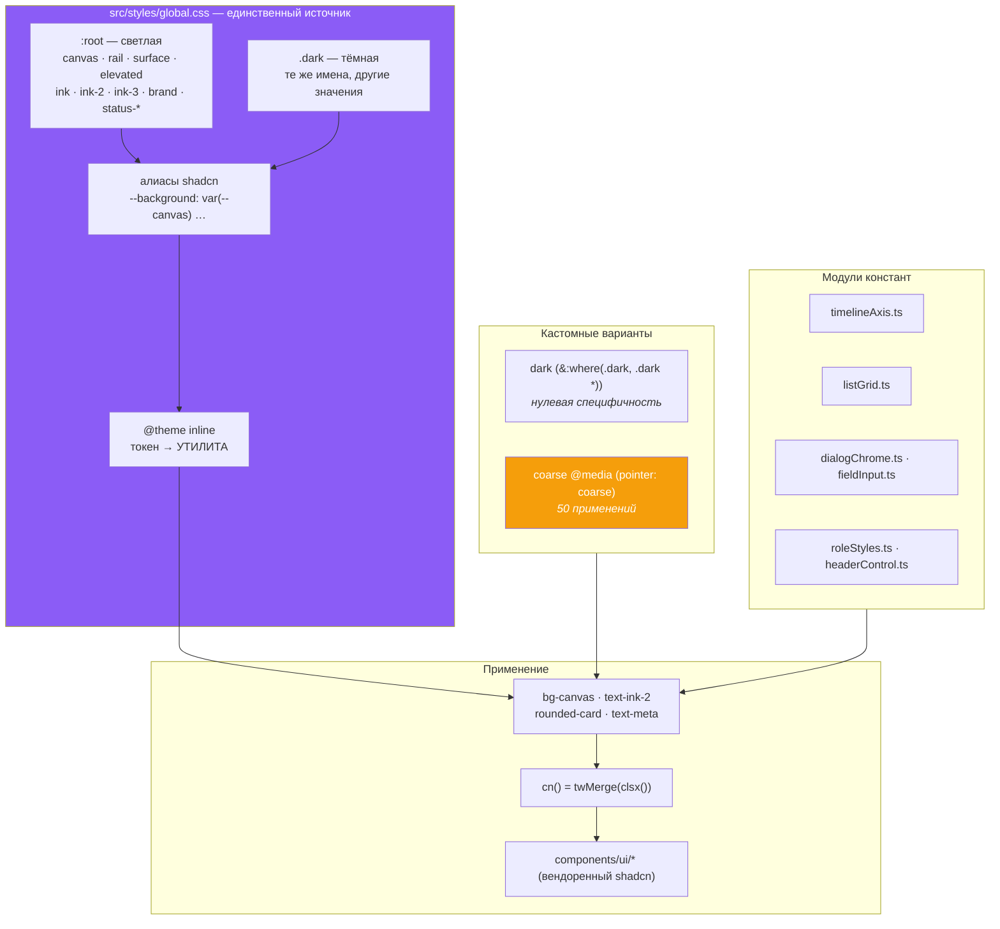

# 18 · Дизайн-система

[← 17 · Роутинг](17-routing.md) · [Оглавление](README.md) · [Далее: 19 · Мобильная архитектура →](19-mobile.md)

---

## 🧒 LEVEL 1

> Дизайн-система — это **набор кубиков LEGO, а не коробка случайного пластика**.

Кубики LEGO стыкуются, потому что у них **одинаковый шаг**. Если бы каждый
делали «на глаз», ничего бы не сходилось.

В интерфейсе то же самое:

```
❌ Коробка случайного пластика          ✅ Кубики LEGO
   padding: 11px                           p-3   (12px)
   padding: 13px                           p-3   (12px)
   font-size: 12.5px                       text-meta (13px)
   font-size: 13.5px                       text-meta (13px)
   color: #5a5a5a                          text-ink-3
   → всё почти одинаковое,               → всё либо одинаковое,
     но чуть-чуть разное                    либо явно разное
```

«Почти одинаковое, но чуть-чуть разное» — это то, из-за чего интерфейс
выглядит **недоделанным**, даже когда каждый экран по отдельности нормальный.

---

## 👷 LEVEL 2 — Токены Veylo

Всё живёт в **одном файле**: `src/styles/global.css` (427 строк). Нет
`tailwind.config.js` — Tailwind v4 конфигурируется из CSS.

### Два слоя токенов, и разделение осознанное

```css
:root {
  /* СЛОЙ 1 — токены оболочки (свои) */
  --canvas: oklch(0.958 0.004 265);
  --surface: oklch(0.978 0.003 265);
  --elevated: oklch(1 0 0);
  --ink: oklch(0.24 0.02 265);
  ...

  /* СЛОЙ 2 — токены shadcn, АЛИАСЫ на слой 1 */
  --background: var(--canvas);
  --card: var(--surface);
  --popover: var(--elevated);
  --foreground: var(--ink);
  ...
}
```

Комментарий объясняет, зачем два слоя:

> *«The shadcn tokens below were already here and are already consumed by every
> vendored primitive… They are **RETUNED rather than replaced**, so the board,
> the modals and the cards pick up the new palette without touching twenty
> component files.»*

И почему у слоя 1 свои имена:

> *«named so they cannot collide with a shadcn token that Tailwind already turns
> into a utility — `--color-primary` is taken, so primary text is `--ink`, not
> `--text-primary`»*

**🔥 Баг, который это чинило.** До алиасинга светлая тема была **второй,
независимой палитрой**:

> *«Left as literals, this block was a SECOND palette: neutral greys
> (`oklch(0.145 0 0)`, `#494c6b`) beside the shell's navy-tinted ones, so a
> dropdown (`bg-popover`) and the card it opened over (`bg-surface`) were
> **mismatched whites with mismatched text**. Dark mode never had the problem
> because dark aliased from the start.»*

Урок: **два источника цвета = два разных продукта на одном экране.**

### Четыре уровня поверхности

```
┌─────────────────────────────────────────────┐
│ --canvas    страница                        │  светлее ← ТЕМНАЯ ТЕМА → темнее
│  ┌────────────────────────────────────────┐ │
│  │ --rail   сайдбар                       │ │
│  └────────────────────────────────────────┘ │
│  ┌────────────────────────────────────────┐ │
│  │ --surface  колонка                     │ │
│  │   ┌──────────────────────────────────┐ │ │
│  │   │ --elevated  карточка / popover   │ │ │
│  │   └──────────────────────────────────┘ │ │
│  └────────────────────────────────────────┘ │
└─────────────────────────────────────────────┘
```

| Токен | Светлая | Тёмная |
|---|---|---|
| `--canvas` | `oklch(0.958 …)` | `oklch(0.145 0.019 267)` |
| `--rail` | `oklch(0.99 …)` | `oklch(0.163 0.02 267)` |
| `--surface` | `oklch(0.978 …)` | `oklch(0.196 0.021 267)` |
| `--elevated` | `oklch(1 0 0)` (чистый белый) | `oklch(0.228 0.023 267)` |

**Почему светлая тема — не плоская белая:**

> *«The same four-step hierarchy as dark, not a flat white: canvas is the page,
> surface is a column, elevated is a card. **Collapsing surface and elevated to
> white would leave a card invisible against its own column.**»*

**Почему у тёмной темы разброс именно 0.083:**

> *«The page was `oklch(0.17)` with a 0.092 spread up to the card, which reads
> as four obviously different greys stacked on each other — **the "developer
> dashboard" look**. A near-black page with a 0.083 spread keeps the same four
> levels while making each step something you notice **only when you look for
> it**, which is what lets a card sit on a column without either needing a
> border to be found.»*

Это редкий уровень точности в объяснении, почему число именно такое.

### Почему OKLCH, а не HEX

```css
--brand: oklch(0.62 0.2 292);
/*             │    │    └── hue: оттенок (0–360)
                │    └─────── chroma: насыщенность
                └──────────── lightness: ВОСПРИНИМАЕМАЯ светлота */
```

| | HEX / HSL | OKLCH |
|---|---|---|
| Светлота | не воспринимаемая | **воспринимаемая** |
| `#0000FF` и `#FFFF00` при L=50% | выглядят по-разному по яркости | одинаково |
| Смена оттенка при той же L | яркость «плавает» | остаётся |
| Охват | sRGB | шире (P3) |

Практика: `--status-blue`, `--status-orange`, `--status-green`, `--status-red`
заданы с **близкими L** (0.66–0.76 в тёмной), поэтому четыре статуса
воспринимаются одинаково заметными. С HEX жёлтый выглядел бы кричаще ярче
синего при «тех же» числах.

Плюс `color-mix(in oklab, …)` для полупрозрачных производных:

```css
background: color-mix(in oklab, var(--ink-3) 35%, transparent);
```

### Три уровня «чернил»

```
--ink    основной текст          заголовки, названия задач
--ink-2  вторичный               метаданные, подписи
--ink-3  третичный               плейсхолдеры, отключённое
```

Правило: **никакого `text-gray-500`**. Всегда `text-ink`, `text-ink-2`,
`text-ink-3` — тогда переключение темы автоматически корректно.

### `--wash` — приём, который стоит украсть

```css
--wash:        oklch(0.15 0.02 260 / 5%);   /* hover */
--wash-strong: oklch(0.15 0.02 260 / 8%);   /* выделенная строка меню */
```

> *«Translucent ink rather than a fixed grey, which is what lets **one value
> work on the canvas, on a column and on a card**.»*

```
❌ hover: #f0f0f0            ✅ hover: rgba(ink, 5%)
   на белой карточке — ок       на белой карточке — чуть темнее
   на серой колонке — СВЕТЛЕЕ   на серой колонке — чуть темнее
   на тёмной теме — ЯРКОЕ ПЯТНО  на тёмной — чуть светлее (там ink белый)
```

Один токен вместо трёх — потому что это **относительное**, а не абсолютное
значение.

**И баг, который это поймало:**

```css
/* NOT `--elevated`, which is what `--popover` already is: a highlighted
   dropdown row was being painted the exact colour of the popup behind it,
   so every menu in the product — column, board, task, space, sort, filter —
   had NO VISIBLE HOVER in the theme the app opens in. */
--accent: var(--wash-strong);
```

Выделение строки было того же цвета, что фон меню → выделения **не было
видно вообще**, во всех меню, в теме по умолчанию.

### Типографика: шкала, а не произвольные значения

```css
@theme inline {
  --text-micro: 0.625rem;   /* 10px — ключи карточек, счётчики */
  --text-mini:  0.6875rem;  /* 11px — метаданные, чипы, таймстемпы */
  --text-meta:  0.8125rem;  /* 13px — текст диалогов, вторичный UI */
}
```

> *«The three steps below `text-xs` that this product genuinely uses and
> Tailwind does not ship. Named rather than arbitrary so the next dense surface
> reaches for a step **instead of inventing `text-[12.5px]`** — the audit found
> **11.5, 12.5, 13.5, 14 and 17px all coexisting** with the scale they were
> rounding off.»*

Полная шкала: `text-micro` (10) → `text-mini` (11) → `text-xs` (12) →
`text-meta` (13) → `text-sm` (14) → `text-base` (16) → …

Финальная зачистка — коммит `d5816fa` *«move the last arbitrary px sizes onto
the type scale»*.

### Шрифты

```css
@import "@fontsource-variable/geist";
@import "@fontsource-variable/josefin-sans";

.font-wordmark { font-family: "Josefin Sans Variable", sans-serif; }

@theme inline {
  --font-sans: "Geist Variable", sans-serif;
  --font-heading: var(--font-sans);
}
```

**История, которую стоит рассказать:**

> *«`--font-sans` has been Geist since the tokens were written and `@layer base`
> applies it to `html`, but this rule overrode it for the entire body — so
> **the whole product rendered in Josefin Sans**, a geometric display face. At
> the 11–13px a board actually uses, its wide counters and single-storey `a`
> cost real legibility, which is **most of why dense screens read as
> unfinished**.»*

Один CSS-селектор с лишней специфичностью → весь продукт в дисплейном шрифте на
размерах, для которых он не предназначен.

Josefin выжил там, где дисплейному шрифту и место: `.font-wordmark` — логотип и
больше ничего. **Оба шрифта — self-hosted** через `@fontsource-variable`, то
есть запроса к Google Fonts нет: ни блокирующего рендер, ни трекингового.

### Радиусы

```css
--radius-surface-size: 0.875rem;  /* 14px — колонка, диалог */
--radius-card-size:    0.625rem;  /* 10px — карточка */
--radius-control-size: 0.5rem;    /* 8px  — кнопка, инпут */
```

Иерархия: **чем крупнее поверхность, тем больше радиус** — оптически это
выглядит согласованно.

---

## 🏛 LEVEL 3

### Что `@theme inline` делает на самом деле

```css
@theme inline {
  --color-canvas: var(--canvas);
  --text-meta: 0.8125rem;
  --radius-card: var(--radius-card-size);
}
```

Каждая строка **порождает утилиты**:

| Объявление | Утилиты |
|---|---|
| `--color-canvas` | `bg-canvas`, `text-canvas`, `border-canvas`, `ring-canvas`, … |
| `--text-meta` | `text-meta` |
| `--radius-card` | `rounded-card` |

**Слово `inline` важно:** значения подставляются **по ссылке**, а не
вычисляются в момент объявления. Поэтому `.dark`, переопределяя `--canvas`,
меняет и `bg-canvas` — без второго набора утилит.

```
:root { --canvas: светлый }     .dark { --canvas: тёмный }
              ↓                            ↓
       @theme inline: --color-canvas: var(--canvas)
              ↓
       bg-canvas → background: var(--color-canvas) → var(--canvas)
              ↓
       ✅ ОДНА утилита, обе темы
```

Без `inline` пришлось бы иметь `bg-canvas` и `dark:bg-canvas-dark` — то есть
дублировать каждое использование.

### Переключение темы: почему инлайн-скрипт в `index.html`

```html
<script>
  (() => {
    const theme = localStorage.getItem("theme") || "dark";
    if (theme === "dark") document.documentElement.classList.add("dark");
    else document.documentElement.classList.remove("dark");
  })();
</script>
```

**Скрипт стоит в `<head>`, до React, и это обязательно:**

```
❌ Тема из React:
   HTML отрисован (светлый) → JS загрузился → React смонтировался
   → useEffect → добавил .dark
   → 👁 ВСПЫШКА БЕЛОГО на 100–300 мс

✅ Инлайн-скрипт:
   HTML парсится → скрипт выполняется СИНХРОННО → .dark уже на <html>
   → первая отрисовка сразу тёмная
```

Это классический **FOUC** (Flash of Unstyled Content), и синхронный
блокирующий скрипт — единственное решение без SSR.

Плюс в `index.html` есть `<meta name="theme-color">` для обеих схем — красит
адресную строку мобильного браузера.

```css
@custom-variant dark (&:where(.dark, .dark *));
```

`:where()` даёт **нулевую специфичность**, поэтому `dark:` не перебивает
другие модификаторы неожиданным образом.

**Тема по умолчанию — тёмная** (`localStorage.getItem("theme") || "dark"`), и
это записано: *«This is the reference direction, and the theme the app opens
in.»*

### `@custom-variant coarse` — вариант, который стоит украсть

```css
@custom-variant coarse (@media (pointer: coarse));
```

Используется в **50 местах**. Проблема, которую он решает:

> *«The product hides a lot behind hover — a card's rename and menu, a column's
> add/collapse/menu, a row's actions, the assignee and date controls. On a
> mouse that is correct: the control is there when you reach for it and quiet
> when you are reading. On a finger there is **no hover**, so every one of those
> was simply **gone** — column management was **unreachable on a phone
> entirely**, because the cluster is `pointer-events-none` until hovered.»*

```tsx
// TodoCard.tsx — реальный пример
<div className="coarse:opacity-100 -mr-1 flex … opacity-0 transition-opacity
                group-hover:opacity-100 focus-within:opacity-100">
```

Читается: «прозрачно по умолчанию, видно при hover, видно при фокусе, **и
всегда видно на сенсорном устройстве**».

**🔑 Почему `pointer: coarse`, а не `max-md:`** — лучший аргумент главы:

> *«Keyed on the **pointing device** rather than on a `max-md:` width, which is
> the honest test: a narrow desktop window still has a mouse and should keep
> the quiet behaviour, and an iPad at 1024px has a finger and should not.»*

```
             Ширина < 768px    Есть мышь
Телефон           ✅               ❌     → coarse ✅   max-md ✅  (оба правы)
iPad 1024px       ❌               ❌     → coarse ✅   max-md ❌  ← max-md ОШИБАЕТСЯ
Узкое окно        ✅               ✅     → coarse ❌   max-md ✅  ← max-md ОШИБАЕТСЯ
десктопа
```

Ширина — **прокси** для устройства ввода, и прокси неточный. `pointer: coarse`
спрашивает напрямую.

Второе применение — **размер цели касания**:

```tsx
className="… coarse:size-8 coarse:p-0 coarse:grid coarse:place-items-center rounded p-0.5 …"
```

Крошечная кнопка `p-0.5` на мыши превращается в 32×32 на пальце. Рекомендация
WCAG 2.5.5 — минимум 44×44 CSS-пикселя; `size-8` = 32px, `size-9` = 36px.
**Repository evidence:** до 44px эти цели не дотягивают.

### Специализированные модули констант

Три файла, каждый по одной причине:

```ts
// components/timeline/timelineAxis.ts
export const RAIL_WIDTH = "15rem";
export const TICK_MIN: Record<TimelineScale, string> = { weeks: "1.75rem", months: "2.5rem" };
export const HEADER_HEIGHT = 52;
export const ROW_HEIGHT = "h-9";
```

> *«the header, the rows and the today marker all have to agree about where the
> axis starts and how wide a column is, and three components each holding their
> own copy of `15rem` is three chances for the header to stop lining up»*

Аналогично: `components/views/listGrid.ts`, `components/ui/dialogChrome.ts`,
`components/ui/fieldInput.ts`, `components/members/roleStyles.ts`,
`components/board/headerControl.ts`.

**Правило:** значение, о котором **обязаны договориться два и более
компонента**, переезжает в модуль.

Заметь дублирование, которое **признано и подписано**:
```ts
/** The row label column. `w-60` is this value — keep the two in step. */
export const RAIL_WIDTH = "15rem";
/** One row, 36px — `h-9`, and the two must stay in step. */
export const ROW_HEIGHT = "h-9";
```
Tailwind-класс и число не могут быть одним значением (одно нужно как класс,
другое — как число для inline-стиля). Раз устранить нельзя — это **написано**.

### `cn()` — и зачем `tailwind-merge`

```ts
// utils/cn.ts
export const cn = (...inputs) => twMerge(clsx(inputs));
```

```tsx
cn("p-2 text-ink", isActive && "bg-brand", className)
```

| Часть | Задача |
|---|---|
| `clsx` | условные классы, отсев falsy |
| `twMerge` | **разрешение конфликтов**: `cn("p-2", "p-4")` → `p-4` |

Без `twMerge` побеждал бы порядок в CSS-файле, а не порядок аргументов. Тогда
`<Button className="p-4">` работал бы или не работал в зависимости от того, как
Tailwind отсортировал правила — то есть **непредсказуемо**.

Плюс `prettier-plugin-tailwindcss` сортирует классы в исходниках, чтобы diff'ы
были осмысленными.

### Скроллбары — мелочь, которая выдаёт качество

```css
::-webkit-scrollbar { width: 8px; height: 8px; }
::-webkit-scrollbar-thumb {
  border-radius: 9999px;
  background: color-mix(in oklab, var(--ink-3) 35%, transparent);
}
html { scrollbar-width: thin; scrollbar-color: color-mix(...) transparent; }
```

Два бага в одном месте:

> *«There were **two** `::-webkit-scrollbar` blocks in this file, and the second
> silently won: a hard-coded `#5a5a5a` thumb that is a light grey bar on the
> dark board and a dark grey one on the light theme, **in neither case a colour
> from the palette**.»*

> *«`height` matters as much as `width` here — **the board scrolls sideways**,
> and only the vertical bar had ever been styled.»*

### Что этот дизайн-систем **не** делает

| Нет | Значение |
|---|---|
| Storybook | компоненты видны только в приложении |
| визуальных регрессионных тестов | смена токена не ловится автоматикой |
| единой шкалы отступов | используются шкалы Tailwind напрямую |
| документации токенов | источник правды — комментарии в `global.css` |

**Repository evidence:** ничего из этого в репозитории нет. Для проекта такого
размера это соразмерно; для команды из пяти человек Storybook + Chromatic были
бы первым, что стоило бы добавить.

---

## 📊 Карта дизайн-системы



---

## 🧪 Мини-квиз

<details>
<summary><b>1.</b> Почему продакшн-системы избегают произвольных значений вроде <code>text-[12.5px]</code>?</summary>

Потому что «почти одинаковое, но чуть-чуть разное» читается как недоделанность.
Аудит Veylo нашёл **11.5, 12.5, 13.5, 14 и 17px одновременно** — все они
округлялись к шкале, от которой отклонялись. Именованные шаги (`text-micro`,
`text-mini`, `text-meta`) дают следующему разработчику ступеньку, к которой он
потянется вместо изобретения своей.
</details>

<details>
<summary><b>2.</b> Почему hover — это <code>--wash</code> (полупрозрачные чернила), а не фиксированный серый?</summary>

Потому что фиксированный серый работает ровно на одном фоне. `#f0f0f0` на белой
карточке темнее, на серой колонке **светлее**, а в тёмной теме — яркое пятно.
Полупрозрачные чернила — величина **относительная**: один токен корректен на
canvas, на колонке и на карточке, потому что «чернила» в тёмной теме сами
белые.
</details>

<details>
<summary><b>3.</b> Почему <code>coarse:</code> лучше, чем <code>max-md:</code>?</summary>

Потому что он спрашивает про **устройство ввода**, а не про ширину. Ширина —
неточный прокси: iPad на 1024px имеет палец и должен получить видимые контролы,
а узкое окно десктопа имеет мышь и должно сохранить тихое поведение с hover.
`max-md:` ошибается в обоих случаях, `pointer: coarse` — ни в одном.
</details>

<details>
<summary><b>4.</b> Почему переключение темы — инлайн-скрипт в <code>index.html</code>, а не эффект React?</summary>

Из-за FOUC. Эффект React выполняется после того, как HTML уже отрисован —
пользователь увидел бы вспышку светлой темы на 100–300 мс перед тем, как
применилась тёмная. Синхронный блокирующий скрипт в `<head>` ставит класс
`.dark` **до первой отрисовки**. Без SSR другого способа нет.
</details>

<details>
<summary><b>5.</b> Что делает <code>inline</code> в <code>@theme inline</code>?</summary>

Значения подставляются **по ссылке**, а не вычисляются при объявлении. Поэтому
`--color-canvas: var(--canvas)` порождает **одну** утилиту `bg-canvas`, которая
следует за переопределением `--canvas` в `.dark`. Без `inline` понадобились бы
`bg-canvas` и `dark:bg-canvas-dark`, то есть дублирование в каждом месте
использования.
</details>

<details>
<summary><b>6.</b> Зачем OKLCH вместо HEX?</summary>

Потому что `L` в OKLCH — **воспринимаемая** светлота. Четыре статусных цвета
(синий, оранжевый, зелёный, красный) заданы с близкими L и поэтому выглядят
одинаково заметными. В HEX «те же» числа дали бы жёлтый, кричаще яркий рядом с
синим. Плюс `color-mix(in oklab, …)` даёт предсказуемые полупрозрачные
производные.
</details>

<details>
<summary><b>7. Predict:</b> в тёмной теме <code>--accent</code> поставили равным <code>--elevated</code>. Что сломается?</summary>

Выделение строки в **каждом** выпадающем меню продукта — колонки, доски,
задачи, пространства, сортировки, фильтра — станет **невидимым**. Потому что
`--popover` уже равен `--elevated`: выделенная строка красилась бы точно тем же
цветом, что фон меню за ней. И это в теме, с которой приложение открывается по
умолчанию. Именно этот баг чинит комментарий рядом с `--accent: var(--wash-strong)`.
</details>

<details>
<summary><b>8.</b> Зачем нужен <code>tailwind-merge</code>, если есть <code>clsx</code>?</summary>

`clsx` только склеивает строки. Конфликт `"p-2 p-4"` он оставит как есть, и
победителя определит **порядок правил в собранном CSS**, а не порядок
аргументов. `twMerge` понимает семантику Tailwind и оставляет `p-4` —
последний выигрывает. Без него переопределение стиля через `className` работало
бы непредсказуемо.
</details>

---

[← 17 · Роутинг](17-routing.md) · [Оглавление](README.md) · [Далее: 19 · Мобильная архитектура →](19-mobile.md)
