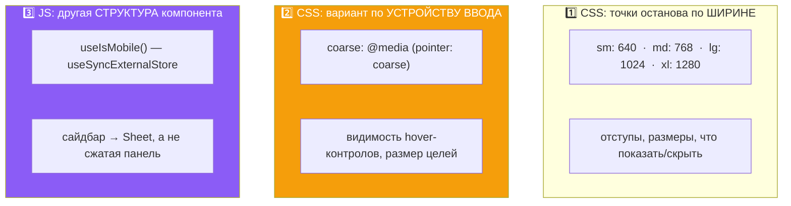
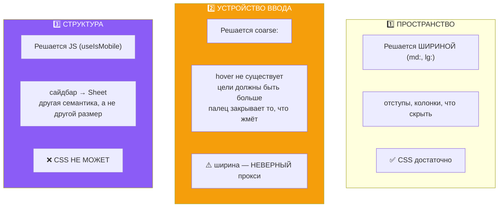
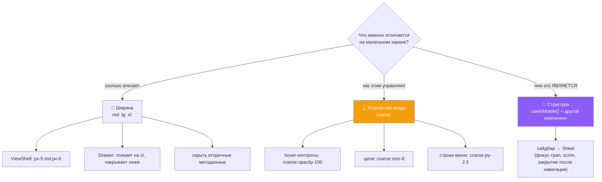

# 19 · Мобильная архитектура

[← 18 · Дизайн-система](18-design-system.md) · [Оглавление](README.md) · [Далее: 20 · Тестирование →](20-testing.md)

---

## 🧒 LEVEL 1

> Мобильный интерфейс — **не «десктоп поменьше»**. Это другой набор органов
> чувств.

| | 🖱 Мышь | 👆 Палец |
|---|---|---|
| Может «наводиться» | ✅ | ❌ **никогда** |
| Точность | 1 пиксель | ~10 мм подушечки |
| Видит, что под ним | ✅ курсор | ❌ **палец закрывает цель** |
| Может нажать правой | ✅ | ❌ |
| Экран | 1440px+ | 390px |

Главный вывод из первой строки:

> **Всё, что спрятано за hover, на телефоне не существует.**

Не «неудобно» — **не существует**. Нет события, которое бы это показало.

В Veylo за hover спрятано много: переименование карточки, меню карточки,
добавление/сворачивание колонки, меню колонки, действия строки списка, контролы
исполнителя и даты. На десктопе это правильно: контрол появляется, когда к нему
тянешься, и молчит, когда ты читаешь. На телефоне это было **полное
исчезновение управления колонками**.

---

## 👷 LEVEL 2 — Три механизма адаптивности

Veylo не «делает мобильную версию». Он использует **три разных механизма**, и
у каждого своя задача.



**Использование в цифрах** (посчитано по `src/components` и `src/pages`):

| Вариант | Применений |
|---|---|
| `md:` | 64 |
| **`coarse:`** | **50** |
| `sm:` | 34 |
| `lg:` | 11 |
| `xl:` | 6 |
| `max-md:` | 4 |

`coarse:` — второй по частоте. Это не вспомогательная мелочь, а один из
несущих механизмов.

---

### 1️⃣ Ширина — для раскладки

```tsx
// ViewShell.tsx
<div className="min-h-0 min-w-0 flex-1 px-5 pt-4 md:px-6">
```

> *«The gutter lives here rather than inside each view, so Board, List and
> everything after them align to one vertical line without each re-deciding it
> — and it is the **SAME** `px-5 md:px-6` the identity row and the toolbar use,
> which is what makes the three read as one surface rather than three stacked
> components.»*

Один отступ, объявленный в **одном** месте, применённый к трём строкам
интерфейса. Если бы каждое представление решало само, вертикальная линия
«поехала» бы при переключении вкладок.

```tsx
// Drawer.tsx
<div onClick={onClose} aria-hidden className="fixed inset-0 z-40 bg-black/40 xl:hidden" />
```

**Панель: толкает на `xl`, накрывает ниже.**

> *«On a wide screen the board keeps its context beside the panel, which is the
> behaviour the old right rail had and the reason **UX principle 1 ("board
> context is never lost")** holds. Below that width there is no room to push
> without squeezing the board into a gutter, so it covers with a scrim
> instead — which is also what makes a panel usable on a phone, where the rail
> simply vanished.»*

И затемнение **только там, где панель что-то накрывает**:

> *«At `xl` it sits beside the board and a scrim would dim a board still being
> read.»*

### 2️⃣ Устройство ввода — для аффордансов

```tsx
// TodoCard.tsx
<div className="coarse:opacity-100 -mr-1 flex shrink-0 items-center gap-0.5
                opacity-0 transition-opacity group-hover:opacity-100 focus-within:opacity-100">
```

Читается как правило из четырёх частей:
- по умолчанию прозрачно;
- видно при hover группы;
- видно при фокусе внутри (**клавиатура**);
- **всегда видно на сенсорном** (`coarse:`).

Второе применение — размер цели:

```tsx
// BoardsSection.tsx
className="hover:text-ink coarse:size-8 coarse:p-0 coarse:grid coarse:place-items-center
           shrink-0 rounded p-0.5 transition-colors duration-150"
```

`p-0.5` (2px) на мыши → `size-8` (32×32) на пальце.

```tsx
// dropdown-menu.tsx
className="… px-2 py-1.5 text-meta … coarse:py-2.5 …"
```

Строки меню становятся выше на сенсоре — 6px вертикального padding'а
превращаются в 10px.

⚠️ **Честная оценка:** WCAG 2.5.5 (Target Size, AAA) рекомендует **44×44**
CSS-пикселя. `size-8` = 32px, `size-9` = 36px. **До 44px эти цели не
дотягивают.** Это реальный пункт для следующей итерации доступности, и его
лучше назвать самому.

### 3️⃣ JS — когда нужна другая структура

```tsx
// sidebar.tsx
const { isMobile, state, openMobile, setOpenMobile } = useSidebar();

if (isMobile) {
  return (
    <Sheet open={openMobile} onOpenChange={setOpenMobile} {...props}>
      <SheetContent … />
    </Sheet>
  );
}
// ниже — обычный десктопный сайдбар
```

**Почему это не решается CSS.** Десктопный сайдбар и мобильный Sheet — **разные
компоненты** с разным поведением:

| | Десктоп | Мобильный Sheet |
|---|---|---|
| Позиция | в потоке, толкает контент | overlay поверх |
| Затемнение | нет | есть |
| Состояние | `open` (свёрнут/развёрнут) | `openMobile` (открыт/закрыт) |
| Закрытие по Escape | не нужно | нужно |
| Фокус-трап | нет | есть |
| Закрытие после навигации | нет | **да** |

CSS может спрятать и показать. Он не может сменить **семантику** — а Sheet это
диалог с фокус-трапом и модальным поведением.

Отсюда и два разных сеттера в `use-sidebar.ts`:

```ts
return isMobile ? setOpenMobile(open => !open) : setOpen(open => !open);
```

**Одна кнопка — два разных состояния**, потому что «свернуть сайдбар» и
«закрыть оверлей» — разные действия.

### `useIsMobile` — правильная реализация

```ts
const MOBILE_BREAKPOINT = 768;
const MOBILE_QUERY = `(max-width: ${MOBILE_BREAKPOINT - 1}px)`;

function subscribe(onStoreChange: () => void) {
  const mql = window.matchMedia(MOBILE_QUERY);
  mql.addEventListener("change", onStoreChange);
  return () => mql.removeEventListener("change", onStoreChange);
}

export function useIsMobile() {
  return React.useSyncExternalStore(
    subscribe,
    () => window.innerWidth < MOBILE_BREAKPOINT,   // снимок на клиенте
    () => false,                                   // снимок на сервере
  );
}
```

> *«The previous version subscribed in an effect and then called setState
> synchronously to seed the value — the cascading-render pattern the lint rule
> flags. This also removes **the one-frame flash of the desktop layout**,
> because the first render already reads the real width.»*

```
❌ useEffect + useState:              ✅ useSyncExternalStore:
   рендер 1: isMobile = false           рендер 1: isMobile = ПРАВДА
   → 👁 десктопная раскладка            → сразу верно
   effect → setState(true)
   рендер 2: isMobile = true
   → 👁 ВСПЫШКА неправильной вёрстки
```

---

## 📱 Как ведут себя главные экраны

### Kanban — горизонтальный скролл

```tsx
// KanbanBoard.tsx
<div className="min-h-0 flex-1 overflow-x-auto pb-4">

// KanbanColumn.tsx
className="rounded-surface border-hairline relative flex w-[288px] shrink-0 flex-col …"
```

**Колонки имеют фиксированную ширину 288px и `shrink-0`.**

```
Телефон 390px:            Десктоп 1440px:
┌──────────────┐          ┌──────────────────────────────────────────┐
│ To Do        │→ →       │ To Do   │ In Prog │ Review  │ Done   │   │
│ (288px)      │          │ (288)   │ (288)   │ (288)   │ (288)  │   │
│              │          │                                          │
└──────────────┘          └──────────────────────────────────────────┘
 скролл вбок               всё видно
```

**Почему не «одна колонка на весь экран со свайпом»** — вопрос честный, и ответ
в модели взаимодействия: карточку нужно **перетаскивать между колонками**. Если
видна одна колонка, целевой колонки на экране нет, и перетаскивание превращается
в «тащи к краю, жди автопрокрутки» — паттерн, который плохо работает пальцем.
288px при 390px экрана оставляют край соседней колонки видимым, и это подсказка,
что там что-то есть.

**Repository evidence:** `scroll-snap` в коде **нет**. Скролл свободный.

### Timeline — сетка скроллится целиком

```ts
export function trackMinWidth(count: number, scale: TimelineScale): string {
  return `calc(${RAIL_WIDTH} + ${count} * ${TICK_MIN[scale]})`;
}
export const TICK_MIN: Record<TimelineScale, string> = { weeks: "1.75rem", months: "2.5rem" };
```

```
42 колонки × 1.75rem = 73.5rem ≈ 1176px  +  рельс 240px  =  ~1416px минимум
```

На телефоне это **гарантированный горизонтальный скролл** — и он правильный:

> *«the track is `1fr` per column, so on a wide screen the columns stretch to
> fill and on a narrow one they hold this size and the whole grid scrolls as
> one. **Nothing reflows either way.**»*

Ключ — «as one»: рельс с названиями и полосы лежат в **одной** сетке, поэтому
при скролле они не рассинхронизируются.

### Панель детали задачи — модалка, а не drawer

Решение M17, зафиксированное в `BoardPage`:

> *«The task detail used to win this slot and **reserve 22rem of every wide
> screen** for a surface that is open a fraction of the time; it is a modal
> now, so nothing but an open board drawer ever takes width from the board.»*

И следствие для мобильного: модалка одинаково работает на любой ширине, тогда
как drawer на 390px забрал бы весь экран, оставив от доски полоску.

---

## 🏛 LEVEL 3

### Почему мобильный — не «десктоп поменьше»: три класса различий



**Ошибка большинства проектов — решать всё три через первый механизм.**
Результат: `max-md:` вокруг hover-контролов (ломает iPad и узкое окно
десктопа) и CSS-трюки вместо смены компонента (Sheet без фокус-трапа).

### Почему `pointer: coarse` честнее ширины — таблица истинности

| Устройство | Ширина | Мышь | `coarse:` даёт | `max-md:` дал бы |
|---|---|---|---|---|
| iPhone 390px | < 768 | ❌ | ✅ показать | ✅ показать |
| iPad 1024px | > 768 | ❌ | ✅ показать | ❌ **скрыть** 💥 |
| Узкое окно десктопа 700px | < 768 | ✅ | ❌ hover | ✅ **показать** 💥 |
| Ноутбук 1440px | > 768 | ✅ | ❌ hover | ❌ hover |
| Ноутбук с тачскрином | > 768 | ✅+👆 | зависит от primary pointer | ❌ hover |

Две ячейки с 💥 — это реальные пользователи, которым `max-md:` сделал бы хуже.

**Про последнюю строку честно:** гибридное устройство (ноутбук с тачскрином)
`pointer: coarse` тоже не решает идеально — медиазапрос отвечает про
**основное** устройство ввода. Полное решение — `@media (any-pointer: coarse)`
или отслеживание последнего использованного ввода. **Repository evidence:** в
Veylo используется `pointer: coarse`, то есть основное устройство.

### Что явно НЕ сделано — и это записано

Из M9-07 (мобильная раскладка) и общего состояния:

| Не сделано | Значение |
|---|---|
| Цели касания < 44px | `size-8` = 32, `size-9` = 36. WCAG 2.5.5 AAA не выполнен |
| Фокус-трап в `Drawer` | *«Focus trapping is deliberately not attempted here. Escape closes, and the full keyboard treatment — trap, restore, `aria-modal` semantics — belongs to M9-02 alongside the board's own accessibility pass, which will do it once for every overlay rather than once per component»* |
| Свайп-жесты | нет |
| `scroll-snap` для колонок | нет |
| PWA / офлайн | нет манифеста, нет service worker |
| Мобильное перетаскивание проверено | 🔶 «browser verification owed» по M17/M19/M20 |

**Про фокус-трап важно понимать логику отказа:** это не «забыли», а «делать
один раз для всех оверлеев, а не по разу на компонент». Реализация в `Drawer`
означала бы вторую реализацию в `Modal`, третью в `Sheet` — и они разошлись бы.

**Про перетаскивание на телефоне.** `PointerSensor` из `@dnd-kit` работает с
`pointerdown`/`pointermove`, то есть **технически** сенсор поддерживается. Но:

```ts
useSensor(PointerSensor, { activationConstraint: { distance: 8 } })
```

Порог по **расстоянию**, а не по времени. На сенсорном экране это конфликтует со
скроллом: 8px движения пальцем при попытке прокрутить список может начать драг.
Обычное решение — `activationConstraint: { delay: 250, tolerance: 5 }` для
сенсора (long-press начинает драг, короткое движение прокручивает).

**Repository evidence: такой отдельной сенсорной конфигурации в
`useKanbanDnd.ts` нет.** Это конкретный, называемый пункт для мобильной
доработки — и хороший ответ на «что бы вы улучшили».

### Порядок токенов ввода в компоненте

Обрати внимание на порядок в классе:

```tsx
"coarse:opacity-100 opacity-0 group-hover:opacity-100 focus-visible:opacity-100"
```

Порядок в строке **не** определяет победителя — это делает специфичность
Tailwind и `tailwind-merge`. Но читается он как приоритет намерения:

1. `coarse:` — устройство ввода (самое сильное утверждение);
2. `opacity-0` — база;
3. `group-hover:` — мышь;
4. `focus-visible:` — клавиатура.

**Три способа ввода покрыты явно.** Это то, что отличает доступный интерфейс от
«работает мышью».

---

## 📊 Карта решений



---

## 🧪 Мини-квиз

<details>
<summary><b>1.</b> Почему мобильный интерфейс — не «десктоп поменьше»?</summary>

Потому что различий три класса, и только один — про размер. **Пространство**
решается шириной. **Устройство ввода** решается `coarse:`: hover не существует
вообще, поэтому всё спрятанное за ним исчезает, а цели должны быть больше.
**Структура** решается JS: сайдбар на телефоне — это Sheet с фокус-трапом и
scrim'ом, то есть другая семантика, а не другой размер. CSS третий класс не
решает.
</details>

<details>
<summary><b>2.</b> iPad 1024px. Покажет ли <code>coarse:</code> hover-контролы? А <code>max-md:</code>?</summary>

`coarse:` — **да**: у устройства палец, `(pointer: coarse)` истинно. `max-md:`
— **нет**: 1024 > 768, и контролы остались бы невидимыми на устройстве, где
hover физически невозможен. Ровно поэтому Veylo ключуется на устройство ввода,
а не на ширину.
</details>

<details>
<summary><b>3.</b> Почему сайдбар на мобильном — <code>Sheet</code>, а не CSS-сжатие?</summary>

Потому что различается **семантика**, а не размер. Sheet — модальный оверлей с
scrim'ом, фокус-трапом, закрытием по Escape и закрытием после навигации.
Десктопный сайдбар — элемент в потоке, который толкает контент, без модального
поведения. CSS умеет прятать и показывать; сменить компонент на модальный
диалог он не может. Отсюда и два разных состояния: `open` против `openMobile`.
</details>

<details>
<summary><b>4.</b> Почему <code>useIsMobile</code> использует <code>useSyncExternalStore</code>?</summary>

Потому что `window.matchMedia` — внешнее хранилище. Классический
`useEffect + useState` даёт лишний рендер и **один кадр десктопной вёрстки** на
телефоне: первый рендер вернул бы `false`, эффект исправил бы это вторым
рендером. `useSyncExternalStore` читает реальную ширину **уже на первом
рендере**, и лишнего рендера нет.
</details>

<details>
<summary><b>5.</b> Колонки Kanban — <code>w-[288px] shrink-0</code>. Почему не «одна колонка на весь экран»?</summary>

Потому что карточку нужно перетаскивать **между** колонками. Если видна одна,
целевой колонки на экране нет, и жест вырождается в «тащи к краю и жди
автопрокрутки» — плохо работающий пальцем паттерн. 288px при экране 390px
оставляют край соседней колонки видимым, что само по себе подсказывает
направление скролла.
</details>

<details>
<summary><b>6.</b> Почему в <code>Drawer</code> нет фокус-трапа, и почему это не «забыли»?</summary>

Потому что клавиатурная обработка оверлеев (трап, возврат фокуса, семантика
`aria-modal`) должна быть реализована **один раз для всех оверлеев**, а не по
разу на компонент. Реализация здесь означала бы вторую в `Modal`, третью в
`Sheet`, и они разошлись бы. Это записано как задача M9-02. Escape при этом
закрывает — и делает это, уступая тому, что сверху: `if (e.key === "Escape" &&
!e.defaultPrevented)`.
</details>

<details>
<summary><b>7. Predict:</b> пользователь на телефоне пытается прокрутить колонку, задев карточку. Что произойдёт?</summary>

Есть риск, что начнётся **драг вместо скролла**: `PointerSensor` настроен с
`activationConstraint: { distance: 8 }`, то есть 8 пикселей движения запускают
перетаскивание, а прокрутка пальцем эти 8 пикселей проходит мгновенно. Обычное
решение — отдельный touch-сенсор с `{ delay: 250, tolerance: 5 }`, чтобы драг
начинался long-press'ом. **Такой конфигурации в `useKanbanDnd.ts` нет** — это
конкретный пункт мобильной доработки.
</details>

<details>
<summary><b>8.</b> Соответствуют ли цели касания в Veylo рекомендациям WCAG?</summary>

**Нет.** WCAG 2.5.5 (AAA) рекомендует 44×44 CSS-пикселя. `coarse:size-8` даёт
32px, `coarse:size-9` — 36px. Улучшение относительно `p-0.5` (≈2px + иконка)
огромное, но до планки не дотягивает. Это честный пункт следующей итерации
доступности.
</details>

---

[← 18 · Дизайн-система](18-design-system.md) · [Оглавление](README.md) · [Далее: 20 · Тестирование →](20-testing.md)
