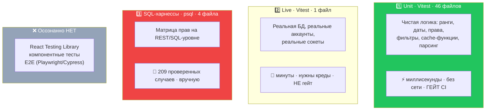

# 20 · Тестирование

[← 19 · Мобильная архитектура](19-mobile.md) · [Оглавление](README.md) · [Далее: 21 · Миграции →](21-migrations.md)

---

## 🧒 LEVEL 1

> Тест — это **вопрос, который ты задаёшь коду один раз, а он отвечает вечно**.

Без теста ты проверяешь руками. Один раз. Потом кто-то (или ты через месяц)
меняет соседнюю строку, и ответ тихо становится другим. Никто не заметит, пока
это не увидит пользователь.

Правило, которому следует Veylo:

> **Тестируй там, где ломается тихо.**

```
🔴 Ломается ТИХО                      🟢 Ломается ГРОМКО
   • арифметика рангов                   • опечатка в имени компонента
   • «строго ниже своего ранга»           • сломанный импорт
   • граница «до/после полуночи»          • неверный тип
   • отказ RLS (пустой результат!)        → это ловят tsc и eslint
   • off-by-one в индексе дропа
   → нужен ТЕСТ
```

---

## 👷 LEVEL 2 — Три уровня, три инструмента



### Что покрыто unit-тестами

46 файлов `*.test.ts`, **всегда рядом с предметом**:

| Область | Тесты |
|---|---|
| **Порядок** | `utils/rank.test.ts`, `todos/dropIndex.test.ts`, `todos/insertDense.test.ts` |
| **Кэш** | `todos/cache.test.ts`, `columns/cache.test.ts`, `comments/cache.test.ts` |
| **Права** | `members/permissions.test.ts` |
| **Даты** | `utils/dueDate.test.ts`, `utils/calendarGrid.test.ts`, `views/calendar.test.ts`, `views/timeline.test.ts`, `views/timelineDrag.test.ts`, `utils/relativeTime.test.ts` |
| **Представления** | `views/registry.test.ts`, `views/scope.test.ts`, `views/summary.test.ts`, `views/trends.test.ts`, `todos/view.test.ts`, `todos/filterOptions.test.ts` |
| **Идентичность** | `utils/username.test.ts`, `utils/identifier.test.ts`, `utils/uuid.test.ts`, `utils/taskKey.test.ts` |
| **Безопасность** | `utils/nextPath.test.ts`, `utils/validation.test.ts` |
| **Фичи** | `forYou/feed.test.ts`, `forYou/viewed.test.ts`, `notifications/notifications.test.ts`, `invites/inviteError.test.ts`, `invites/inviteLink.test.ts`, `activities/activityText.test.ts`, `activities/activityGroups.test.ts`, `spaces/groupBoards.test.ts`, `boards/deleteConfirm.test.ts`, `comments/commentDraft.test.ts`, `todos/taskDraft.test.ts`, `todos/toCardContent.test.ts`, `columns/limitBreach.test.ts` |
| **Инфраструктура** | `queryClient/retryPolicy.test.ts`, `realtime/events.test.ts`, `realtime/presence.test.ts`, `todos/todoApi.test.ts` |
| **A11y / DnD** | `hooks/keyboardDrag.test.ts`, `hooks/dragAnnouncements.test.ts` |
| **Константы** | `constants/priorities.test.ts`, `constants/workTypes.test.ts` |

**Закономерность:** тестируется то, что можно вызвать функцией. Ни один тест не
рендерит компонент.

### Конфигурация — два файла, не один флаг

```ts
// vitest.config.ts — ГЕЙТ
export default defineConfig({
  resolve: { alias: { "@": path.resolve(__dirname, "./src") } },
  test: {
    include: ["src/**/*.test.ts"],
    exclude: ["**/node_modules/**", "**/dist/**", "src/**/*.live.test.ts"],
    environment: "node",     // ⬅️ НЕ jsdom
  },
});
```

Три решения в десяти строках:

1. **Standalone, а не `test`-блок в `vite.config.ts`:**
   > *«these tests are pure TypeScript, so they need neither the React plugin
   > nor Tailwind. Only the `@` alias is shared, and it is repeated rather than
   > imported so loading this config does not pull in the whole build
   > pipeline.»*

2. **`environment: "node"`, не `jsdom`:**
   > *«nothing here touches the DOM»*
   jsdom стоит времени старта и памяти на **каждый** запуск.

3. **Live-тесты исключены явно:**
   > *«`*.live.test.ts` opens real sockets to the linked project and takes
   > minutes. It is a real suite with real assertions… but it is not a gate,
   > and **a gate that needs credentials and a network stops being run**.»*

### 🔥 Тесты типизируются `tsc -b` — и это редко

```jsonc
// tsconfig.app.json
// *.test.ts is deliberately not excluded. The old *.check.ts files had to be,
// because they imported `node:assert` and this config pins `types` to
// vite/client. Vitest tests import from "vitest" instead, so `tsc -b` can
// typecheck them — which means a test that no longer matches its subject's
// types FAILS THE BUILD, not just the test run.
"include": ["src", ...]
```

**Что это даёт:**

```
Ты переименовал поле Todo.due_date → Todo.deadline
   ↓
❌ Обычный проект: тест компилируется (any / устаревшие типы),
   падает на ассерте, ты чинишь тест — и не знаешь, сколько ещё мест сломано
   ↓
✅ Veylo: `npm run build` падает НА КОМПИЛЯЦИИ,
   перечисляя каждое место — включая тесты
```

Тест, разошедшийся с предметом, — **ошибка сборки**, а не красный прогон.

---

## 🔴 Live-suite — единственный тест против реальной БД

`src/services/auth/username.live.test.ts` — проверка гонки за username из
[главы 10](10-usernames.md).

```ts
// vitest.live.config.ts
function serviceRoleKey(): string {
  const raw = execFileSync("npx",
    ["--no-install", "supabase", "projects", "api-keys", "--project-ref", PROJECT_REF],
    { encoding: "utf8", shell: true });
  const { keys } = JSON.parse(raw) as { keys: { id: string; api_key: string }[] };
  const key = keys.find(k => k.id === "service_role")?.api_key;
  if (!key) throw new Error("No service_role key from the Supabase CLI. Run `npx supabase login` first.");
  return key;
}

export default defineConfig({
  test: {
    include: ["src/**/*.live.test.ts"],
    env: { VEYLO_SERVICE_ROLE_KEY: serviceRoleKey() },   // ⬅️ БЕЗ префикса VITE_
    fileParallelism: false,
    testTimeout: 180_000,
  },
});
```

### 🔒 Как service-role ключ не попадает в бандл

> *«**It is fetched rather than stored, and that is the point.** A service-role
> key in `.env` is a key on disk in a repo, one `git add -f` away from being
> published, and it would sit beside two values that are **meant** to ship to
> the browser. Read on demand it exists only for the length of this process, and
> only for someone whose CLI is already logged in to the project.»*

```
❌ .env:  VEYLO_SERVICE_ROLE_KEY=eyJhb…
   → лежит на диске
   → рядом с VITE_* переменными, которые СПЕЦИАЛЬНО уезжают в браузер
   → один `git add -f` от публикации

✅ Читается CLI в момент запуска конфига
   → живёт только в памяти процесса
   → БЕЗ префикса VITE_ → Vite физически не может его инлайнить
   → работает только у того, кто уже залогинен в CLI
```

### Почему два конфига, а не флаг

> *«an env variable would have to be set differently on Windows and on CI, and a
> `describe.skipIf` would report the live checks as **passing-because-skipped**,
> which is the one thing M6-12's evidence must never do.»*

Разница между «прошло» и «пропущено» — принципиальная. Пропущенный тест,
показанный зелёным, хуже отсутствующего.

### Как выглядит live-тест

```ts
async function register(tag: string, username: string) {
  const email = `m10.${tag}.${STAMP}${TEST_EMAIL_DOMAIN}`;
  const { data, error } = await admin.auth.admin.createUser({
    email, password: PASSWORD, email_confirm: true,
    user_metadata: { username },              // ⬅️ тот же канал, что у формы
  });
  createdUsers.push(data.user!.id);           // ⬅️ для очистки в afterAll
  const client = anonClient(tag);             // ⬅️ ОТДЕЛЬНЫЙ клиент на участника
  await client.auth.signInWithPassword({ email, password: PASSWORD });
  ...
}
```

Три приёма, которые стоит забрать себе:

| Приём | Зачем |
|---|---|
| `STAMP = Date.now().toString(36)` в каждом имени | параллельные и повторные прогоны не сталкиваются |
| отдельный `createClient` с уникальным `storageKey` | два «пользователя» в одном процессе не делят сессию |
| `createdUsers[]` + очистка в `afterAll` | тест не оставляет мусора в живой БД |
| `fileParallelism: false` | *«the peers share one board and the order they touch it is the scenario»* |

---

## 🔐 SQL-харнессы — как доказывают безопасность

Четыре файла в `scripts/`, запускаются вручную через `psql`:

| Файл | Что доказывает | Результат |
|---|---|---|
| `verify-m3-14-membership.sql` | матрица мутаций членства | **67/67** |
| `verify-m3-15-owner-immutability.sql` | инварианты I1–I5 | **37/37** |
| `verify-m3-16-role-matrix.sql` | полная матрица ролей | **105/105** |
| `verify-m4-invites.sql` | жизненный цикл приглашений | ✅ |

Плюс `dev-seed-perf-board.sql` — генератор большой доски для замеров.

### Почему это SQL, а не Vitest

**Правило доказательства** (Enforcement rule 7):

> *«**Proof is REST-level.** A UI check proves nothing about a policy, because
> the UI never asks for rows it does not expect. Role tests use direct
> PostgREST/RPC calls with a real token for that role.»*

Разберём подробно, потому что это главная мысль главы:

```
UI-тест «viewer не видит кнопку удаления»
   ↓ доказывает: кнопка скрыта
   ✅ проверил permissions.ts
   ❌ НЕ проверил RLS

   Если политику удалить целиком, тест ОСТАНЕТСЯ ЗЕЛЁНЫМ.
   Потому что UI всё равно не отправит запрос.
```

```
SQL-тест «viewer выполняет DELETE FROM todos»
   ↓ доказывает: база отказала
   ✅ проверил РЕАЛЬНУЮ границу
```

### Как харнесс работает без JWT на каждую роль

Из шапки `verify-m3-16-role-matrix.sql`:

> *«`auth.uid()` reads the `request.jwt.claims` GUC that PostgREST sets from the
> verified token, and a session can set that GUC directly. Each case also does
> `set local role authenticated`, so **table privileges are exercised alongside
> the policies — a denial that came from a missing GRANT rather than from RLS
> still shows up**.»*

Два шага на каждый случай:

```sql
set local request.jwt.claims = '{"sub":"<uuid участника>"}';  -- кто я
set local role authenticated;                                  -- какая роль в PG
-- ...выполнить операцию, записать результат
```

Второй шаг существенен: без `set local role` тест выполнялся бы как суперюзер,
у которого **и RLS обойдена, и все гранты есть**. То есть проверял бы ничего.

### Безопасность запуска

> *«It ends in ROLLBACK. Nothing it creates survives, so it is **safe against
> the linked project as well as a replica**.»*

Весь харнесс — одна транзакция, завершающаяся откатом. Он создаёт пользователей,
доски, задачи, пытается их сломать и **не оставляет следа**.

### Форма проверки отказа — критична

Из Appendix C плана:

```
read denial:  ожидаем []       — НЕ строки
write denial: ожидаем 42501    — ИЛИ 0 строк затронуто
RPC denial:   ожидаем собственную ошибку функции
```

**Почему это отдельно записано:** `USING` фильтрует **молча**. Тест вида
«операция не упала» прошёл бы и при полностью открытой политике. Нужно
проверять **конкретную форму отказа**.

### Что харнесс НЕ доказывает

В шапке файла есть раздел «WHAT THIS DOES *NOT* PROVE» — и это признак зрелого
теста. Он честно перечисляет свои границы, а не притворяется полным.

---

## 🏛 LEVEL 3

### Почему нет React Testing Library — разбор решения

Из `CLAUDE.md`:

> *«No React Testing Library, deliberately: **pure logic is where the risk is**,
> and component tests nobody needs are a maintenance cost. Revisit if a
> component grows logic worth pinning down.»*

| | Компонентные тесты | Тесты чистой логики (выбрано) |
|---|---|---|
| Что ломается тихо | редко | **часто** |
| Хрупкость к рефакторингу | высокая (селекторы, разметка) | низкая (сигнатуры) |
| Скорость | 100–500 мс на тест | < 1 мс |
| Нужен jsdom | ✅ | ❌ |
| Ловит `off-by-one` | нет | **да** |
| Ловит «кнопка не отрисовалась» | да | нет |

**Ключевой аргумент:** архитектура Veylo вынесла всю логику **из** компонентов.
`TodoCard` — чистый рендер. `permissions.ts` — чистые функции.
`rank.ts` — арифметика. Компонент, из которого убрали логику, — это разметка, и
тестировать её значит тестировать JSX.

**И условие пересмотра записано:** «if a component grows logic worth pinning
down». То есть это не догма, а решение с триггером.

**Честная цена.** Не ловятся:
- компонент перестал рендериться после смены props;
- обработчик отвалился;
- ошибка доступности в разметке;
- регрессия вёрстки.

Отсюда «browser verification owed» у M17/M19/M20 в плане: ручная проверка
**записана как невыполненная**, а не замолчана.

### Почему нет E2E

**Repository evidence:** Playwright/Cypress в `package.json` **отсутствуют**.

Что бы дал E2E: полные journey из [главы 25](25-user-journeys.md) — регистрация
→ подтверждение → создание доски → перетаскивание → приглашение.

Что он стоит: инфраструктура (браузеры в CI), нестабильность (flaky-тесты),
время (минуты на прогон), тестовые данные, и — самое дорогое — **поддержка**:
каждое изменение UI ломает селекторы.

Для одного разработчика соотношение неочевидно. Для команды E2E на 3–5
критических сценариев — первое, что стоило бы добавить.

### CI — три команды, ни одной лишней

```yaml
- run: npm ci
- run: npm run lint
- run: npm run build     # ⬅️ tsc -b: ЕДИНСТВЕННЫЙ typecheck
- run: npm test
```

Два комментария в самом workflow:

> *«`tsc -b` is the only typecheck in this project; the dev server passing means
> nothing. It now covers `*.test.ts` too, so a test that drifts from its
> subject's types fails here. **No Supabase credentials are needed** — the env
> vars are inlined by Vite and their absence is a runtime throw, not a build
> error.»*

> *«One line rather than one per file: adding a test no longer means remembering
> to add it here.»*

**Второй пункт — про дисциплину.** Раньше CI перечислял файлы; новый тест мог не
попасть в список, и никто бы не заметил. `npm test` берёт всё по маске.

**Первый — про архитектуру.** CI не нужны креды Supabase, потому что переменные
инлайнятся Vite'ом и их отсутствие — ошибка **времени выполнения**, а не
сборки. Значит, форк может собрать проект, не имея доступа к базе.

### История: почему Vitest, а не самодельные проверки

Из `CLAUDE.md`:

> *«**Vitest is the only test mechanism** — the `*.check.ts` +
> `node --experimental-strip-types` self-checks are gone, ported to `*.test.ts`
> siblings. **Two ways to run tests meant two things to remember**; there is one
> now, and CI runs `npm test` rather than enumerating files.»*

Раньше было: `*.check.ts` файлы с `node:assert`, запускаемые вручную через
экспериментальный флаг Node. Проблемы:
- их приходилось **исключать** из `tsconfig.app.json` (импортировали
  `node:assert`, а `types` пришпилен к `vite/client`) → **не типизировались**;
- CI перечислял их по одному;
- два способа запускать тесты = два способа забыть.

Миграция на Vitest (M1-17) решила все три разом — и попутно **включила
типизацию тестов**, что и дало главное свойство «тест ломает сборку».

### Что тестируется в самих тестах: примеры формулировок

Хороший тест **объясняет, почему он существует**. Из `rank.test.ts`:

```ts
it("falls back to position when a rank is missing", () => {
  // The state between the migration and the backfill, and the state of a row
  // written by an older client. It must sort where it belongs rather than
  // jumping to the front, which is what a `?? 0` would have done.
  const rows = [row(3072), row(null, 2), row(1024)];
  expect(rows.slice().sort(byRank).map(r => r.rank)).toEqual([1024, null, 3072]);
});

it("puts the two scales in the same space", () => {
  // position 2 is what the backfill would have written as 2 * RANK_GAP, so a
  // mixed column is correctly ordered rather than merely not crashing.
  expect(byRank(row(null, 2), row(2 * RANK_GAP))).toBe(0);
});
```

Заметь формулировку: **«correctly ordered rather than merely not crashing»**.
Тест проверяет **правильность**, а не отсутствие исключения.

И самый ценный тест проекта — инвариант, а не поведение:

```ts
// views/registry.test.ts
// «asserts that exactly one view reorders, so adding a second is a failing
//  test rather than a discovery in production»
```

Это тест не функции, а **архитектурного правила**.

### Пирамида Veylo — и почему она перевёрнута наоборот

```
Классическая пирамида:              Veylo:
       ╱╲  E2E (мало)                    ────────  SQL-харнессы (209 случаев)
      ╱  ╲                                  ╲    ╱   вручную, но исчерпывающе
     ╱    ╲ Integration                      ╲  ╱
    ╱______╲                                  ╲╱  live (1)
   ╱________╲ Unit (много)              ────────  Unit (46) — гейт CI
```

Veylo вкладывается на **двух концах**: быстрые unit-тесты чистой логики (гейт) и
исчерпывающая проверка **границы безопасности** (вручную, но 209 случаев).
Середина — интеграционные и компонентные — сознательно пуста, потому что
архитектура вынесла логику из компонентов и туда нечего тестировать.

**Это защитимая позиция**, если её сформулировать именно так, а не как «мы не
пишем тесты на UI».

---

## 🧪 Мини-квиз

<details>
<summary><b>1.</b> Почему тесты безопасности обходят UI?</summary>

Потому что UI **никогда не отправляет запрос, который не ожидает пройти**.
Тест «viewer не видит кнопку» доказывает, что кнопка скрыта, — и останется
зелёным, даже если удалить политику целиком. Настоящее доказательство — прямой
запрос на REST/SQL-уровне с реальным токеном роли и проверка **конкретной формы
отказа**: `[]` для чтения, `42501` или 0 строк для записи.
</details>

<details>
<summary><b>2.</b> Почему <code>*.test.ts</code> НЕ исключены из <code>tsconfig.app.json</code>?</summary>

Чтобы `tsc -b` их типизировал. Тогда тест, разошедшийся с типами своего
предмета, **ломает сборку**, а не просто краснеет в прогоне. Старые `*.check.ts`
приходилось исключать — они импортировали `node:assert`, а `types` пришпилен к
`vite/client`. Vitest импортирует из `"vitest"`, поэтому исключение перестало
быть нужным.
</details>

<details>
<summary><b>3.</b> Почему live-тесты вынесены во второй конфиг, а не спрятаны за флагом?</summary>

Env-переменную пришлось бы задавать по-разному на Windows и в CI, а
`describe.skipIf` показал бы live-проверки **зелёными потому, что пропущены** —
именно то, чем доказательство никогда не должно быть. Отдельный конфиг делает
разницу между «прошло» и «не запускалось» видимой.
</details>

<details>
<summary><b>4.</b> Как service-role ключ не попадает в бандл?</summary>

Двумя способами сразу. Он **не хранится**: `vitest.live.config.ts` достаёт его
через Supabase CLI в момент загрузки конфига, и живёт он только в памяти
процесса. И он передаётся как `VEYLO_SERVICE_ROLE_KEY` — **без** префикса
`VITE_`, поэтому Vite физически не может его заинлайнить. Работает только у
того, кто уже залогинен в CLI.
</details>

<details>
<summary><b>5.</b> Почему в SQL-харнессе есть <code>set local role authenticated</code>?</summary>

Чтобы проверялись **и политики, и гранты**. Без этого тест выполнялся бы как
суперюзер, у которого RLS обойдена и все привилегии есть, — то есть проверял бы
ничего. С этой строкой отказ, вызванный отсутствующим `GRANT`, а не RLS, тоже
проявится.
</details>

<details>
<summary><b>6.</b> Почему нет React Testing Library, и что вернуло бы её?</summary>

Потому что вся логика вынесена **из** компонентов: `TodoCard` — чистый рендер,
`permissions.ts` — чистые функции, `rank.ts` — арифметика. Тестировать
компонент без логики — значит тестировать JSX, ценой хрупких селекторов и jsdom.
Условие пересмотра записано в `CLAUDE.md`: «if a component grows logic worth
pinning down». Честная цена — не ловятся регрессии рендера и доступности,
отсюда «browser verification owed» в плане.
</details>

<details>
<summary><b>7. Predict:</b> добавили <code>canReorder: true</code> второму представлению. Что произойдёт?</summary>

**Упадёт `views/registry.test.ts`** — он утверждает, что ровно одно
представление меняет порядок. Это тест не функции, а **архитектурного правила**:
второй писатель порядка означал бы два представления, перенумеровывающих одну
колонку из двух устаревших снимков. Инвариант защищён автоматикой, а не
комментарием.
</details>

<details>
<summary><b>8.</b> Почему CI не нужны креды Supabase?</summary>

Потому что `VITE_*` переменные инлайнятся Vite'ом на этапе сборки, и их
отсутствие — это `throw` **времени выполнения** в `services/api/supabase.ts`, а
не ошибка компиляции. `tsc -b` и `vite build` проходят без них, а unit-тесты
сети не касаются вообще. Следствие: форк собирается без доступа к базе.
</details>

---

[← 19 · Мобильная архитектура](19-mobile.md) · [Оглавление](README.md) · [Далее: 21 · Миграции →](21-migrations.md)
