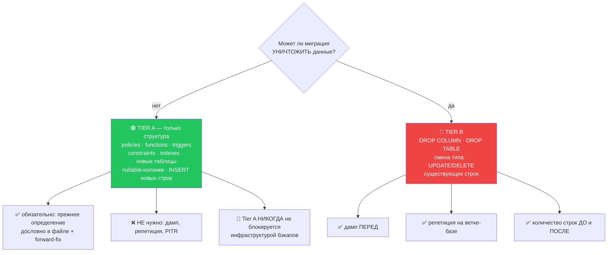

# 21 · Миграции

[← 20 · Тестирование](20-testing.md) · [Оглавление](README.md) · [Далее: 22 · Обработка ошибок →](22-errors.md)

---

## 🧒 LEVEL 1

> Миграция — это **строительная бригада, которая перестраивает дом, пока в нём
> живут люди**.

Отсюда все правила:

- **Нельзя снести стену раньше, чем построена новая.** Иначе крыша упадёт на
  жильцов.
- **Нельзя «отменить» перестройку.** Можно только перестроить обратно — новой
  работой.
- **Сначала пристрой, потом перевези вещи, потом сноси старое.** Три отдельных
  дня, а не один.
- **Перед сносом сделай фотографии.** Если что-то пропадёт, ты хотя бы знаешь,
  что там было.

И главное:

> **Схема, изменённая в панели администратора, — это изменение, которого не
> существует.**

Потому что его нет в репозитории, значит его нельзя повторить на новой базе,
значит новый разработчик получит **другую** базу.

---

## 👷 LEVEL 2 — Как это устроено в Veylo

### Команды

```bash
npm run db:diff -- -f <name>   # захватить локальные изменения в новую миграцию
npm run db:push                # применить непринятые миграции к связанному проекту
npm run db:pull                # забрать удалённые изменения, о которых CLI не знает
npm run db:types               # перегенерировать src/types/database.ts
```

⚠️ **`db:pull`, `db:diff` и `db:dump` требуют запущенного Docker Desktop** — они
поднимают локальную теневую базу для сравнения. `db:push` и `db:types` — нет.

### Анатомия файла

```
supabase/migrations/20260814092000_accept_invite_rpc.sql
                    └──────┬─────┘ └────────┬─────────┘
                    YYYYMMDDHHMMSS      описание
                    ⬆️ ЭТО и есть версия. Порядок = сортировка имён.
```

Всего **58 миграций**, с `20260804000000_baseline_schema.sql` по
`20260824120000_default_space_name.sql`.

### 🔑 Три нерушимых правила

#### Правило 1 — только через CLI

> *«The two existing migrations were applied by hand in the Supabase SQL editor.
> That stops with M0-05. From then on: write the migration file →
> `supabase db push` → commit. **No SQL editor, no exceptions. A schema change
> made in the dashboard is a schema change that does not exist.**»*

#### Правило 2 — forward-only

**`supabase migration down` не существует.** «Откат» всегда означает одно из:

| Способ | Когда | Цена |
|---|---|---|
| **Forward-fix миграция** | 🟢 практически всегда | бесплатно |
| Восстановление из дампа | потеря данных | простой |
| PITR | — | **недоступен** (не оплачен) |

> *«**This is the default and it is what you will use essentially always.** It
> is also free, which is why it is the backbone of this project's recovery
> story.»*

Чтобы forward-fix был копипастой, каждая Tier A миграция **записывает прежнее
определение дословно в своём же файле**:

```sql
-- Прежнее определение, для forward-fix:
--   create or replace function public.accessible_board_ids()
--   returns setof uuid language sql stable security definer
--   as $$ select b.id from public.boards b where b.owner_id = auth.uid(); $$;

create or replace function public.accessible_board_ids() ...
```

Откат — это скопировать закомментированный блок в новый файл.

#### Правило 3 — Expand → Backfill → Contract

**Никогда в одной миграции.**


| Фаза | Обратима? | Риск |
|---|---|---|
| **Expand** | да, тривиально | 🟢 SAFE |
| **Backfill** | да, данные добавляются | 🔴 **HIGH — здесь теряются данные** |
| **Contract** | только вперёд | 🔴 HIGH |

**Ключ — окно между Backfill и Contract:**

> *«Deploy the application code that reads the new shape **between** Backfill and
> Contract. That way there is a window where both shapes are valid and **a bad
> deploy is a revert, not an incident**.»*

Реальный пример из Veylo — ранги (M6-A):

```
1. 20260814120000_add_rank_columns.sql   EXPAND    (rank nullable)
2. 20260814121000_backfill_ranks.sql     BACKFILL  (position * 1024)
3. …код читает по rank, byRank падает на position…
4. M6-05 «drop position»                 CONTRACT  ❌ ЕЩЁ НЕ СДЕЛАНО
```

Третий шаг — почему `byRank` содержит fallback:

```ts
function rankOf(row: Ranked): number {
  return row.rank ?? (row.position ?? 0) * RANK_GAP;
}
```

Строка, записанная старым клиентом или прочитанная **между** миграцией и
backfill'ом, сортируется правильно. **Это и есть окно совместимости в коде.**

### Два уровня риска — Tier A и Tier B

Правило 6 плана — вклад, который стоит забрать в свои проекты:



**Почему это ценно:** без разделения любая миграция требовала бы полной
процедуры, и создание политики стоило бы столько же, сколько удаление колонки.
Результат — либо всё тормозит, либо процедуру перестают соблюдать вообще.

> *«Rehearsing a `create policy` costs an afternoon and **proves nothing that
> the migration's own verification block does not**.»*

---

## 📜 Хронология: 58 миграций как история продукта

```mermaid
timeline
    title Эволюция схемы Veylo
    section M0 — Фундамент (04–05 авг)
        baseline_schema · column_category · column_limits · rls_policies : 4 миграции
    section M2 — Доски (06–07 авг)
        create_boards · add_board_id · task_fields · timestamps · indexes : EXPAND
        provision_new_user · backfill_personal_boards : BACKFILL
        board_id_constraints · rls_board_ownership : CONTRACT
        🔴 drop_user_id · todos_uuid · drop_completed : TIER B
        board_task_keys : KAN-N
    section M3 — Роли (10–11 авг)
        create_board_members · membership_helpers · индекс : 3
        backfill_owner_memberships · boards_rls · columns_todos_rls : 3
        membership_roster · membership_mutations : RPC
        🔒 owner_immutability · settings_by_role · same_board FK : инварианты
    section M4 — Приглашения (14 авг)
        create_board_invites · create_invite · accept_invite : 3
        🐛 fix_accept_invite_ambiguity : инцидент 42702
    section M14–M15 — Пространства (14 авг)
        board_key_prefix · avatar_storage · handle_new_user_search_path
        create_spaces · add_rank_columns · backfill_ranks · rebalance
    section M18–M20 — Представления (15–18 авг)
        create_activities · activity_field_events
        todos_start_date · realtime_publication
        create_comments · realtime_comments
    section M22–M23 — Идентичность (19–24 авг)
        email_invites_stage1 · provision_on_confirmation
        username_helpers · backfill_usernames · username_rules
        login_email_for · create_notifications · decline_invite
        unfiled_space · default_space_name
```



**Что видно из этой картины:**

1. **M2 — образцовый expand→backfill→contract.** Девять миграций подряд,
   разложенных по фазам.
2. **Три Tier B подряд** (`drop_user_id`, `todos_uuid`, `drop_completed`) — и
   именно после них появилась дисциплина тиров.
3. **Fix-миграция сразу после фичи** (`fix_accept_invite_ambiguity`) — след
   реального инцидента.
4. **Backfill всегда отдельным файлом** (`backfill_personal_boards`,
   `backfill_ranks`, `backfill_usernames`).

### Разбор одной опасной миграции

`20260807190600_todos_uuid.sql` — смена типа первичного ключа. **Tier B,
BREAKING.**

Шапка перечисляет **три** причины, а не одну:

> *«1. Optimistic inserts had to mint a fake id with `Date.now()`… which is why
> the row needed an `isOptimistic` flag. 2. Sequential ids **leak the total row
> count**. 3. Under M6 realtime, a client-generated uuid makes echo suppression
> an identity match instead of bespoke de-duplication.»*

**Преflight-проверка — приём, который стоит скопировать:**

```sql
do $$
declare refs text;
begin
  select string_agg(conrelid::regclass::text || '.' || conname, ', ')
  into refs from pg_constraint
  where contype = 'f' and confrelid = 'public.todos'::regclass;

  if refs is not null then
    raise exception
      'M2-14: foreign keys still reference todos.id: %. Swap them in this '
      'same transaction or this migration is not safe.', refs;
  end if;
end $$;
```

**Миграция проверяет собственные предпосылки и отказывается выполняться, если
они не держатся.** Не «надеюсь, никто не добавил FK» — а «убедись и упади с
внятным сообщением».

И объяснение тайминга:

> *«This is precisely why the plan puts this task in M2. Once M7 adds
> `comments.todo_id`, **every referencing table needs the same swap in the same
> transaction** and this stops being a twenty-line migration.»*

Смена типа PK **дешевеет тем раньше, чем меньше на него ссылок**. Отложить —
значит заплатить в разы больше.

**И отказ от «страховочной» колонки:**

> *«**NO `legacy_id`.** The plan offers one to keep `KAN-{id}` stable… but M2-21
> lands immediately after this and replaces that label with a per-board key.
> Preserving the integer would mean carrying a column **whose only reader is
> deleted in the next migration**.»*

Отказ от страховки, которая никому не пригодится, — тоже решение, и оно
записано.

### Транзакционность

```sql
-- The whole swap runs in one transaction — the CLI wraps each migration in one,
-- which is why there is no explicit begin/commit here. A partial primary-key
-- swap leaves the table unusable, so it either completes or it does not.
```

**Supabase CLI оборачивает каждую миграцию в транзакцию.** Значит:
- ✅ частичного применения не бывает;
- ⚠️ но `CREATE INDEX CONCURRENTLY` **не работает** внутри транзакции —
  для больших таблиц это ограничение придётся обходить.

---

## 🏛 LEVEL 3

### Почему `docs/DATABASE.md` описывает таблицы, которых нет

`attachments`, `labels`, `todo_labels` описаны как поля и связи — **и их нет в
схеме**. Это не ошибка документа: он изначально писался как **проектный
документ**, а не как отражение схемы.

**Урок для собеседования:** документ, смешивающий «что есть» и «что
планируется», перестаёт быть надёжным ни для того, ни для другого.
`docs/IMPLEMENTATION_PLAN.md` решает это статусными маркерами (✅ / 🔶 / ⬜ / ◑ /
🗺) — у него **у каждой строки** есть состояние. У `DATABASE.md` — нет.

### Две миграции, применённые «мимо» Git

История зафиксирована в плане, и её стоит уметь пересказать:

**Инцидент 1 — две первые миграции применены руками в SQL-редакторе.**

Последствие: схема существовала в БД, но не в репозитории. Новый клон
воспроизвёл бы **другую** базу. Устранено M0-05: захвачен
`20260804000000_baseline_schema.sql`, введено правило «только CLI».

**Инцидент 2 — M3-05 применена до коммита.**

> *«The M3-05 migration was applied to the linked project **before it was
> committed**. **That gap is now closed** — committed as `3c3eec8`, and
> `supabase migration list` shows all 23 versions paired local↔remote. **Git
> and the database agree.**»*

Опасность окна: если бы в этот момент кто-то склонировал репозиторий и
применил миграции, он получил бы базу **без** политик M3-05 — то есть с другой
моделью безопасности.

**Как это проверяют:**

```bash
supabase migration list
# показывает Local ↔ Remote попарно; расхождение видно сразу
```

Это **однострочная проверка целостности**, и её стоит делать привычкой.

**Третий, честный пункт:**

> *«**Standing note — M3-01 → M3-05 were applied without a dump.** Docker and a
> direct database connection were unavailable in that session. All five were
> additive or policy-only and were reversible by forward-fix, which is exactly
> the Tier A case Rule 6 now describes. **Recorded for accuracy; no longer
> treated as a process failure.**»*

Обрати внимание на формулировку: событие **зафиксировано**, потом
**переклассифицировано** после введения тиров. Это то, как выглядит зрелый
инженерный журнал — а не «замяли».

### Почему PITR выключен — решение с посчитанной ценой

> *«Enabling PITR requires the Pro plan plus a Small compute add-on plus the
> add-on itself — **roughly $125/month, uncapped by the spend cap** — to insure
> a fixture dataset. That is not a sensible trade for this project today.»*

Из-за этого:

> *«The practical consequence is narrow: **a migration that destroys data needs
> a dump taken beforehand.** Migrations that only change structure do not,
> because forward-fix SQL reverses them completely.»*

Именно это и породило разделение на тиры. **Ограничение бюджета превратилось в
инженерную дисциплину.**

Процедура для Tier B:

```bash
supabase db dump --linked -f backups/pre-<task-id>-$(date +%Y%m%d-%H%M).sql
# 1. подтвердить, что дамп непустой и содержит нужные таблицы
# 2. записать количество строк по каждой затронутой таблице в описание PR
```

`backups/` — **в `.gitignore`**: дампы содержат данные пользователей.

⚠️ И честная оговорка: *«Verifying the dump actually restores into a scratch
database is the stronger check and is deferred (PH-02). For a fixture dataset,
a non-empty dump plus forward-fix SQL is proportionate.»*
**Непроверенный дамп — это не бэкап, это надежда.** Проект это знает и
записал.

### Что не сделано: `todos.status` / `previous_status`

Мёртвые колонки. Ни одного читателя — их нет даже в `TODO_FIELDS`.
Удаление — задача M14, статус:

> *«**Outstanding: the Tier B drop of `todos.status` / `previous_status`**,
> blocked on the Rule 6 backup procedure.»*

**Заблокировано процедурой, а не забыто.** И это правильный порядок: колонка,
которую никто не читает, стоит немного места; неправильно выполненный `DROP
COLUMN` без дампа стоит данных.

То же с `todos.position` (M6-05): Tier B, ждёт «отлёжки».

### Генерация типов — обязательный шаг после миграции

```bash
npm run db:types   # supabase gen types typescript --linked > src/types/database.ts
```

**Забыть — значит получить рассинхрон в самом опасном месте:**

```
Миграция добавила колонку → типы не перегенерены
   ↓
TypeScript не знает о колонке
   ↓
supabase.from("todos").select("new_col")  →  ошибка компиляции ✅ (поймали)

Миграция УДАЛИЛА колонку → типы не перегенерены
   ↓
TypeScript всё ещё её знает
   ↓
код компилируется, PostgREST отвечает 400 в рантайме  💥 (не поймали)
```

Вторая половина опаснее: ошибка уезжает в продакшн.

⚠️ **Repository evidence:** проверки «типы соответствуют схеме» в CI **нет**.
Это ручная дисциплина, и её стоило бы автоматизировать — регенерировать в CI и
падать при непустом `git diff`.

### Правила из Code Review Checklist, касающиеся миграций

- [ ] Любая новая таблица имеет **включённую RLS и хотя бы одну политику — в
      той же миграции**.
- [ ] Новые `SECURITY DEFINER` функции — `STABLE` где возможно и с явным
      `search_path`.
- [ ] Ни одна колонка владения не присылается клиентом там, где сработал бы
      DB-default.
- [ ] Новых INSERT/UPDATE/DELETE политик на `board_members` не добавлено.
- [ ] Изменение соответствует матрицам Permission Model — **или** секция
      обновлена в том же PR с причиной.

**Первый пункт — самый важный.** Таблица с включённой RLS и без политики
недоступна вообще; таблица **без** RLS доступна **всем**. Разница между
«ничего не работает» и «утечка» — одна строка `enable row level security`, и
она обязана быть в том же файле, что и `create table`.

### Порядок применения имеет значение

```sql
-- create_notifications.sql
create table public.notifications (
  type text not null check (type in ('invite', 'assigned'))
);
-- ...потом триггеры, которые пишут эти типы
```

Если бы триггер применился **раньше** CHECK'а с нужным типом, он падал бы с
`23514` — и падал бы **внутри** вставки в `board_invites`, то есть ломал бы
приглашения целиком.

Правило из таблицы «When to create which»:
- **RLS-политика** — в том же коммите, что таблица, **никогда не позже**;
- **`SECURITY DEFINER` функция** — **до** политик, которые её вызывают;
- **привилегированная RPC** — прочитана построчно **до** применения.

---

## 📋 Чеклист: как написать миграцию в Veylo

```
1. Классифицируй: Tier A или Tier B?  → напиши это в описании PR
2. Tier B? → дамп + количество строк ДО
3. Один файл = одна фаза (expand ИЛИ backfill ИЛИ contract)
4. Захвати прежнее определение ДОСЛОВНО в комментарии (forward-fix)
5. Новая таблица? → enable RLS + минимум одна политика В ЭТОМ ЖЕ ФАЙЛЕ
6. SECURITY DEFINER? → set search_path = '' + собственная проверка прав
                       + revoke from public, anon
7. Преflight-блок, если у миграции есть предпосылки
8. npm run db:push
9. npm run db:types           ⬅️ НЕ ЗАБЫТЬ
10. npm run build             ⬅️ ловит рассинхрон типов
11. supabase migration list   ⬅️ local ↔ remote должны совпадать
12. Коммит миграции И перегенерированных типов ВМЕСТЕ
```

---

## 🧪 Мини-квиз

<details>
<summary><b>1.</b> Почему изменение схемы через панель Supabase «не существует»?</summary>

Потому что его нет в репозитории. Значит, оно не воспроизводится на чистой базе,
и следующий клон получит **другую** схему. Дальше расходятся типы, тесты и
поведение — и никто не знает, какая база «правильная». Правило 1: миграции живут
в Git и применяются только CLI.
</details>

<details>
<summary><b>2.</b> Что означает Tier A / Tier B и зачем разделение?</summary>

Tier A — только структура (policies, functions, triggers, constraints, indexes,
новые таблицы, nullable-колонки): **не может потерять данные**, нужен лишь
захват прежнего определения для forward-fix. Tier B — `DROP COLUMN`, смена типа,
`UPDATE`/`DELETE` существующих строк: **может**, нужны дамп, репетиция и подсчёт
строк. Без разделения создание политики стоило бы столько же, сколько удаление
колонки, и процедуру просто перестали бы соблюдать.
</details>

<details>
<summary><b>3.</b> Почему expand, backfill и contract — три отдельные миграции?</summary>

Чтобы между backfill и contract существовало **окно, в котором валидны обе
формы**. В этом окне деплоится код, читающий новую форму, и плохой деплой
становится **откатом кода**, а не инцидентом с данными. В одной миграции такого
окна нет: старый код ломается в тот же момент, когда исчезает старая колонка.
</details>

<details>
<summary><b>4.</b> Как в Veylo делается «rollback», если <code>migration down</code> нет?</summary>

Forward-fix: новая миграция, отменяющая изменение. Чтобы это была копипаста, а
не археология, каждая Tier A миграция **записывает прежнее определение дословно
в своём же файле**. Для потери данных — восстановление из дампа (PITR
недоступен: ~$125/мес ради фикстур, отложено в Part V).
</details>

<details>
<summary><b>5.</b> Что делает преflight-блок в <code>todos_uuid.sql</code> и почему это важно?</summary>

Проверяет `pg_constraint` и падает с внятным сообщением, если на `todos.id` ещё
ссылается хоть один внешний ключ. Миграция **проверяет собственные предпосылки**
вместо надежды на то, что они держатся. Плюс шапка объясняет тайминг: как только
M7 добавит `comments.todo_id`, тот же обмен придётся делать для каждой
ссылающейся таблицы в одной транзакции, и двадцатистрочная миграция перестанет
быть двадцатистрочной.
</details>

<details>
<summary><b>6.</b> Почему <code>byRank</code> содержит fallback на <code>position</code>?</summary>

Это **окно совместимости** между backfill и contract, выраженное в коде. Строка,
записанная старым клиентом или прочитанная между миграцией и backfill'ом, имеет
`rank = null`. Fallback `position * RANK_GAP` вычисляет ровно то, что записал бы
backfill, поэтому смешанная колонка сортируется **правильно**, а не просто «не
падает». Fallback уйдёт вместе с M6-05.
</details>

<details>
<summary><b>7. Predict:</b> вы применили миграцию, удаляющую колонку, но забыли <code>npm run db:types</code>. Что произойдёт?</summary>

Сборка **пройдёт**: TypeScript всё ещё «знает» колонку из устаревшего
`database.ts`. Ошибка проявится **в рантайме** — PostgREST вернёт 400 на запрос
несуществующей колонки. Обратный случай (добавили колонку, не перегенерили)
безопаснее: он ломает **компиляцию**. Проверки «типы = схема» в CI нет — это
ручная дисциплина, и её стоило бы автоматизировать.
</details>

<details>
<summary><b>8.</b> Почему RLS-политика обязана быть в том же файле, что <code>create table</code>?</summary>

Потому что таблица **без** RLS доступна всем, а с включённой RLS и без политик —
никому. Первое — утечка, второе — «ничего не работает». Между `create table` и
отдельной миграцией с политикой существует окно, в котором таблица открыта.
Один файл окно закрывает.
</details>

---

[← 20 · Тестирование](20-testing.md) · [Оглавление](README.md) · [Далее: 22 · Обработка ошибок →](22-errors.md)
