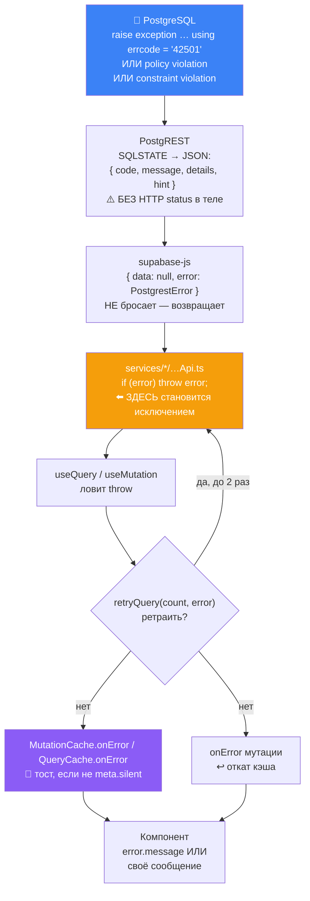

# 22 · Обработка ошибок

[← 21 · Миграции](21-migrations.md) · [Оглавление](README.md) · [Далее: 23 · Производительность →](23-performance.md)

---

## 🧒 LEVEL 1

> Ошибка — это **сообщение, которому нужно доехать до нужного человека**.

Есть три адресата, и им нужны **разные** сообщения:

| Кому | Что нужно | Пример |
|---|---|---|
| 👤 **Пользователю** | что делать дальше | «Приглашение истекло. Попросите новое.» |
| 🧑‍💻 **Разработчику** | что именно сломалось | `42702 ambiguous column reference "board_id"` |
| 🤖 **Коду** | повторять или нет | `42501` → нет смысла, `08006` → попробуй ещё |

Самая частая ошибка в проектировании ошибок — **дать всем троим одно и то же
сообщение**. Тогда либо пользователь видит SQLSTATE, либо разработчик видит
«что-то пошло не так» и не может ничего починить.

Ровно это и случилось в Veylo однажды — история ниже.

---

## 👷 LEVEL 2 — Путь ошибки через все слои



### Шаг 1 — Postgres порождает ошибку тремя способами

| Способ | Пример | SQLSTATE |
|---|---|---|
| **Явный `raise`** в RPC | `raise exception 'invitation has expired' using errcode = '22023'` | тот, что указали |
| **Нарушение constraint** | `todos_date_range_check`, `profiles_username_lower_key` | `23514`, `23505` |
| **Нарушение политики** (`WITH CHECK`) | insert на чужую доску | `42501` |
| **Молчаливый отказ** (`USING`) | select чужой строки | ❗ **никакого** — просто 0 строк |

Последняя строка — источник почти всех загадок при отладке. См.
[главу 29](29-debugging.md).

### Шаг 2 — 🔥 Supabase сообщает об ошибках в ДВУХ разных формах

**Это то, из-за чего существует `retryPolicy.ts`, и это спрашивают на
собеседовании.**

```ts
// Auth, Storage, Edge Functions:
{ status: 401, message: "Invalid login credentials", name: "AuthApiError" }
//  ⬆️ есть HTTP status

// PostgREST:
{ code: "42501", message: "new row violates row-level security policy",
  details: null, hint: null }
//  ⬆️ status НЕТ ВООБЩЕ, только code
```

Комментарий в `retryPolicy.ts`:

> *«PostgREST errors carry **no status at all** — only `code`, either a PostgREST
> code (`PGRST301`) or a five-character SQLSTATE (`42501`). **A predicate that
> read only `status` would never fire for the permission denial this exists to
> catch**, which is the whole point.»*

Поэтому предикат читает **обе** формы:

```ts
export function isRetryableError(error: unknown): boolean {
  const status = statusOf(error);
  if (status !== null) {
    if ([408, 429].includes(status)) return true;
    return status >= 500;
  }

  const code = codeOf(error);
  if (code === null) return true;                       // голый TypeError = сеть
  if (["40001", "40P01"].includes(code)) return true;   // serialization / deadlock

  return code.length === 5 && ["08","53","57","58"].includes(code.slice(0, 2));
}
```

И даже `statusOf` знает про третью форму:

```ts
// Storage reports its status as a string.
if (typeof statusCode === "string" && /^\d+$/.test(statusCode)) return Number(statusCode);
```

### Шаг 3 — сервисный слой превращает результат в исключение

```ts
export async function fetchTodos(boardId: string) {
  const { data, error } = await supabase.from("todos").select(...)...;
  if (error) throw error;      // ⬅️ ЕДИНОЕ правило всего слоя
  return data;
}
```

**`supabase-js` не бросает — он возвращает `{ data, error }`.** Сервисный слой
превращает это в исключение, потому что дальше живёт TanStack Query, а он
работает с промисами: `reject` = ошибка, `resolve` = успех.

Если бы `{ data: null, error }` уходило в хук как **успех**, `useQuery` считал бы
запрос выполненным и положил бы `null` в кэш.

### Шаг 4 — глобальные обработчики

```ts
const mutationCache = new MutationCache({
  onError: (error, _v, _c, mutation) => {
    if (mutation.meta?.silent) return;
    toast.error(messageOf(error));
  },
});

const queryCache = new QueryCache({
  onError: (error, query) => {
    if (query.meta?.silent) return;
    if (query.state.data === undefined) return;   // 🔑 первая загрузка — не тостим
    toast.error(messageOf(error));
  },
});
```

**Почему это существует** — цитата, которую стоит помнить дословно:

> *«**Not one mutation surfaced a failure before this**, so a rejected write and
> a successful one looked identical — **an RLS policy could deny every insert
> and the only symptom would be cards that vanish on refresh.**»*

Это идеальная история для собеседования: **отказ в доступе выглядел как успех**,
а симптом проявлялся только после F5.

**Асимметрия query/mutation:**

| | Мутация | Запрос |
|---|---|---|
| Тостим всегда? | ✅ да (кроме `silent`) | ❌ только если данные **уже** на экране |
| Почему | пользователь совершил действие и ждёт ответа | первая загрузка уже отрисована компонентом |

> *«A first load that fails is already rendered by the component holding the
> query… **A refetch that fails when data is already on screen is the silent
> case**: the board keeps showing stale rows with no other signal.»*

### Шаг 5 — типизированный opt-out

```ts
type ErrorMeta = { silent?: boolean };

declare module "@tanstack/react-query" {
  interface Register {
    mutationMeta: ErrorMeta;
    queryMeta: ErrorMeta;
  }
}
```

⚠️ **Тонкость, из-за которой это `type`, а не `interface`:**

> *«TanStack's `Register` only adopts a meta type that satisfies
> `Record<string, unknown>`, and **an interface has no implicit index
> signature** — declaring this as an interface would fall back to untyped meta
> **without any error to say so**.»*

Кто отказывается от тоста и почему:

```ts
// useLogin — форма рисует ошибку рядом с полями
meta: { silent: true },

// useNotifications — «the panel renders its own failure, so the global toast
// would say the same thing again in the corner»
meta: { silent: true },

// useUnreadCount — «this one runs on every page for every signed-in user,
// so a toast here would follow them around the product»
meta: { silent: true },
```

### Шаг 6 — `messageOf`: как достать текст

```ts
function messageOf(error: unknown): string {
  if (error instanceof Error && error.message) return error.message;

  if (typeof error === "object" && error !== null) {
    const { message } = error as { message?: unknown };
    if (typeof message === "string" && message) return message;
  }

  return "Something went wrong. Please try again.";
}
```

Три ветки, потому что `unknown` — честный тип для ошибки: бросить можно **что
угодно**, включая строку, число и `undefined`.

---

## 🎯 Пять примеров из реального кода

### 1 · SQLSTATE → человеческий текст (приглашения)

```ts
const MESSAGES: Record<string, string> = {
  "28000": "Please sign in to accept this invitation.",
  P0002:   "This invitation link is not valid. It may have been revoked.",
  "22023": "This invitation link has expired. Ask for a new one.",
  "23505": "This invitation has already been used.",
  "42501": "This invitation cannot be accepted.",
};

export function inviteErrorMessage(error: unknown): string {
  if (typeof error === "object" && error !== null) {
    const { code } = error as { code?: unknown };
    if (typeof code === "string" && code in MESSAGES) return MESSAGES[code];
  }

  console.error("[invite] unmapped acceptance failure:", error);   // ⬅️ 🔑
  return FALLBACK;
}
```

**🔥 История, которая породила эту строку `console.error`:**

> *«An unmapped code is a bug in the RPC, not a bad invitation… **`accept_invite`
> shipped raising 42702 on EVERY call, and the only symptom anywhere was this
> sentence, with the SQLSTATE discarded here.**»*

```
`42702` = ambiguous_column
   ↓
Функция была сломана ПОЛНОСТЬЮ — падала на каждом вызове
   ↓
Пользователь видел: «Не удалось принять приглашение. Попробуйте ещё раз.»
   ↓
Разработчик видел: ТО ЖЕ САМОЕ
   ↓
Диагноз занял на порядок больше времени, чем должен был
```

Исправление — коммит `159869a` + миграция
`20260814093000_fix_accept_invite_ambiguity.sql`.

**Правило, которое из этого следует:**

> Обобщённое сообщение для пользователя — правильно.
> **Проглоченный код ошибки — нет.**
> Ветка fallback обязана логировать оригинал.

### 2 · Ошибка отрисовки — `ErrorBoundary`

```tsx
export default class ErrorBoundary extends Component<Props, State> {
  static getDerivedStateFromError(error: Error): State { return { error }; }
  reset = () => this.setState({ error: null });
  render() {
    const { error } = this.state;
    if (!error) return this.props.children;
    if (this.props.fallback) return this.props.fallback(error, this.reset);
    return <ErrorPanel error={error} onRetry={this.reset} />;
  }
}
```

**Два уровня установки:**

```
Route errorElement (RouteErrorPage)     ← внешняя сеть: вся страница
  └─ ErrorBoundary вокруг списка карточек КАЖДОЙ колонки
       └─ одна битая карточка стоит одного списка, а не доски
```

Из `CLAUDE.md`: *«wraps each column's card list so one bad card costs that list
and nothing else»*.

**Чего Error Boundary НЕ ловит** (частый вопрос):

| Не ловит | Что вместо |
|---|---|
| ошибки в `onClick` и других обработчиках | try/catch или `onError` мутации |
| асинхронные (`setTimeout`, промисы) | `.catch()` |
| ошибки самого boundary | внешний boundary |
| ошибки сети в запросах | `QueryCache.onError` |

### 3 · Откат кэша при неудачной мутации

```ts
onError: (_err, _vars, context) => {
  if (!context) return;

  if (context.previousTodos) {
    queryClient.setQueryData(queryKeys.todos(boardId), context.previousTodos);
    return;
  }

  // Восстанавливать нечего: setQueryData(key, undefined) — это NO-OP,
  // значит оптимистичный порядок пережил бы провал.
  queryClient.removeQueries({ queryKey: queryKeys.todos(boardId), exact: true });
},
```

**Вторая ветка — самая недооценённая строчка в проекте.**

```
❌ Наивно:
   queryClient.setQueryData(key, context?.previousTodos)
   → если previousTodos === undefined, это NO-OP
   → карточка ОСТАЁТСЯ на новом месте, хотя сервер отказал
   → пользователь думает, что получилось

✅ Как есть:
   removeQueries → запись кэша удалена → useTodos перезагружает правду
```

И `onError` **не** тостит — это делает `MutationCache`:

> *«Restore only. The message comes from the MutationCache handler in
> `queryClient.ts`; a toast here as well would report one failure twice.»*

### 4 · Ошибка, которая **не должна** быть фатальной

```ts
// authApi.signIn
const { error: provisionError } = await supabase.rpc("provision_new_user");

if (provisionError) {
  console.warn("provision_new_user failed on sign-in", provisionError);
}
```

> *«Not fatal: **a user who cannot be provisioned should still get into the app
> and see the empty-board state, rather than being unable to sign in at all.**»*

Сравни с соседней строкой в той же функции:

```ts
const { data: resolved, error: resolveError } = await supabase.rpc("login_email_for", ...);
if (resolveError) throw resolveError;      // ⬅️ БРОСАЕТ
```

> *«A failure here is the function being absent (the migration has not been
> applied) or unreachable. **Reporting it as bad credentials would send someone
> to reset a password that is perfectly fine**, so it surfaces.»*

**Две RPC подряд, два противоположных решения — и каждое обосновано вопросом
«что произойдёт с пользователем, если проглотить эту ошибку».**

| Ошибка | Проглотить? | Что будет, если решить наоборот |
|---|---|---|
| `provision_new_user` упала | ✅ да, `console.warn` | человек **не сможет войти** из-за проблемы, не связанной со входом |
| `login_email_for` упала | ❌ нет, `throw` | человек пойдёт **сбрасывать нормальный пароль** |

### 5 · Валидация форм — до сети

```ts
// utils/validation.ts
const EMAIL_SHAPE = /^[^\s@]+@[^\s@]+\.[^\s@]+$/;
```

> *«**Deliberately loose:** something, an @, something, a dot, something.
> Stricter patterns reject addresses that are perfectly valid, **which is a
> worse failure than letting a typo through to a server that will catch it**.»*

```ts
export function validatePassword(password: string): string | undefined {
  // Not trimmed: leading and trailing spaces are part of a password, and
  // silently dropping them would reject the credentials the user registered with.
  ...
}
```

Две тонкости, обе про **направление ошибки**:
- слишком строгий email отвергает **валидного** пользователя (ложноположительное
  срабатывание — хуже);
- `trim()` пароля молча меняет то, что человек ввёл, — и он не сможет войти с
  паролем, которым **зарегистрировался**.

```ts
export function validateIdentifier(value: string): string | undefined {
  ...
  // A username typed at the login form is checked for shape only. It is
  // deliberately NOT checked for existence — that answer belongs to the server,
  // and asking here would build the enumeration oracle the RPC avoids.
}
```

**Валидация формы — не место для проверки существования.** Это создало бы
именно тот оракул перечисления аккаунтов, который [глава 10](10-usernames.md)
старательно закрывает.

---

## 🏛 LEVEL 3

### Таблица: какая ошибка куда и почему

| Класс | Источник | Ретрай | Тост | Откат | Показ пользователю |
|---|---|---|---|---|---|
| **Сеть** (`TypeError`) | fetch | ✅ ×2 | ✅ | ✅ | «Что-то пошло не так» |
| **5xx** | сервер | ✅ ×2 | ✅ | ✅ | сообщение сервера |
| **408 / 429** | сервер | ✅ ×2 | ✅ | ✅ | сообщение сервера |
| **`42501`** RLS | политика | ❌ | ✅ | ✅ | сообщение политики |
| **`23505`** unique | constraint | ❌ | ✅ | ✅ | зависит от места |
| **`23514`** check | constraint | ❌ | ✅ | ✅ | сообщение constraint |
| **`23503`** FK | constraint | ❌ | ✅ | ✅ | — |
| **`PGRST301`** JWT expired | PostgREST | ❌ | ✅ | ✅ | ведёт к разлогину |
| **`40001` / `40P01`** | конкуренция | ✅ ×2 | если исчерпан | ✅ | — |
| **RPC `raise`** | функция | ❌ | зависит | ✅ | **сообщение функции** |
| **Ошибка рендера** | React | — | ❌ | — | `ErrorBoundary` |
| **Ошибка валидации** | клиент | — | ❌ | — | рядом с полем |
| **Молчаливый `USING`** | RLS | — | ❌ | — | ❗ **пустой список** |

**Последняя строка — самая коварная.** Отказ `USING` не является ошибкой ни на
одном уровне: PostgREST вернёт `200 []`. Пользователь увидит **пустую доску**.

### Как RPC делает свои сообщения полезными

```sql
raise exception 'only an admin or the owner may invite people'
  using errcode = '42501';
```

**Два уровня в одной строке:**

| Часть | Кому |
|---|---|
| текст сообщения | 👤 пользователю (доезжает через `error.message` до тоста) |
| `errcode` | 🤖 коду (`retryPolicy` решает не повторять; `inviteErrorMessage` мапит в свой текст) |

`errcode` **выбирается осмысленно**, а не берётся дефолтный `P0001`:

| Код | Значение | Где используется |
|---|---|---|
| `28000` | invalid_authorization_specification | нет сессии |
| `42501` | insufficient_privilege | нет прав |
| `22023` | invalid_parameter_value | истекло, неизвестная роль |
| `23505` | unique_violation | уже использовано |
| `P0002` | no_data_found | не найдено |

Благодаря этому клиент может маппить **по коду**, а не по тексту сообщения —
текст можно переводить и менять, код стабилен.

### Тосты: почему очередь, а не один

```ts
const DURATION = 5000;
const MAX_VISIBLE = 3;

push: (variant, message) => {
  const id = nextId++;
  set(state => ({ toasts: [...state.toasts, { id, variant, message }].slice(-MAX_VISIBLE) }));
  // A toast dropped by the cap above is already gone; dismissing it later is
  // a no-op, so the timer needs no cancelling.
  setTimeout(() => get().dismiss(id), DURATION);
},
```

Три решения:
- **`slice(-MAX_VISIBLE)`** — при каскаде ошибок экран не заливается;
- **таймер не отменяется** — `dismiss` для уже удалённого тоста это no-op,
  значит бухгалтерия отмены не нужна;
- **Zustand, а не Context** — писать в очередь нужно из `MutationCache.onError`,
  а это **не компонент**, и хука там нет.

### Три вопроса, на которые отвечает каждая ошибка

Практический чеклист при написании нового пути ошибки:

```
1. Может ли ПОВТОР это исправить?
   → определяет retry (retryPolicy)

2. Знает ли пользователь, что он что-то сделал?
   → мутация: да → тост
   → первая загрузка: нет → рендерит компонент
   → refetch: нет → тост (иначе тихо)

3. Может ли пользователь ЧТО-ТО СДЕЛАТЬ по этому поводу?
   → да  → конкретное сообщение («истекло, попросите новое»)
   → нет → обобщённое + console.error с оригиналом
```

Третий вопрос — тот, который проваливают чаще всего. Обобщённое сообщение
**без** логирования оригинала — это ровно баг `42702`, повторённый заново.

### Чего в системе ошибок нет

| Нет | Значение |
|---|---|
| Sentry / трекинг ошибок | ошибки продакшена **никто не видит**, кроме консоли пользователя |
| Error ID / correlation id | пользователь не может сослаться на конкретный случай |
| Экспоненциальный backoff | TanStack ретраит с дефолтной задержкой |
| Офлайн-режим | сеть пропала — все запросы падают |
| Локализация сообщений об ошибках | i18n есть, но сообщения ошибок английские |

**Repository evidence:** ничего из этого в репозитории нет. Для портфолио-проекта
соразмерно; **Sentry — первое, что стоит добавить при реальных пользователях**,
потому что сейчас единственный источник информации об ошибке — рассказ
пользователя.

Это опять же честный пункт: с `console.error` в fallback-ветках инженер **может**
диагностировать проблему, но только если сидит рядом.

---

## 🧪 Мини-квиз

<details>
<summary><b>1.</b> Почему <code>retryPolicy</code> читает и <code>status</code>, и <code>code</code>?</summary>

Потому что Supabase сообщает об ошибках в **двух формах**. Auth, Storage и Edge
Functions несут HTTP `status`. PostgREST — **не несёт статуса вообще**, только
`code` (`PGRST301` или SQLSTATE вроде `42501`). Предикат, читающий только
`status`, никогда не сработал бы для отказа доступа — то есть ровно для того
случая, ради которого он написан.
</details>

<details>
<summary><b>2.</b> Почему провал первой загрузки не тостится, а провал refetch — тостится?</summary>

Провал первой загрузки **уже отрисован** компонентом, который держит запрос
(`KanbanBoard` показывает `error.message`). Тост повторил бы то же самое. Провал
refetch'а — **тихий** случай: на экране уже есть данные, доска продолжает
показывать устаревшее и ничем об этом не сигналит. Проверка
`if (query.state.data === undefined) return;` различает эти два случая.
</details>

<details>
<summary><b>3.</b> Зачем <code>console.error</code> в fallback-ветке <code>inviteErrorMessage</code>?</summary>

Потому что необработанный код — **баг RPC, а не плохое приглашение**, и он
обязан попасть в лог. Это уже стоило инцидента: `accept_invite` уехала в релиз,
бросая `42702` (`ambiguous_column`) на **каждом** вызове, а единственным
симптомом было вежливое обобщённое сообщение — SQLSTATE отбрасывался в этой
самой ветке. Полностью сломанная функция выглядела как «неудачная попытка».
</details>

<details>
<summary><b>4.</b> Почему <code>onError</code> в <code>useTodoDrop</code> вызывает <code>removeQueries</code>, если снимка нет?</summary>

Потому что `setQueryData(key, undefined)` — это **no-op**, и оптимистичный
порядок пережил бы провал: карточка осталась бы на новом месте, хотя сервер
отказал. Удаление записи кэша заставляет `useTodos` перезагрузить правду.
</details>

<details>
<summary><b>5.</b> <code>signIn</code> вызывает две RPC подряд: одна бросает, другая нет. Почему?</summary>

Разный ответ на вопрос «что произойдёт с пользователем, если проглотить».
`login_email_for` упала — значит функции нет или она недоступна; сообщить об
этом как о неверных учётных данных означало бы отправить человека **сбрасывать
нормальный пароль**. `provision_new_user` упала — это не про вход; проглотить
правильно, иначе человек не сможет войти из-за проблемы, ко входу отношения не
имеющей, а провижининг идемпотентен и починится в следующий раз.
</details>

<details>
<summary><b>6.</b> Почему <code>ErrorMeta</code> объявлен как <code>type</code>, а не <code>interface</code>?</summary>

Потому что `Register` у TanStack принимает только тип, удовлетворяющий
`Record<string, unknown>`, а у **интерфейса нет неявной индексной сигнатуры**.
Объявление интерфейсом молча откатилось бы на нетипизированный `meta` — **без
единой ошибки, которая бы об этом сказала**.
</details>

<details>
<summary><b>7. Predict:</b> RLS-политика SELECT отвергает все строки. Что увидит пользователь?</summary>

**Пустую доску и никакой ошибки.** Отказ `USING` фильтрует **молча**: PostgREST
вернёт `200 []`, ошибки нет ни на одном слое, тоста нет, ретрая нет. Это самый
коварный класс сбоя в системе, и именно поэтому SQL-харнессы проверяют
конкретную форму отказа (`[]`, а не «не упало»).
</details>

<details>
<summary><b>8.</b> Почему <code>EMAIL_SHAPE</code> намеренно нестрогий?</summary>

Потому что направление ошибки важнее её частоты. Строгий паттерн отвергает
**валидные** адреса — то есть блокирует реального пользователя. Нестрогий
пропускает опечатку на сервер, который её поймает. Первое — хуже. По той же
логике пароль не проходит `trim()`: пробелы по краям — часть пароля, и молчаливое
их удаление отвергло бы учётные данные, которыми человек **зарегистрировался**.
</details>

---

[← 21 · Миграции](21-migrations.md) · [Оглавление](README.md) · [Далее: 23 · Производительность →](23-performance.md)
