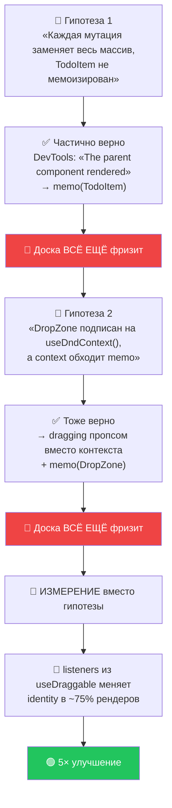
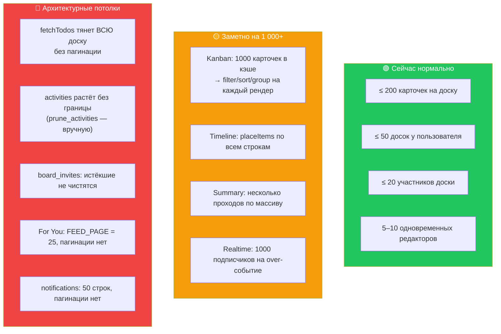

# 23 · Производительность

[← 22 · Обработка ошибок](22-errors.md) · [Оглавление](README.md) · [Далее: 24 · Деплой →](24-deployment.md)

---

## 🧒 LEVEL 1

> Оптимизация без измерения — это **лечение без диагноза**.

Больной жалуется на боль в груди. Можно:
- **A.** Дать таблетку от всего сразу.
- **B.** Сделать кардиограмму и лечить то, что она показала.

Вариант A — это «давайте обернём всё в `useMemo`» и «включим React Compiler».
Вариант B — это то, что сделал Veylo, и там есть **цифры**.

Правило проекта, записанное дословно:

> **«Profile first; memoise only what the profiler names.»**

И самое ценное: **профайлер дважды опроверг гипотезу, которая уже была
записана**. Оба раза это зафиксировано в плане, а не подчищено.

---

## 👷 LEVEL 2 — Единственный реальный замер

### Постановка

- **204 карточки** в 4 колонках (`scripts/dev-seed-perf-board.sql` — dev-фикстура,
  которая дополняет крупнейшую доску и откатывается удалением
  `title like '[perf] %'`).
- Скриптованное перетаскивание **на 16 шагов**.
- Замер через хук `__REACT_DEVTOOLS_GLOBAL_HOOK__.onCommitFiberRoot`,
  атрибуция рендеров по флагу фибры `PerformedWork`.

### Три гипотезы, две из них неверные



### Что показало измерение

Инструментирование identity через **1 643 рендера** `DraggableTodo` за одно
перетаскивание:

| Что | Сколько раз сменило identity |
|---|---|
| `setNodeRef` | **0** |
| `attributes` | **2** |
| **`listeners`** | **1 224** 🔥 |

Цепочка последствий:

```
listeners пересобирается (dnd-kit v6 так устроен)
   ↓ спред в handleProps
handleProps — новый объект
   ↓
memo у TodoContainer СРАВНИВАЕТ НЕРАВНО
   ↓
все ~200 TodoCard перерисовываются
   ↓ вместе с поддеревьями
DueDateControl · PriorityControl · AssigneeControl · TodoMenu
   ↓ и иконками lucide
Calendar ×205 · Pencil ×205 · User ×205 · Ellipsis ×214  — НА КОММИТ
```

### Что оказалось НЕ виновато

| Подозреваемый | Измерено |
|---|---|
| Обработчики событий | синхронный `pointermove` — **0.1 мс** |
| Collision detection | `pickNearest` читает **кэшированные** rect'ы dnd-kit, `getBoundingClientRect` не вызывается **никогда** |
| Layout / Paint | **ни разу** не доминировали в кадре |
| Размер DOM | все 204 карточки уже смонтированы и отрисованы |
| Свежий объект `setIndicator` | 19 коммитов на 20 движений мыши = **15.3 мс суммарно** (~0.8 мс каждый) — ≈**1%** проблемы |

Про последний пункт есть отличная формулировка:

> *«Left alone: it is a genuine inefficiency worth roughly 1% of the problem, and
> **changing it would have looked like a fix while the board still froze**.»*

### Исправление — не memo, а закрепление identity

```tsx
// src/components/todo/TodoItem.tsx
const { attributes, listeners, setNodeRef, isDragging } = useDraggable({...});

const listenersRef = useRef(listeners);

useEffect(() => {
  listenersRef.current = listeners;      // ⬅️ обновляется в ЭФФЕКТЕ, не в рендере
}, [listeners]);

// Имена слушателей фиксированы тем, какие сенсоры зарегистрированы,
// поэтому ключ стабилен на всю жизнь карточки.
const listenerKeys = listeners ? Object.keys(listeners).sort().join(",") : "";

const handleProps = useMemo(() => { /* стабильные обёртки, читающие listenersRef */ },
  [listenerKeys, ...]);
```

**Приём:** объект с нестабильной identity уходит в `ref`, а наружу отдаются
**стабильные функции-обёртки**, которые читают `ref.current` в момент вызова.
Обновление `ref` — в эффекте, а не во время рендера.

### Результат

| Перетаскивание на 16 шагов, 204 карточки | до | после |
|---|---|---|
| Худший коммит | **122 мс** | **24.5 мс** |
| Суммарное время коммитов React | 444 мс | 165 мс |
| Long tasks | 7 (807 мс) | 1 (208 мс) |

**≈5× по худшему коммиту, ≈4× меньше блокировки главного потока.**

И честная оговорка:

> *«**What is deliberately not claimed:** the numbers are from a dev build, and
> no production profile was taken. **The ratio is what this task
> establishes.**»*

### Где `React.memo` в проекте

**Ровно два места**, и оба названы измерением:

```
memo(TodoItem)     ← «The parent component rendered» на каждое движение мыши
memo(DropZone)     ← после снятия подписки на useDndContext
```

**И `DropZone` сначала рассмотрели и ОТКЛОНИЛИ:**

> *«its `onAdd={addHandlerFor(gap)}` is a fresh closure every render, so a
> `memo` would fail every comparison **and add cost**. Its `active` prop also
> genuinely changes during a drag — it is the blue line.»*

Мемо стало осмысленным только **после** того, как пропсы сделали сравнимыми:
`onAdd` превратился в один стабильный `useCallback`-нутый `openAt(index)`, а
per-gap замыкание — в булев `canAdd`.

**Мемоизировать имеет смысл только то, у чего пропсы переживают сравнение.**

### Почему это вообще сработало — благодаря дисциплине cache-функций

> *«It works here precisely because the props survive it — `KanbanColumn` passes
> only `todo` and `dragDisabled`, no callbacks and no inline objects, and
> `todos/cache.ts` returns untouched rows **by reference**. …**The referential
> discipline the cache functions have kept since M2 is what made a one-line fix
> possible** — had they rebuilt rows, `memo` would have compared unequal every
> time and bought nothing.»*

Правило из [главы 05](05-data-flow.md) — «нетронутые строки проходят по ссылке»
— писалось ради корректности отката. Через четыре месяца оно **окупилось
производительностью**.

---

## 🏛 LEVEL 3

### Виртуализация — отклонена **доказательством**, а не по умолчанию

M9-10 (виртуализация длинных колонок) — **SKIPPED**, и это записанное решение:

> *«**The condition was never met.** This task fires *only if M9-05's profiling
> proves a real problem* that virtualisation would solve. **It proved the
> opposite:** on a real 204-card board the cost was **render breadth, not DOM
> size**. The worst commit re-rendered ~200 `TodoCard` subtrees because one
> object's identity churned — **every one of those cards was already mounted and
> painted**, and the freeze happened during pointer-moves that changed no DOM at
> all. **Unmounting off-screen cards would not have touched it.**»*

```
Виртуализация лечит:  много DOM-узлов
Проблема была:        много ре-рендеров уже существующих узлов
                      → разные болезни
```

Плюс: `docs/FRONTEND.md` говорит *«Virtualize long lists if necessary»*, а
виртуализация 40-карточной колонки — это зависимость и куча багов со скроллом,
купленные **ни за что**.

### React Compiler — отклонён **асимметрией**, а не числами

Из [главы 03](03-stack.md), но здесь это на своём месте:

| | Стоимость | Выгода |
|---|---|---|
| Время сборки | 3.56 s → **9.70 s** (×2.7) | — |
| Чанк доски | 440 kB → **552 kB** (+25%) | — |
| Экономия ре-рендеров | — | **не измерена** |

> *«**The reason is the asymmetry, not the numbers alone.** The cost is measured
> and certain; the benefit is auto-memoisation that **nobody has profiled**…
> Enabling a blanket memoiser before that profiling **contradicts M9-05's own
> instruction** — "profile first; memoise only what the profiler names" — and
> would have made the task moot without answering it.»*

**И это оказалось правильным по существу:** профилирование показало, что
проблема была в **identity объекта `listeners`, приходящего из библиотеки**.
Компилятор мемоизировал бы компоненты, но не починил бы `listeners` — он не
может стабилизировать то, что создаёт `useDraggable` внутри dnd-kit.

Триггер пересмотра остался: *«Restoring it is four devDependencies and three
lines of `vite.config.ts`.»*

### Оптимизации, которые уже встроены в архитектуру

Многие «оптимизации» в Veylo — не оптимизации, а **следствия правильных
решений**:

| Механизм | Что экономит | Ради чего сделано изначально |
|---|---|---|
| **Fractional ranks** | перемещение = **1 строка** вместо N | конкурентность, не скорость |
| **Cache-функции по ссылке** | React пропускает нетронутые карточки | корректность отката |
| **`staleTime: 30_000`** | переключение вкладки не стоит запроса | UX |
| **`TODO_LIST_FIELDS` (12 колонок)** | не тянет `description` на каждую карточку | явная оптимизация M5-07 |
| **`accessible_board_ids()` как `setof`** | 🔑 **InitPlan** — один раз на оператор, не на строку | производительность политик |
| **Частичный индекс** unread | `COUNT(*)` только по непрочитанным | явно |
| **`head: true`** для бейджа | нет тела ответа | явно |
| **`forYouByIds` с сортировкой** | две вкладки делят один запрос | явно |
| **`enabled: Boolean(boardId)`** | нет запроса до резолва маршрута | корректность |
| **Lazy-роуты** | `BoardPage` не в первом чанке | M9-03 |
| **Один realtime-канал на доску** | не N подписок по представлениям | архитектура |
| **`useSyncExternalStore`** | нет лишнего рендера при определении мобильного | корректность |

**Про InitPlan стоит сказать подробнее**, потому что это самая недооценённая
оптимизация проекта:

```sql
-- ✅ Row-independent → PostgreSQL вычисляет ОДИН РАЗ на оператор
board_id in (select public.accessible_board_ids())

-- ❌ Row-dependent → вычислялось бы на КАЖДОЙ строке
exists (select 1 from board_members m
         where m.board_id = todos.board_id and m.user_id = auth.uid())
```

Комментарий в миграции: *«Row-independent and set-returning, so policies using
it plan as an **InitPlan evaluated once per statement**.»*

При выборке 500 карточек разница — один подзапрос против пятисот.

Есть и признанная регрессия этого свойства:

> *«The role list is spelled out six times because a policy cannot be
> parameterised… that is the point at which a `writable_board_ids()`
> set-returning helper mirroring `accessible_board_ids()` earns its place.
> **It would also restore InitPlan evaluation on bulk upserts.**»*

То есть `board_role(board_id)` в write-политиках — **row-dependent**, и на
массовых upsert'ах он вычисляется построчно. Известно и записано.

### Где Veylo станет медленным — честный анализ



#### Разбор главного потолка — `fetchTodos`

```ts
export async function fetchTodos(boardId: string) {
  return supabase.from("todos").select(TODO_LIST_FIELDS)
    .eq("board_id", boardId)
    .order("rank", { ascending: true, nullsFirst: false });
  // ⬆️ НЕТ .limit() и НЕТ .range()
}
```

**Доска на 10 000 задач загрузится целиком.** Последствия:

| Слой | Что произойдёт |
|---|---|
| Сеть | ~2–5 МБ JSON |
| Парсинг | сотни миллисекунд |
| Кэш | весь массив в памяти |
| `useVisibleTodos` | filter → search → sort по 10 000 на каждое изменение фильтра |
| `useTodosByColumns` | группировка по 10 000 |
| Рендер | 10 000 `TodoItem` (частично спасает `memo`) |

**Почему это осознанно:** доска на 10 000 карточек — не kanban-доска, а база
данных. Продуктовый предел ощущается раньше технического.

**Что делать, если понадобится:** `useInfiniteQuery` с курсором по `rank`,
плюс серверная фильтрация. Это перестроит `useVisibleTodos` — сейчас он
предполагает, что весь scope в памяти.

### Индексы — что есть и чего нет

**Есть** (проверено по миграциям):

| Индекс | Обслуживает |
|---|---|
| `todos_board_id_idx` | загрузка доски |
| `todos_column_id_rank_idx` | порядок в колонке |
| `todos_column_id_position_idx` | legacy |
| `columns_board_id_rank_idx` | порядок колонок |
| `board_members_user_id_idx` | 🔑 `accessible_board_ids()` — **каждая политика** |
| `board_members_board_id_idx` | ростер |
| `boards_owner_id_idx`, `boards_space_id_idx` | сайдбар |
| `spaces_owner_id_idx` | сайдбар |
| `activities_board_created_idx` | лента |
| `activities_board_entity_idx` | история одной задачи |
| `comments_todo_created_idx` | один тред без узла сортировки |
| `notifications_user_created_idx` | список инбокса |
| `notifications_user_unread_idx` **(частичный)** | бейдж |
| `profiles_username_lower_key` **(unique)** | уникальность + резолв входа |
| `board_invites_board_id_idx` | список приглашений |
| `todos_board_key_unique` | уникальность `KAN-N` |

**Чего нет — и это стоит назвать:**

| Отсутствует | Обслуживал бы | Насколько нужен |
|---|---|---|
| `todos(assignee_id)` | 🔥 `fetchAssignedTodos` — **вкладка For You** | заметно на большой БД |
| `activities(actor_id, entity_type)` | `fetchWorkedOn` | то же |
| `todos(board_id, due_date)` | Calendar / Timeline / DueSoon | средне |
| `profiles(lower(email))` | `search_board_invitees`, `notify_on_invite` | средне |

**Repository evidence:** ни одного из этих индексов в миграциях нет.
`fetchAssignedTodos` делает `.eq("assignee_id", userId)` — на текущем объёме это
seq scan, который никто не замечает; на миллионе строк это первое, что придётся
чинить.

**Это лучший ответ на «что бы вы оптимизировали следующим»:** конкретный,
измеримый, дешёвый (`create index concurrently`) и найденный чтением кода, а не
угаданный.

### Как масштабировать до 100 000 пользователей

Вопрос почти гарантированно прозвучит на собеседовании. Ответ по слоям:

```mermaid
flowchart LR
    subgraph Now["Сейчас"]
        N1["Vercel CDN"]
        N2["Supabase<br/>1 инстанс Postgres"]
    end

    subgraph Step1["Шаг 1 — дешёвое"]
        S1["Индексы: assignee_id,<br/>activities(actor_id), due_date"]
        S2["Пагинация: useInfiniteQuery<br/>для досок, ленты, инбокса"]
        S3["pg_cron: prune_activities,<br/>очистка истёкших приглашений"]
        S4["Connection pooler (уже есть<br/>в config, выключен)"]
    end

    subgraph Step2["Шаг 2 — среднее"]
        M1["Read replicas для тяжёлых чтений"]
        M2["Материализованные представления<br/>для Summary/Trends"]
        M3["writable_board_ids() —<br/>вернуть InitPlan на записи"]
        M4["Persist кэша<br/>(namespaced по user id)"]
    end

    subgraph Step3["Шаг 3 — дорогое"]
        L1["Шардирование по board_id"]
        L2["Отдельный realtime-кластер"]
        L3["CQRS: чтения из проекции"]
        L4["Свои Edge Functions<br/>для тяжёлых агрегаций"]
    end

    Now --> Step1 --> Step2 --> Step3

    style Step1 fill:#22c55e,color:#fff
    style Step3 fill:#ef4444,color:#fff
```



**Ключевая мысль, которую стоит произнести:** архитектура **не** мешает
масштабированию. Всё board-scoped, всё индексируемо по `board_id`, шардирование
по доске — естественная граница. Ничего в схеме не придётся переделывать —
только добавлять.

Что действительно упирается в потолок раньше — это **realtime**: один канал на
доску × число открытых досок. Supabase Realtime имеет свои лимиты, и здесь
контроль ограничен.

### Что НЕ было оптимизировано — и почему это правильно

| Не сделано | Почему |
|---|---|
| Мемоизация «на всякий случай» | `React.memo` ровно **дважды**, оба раза назван профайлером |
| Виртуализация | доказано, что лечит не ту болезнь |
| React Compiler | стоимость измерена, выгода — нет |
| Персист кэша | **это защита**: без namespace по user id отдал бы чужие строки |
| Debounce фильтров | не измерено как проблема |
| Оптимистичные апдейты везде | только там, где результат предсказуем |

**Общий принцип:** отсутствие оптимизации — тоже решение, и в Veylo каждое
такое решение **записано вместе с триггером пересмотра**.

---

## 🧪 Мини-квиз

<details>
<summary><b>1.</b> Что на самом деле замедляло доску, и почему первые две гипотезы были неполны?</summary>

`listeners` из `useDraggable` меняет identity на ~75% рендеров (1 224 раза из
1 643). Он спредится в `handleProps`, ломая memo у `TodoContainer`, из-за чего
перерисовывались все ~200 `TodoCard` с их контролами и иконками.
`memo(TodoItem)` и снятие `useDndContext` у `DropZone` были **верны, но
меньшими** путями — исправив их, стало видно главный. Профайлер дважды
опроверг записанную гипотезу.
</details>

<details>
<summary><b>2.</b> Почему виртуализация не помогла бы?</summary>

Потому что она лечит **размер DOM**, а проблемой была **широта ре-рендеров**.
Все 204 карточки уже были смонтированы и отрисованы; фриз происходил во время
движений мыши, которые **не меняли DOM вообще**. Демонтаж карточек за экраном
не тронул бы эту стоимость. Решение записано в M9-10 как отклонённое
доказательством, а не по умолчанию.
</details>

<details>
<summary><b>3.</b> Почему <code>DropZone</code> сначала отклонили для мемоизации, а потом мемоизировали?</summary>

Изначально его `onAdd={addHandlerFor(gap)}` был свежим замыканием на каждый
рендер — memo **проваливал бы каждое сравнение и добавлял стоимость**. Он стал
осмысленным только после того, как пропсы сделали сравнимыми: `onAdd` →
один стабильный `useCallback`-нутый `openAt(index)`, per-gap замыкание →
булев `canAdd`. Мемоизировать имеет смысл только то, у чего пропсы переживают
сравнение.
</details>

<details>
<summary><b>4.</b> Почему <code>accessible_board_ids()</code> возвращает <code>setof uuid</code>, а не <code>boolean</code>?</summary>

Потому что `board_id in (select accessible_board_ids())` **не зависит от
строки**, и PostgreSQL планирует его как **InitPlan** — вычисляемый один раз на
оператор. Предикат вида `exists (select … where m.board_id = todos.board_id)`
зависел бы от строки и выполнялся бы на каждой. При выборке 500 карточек это
один подзапрос против пятисот.
</details>

<details>
<summary><b>5.</b> Какого индекса не хватает, и что он обслуживал бы?</summary>

`todos(assignee_id)`. Его использовал бы `fetchAssignedTodos` — вкладка
«Assigned to me» на странице For You, где стоит `.eq("assignee_id", userId)`
без индекса. Также отсутствуют `activities(actor_id, entity_type)` для
«Worked on» и `todos(board_id, due_date)` для Calendar/Timeline/DueSoon. На
текущем объёме это seq scan, которого никто не замечает.
</details>

<details>
<summary><b>6.</b> Почему кэш TanStack Query не персистится, и это оптимизация или защита?</summary>

**Защита.** Библиотеки установлены, но не подключены намеренно: id доски не
секрет, и `["todos", boardId]` не scoped по **пользователю**, поэтому
персистированный кэш отдал бы следующему человеку за этим браузером строки
предыдущего. Условие включения записано: ключ персиста, namespaced по user id,
плюс осознанное решение о том, что переживает выход.
</details>

<details>
<summary><b>7. Predict:</b> доска на 5 000 карточек. Что произойдёт первым?</summary>

`fetchTodos` загрузит **все 5 000** — там нет ни `.limit()`, ни `.range()`.
Дальше `useVisibleTodos` будет прогонять filter → search → sort по всему массиву
на каждое изменение фильтра, а `useTodosByColumns` — группировать его. Рендер
частично спасёт `memo(TodoItem)`, но сеть, парсинг и пайплайн — нет. Первое
исправление — `useInfiniteQuery` с курсором по `rank` и серверная фильтрация,
что перестроит `useVisibleTodos`.
</details>

<details>
<summary><b>8.</b> Почему React Compiler остался выключенным, даже с точки зрения производительности?</summary>

Потому что стоимость **измерена и определённа** (×2.7 сборка, +25% чанк), а
выгода — **не измерена**. И по существу он бы не помог: настоящей проблемой
была identity объекта `listeners`, создаваемого **внутри dnd-kit**.
Компилятор мемоизирует компоненты, но не может стабилизировать то, что
`useDraggable` пересоздаёт у себя внутри.
</details>

---

[← 22 · Обработка ошибок](22-errors.md) · [Оглавление](README.md) · [Далее: 24 · Деплой →](24-deployment.md)
