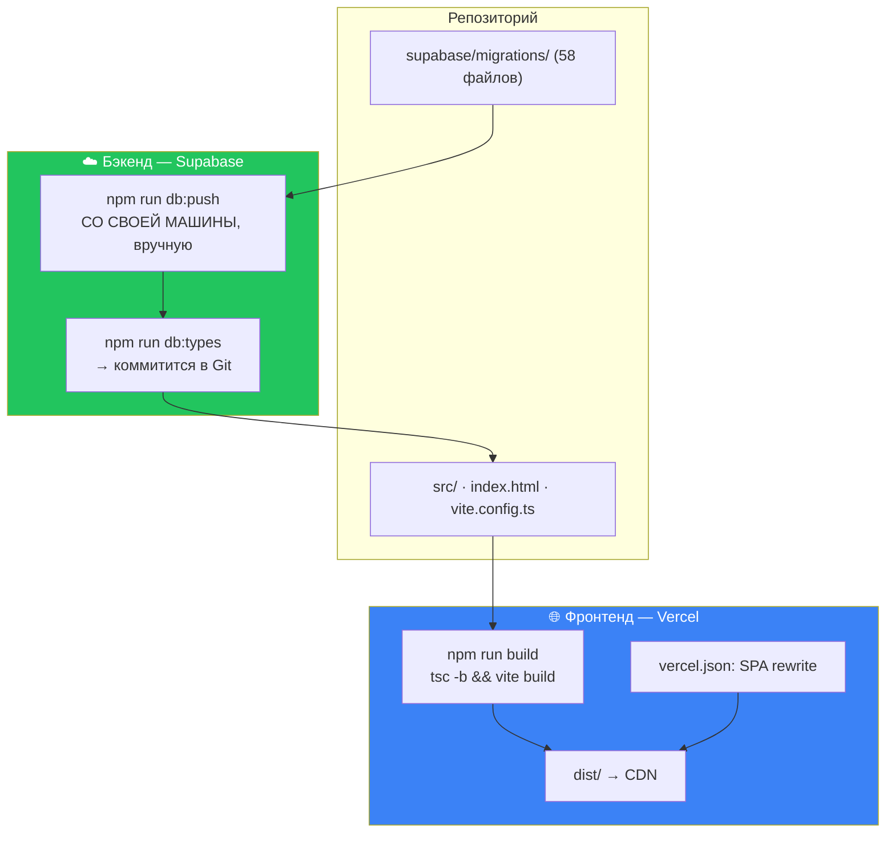

# 24 · Деплой

[← 23 · Производительность](23-performance.md) · [Оглавление](README.md) · [Далее: 25 · User journeys →](25-user-journeys.md)

---

## 🧒 LEVEL 1

> Деплой — это **переезд из твоей комнаты в общественное место**.

Дома можно оставить ключи на столе. В общественном месте — нельзя.

```
🏠 ЛОКАЛЬНО                          🌍 ПРОДАКШН
   .env на диске                        переменные в панели Vercel
   localhost:5173                       veylo.app
   любой origin                         только разрешённые redirect URL
   ошибки в консоли                     ошибки никто не видит
```

Главный вопрос деплоя: **что можно показывать всем, а что нельзя?**

```
✅ МОЖНО в браузер            ❌ НЕЛЬЗЯ никогда
   VITE_SUPABASE_URL             SUPABASE_SERVICE_ROLE_KEY
   VITE_SUPABASE_                (обходит RLS = полный доступ к БД)
     PUBLISHABLE_KEY             пароли от БД
                                 SMTP-креды
```

Разница простая: публичный ключ **ничего не разрешает сам по себе** — права
даёт JWT пользователя через RLS. Сервисный ключ **обходит RLS целиком**.

---

## 👷 LEVEL 2 — Как устроен деплой Veylo

### Два независимых куска



⚠️ **Два деплоя не связаны автоматикой.** Миграции применяются **вручную**
командой `npm run db:push` с машины разработчика. Vercel про базу ничего не
знает и не может её мигрировать.

**Следствие, которое нужно держать в голове:** порядок «сначала миграция, потом
код» соблюдается **дисциплиной**, а не пайплайном. Отсюда правило
expand→backfill→contract из [главы 21](21-migrations.md): оно как раз существует,
чтобы окно между двумя деплоями было безопасным.

### `vercel.json` — три строки, одна проблема

```json
{
  "rewrites": [
    { "source": "/(.*)", "destination": "/index.html" }
  ]
}
```

**Что это чинит:**

```
Пользователь открывает https://veylo.app/boards/abc-123 напрямую (или F5)
   ↓
❌ Без rewrite:
   Vercel ищет файл /boards/abc-123 → не находит → 404
   (React Router даже не запускается — он живёт ВНУТРИ index.html)

✅ С rewrite:
   Любой путь отдаёт index.html
   → загружается React
   → createBrowserRouter читает window.location
   → рисует BoardPage
```

Это **обязательный** конфиг для любого SPA с `createBrowserRouter`. Без него
работают только переходы внутри приложения, а прямые ссылки и F5 — нет.

⚠️ **Побочный эффект:** сервер больше не может вернуть настоящий 404 —
`/полная-ерунда` отдаст `index.html` со статусом **200**, а «страницу не найдено»
нарисует маршрут `*`. Для SPA это норма, но для SEO это значит, что несуществующие
страницы отдаются как валидные.

### Переменные окружения

```bash
# .env — 🔴 в .gitignore
VITE_SUPABASE_URL=https://nxnnfaoyttbzndphnawe.supabase.co
VITE_SUPABASE_PUBLISHABLE_KEY=<публичный ключ>
```

**🔑 Префикс `VITE_` — это механизм безопасности, а не соглашение об именах.**

```
Vite инлайнит в бандл ТОЛЬКО переменные с префиксом VITE_.
   ↓
VITE_SUPABASE_URL              → попадёт в JS  ✅ так и задумано
VEYLO_SERVICE_ROLE_KEY         → НЕ попадёт    ✅ физически невозможно
```

Именно поэтому live-тесты используют `VEYLO_SERVICE_ROLE_KEY` **без** префикса
(см. [главу 20](20-testing.md)): даже случайный импорт этой переменной в
`src/` не заинлайнил бы её.

**И «инлайнит» — буквально:**

```ts
// исходник
const url = import.meta.env.VITE_SUPABASE_URL;

// собранный бандл
const url = "https://nxnnfaoyttbzndphnawe.supabase.co";
```

Значение **вшито в JS-файл**. Следствие, записанное в `CLAUDE.md`:

> *«Vite inlines them at build time, so **a missing variable is a rebuild, not a
> redeploy**.»*

Изменил переменную в Vercel → надо **пересобрать**, не просто передеплоить.

**Проверка при загрузке модуля:**

```ts
if (!supabaseUrl) {
  throw new Error("Missing environment variable VITE_SUPABASE_URL — add it to .env and restart the dev server.");
}
```

> *«so a missing variable fails the app at startup with a named cause instead of
> surfacing as an opaque error on the first query»*

⚠️ И это **ошибка времени выполнения, а не сборки**. Поэтому CI собирает проект
**без** кредов Supabase — что хорошо (форк соберётся), но означает, что
пропущенная переменная выяснится только в браузере.

### Где какой секрет должен лежать

| Секрет | Где | Почему |
|---|---|---|
| `VITE_SUPABASE_URL` | `.env` локально + переменные Vercel | публичный, уезжает в браузер |
| `VITE_SUPABASE_PUBLISHABLE_KEY` | там же | публичный, прав не даёт |
| **`service_role` ключ** | 🔴 **нигде на диске** | достаётся Supabase CLI по требованию |
| Пароль от БД | панель Supabase | не нужен приложению |
| SMTP-креды | панель Supabase | GoTrue шлёт письма сам |

**Про service_role — решение, которое стоит скопировать:**

```ts
// vitest.live.config.ts
function serviceRoleKey(): string {
  const raw = execFileSync("npx", ["--no-install", "supabase", "projects",
    "api-keys", "--project-ref", PROJECT_REF], { encoding: "utf8", shell: true });
  ...
}
```

> *«**It is fetched rather than stored, and that is the point.** A service-role
> key in `.env` is a key on disk in a repo, **one `git add -f` away from being
> published**, and it would sit beside two values that are meant to ship to the
> browser.»*

### Что в `.gitignore`

```
.env          🔴 креды
backups/      🔴 дампы БД — содержат ДАННЫЕ ПОЛЬЗОВАТЕЛЕЙ
dist/         сборка
node_modules/
```

`backups/` — тонкий момент: дамп это не «большой файл», это **персональные
данные**. Из плана: *«Backups directory is gitignored — dumps contain user data
and must never be committed.»*

---

### Сборка

```bash
npm run build     # = tsc -b && vite build
```

**Две команды, и порядок важен:**

| Шаг | Что делает | Почему первым |
|---|---|---|
| `tsc -b` | **единственный typecheck** | сборка не должна начинаться, если типы не сходятся |
| `vite build` | бандлинг, минификация, code splitting | — |

Из `CLAUDE.md`: *«**the only typecheck; run it before claiming a change
compiles**»*.

**Почему `npm run dev` не считается проверкой:** Vite в dev-режиме
**стирает типы, а не проверяет их**. Файл с ошибкой типа прекрасно работает в
dev и падает на сборке.

Плюс `noUnusedLocals` / `noUnusedParameters` в `tsconfig.app.json`: **неиспользуемый
импорт ломает `npm run build`**, хотя dev-сервер на него не жалуется.

### Результат сборки

```
dist/
├── index.html
└── assets/
    ├── index-<hash>.js       ← основной чанк (React, Router, Query, Supabase,
    │                            LoginPage, ForYouPage, NotFound, RouteError)
    ├── BoardPage-<hash>.js    ← 💤 lazy: dnd-kit + 5 представлений + модалки
    ├── ProfilePage-<hash>.js  ← 💤
    ├── RegisterPage-<hash>.js ← 💤
    ├── …
    └── index-<hash>.css
```

Хэш в имени — это cache-busting: CDN может кэшировать файл навсегда, потому что
изменение содержимого меняет имя.

Из README (в контексте React Compiler): чанк доски ≈ **440 kB**. Это **весь
`BoardPage`** с dnd-kit, пятью представлениями, тредом комментариев и модалками
— и именно поэтому он lazy.

---

## 🏛 LEVEL 3

### ⚠️ Ловушка: allow-list редиректов Supabase

Самая частая проблема при первом деплое, и она **тихая**.

```ts
// authApi.requestPasswordReset
await supabase.auth.resetPasswordForEmail(email.trim(), {
  redirectTo: `${window.location.origin}/reset-password`,
});
```

Комментарий фиксирует проблему заранее:

> *«**`redirectTo` is built from `window.location.origin`**, so the same build
> works on localhost and on the deployed domain without an environment variable
> to keep in step. **Supabase only honours it if the URL is in the project's
> redirect allow-list — both origins have to be added there, and a missing entry
> is why a link silently lands on the site root instead.**»*

```
Панель Supabase → Authentication → URL Configuration:

Site URL:                  https://veylo.app
Redirect URLs (allow-list):
  http://localhost:5173/**       ← разработка
  https://veylo.app/**           ← продакшн
  https://*-<team>.vercel.app/** ← превью-деплои
```

**Симптом при пропуске:** ссылка сброса пароля приводит на **корень сайта**, а
не на `/reset-password`. Ошибки нет. Логов нет. Пользователь просто оказывается
на главной и не понимает, почему.

**И то же касается превью-деплоев Vercel.** Каждый PR получает свой домен вида
`veylo-git-feature-xyz-team.vercel.app`. Без wildcard в allow-list подтверждение
почты и сброс пароля на превью **не работают** — а обнаруживается это уже после
мержа.

⚠️ **Repository evidence:** локальный `supabase/config.toml` содержит
`site_url = "http://127.0.0.1:3000"` и `additional_redirect_urls =
["https://127.0.0.1:3000"]` — это **локальная** конфигурация. Настройки
связанного проекта живут в панели Supabase и **в репозитории отсутствуют**, так
что подтвердить их состояние по коду невозможно.

### Разрыв между локальным и удалённым конфигом

```toml
# supabase/config.toml — применяется к ЛОКАЛЬНОМУ supabase start
[auth]
site_url = "http://127.0.0.1:3000"
jwt_expiry = 3600
enable_refresh_token_rotation = true
minimum_password_length = 6

[auth.email]
enable_confirmations = true       # 🔑 определяет ВСЮ регистрацию
```

**Часть этих настроек CLI умеет пушить, часть — нет**, и это зависит от версии
CLI и от того, что включено в проекте.

**Практический вывод:** `enable_confirmations = true` в файле **не является
доказательством**, что подтверждение включено на связанном проекте. Код это
знает и не полагается на конфиг:

```ts
return {
  ...data,
  // Read off the response rather than assumed from configuration, so the UI
  // tells the truth whichever way the project is set.
  needsConfirmation: !data.session,
};
```

**Это хороший приём:** поведение читается из **ответа**, а не из предположения о
конфигурации. Приложение корректно при любой настройке.

### CI: что проверяется и чего нет

```yaml
on:
  pull_request:
  push: { branches: [main] }

jobs:
  validate:
    steps:
      - uses: actions/checkout@v4
      - uses: actions/setup-node@v4
        with: { node-version: 24, cache: npm }
      - run: npm ci
      - run: npm run lint
      - run: npm run build
      - run: npm test
```

| ✅ Проверяется | ❌ Не проверяется |
|---|---|
| ESLint | миграции применены |
| `tsc -b` (включая тесты) | типы соответствуют схеме |
| 46 unit-тестов | live-тесты (нужны креды) |
| — | SQL-харнессы прав (запуск вручную) |
| — | E2E (не существует) |
| — | визуальные регрессии |

**Три пробела, которые стоит назвать самому:**

1. **Никакой автоматики деплоя миграций.** `db:push` — вручную. Значит, возможно
   состояние «код на проде читает колонку, которой нет в базе».
2. **Нет проверки «типы = схема».** Дешёвое исправление: прогнать
   `npm run db:types` в CI и падать при непустом `git diff` — то есть если
   сгенерированный файл отличается от закоммиченного.
3. **SQL-харнессы (209 случаев) запускаются вручную.** Регрессия политики не
   поймается автоматикой.

Первый пункт — самый серьёзный. Именно поэтому правило
expand→backfill→contract существует: оно делает окно между деплоями
**безопасным by design**, раз уж синхронизировать их автоматикой некому.

### Чего в деплое нет

| Отсутствует | Значение | Repository evidence |
|---|---|---|
| **Content Security Policy** | XSS = компрометация сессии (она в `localStorage`) | нет ни в `index.html`, ни в `vercel.json` |
| Security headers (HSTS, X-Frame-Options) | защита от кликджекинга | нет в `vercel.json` |
| Sentry / трекинг ошибок | ошибки прода **никто не видит** | нет в `package.json` |
| Analytics | нет данных о поведении | нет |
| Health check / uptime monitoring | о падении узнают от пользователей | нет |
| Staging-окружение | превью-деплои Vercel ходят в **боевую** базу | один `project-ref` |
| PITR | нет point-in-time recovery | отложено (Part V, PH-01), ~$125/мес |
| Rollback-процедура для БД | только forward-fix | по дизайну |

**Про staging стоит сказать отдельно, потому что это реальный риск.** Превью-деплой
Vercel собирается из тех же переменных окружения, что и продакшн, а значит
указывает на **ту же базу**. Тестирование фичи на превью означает создание
реальных строк в боевых данных.

Правильное решение — второй проект Supabase для превью и разные переменные для
Preview/Production в Vercel. **Repository evidence: второго `project-ref` в
репозитории нет.**

**Про CSP — первое, что стоит добавить.** Сессия лежит в `localStorage`
(см. [главу 09](09-auth.md)), значит любой выполнившийся на странице скрипт её
получает. CSP в `vercel.json` — это несколько строк:

```json
{
  "headers": [{
    "source": "/(.*)",
    "headers": [
      { "key": "Content-Security-Policy", "value": "default-src 'self'; connect-src 'self' https://*.supabase.co wss://*.supabase.co; img-src 'self' data: https://*.supabase.co; style-src 'self' 'unsafe-inline'" },
      { "key": "X-Frame-Options", "value": "DENY" },
      { "key": "Strict-Transport-Security", "value": "max-age=63072000; includeSubDomains; preload" }
    ]
  }]
}
```

⚠️ Это **предложение, а не текущее состояние репозитория** — `vercel.json`
содержит только `rewrites`.

### Чеклист деплоя

```
── ПЕРЕД ПЕРВЫМ ДЕПЛОЕМ ──────────────────────────────────
□ Переменные Vercel: VITE_SUPABASE_URL, VITE_SUPABASE_PUBLISHABLE_KEY
  (для Production И Preview, если превью должны работать)
□ Supabase → Auth → URL Configuration:
    Site URL = продакшн-домен
    Redirect URLs: localhost + прод + wildcard превью
□ Supabase → Storage: бакет `avatars` существует
    (миграция настраивает лимиты, но не создаёт бакет)
□ supabase migration list → local ↔ remote совпадают

── КАЖДЫЙ ДЕПЛОЙ ─────────────────────────────────────────
□ npm run build   ← локально, прежде чем полагаться на CI
□ npm run lint
□ npm test
□ Миграции? → npm run db:push ПЕРЕД деплоем кода
□ Миграции? → npm run db:types + коммит сгенерированного файла
□ Tier B миграция? → дамп + количество строк ДО (глава 21)

── ПОСЛЕ ─────────────────────────────────────────────────
□ Прямая ссылка на /boards/:id работает (проверяет rewrite)
□ F5 на вложенном маршруте работает
□ Регистрация → письмо приходит → ссылка ведёт в приложение
□ Сброс пароля → ссылка ведёт на /reset-password, НЕ на корень
□ supabase migration list ещё раз
```

**Третий пункт первого блока стоит пояснить:** миграция
`20260814101000_avatar_storage_ownership.sql` выставляет политики и лимиты для
бакета `avatars` и делает `update storage.buckets … where id = 'avatars'` — то
есть предполагает, что **бакет уже существует**. Его создание в миграциях
**не найдено**; вероятно, он был создан через панель. Это тот самый случай,
который правило «только CLI» и призвано исключать.

---

## 🧪 Мини-квиз

<details>
<summary><b>1.</b> Зачем нужен <code>vercel.json</code> с rewrite, и что сломается без него?</summary>

Без него прямая ссылка `https://veylo.app/boards/abc` и F5 на любом вложенном
маршруте дадут **404 от Vercel**: он ищет файл по этому пути и не находит.
React Router до этого даже не доходит — он живёт внутри `index.html`. Rewrite
отдаёт `index.html` на любой путь, дальше маршрут читает `window.location`.
Побочный эффект: настоящий 404 сервер вернуть больше не может — несуществующие
страницы отдаются со статусом 200.
</details>

<details>
<summary><b>2.</b> Почему префикс <code>VITE_</code> — это механизм безопасности?</summary>

Потому что Vite инлайнит в бандл **только** переменные с этим префиксом.
Переменная без него физически не может попасть в клиентский JS. Именно на этом
построена защита service-role ключа в live-тестах: он передаётся как
`VEYLO_SERVICE_ROLE_KEY`, и даже случайный импорт в `src/` не заинлайнил бы его.
</details>

<details>
<summary><b>3.</b> Изменили значение переменной в панели Vercel. Достаточно ли передеплоить?</summary>

**Нет — нужна пересборка.** Vite подставляет значения в JS **на этапе сборки**,
буквально вшивая строку в файл. Из `CLAUDE.md`: «a missing variable is a
rebuild, not a redeploy». Передеплой той же сборки раздаст старое значение.
</details>

<details>
<summary><b>4.</b> Ссылка сброса пароля приводит на корень сайта, а не на <code>/reset-password</code>. Причина?</summary>

Домен не добавлен в **redirect allow-list** проекта Supabase.
`resetPasswordForEmail` передаёт `redirectTo`, построенный из
`window.location.origin`, но Supabase honors его **только** для разрешённых URL —
иначе молча использует Site URL. Ошибки нет, логов нет. Та же проблема ломает
подтверждение почты на превью-деплоях Vercel, если не добавлен wildcard.
</details>

<details>
<summary><b>5.</b> Как service-role ключ не оказывается на диске?</summary>

`vitest.live.config.ts` достаёт его через Supabase CLI (`supabase projects
api-keys`) в момент загрузки конфига и передаёт в тесты через `test.env` без
префикса `VITE_`. Он живёт только в памяти процесса и доступен только тому, кто
уже залогинен в CLI. Ключ в `.env` был бы файлом на диске, «в одном
`git add -f` от публикации», да ещё рядом с двумя значениями, которые
**специально** уезжают в браузер.
</details>

<details>
<summary><b>6.</b> Какой самый серьёзный пробел в CI, и почему правило expand→backfill→contract его смягчает?</summary>

Миграции применяются **вручную** (`npm run db:push`), CI их не деплоит и не
проверяет. Значит, возможно состояние «код на проде читает колонку, которой нет
в базе». Expand→backfill→contract создаёт **окно, в котором валидны обе формы
схемы**: код деплоится внутри него, и рассинхрон становится откатом кода, а не
инцидентом с данными.
</details>

<details>
<summary><b>7.</b> Что первым добавить в <code>vercel.json</code> перед реальными пользователями?</summary>

**Content Security Policy**, а с ней `X-Frame-Options: DENY` и HSTS. Сессия
Supabase лежит в `localStorage`, значит любой выполнившийся на странице скрипт
её получает — XSS равен компрометации сессии. Сейчас в `vercel.json` **только**
`rewrites`; заголовков безопасности нет.
</details>

<details>
<summary><b>8. Predict:</b> тестируем фичу на превью-деплое Vercel. Куда пойдут данные?</summary>

**В боевую базу.** Проект Supabase в репозитории один (`nxnnfaoyttbzndphnawe`),
и превью собирается из тех же переменных. Значит, тест на превью создаёт
реальные строки в продовых данных. Правильное решение — второй проект Supabase
для превью и разные переменные для Preview/Production в Vercel; второго
`project-ref` в репозитории нет.
</details>

---

[← 23 · Производительность](23-performance.md) · [Оглавление](README.md) · [Далее: 25 · Полные user journeys →](25-user-journeys.md)
