# 25 · Полные user journeys

[← 24 · Деплой](24-deployment.md) · [Оглавление](README.md) · [Далее: 26 · Как построить это самому →](26-rebuild-from-zero.md)

---

> Тринадцать сценариев, каждый **от клика до базы и обратно**.
> Это глава-справочник: возвращайся к ней, когда нужно проследить конкретный путь.

**Общая форма каждого пути:**

```
UI → компонент → хук → сервис → supabase-js → PostgREST →
🔐 RLS / ⚙️ триггер / 📐 constraint → ответ → кэш → UI
```

---

## Легенда

| Символ | Значение |
|---|---|
| 🟢 | пользователь видит результат **немедленно** (оптимистично) |
| 🔐 | точка проверки безопасности |
| ⚙️ | триггер БД |
| 📐 | constraint / FK |
| ↩️ | точка отката |

---

## 1 · Регистрация

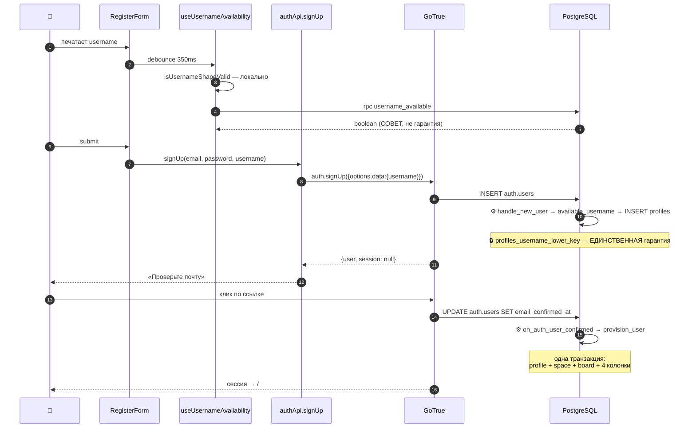

**Файлы:** `RegisterForm.tsx` → `useRegister.ts` → `authApi.signUp` →
`20260821130000_handle_new_user_username.sql` → `20260824120000_default_space_name.sql`

📖 [09 · Auth](09-auth.md) · [10 · Usernames](10-usernames.md)

---

## 2 · Вход (email или username)

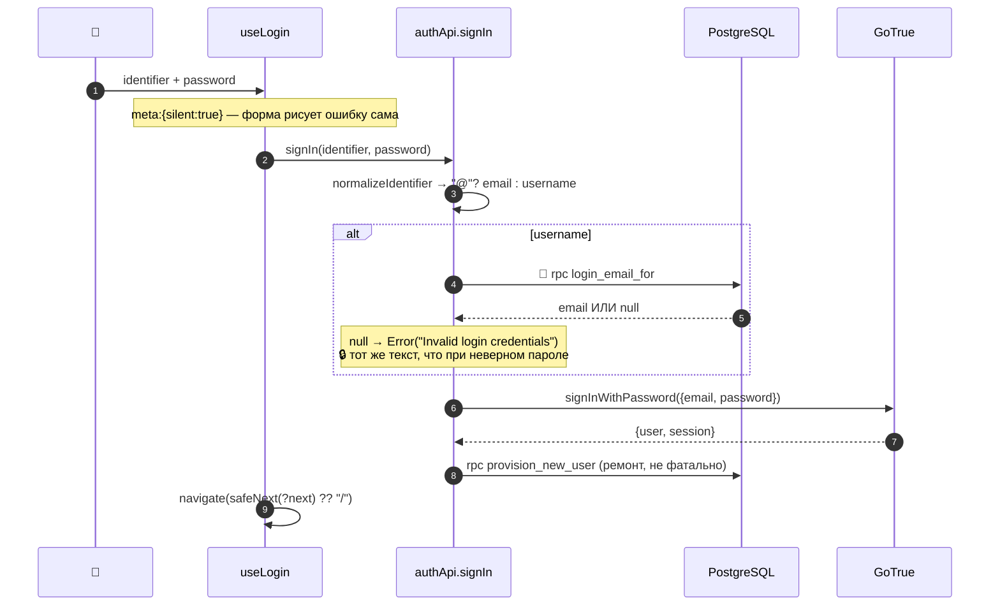

📖 [09 · Auth](09-auth.md) · [10 · Usernames](10-usernames.md)

---

## 3 · Сброс пароля

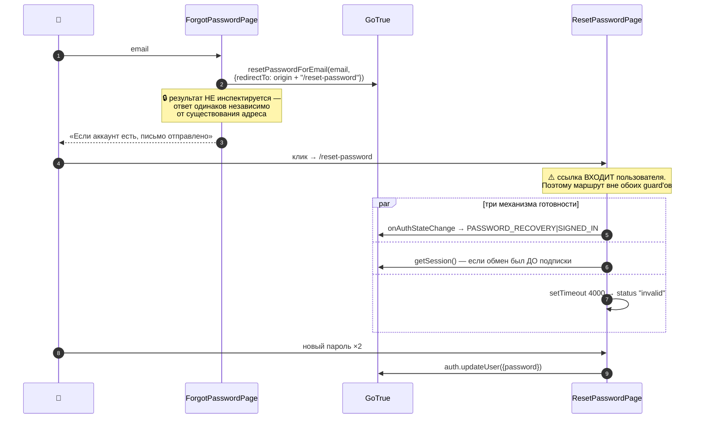

⚠️ **Ловушка деплоя:** без домена в allow-list Supabase ссылка молча приводит
на корень сайта.

📖 [09 · Auth](09-auth.md) · [24 · Деплой](24-deployment.md)

---

## 4 · Создание Space

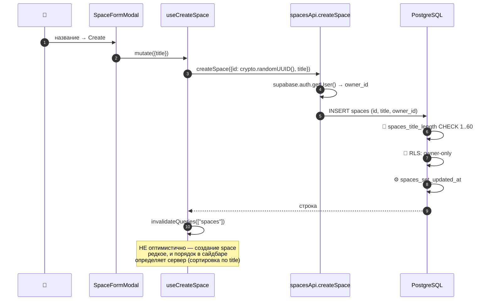

**Почему без оптимистичного апдейта:** операция редкая, а сортировка списка
идёт по `title` — оптимистичная вставка потребовала бы воспроизвести
серверную сортировку на клиенте ради экономии одного round-trip'а.

📖 [11 · Spaces/Boards/Tasks](11-spaces-boards-tasks.md)

---

## 5 · Создание Board

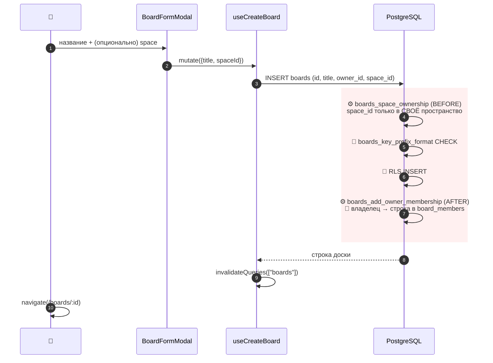

**🔑 Ключевой шаг — 7-й.** Владелец становится участником **триггером**, а не
кодом создания. Без этого `accessible_board_ids()` вернул бы доску (по
`owner_id`), но `board_role()` вернул бы `null`, и владелец не смог бы **писать**
в собственную доску.

⚠️ **Новая доска создаётся без колонок.** Четыре колонки заводит только
`provision_user` для первой доски. Вторая доска начинается пустой.

📖 [11 · Spaces/Boards/Tasks](11-spaces-boards-tasks.md)

---

## 6 · Создание задачи

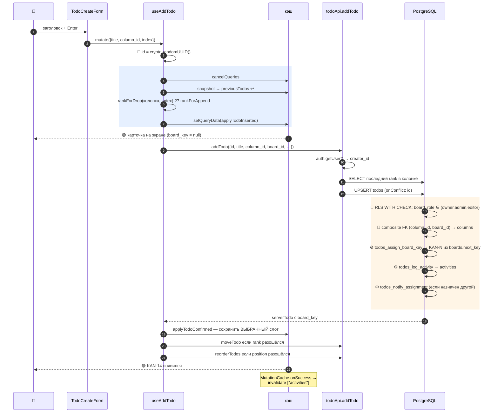

📖 [05 · Data flow](05-data-flow.md) · [12 · Kanban](12-kanban.md)

---

## 7 · Перемещение задачи (drag & drop)

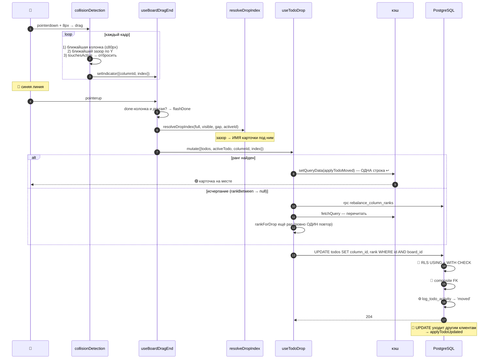

**Провал:** `onError` восстанавливает `previousTodos`; если снимка нет —
`removeQueries` (иначе `setQueryData(key, undefined)` — no-op, и оптимистичный
порядок пережил бы отказ).

📖 [12 · Kanban](12-kanban.md)

---

## 8 · Создание задачи росчерком на Timeline

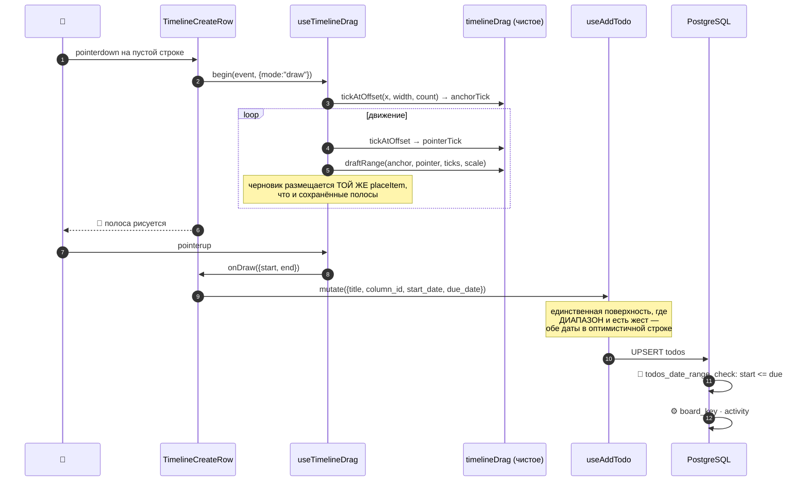

📖 [13 · Timeline](13-timeline.md)

---

## 9 · Изменение задачи (назначить исполнителя)

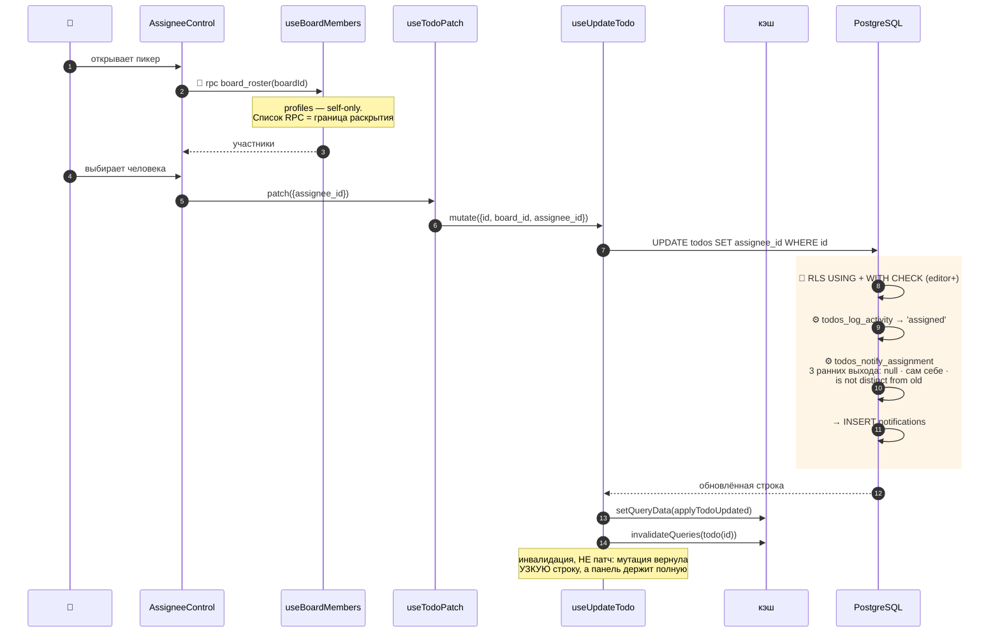

**Заметь:** viewer **может** быть назначен — назначение требует членства, а не
права записи (решение M5-05).

📖 [05 · Data flow](05-data-flow.md) · [14 · Уведомления](14-notifications.md)

---

## 10 · Приглашение участника

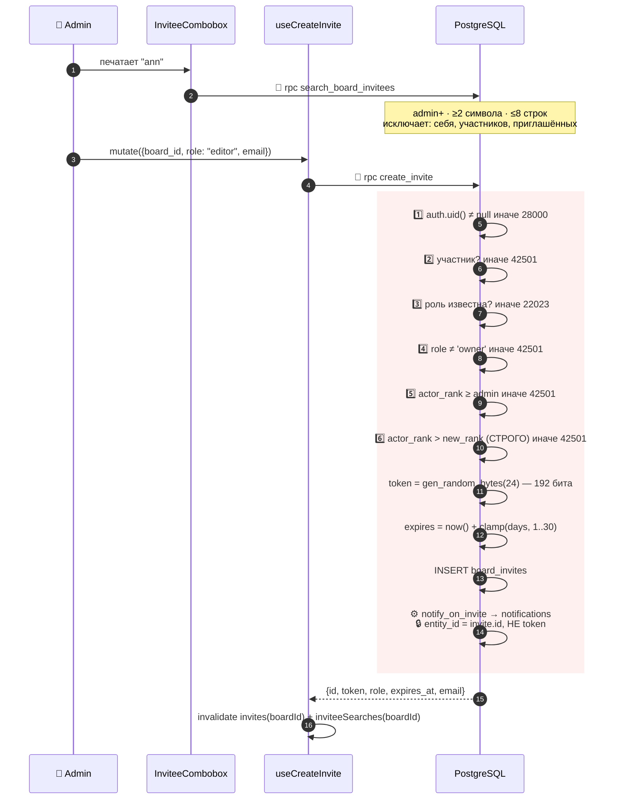

📖 [15 · Приглашения](15-invitations.md)

---

## 11 · Принятие приглашения

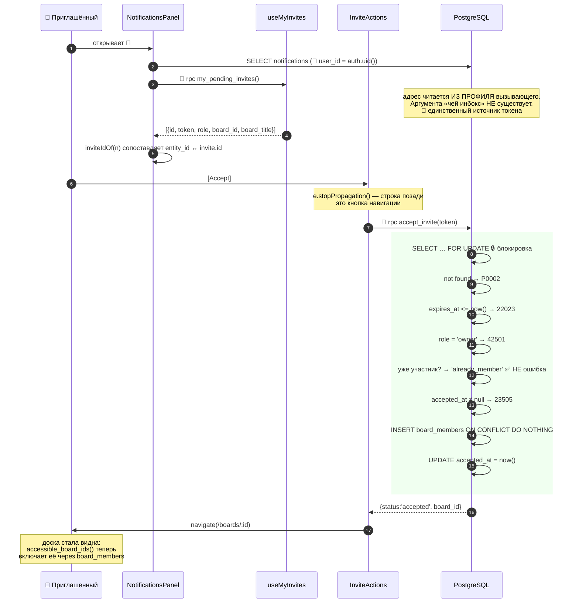

📖 [15 · Приглашения](15-invitations.md)

---

## 12 · Отклонение приглашения

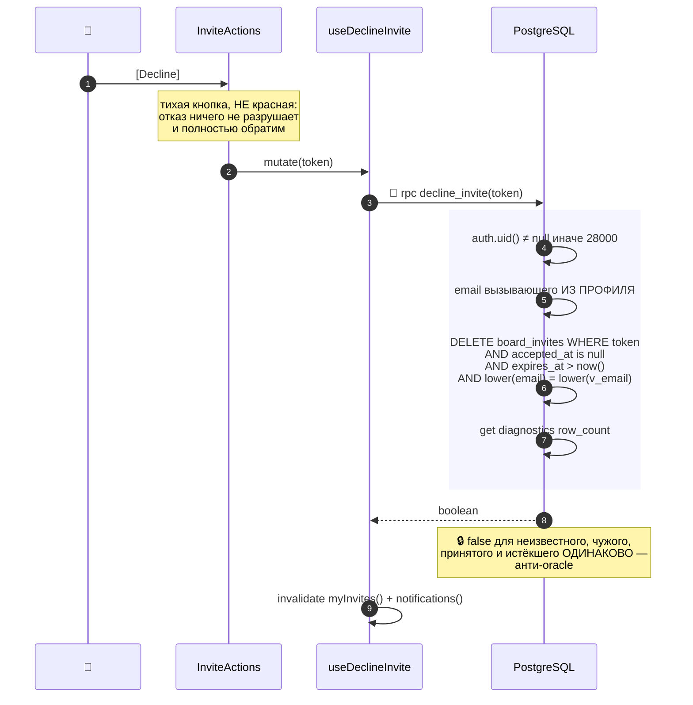

📖 [15 · Приглашения](15-invitations.md)

---

## 13 · Изменение роли участника

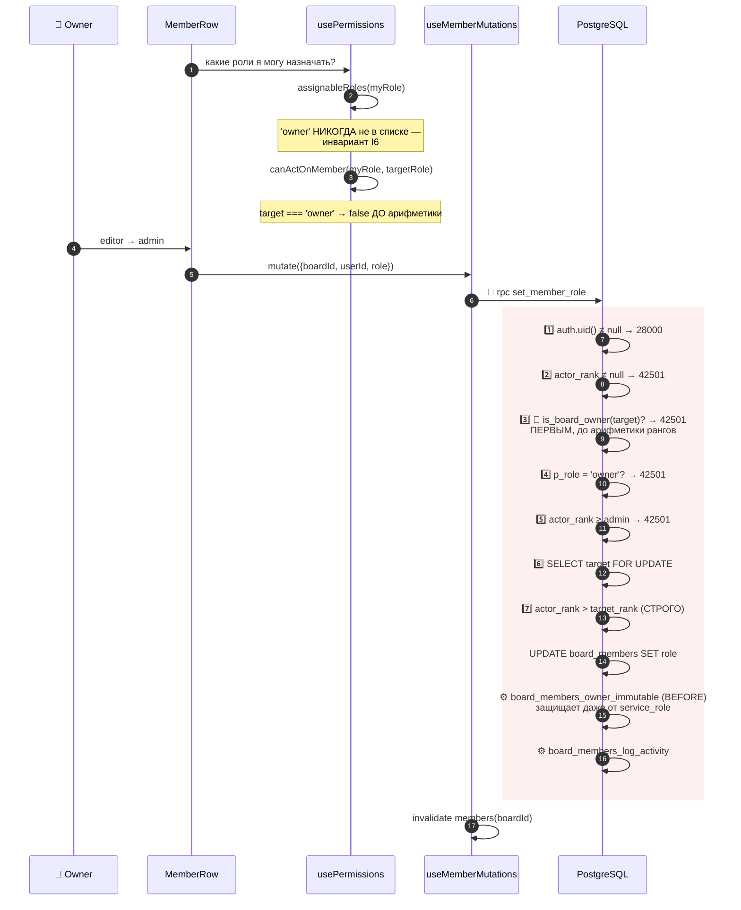

**Почему проверка владельца стоит третьей, до арифметики:** *«so the Owner stays
untouchable even if the arithmetic below were wrong»* — defence in depth внутри
одной функции.

📖 [08 · Безопасность](08-security.md)

---

## 📊 Сводная таблица

| # | Journey | Оптимистично? | 🔐 Точки безопасности | ⚙️ Триггеры |
|---|---|---|---|---|
| 1 | Регистрация | — | `username_available`, unique index | `handle_new_user`, `on_auth_user_confirmed` |
| 2 | Вход | — | `login_email_for`, одинаковое сообщение | — |
| 3 | Сброс пароля | — | ответ не зависит от существования адреса | — |
| 4 | Создать Space | ❌ | RLS owner-only, CHECK длины | `spaces_set_updated_at` |
| 5 | Создать Board | ❌ | RLS INSERT, `boards_space_ownership` | `boards_add_owner_membership` 🔑 |
| 6 | Создать задачу | ✅ | RLS `WITH CHECK`, composite FK | `assign_board_key`, `log_activity`, `notify_assignment` |
| 7 | Переместить задачу | ✅ | RLS `USING`+`WITH CHECK`, composite FK | `log_activity` |
| 8 | Timeline-росчерк | ✅ | то же + `date_range_check` | то же |
| 9 | Назначить исполнителя | ✅ | RLS, `board_roster` | `log_activity`, `notify_assignment` |
| 10 | Пригласить | ❌ | 6 проверок в RPC, токен на сервере | `notify_on_invite` |
| 11 | Принять | ❌ | `FOR UPDATE`, 5 проверок | — |
| 12 | Отклонить | ❌ | адрес у вызывающего, единый `false` | — |
| 13 | Сменить роль | ❌ | 7 проверок, владелец первым | `owner_immutable`, `log_activity` |

**Закономерность:** оптимистично обновляется только то, **результат чего
предсказуем** — операции над задачами. Всё, что проходит через RPC с проверками
прав, ждёт ответа сервера, потому что клиент не может знать заранее, разрешат ли.

---

## 🧪 Мини-квиз

<details>
<summary><b>1.</b> Почему создание задачи оптимистично, а создание доски — нет?</summary>

Потому что результат создания задачи **предсказуем**: клиент знает id (сам его
сминтил), колонку, ранг и всё, что покажет карточка, кроме `board_key`. Создание
доски проходит через триггеры (`boards_add_owner_membership`) и возвращает
поля, которые клиент угадать не может, а сама операция редкая — экономия одного
round-trip'а не стоит сложности.
</details>

<details>
<summary><b>2.</b> Какой шаг в journey «создание доски» самый важный и почему?</summary>

Триггер `boards_add_owner_membership`. Без него `accessible_board_ids()` вернул
бы доску (по `owner_id`), но `board_role()` вернул бы `null` — и владелец **не
смог бы писать** в собственную доску, потому что все write-политики читают
`board_role`, а не владение.
</details>

<details>
<summary><b>3.</b> В journey 11 «уже участник» возвращается ДО проверки <code>accepted_at</code>. Зачем такой порядок?</summary>

Типичный сценарий — человек принял приглашение и снова открыл ту же ссылку из
письма. Он действительно участник, и правильный ответ — отвести на доску.
Проверка `accepted_at` предназначена для **другого** человека, пытающегося
использовать уже погашенный токен. Обратный порядок пугал бы законного
участника ошибкой «приглашение уже использовано».
</details>

<details>
<summary><b>4. Predict:</b> в journey 7 сеть отвалилась после оптимистичной записи. Что увидит пользователь?</summary>

Карточка вернётся на место (`onError` восстановит `previousTodos`) и появится
тост от `MutationCache.onError`. Если снимка не было — запись кэша удалится
целиком (`removeQueries`), потому что `setQueryData(key, undefined)` — no-op и
оптимистичный порядок пережил бы отказ. Ретрая не будет: `mutations.retry: false`.
</details>

<details>
<summary><b>5.</b> Почему в journey 9 <code>useUpdateTodo</code> инвалидирует <code>todo(id)</code>, а не патчит?</summary>

Потому что мутация возвращает **узкую** проекцию строки (12 колонок доски), а
запись `todo(id)` держит полную строку с `description`. Мёрдж оставил бы
`description` в состоянии «до правки». Инвалидация бесплатна, когда панель
детали закрыта: у запроса нет наблюдателя, и refetch не произойдёт.
</details>

<details>
<summary><b>6.</b> Что общего у journey 3, 12 и части journey 2 с точки зрения безопасности?</summary>

Все три **намеренно не различают** случаи, чтобы не стать оракулом. Сброс пароля
отвечает одинаково независимо от существования адреса. `decline_invite` возвращает
`false` для неизвестного, чужого, принятого и истёкшего токена одинаково. Вход
даёт дословно одно сообщение при неизвестном username и при неверном пароле.
</details>

---

[← 24 · Деплой](24-deployment.md) · [Оглавление](README.md) · [Далее: 26 · Как построить это самому →](26-rebuild-from-zero.md)
