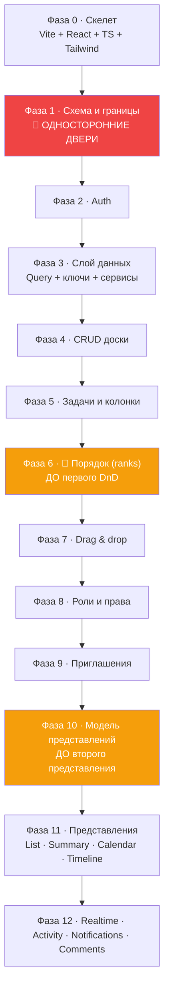

# 26 · Как бы я построил это сам

[← 25 · User journeys](25-user-journeys.md) · [Оглавление](README.md) · [Далее: 27 · Почему мы сделали так →](27-architecture-decisions.md)

---

> Эта глава отвечает на вопрос: **«Если завтра всё удалить — смогу ли я собрать
> это заново?»**
>
> Порядок фаз — не тот, в котором Veylo строился исторически. Это порядок,
> который **проект сам вывел** через ретроспективу: `docs/IMPLEMENTATION_PLAN.md`
> содержит таблицу «Build order — the sequence to actually work in», и каждая
> строка объясняет, **что пришлось бы переделывать**, если запустить её раньше.

---

## 🧭 Принцип, определяющий весь порядок

```
Сначала решения, которые нельзя отменить.
Потом решения, которые дорого отменить.
Потом всё остальное.
```

**«Односторонние двери»** — термин из плана. Три примера:

| Решение | Почему односторонняя дверь |
|---|---|
| `boards.key_prefix` + счётчик на доске | *«has to be settled before a user can create a second board, or two boards both hand out KAN-1»* |
| «Space — не область прав» | *«had to be answered before a `spaces` table existed rather than after»* |
| `todos.id` → uuid | *«Once M7 adds `comments.todo_id`, every referencing table needs the same swap in the same transaction»* |

**Общее свойство:** цена решения растёт с количеством данных и ссылок. Принять
его **до** появления данных — бесплатно. После — миграция.

---

## 📐 Карта фаз



**Три критические точки:**
- 🔴 **Фаза 1** — решения, которые дороже всего отменить.
- 🟠 **Фаза 6** — ранги **до** первого DnD, иначе DnD пишется дважды.
- 🟠 **Фаза 10** — модель представлений **до** второго представления, иначе
  фильтры расходятся.

---

## Фаза 0 · Скелет (½ дня)

**Что нужно знать заранее:** ничего сверх «умею запустить `npm create`».

```bash
npm create vite@latest veylo -- --template react-ts
npm i tailwindcss @tailwindcss/vite
npm i @tanstack/react-query react-router @supabase/supabase-js
```

**Что делаем:**
- `tsconfig.app.json`: `strict`, `noUnusedLocals`, `noUnusedParameters`, alias `@/`;
- `src/styles/global.css`: `@theme inline` с токенами и `@custom-variant dark`;
- инлайн-скрипт темы в `index.html` (**до** React, иначе FOUC);
- ESLint + Prettier + `prettier-plugin-tailwindcss`;
- CI: `lint` → `build` → `test`.

**❗ Не откладывать:** `strict` и `noUnusedLocals`. Включить их через месяц —
это сотни ошибок разом. Включить сразу — ноль.

**Проверка фазы:** `npm run build` зелёный, тема переключается без вспышки.

---

## Фаза 1 · Схема и границы (2–3 дня) 🔴

> **Самая важная фаза. Ошибки здесь стоят миграций, а не рефакторингов.**

**Что нужно знать:** SQL DDL, foreign keys, что такое RLS, `USING` vs
`WITH CHECK`.

### Шаг 1.1 — Ответить на пять вопросов **до** первой таблицы

| Вопрос | Ответ Veylo | Цена ошибки |
|---|---|---|
| **Что является единицей владения?** | Board | переписать каждую политику и запрос |
| **Space — это область прав?** | Нет | вторая система авторизации |
| **Какие типы ключей?** | uuid везде | миграция типа PK с пересборкой таблицы |
| **Кто генерирует id задачи?** | Клиент | флаг `isOptimistic` и логика примирения |
| **Читаемые ключи — глобальные или на доску?** | На доску | два `KAN-1` в один момент |

### Шаг 1.2 — Таблицы, по порядку зависимостей

```sql
profiles (id = auth.users.id)          -- 1:1 с auth
spaces (owner_id → profiles)           -- owner-only
boards (owner_id → profiles,
        space_id → spaces NULL,
        key_prefix, next_key)          -- 🔑 ЕДИНИЦА ВЛАДЕНИЯ
board_members (board_id, user_id) PK   -- M2M + role
columns (board_id NOT NULL)
todos (board_id NOT NULL,
       column_id, board_key)
```

**Правило, которое экономит месяцы:** каждая коллаборативная таблица получает
`board_id NOT NULL` — **даже если он выводится**. Это ключ каждой политики.
`comments.board_id` денормализован именно поэтому, и композитный FK не даёт ему
разойтись.

### Шаг 1.3 — RLS в той же миграции

```sql
create table public.todos (...);
alter table public.todos enable row level security;   -- ⬅️ ТОТ ЖЕ ФАЙЛ
create policy "Members select todos" on public.todos
  for select to authenticated
  using (board_id in (select public.accessible_board_ids()));
```

**Между `create table` и отдельной миграцией с политикой существует окно, в
котором таблица открыта всем.** Один файл его закрывает.

### Шаг 1.4 — Три помощника

```sql
accessible_board_ids()   -- setof uuid → InitPlan, один раз на оператор
board_role(board_id)     -- text
is_board_member(board_id)-- boolean
```

Все три — `SECURITY DEFINER` + `set search_path = ''`, иначе политика на
`board_members`, читающая `board_members`, **рекурсирует в жёсткий 500**.

**Проверка фазы:** SQL-скрипт, который под ролью `authenticated` с чужим
`auth.uid()` получает `[]` на чтении и `42501` на записи.

---

## Фаза 2 · Auth (1–2 дня)

**Что нужно знать:** JWT, access/refresh, чем аутентификация отличается от
авторизации.

**Порядок:**
1. `AuthProvider` — **один** `getSession()` и **одна** подписка. Смонтирован
   **выше** `QueryClientProvider`, потому что должен звать `queryClient.clear()`
   на `SIGNED_OUT`.
2. Context **без дефолтного значения** + `throw` в `useAuth`.
3. `ProtectedRoute` / `PublicRoute`.
4. `handle_new_user` — триггер на `auth.users`, который **не имеет права
   падать** (он внутри вставки).
5. `provision_user` — идемпотентная транзакция: profile + space + board + колонки.

**❗ Решить сразу:** обязательно ли подтверждение почты. Это меняет **всю**
регистрацию: без сессии клиент не может писать в `profiles`, и username едет
через `options.data` в метаданные.

**Проверка фазы:** регистрация → письмо → подтверждение → доска с четырьмя
колонками существует. Повторный вход не создаёт вторую доску.

---

## Фаза 3 · Слой данных (1 день)

**Что нужно знать:** TanStack Query — query/mutation/cache, `staleTime` vs
`gcTime`.

```
src/services/
├── api/supabase.ts          ← один клиент, броски при отсутствии env
├── queryClient/
│   ├── queryKeys.ts         ← 🔑 единственное место, где ключ записан
│   ├── queryClient.ts       ← staleTime, MutationCache.onError → тост
│   └── retryPolicy.ts       ← ЧИТАЕТ И status, И code
└── <feature>/
    ├── <feature>Api.ts      ← сырой supabase, if (error) throw error
    └── use<Thing>.ts        ← useQuery / useMutation
```

**❗ Три вещи, которые дешевле сделать сейчас:**

1. **Фабрика ключей с обязательным `boardId`.** Даже если он может быть
   `undefined`. Это превращает «найди все места, читающие доску» в **ошибку
   компилятора**.
2. **`MutationCache.onError` → тост.** Без него отказ RLS выглядит **как
   успех**, и симптом проявляется только после F5.
3. **`retryPolicy`, читающий обе формы ошибки.** PostgREST не несёт HTTP-статус,
   только `code`.

**Проверка фазы:** намеренно сломать политику → увидеть тост, а не тишину.

---

## Фаза 4 · CRUD доски (1 день)

- `boards` / `spaces` API + хуки;
- `groupBoardsBySpace` — **чистая функция с тестом**;
- сайдбар;
- маршрут `/boards/:boardId`, `useBoardId()`;
- `isUuid()` перед запросом — иначе кривой uuid даст ошибку типа, а не 404.

**❗ Не класть пространство в путь.** `/boards/:id`, не
`/spaces/:s/boards/:b` — иначе перекладывание доски ломает каждую ссылку.

---

## Фаза 5 · Задачи и колонки (2 дня)

- `todos` / `columns` API + хуки;
- **чистые cache-функции** в `cache.ts` — вне замыканий мутаций **с самого
  начала**;
- оптимистичные `useAddTodo`, `useUpdateTodo`, `useDeleteTodo`;
- `TodoCard` (презентационный) + `TodoItem` (контейнер);
- триггер `todos_assign_board_key`.

**❗ Cache-функции сразу снаружи.** Их придётся вызывать из realtime (фаза 12),
а обработчик канала не может залезть в `onMutate`. Вынести потом — рефакторинг
всех мутаций.

**❗ Правило иммутабельности с первого дня:** ни одна cache-функция не мутирует
вход. `onMutate` снимает снимок для отката, и кэш держит **те же объекты**.

---

## Фаза 6 · Порядок (1 день) 🟠

> **Критическая точка. Делать ДО первого drag & drop.**

Из плана:

> *«The last cheap moment for the ordering migration: **before any second
> reorderable surface exists** (backlog rows, timeline rows) and before the
> redesign touches drag affordances. **Doing it after means doing the DnD work
> twice.**»*

**Что строим:**

```ts
export const RANK_GAP = 1024;               // 2^10 — десять делений в целых
export function byRank(a, b) { ... }        // + fallback на position
export function rankBetween(before, after): number | null
export function rankForAppend(rows): number
export function neighboursAt(ordered, index): { before, after }
export function rankForDrop(column, index): number | null
```

Плюс RPC `rebalance_column_ranks(column_id)` и
`rebalance_board_column_ranks(board_id)`.

**❗ `rankBetween` возвращает `null` при исчерпании — ДО записи.** Иначе две
карточки получат один ранг, то есть ровно ту неопределённость порядка, ради
устранения которой всё затевалось.

**Проверка фазы:** тест, который делает 60 вставок в один зазор и убеждается,
что `null` приходит **раньше**, чем два ранга совпадут.

---

## Фаза 7 · Drag & drop (2–3 дня)

**Что нужно знать:** `@dnd-kit/core` — `DndContext`, `useDraggable`,
`useDroppable`, `collisionDetection`, `DragOverlay`.

```
useKanbanDnd      сенсоры + своя collisionDetection + индикаторы
DropZone          постоянно смонтированные зазоры между карточками
useBoardDragEnd   логика onDragEnd
resolveDropIndex  🔑 зазор → ИМЯ карточки под ним
useTodoDrop       мутация: одна строка + ребаланс при исчерпании
```

**❗ Три решения, которые определяют всё:**

1. **Ничего не переливается.** Двигается только `DragOverlay`. Значит,
   collision detection ищет **ближайший зазор по расстоянию**, а не
   пересечение.
2. **`resolveDropIndex` с самого начала.** Кажется преждевременным, пока нет
   фильтров — но именно фильтры его и потребуют, и без него дроп в последний
   зазор работает только благодаря тому, что `splice` клампит индекс.
3. **`touchesActive` → пустой массив коллизий.** Зазор у самой карточки — это
   операция-пустышка.

**Клавиатура — сразу, не потом.** Ретрофит доступности — это работа дважды.
Ключ: `pointerCoordinates ?? centreOf(collisionRect)` — одна строка, сводящая
клавиатуру и мышь в один путь.

---

## Фаза 8 · Роли и права (2–3 дня)

**Порядок обязателен:**

```
1. board_role_rank(text) → integer      viewer 1 < editor 2 < admin 3 < owner 4
2. RPC членства (все SECURITY DEFINER, каждая со своей проверкой):
     add_board_member · set_member_role · remove_board_member · leave_board
3. Триггеры неизменяемости владельца (BEFORE, включая service_role)
4. board_roster(board_id) — граница раскрытия
5. permissions.ts на клиенте — ЗЕРКАЛО, не замок
6. SQL-харнесс, проверяющий каждую клетку матрицы
```

**❗ Порядок проверок внутри RPC:**

```sql
1. auth.uid() ≠ null
2. вызывающий — участник
3. 🔑 цель — владелец? → отказ  ⬅️ ДО арифметики рангов
4. запрашиваемая роль ≠ 'owner'
5. вызывающий ≥ admin
6. actor_rank > target_rank (СТРОГО)
```

Третий шаг **до** арифметики — чтобы владелец остался защищённым, даже если
арифметику однажды сломает рефакторинг.

**❗ `board_members` не получает НИ ОДНОЙ write-политики.** RLS включена, политик
нет = запрещено всё. Каждая мутация — через RPC.

**❗ `roleRank` возвращает `null`, а не `0`.** `null <= 2` в JS даёт `true` —
это форма, которая превращает отказ в разрешение.

**Проверка фазы:** харнесс, покрывающий каждую клетку обеих матриц, с проверкой
**формы отказа** (`[]` для чтения, `42501` для записи), заканчивающийся
`ROLLBACK`.

---

## Фаза 9 · Приглашения (1–2 дня)

```
board_invites (token UNIQUE, expires_at, accepted_at, email NULL,
               CHECK role in ('admin','editor','viewer'))   ⬅️ 'owner' невозможен
create_invite     6 проверок, токен gen_random_bytes(24), срок зажат 1..30
accept_invite     FOR UPDATE, already_member ≠ ошибка
decline_invite    → boolean, адрес у вызывающего
revoke_invite     → DELETE
my_pending_invites 🔑 ЕДИНСТВЕННЫЙ источник токена
```

**❗ Токен генерирует сервер.** Клиентский токен был бы перебираемым.

**❗ Маршрут `/invite/:token` вне обоих guard'ов** — должен работать в обоих
состояниях сессии, и `?next=` проносит токен через вход (с `safeNext`).

---

## Фаза 10 · Модель представлений (1 день) 🟠

> **Критическая точка. Делать ДО второго представления.**

```ts
// registry.ts — что представление МОЖЕТ
export interface ViewCapabilities {
  canReorder: boolean;   // 🔑 ровно одно true, защищено тестом
  canGroup: boolean;
  canSort: boolean;
}

// useVisibleTodos — ЕДИНСТВЕННЫЙ pipeline
scope → filter → search → sort
```

**❗ Почему до второго представления.** Из плана:

> *«Put the filter in `KanbanBoard` and the list disagrees with it the first
> time one of them changes.»*

**❗ Тест на инвариант:**

```ts
it("exactly one view reorders", () => {
  expect(Object.values(VIEWS).filter(v => v.capabilities.canReorder)).toHaveLength(1);
});
```

Второй писатель порядка становится **падающим тестом**, а не открытием в
продакшене.

**❗ Группировка НЕ в pipeline.** Группы одинаковые, но во что они превращаются
— swimlane или заголовок секции — дело представления.

---

## Фаза 11 · Представления (3–4 дня)

**Порядок внутри фазы важен:**

```
1. List      ← доказывает, что pipeline работает для второго рендерера
2. Summary   ← доказывает, что представление может ничего не уметь
3. Calendar  ← ПЕРВАЯ дата-ось. БЕЗ миграции.
4. Timeline  ← вторая дата-ось. С миграцией.
```

**Почему Calendar **до** Timeline** — лучший пример управления риском в проекте:

> *«M19 found that `due_date` is a `timestamptz` rather than the `date` this
> plan assumed, and **that discovery decided this milestone's column type
> before a line of it was written**.»*

Дешёвое представление **без миграции** нашло ошибку в предположениях о типах.
Дорогое представление **с миграцией** получило готовый ответ.

**❗ Правило дат с первой минуты:**

```ts
toCalendarDay(value) { return value.slice(0, 10); }   // СРЕЗ, не парсинг
```

`Date` — только внутри форматтера, через `Date.UTC`, читается с
`timeZone: "UTC"`, наружу не выходит. Иначе задача «на 13-е» покажется «на
12-е» западнее Гринвича.

---

## Фаза 12 · Живой продукт (3–4 дня)

```
Realtime      канал на BoardPage, ПЕРЕИСПОЛЬЗУЕТ cache-функции фазы 5
Activity      триггеры, БЕЗ клиентского пути записи, entity_id БЕЗ FK
Notifications то же + payload как СНИМОК, токенов внутри нет
Comments      композитный FK на (todo_id, board_id), grant update (content)
```

**❗ Realtime — на уровне страницы, не представления.** Один канал на доску;
все пять представлений становятся live одновременно и ни одно не знает, что
realtime существует.

**❗ Правило журналов:** если запись — **свидетельство**, у неё не должно быть
клиентского пути записи. Ни INSERT-политики, ни INSERT-гранта.

**❗ `payload` — снимок, а не ссылки.** Уведомление — исторический факт; join
задним числом переписывал бы историю при переименовании доски.

---

## 🎓 Что нужно знать перед каждой фазой

| Фаза | Обязательные знания | Где подтянуть |
|---|---|---|
| 0 | Vite, TS basics | [03 · Стек](03-stack.md) |
| 1 | SQL DDL, FK, RLS, `USING`/`WITH CHECK` | [07](07-database.md), [08](08-security.md) |
| 2 | JWT, сессии, `SECURITY DEFINER` | [09 · Auth](09-auth.md) |
| 3 | TanStack Query, optimistic updates | [05 · Data flow](05-data-flow.md) |
| 4 | React Router, URL как state | [17 · Роутинг](17-routing.md) |
| 5 | React composition, иммутабельность | [04](04-react.md), [05](05-data-flow.md) |
| 6 | fractional indexing, точность double | [12 · Kanban](12-kanban.md) |
| 7 | dnd-kit core, collision detection | [12 · Kanban](12-kanban.md) |
| 8 | PL/pgSQL, триггеры, привилегии | [08 · Безопасность](08-security.md) |
| 9 | capability-модель, CSPRNG | [15 · Приглашения](15-invitations.md) |
| 10 | архитектура pipeline'ов | [05](05-data-flow.md), [12](12-kanban.md) |
| 11 | арифметика дат, CSS Grid | [13 · Timeline](13-timeline.md) |
| 12 | WAL, logical replication | [06 · Supabase](06-supabase.md) |

---

## ⚠️ Восемь ошибок, которые дороже всего исправить потом

| # | Ошибка | Цена | Правильно с первого дня |
|---|---|---|---|
| 1 | Задача принадлежит **пользователю** | переписать схему, политики, все запросы | `board_id NOT NULL` на каждой коллаборативной таблице |
| 2 | `serial`/`integer` вместо `uuid` | смена типа PK с пересборкой + все FK в одной транзакции | uuid везде |
| 3 | Порядок как **dense integer** | DnD пишется дважды; до этого — тихая потеря данных | fractional ranks **до** первого DnD |
| 4 | Авторизация **в React** | всё нужно переписать в БД; до этого — дыра | RLS с первой таблицы |
| 5 | RLS **отдельной миграцией** | окно, в котором таблица открыта всем | `enable row level security` в том же файле |
| 6 | Фильтры в компоненте представления | представления расходятся | один `useVisibleTodos` |
| 7 | Парсинг дат в локальный `Date` | сдвиг на день у половины пользователей | `slice(0, 10)`, `Date` под карантином |
| 8 | Cache-функции **внутри** `onMutate` | рефакторинг всех мутаций при добавлении realtime | чистые функции с фазы 5 |

---

## 📅 Реалистичная оценка

| Фаза | Дней | Накопительно |
|---|---|---|
| 0 · Скелет | 0.5 | 0.5 |
| 1 · Схема и границы | 3 | 3.5 |
| 2 · Auth | 2 | 5.5 |
| 3 · Слой данных | 1 | 6.5 |
| 4 · CRUD доски | 1 | 7.5 |
| 5 · Задачи и колонки | 2 | 9.5 |
| 6 · Порядок | 1 | 10.5 |
| 7 · Drag & drop | 3 | 13.5 |
| 8 · Роли и права | 3 | 16.5 |
| 9 · Приглашения | 2 | 18.5 |
| 10 · Модель представлений | 1 | 19.5 |
| 11 · Представления | 4 | 23.5 |
| 12 · Живой продукт | 4 | **27.5** |

**≈ 6 недель full-time** для одного разработчика, **знающего стек**.

Veylo делался дольше — потому что часть решений принималась **впервые**, и в
плане это записано: «Views shipped ahead of the plan», «Where the original M3
was wrong», «M9-05 amended after re-testing».

**Учиться и строить одновременно — это в 2–3 раза дольше, и это нормально.**

---

## 🧪 Мини-квиз

<details>
<summary><b>1.</b> Почему ранги (фаза 6) должны идти ДО drag & drop (фаза 7)?</summary>

Потому что DnD, написанный поверх dense-integer `position`, придётся **писать
заново**: `useTodoDrop`, `applyTodoMoved`, `dropIndex` и все мутации меняются
вместе с моделью порядка. И до момента замены каждое одновременное
перетаскивание двумя людьми **молча теряет данные** — не с конфликтом, а с
перезаписью карточек, которых второй редактор не касался.
</details>

<details>
<summary><b>2.</b> Почему решение «Space — не область прав» нужно принимать до создания таблицы <code>spaces</code>?</summary>

Потому что после появления данных это перестаёт быть решением и становится
миграцией данных плюс переписыванием политик. И альтернатива дорога сама по
себе: роль в пространстве и роль на доске могут противоречить, значит нужны
правило приоритета, второй набор RPC и вторая матрица прав — **вторая система
авторизации, купленная ради раскладки по папкам**.
</details>

<details>
<summary><b>3.</b> Почему Calendar строился до Timeline?</summary>

Управление риском. Calendar — дешёвое представление **без миграции**, и оно
обнаружило, что `due_date` это `timestamptz`, а не `date`, как предполагал план.
Это открытие определило тип колонки `start_date` **до того, как была написана
первая строка Timeline** — то есть до миграции, которую пришлось бы отменять
forward-fix'ом.
</details>

<details>
<summary><b>4.</b> Почему cache-функции надо выносить наружу сразу, а не когда появится realtime?</summary>

Потому что обработчик realtime-канала **не может залезть в `onMutate`**. Если
трансформации живут в замыканиях мутаций, добавление realtime означает либо
вторую реализацию тех же правил (которая разойдётся), либо рефакторинг всех
мутаций разом. Вынести с самого начала — ноль дополнительной работы.
</details>

<details>
<summary><b>5. Predict:</b> вы поставили <code>enable row level security</code> отдельной миграцией через неделю. Что было всю неделю?</summary>

Таблица была **открыта всем** — RLS выключена означает, что политики не
применяются вообще, и любой аутентифицированный клиент читал и писал любые
строки. Именно поэтому правило гласит: `enable row level security` и минимум
одна политика в **том же файле**, что `create table`.
</details>

<details>
<summary><b>6.</b> Что общего у всех восьми «дорогих ошибок» из таблицы?</summary>

Все восемь — решения, **цена отмены которых растёт со временем**: с объёмом
данных (типы, порядок), с количеством ссылающихся таблиц (uuid), с количеством
мест, которые их читают (авторизация, фильтры, cache-функции). Дешёвые ошибки
— те, чья цена постоянна; их можно откладывать. Эти — нельзя.
</details>

---

[← 25 · User journeys](25-user-journeys.md) · [Оглавление](README.md) · [Далее: 27 · Почему мы сделали так →](27-architecture-decisions.md)
