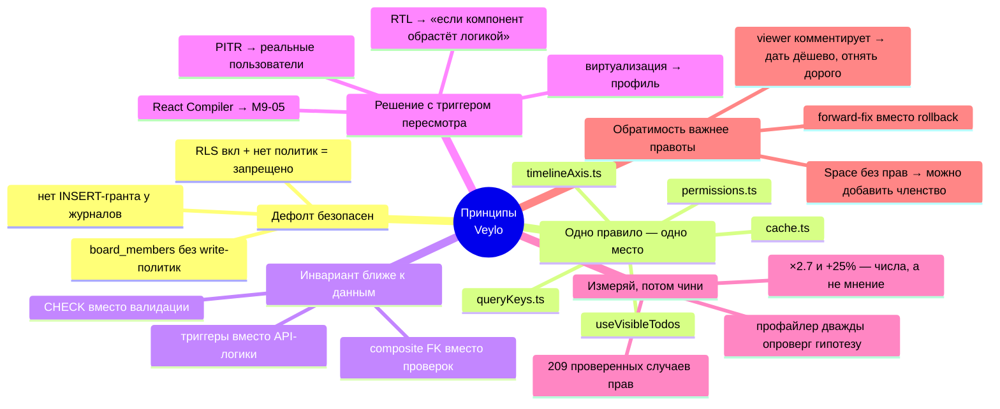

# 27 · Почему мы сделали так

[← 26 · Как построить самому](26-rebuild-from-zero.md) · [Оглавление](README.md) · [Далее: 28 · Вопросы с собеседования →](28-interview-questions.md)

---

> **Формат каждой записи (ADR — Architecture Decision Record):**
>
> **Решение** → **Причина** → **Альтернатива** → **Компромисс** → **Когда
> альтернатива была бы лучше**
>
> Последняя строка — самая важная. Решение без условия пересмотра — это догма,
> а не инженерия.

---

## 🗂 Оглавление решений

| # | Решение | Категория |
|---|---|---|
| [1](#1) | Supabase вместо своего backend | Инфраструктура |
| [2](#2) | Авторизация целиком в БД | Безопасность |
| [3](#3) | Board — единица владения, не User | Модель данных |
| [4](#4) | TanStack Query как единственный state-слой | Frontend |
| [5](#5) | Fractional ranks вместо dense positions | Модель данных |
| [6](#6) | Клиент генерирует UUID задачи | Frontend |
| [7](#7) | Самодельный DnD вместо `@dnd-kit/sortable` | Frontend |
| [8](#8) | Один плоский массив кэша на доску | Frontend |
| [9](#9) | Чистые cache-функции вне мутаций | Frontend |
| [10](#10) | Space — не область прав | Безопасность |
| [11](#11) | Привилегированные операции через RPC | Безопасность |
| [12](#12) | `board_members` без write-политик | Безопасность |
| [13](#13) | Триггеры вместо логики в API | Backend |
| [14](#14) | Токен приглашения не в уведомлении | Безопасность |
| [15](#15) | Username хранится lowercase | Модель данных |
| [16](#16) | Приглашения как отдельная таблица | Модель данных |
| [17](#17) | URL как хранилище состояния | Frontend |
| [18](#18) | Панели — параметры, не маршруты | Frontend |
| [19](#19) | React Compiler выключен | Производительность |
| [20](#20) | Виртуализация отклонена | Производительность |
| [21](#21) | Нет компонентных тестов | Тестирование |
| [22](#22) | Два конфига Vitest | Тестирование |
| [23](#23) | Даты как `timestamptz` + строковые операции | Модель данных |
| [24](#24) | Ровно одна поверхность пишет порядок | Архитектура |
| [25](#25) | Composite FK вместо проверок в коде | Модель данных |
| [26](#26) | Viewer может комментировать | Продукт |
| [27](#27) | PITR не включён | Инфраструктура |
| [28](#28) | Никто не правит чужой комментарий | Продукт |

---

## 1 · Supabase вместо своего backend

| | |
|---|---|
| **Решение** | Нет backend-сервера. PostgreSQL + PostgREST + GoTrue + Realtime. |
| **Причина** | В middleware-архитектуре безопасность — это **действие, которое нужно не забыть**. В RLS — **свойство таблицы**. Включил RLS без политик → таблица не отдаёт ничего. Дефолт стал безопасным. |
| **Альтернатива** | Node/Express + Prisma + свой auth + socket.io |
| **Компромисс** | Тяжёлую логику приходится писать на PL/pgSQL. Отладка политик трудна: отказ выглядит как «пустой результат». Vendor lock-in. |
| **Когда альтернатива лучше** | Нужна серверная логика, не выражаемая в SQL: генерация PDF, интеграции с внешними API, фоновые очереди, ML. Или команда без SQL-компетенций. |

**Про lock-in честно:** схема, политики, функции и триггеры — обычный
PostgreSQL. Съезд означает написать свой auth-слой и REST/realtime, но **данные
и правила доступа переезжают как есть**. Это принципиально дешевле, чем съезд с
Firestore.

---

## 2 · Авторизация целиком в БД

| | |
|---|---|
| **Решение** | Ни одно правило доступа не существует только в React. `permissions.ts` — **зеркало**, не замок. |
| **Причина** | Из плана: *«Frontend permission checks are UX only. They decide what to render. They are never a security control.»* |
| **Альтернатива** | Проверки в API-слое или в компонентах |
| **Компромисс** | Правило описано дважды (SQL + TS). Расхождение возможно, поэтому каждая строка `permissions.ts` **названа по своему правилу в БД**. |
| **Когда альтернатива лучше** | Правило зависит от внешнего сервиса или от данных, которых нет в БД. Тогда — RPC, а не React. |

**Что зеркало покупает:** *«a viewer who can press a button that always fails
reads the board as broken rather than as read-only»*.

---

## 3 · Board — единица владения, не User

| | |
|---|---|
| **Решение** | `todos.user_id` **удалён**. Владение — `boards.owner_id` + `board_members`. |
| **Причина** | Задача, принадлежащая пользователю, делает коллаборацию невозможной без переписывания схемы, всех политик и всех запросов. |
| **Альтернатива** | `todos.user_id` + отдельная таблица шаринга |
| **Компромисс** | Каждая коллаборативная таблица несёт `board_id NOT NULL`, включая `comments`, где он денормализован. |
| **Когда альтернатива лучше** | Продукт строго персональный и коллаборация не планируется **никогда**. |

**Тест для любой новой фичи** (из `docs/ARCHITECTURE.md`): *«Does this belong to
a Board? If yes, design it around the Board. Never design around a User if
collaboration is expected.»*

Авторство сохранилось как `todos.creator_id` — но это **факт о прошлом**, а не
право доступа.

---

## 4 · TanStack Query как единственный state-слой

| | |
|---|---|
| **Решение** | Весь серверный state — в Query. Zustand — ровно 2 файла клиентского state. |
| **Причина** | Redux решает «синхронизировать состояние **клиента**». Задача Veylo — «показывать **чужие** данные, которые устаревают». Дедупликация, ретраи, инвалидация, фоновое обновление — это Query **и есть**. |
| **Альтернатива** | Redux Toolkit + RTK Query, SWR, Apollo |
| **Компромисс** | Кэш — «магия», которую надо понимать. `staleTime`/`gcTime` — источник сюрпризов. |
| **Когда альтернатива лучше** | Приложение с большим **клиентским** состоянием (редактор, игра), где сервер вторичен. |

`stores/toasts.ts` живёт в Zustand по конкретной причине: писать в очередь нужно
из `MutationCache.onError`, **а это не компонент**.

---

## 5 · Fractional ranks вместо dense positions

| | |
|---|---|
| **Решение** | `rank double precision`. Перемещение = запись **одной строки**. |
| **Причина** | Dense integer означает перенумерацию колонки из **своего снимка** и запись всего массива. Два редактора → **молчаливая потеря данных**: перезаписываются карточки, которых второй не касался. |
| **Альтернатива** | Dense integers + серверный RPC переупорядочивания; CRDT/OT; строковые lexoranks |
| **Компромисс** | Точность `double` исчерпывается (~50 вставок в один зазор) → нужен ребаланс. `position` живёт как зеркало до M6-05. |
| **Когда альтернатива лучше** | Один редактор **гарантированно** — тогда dense проще. Нужны сложные merge-семантики — тогда CRDT. |

**Слово «silent» ключевое:** ни ошибки, ни конфликта — карточка однажды
оказывается не там.

---

## 6 · Клиент генерирует UUID задачи

| | |
|---|---|
| **Решение** | `crypto.randomUUID()` в `useAddTodo`. `addTodo` делает `upsert`. |
| **Причина** | Оптимистичная строка **является** реальной строкой. Нет флага `isOptimistic`, нет примирения фейкового id с настоящим. |
| **Альтернатива** | Серверный `gen_random_uuid()` + временный клиентский id |
| **Компромисс** | Клиент может прислать любой uuid, включая коллизию. `upsert` делает это безвредным. |
| **Когда альтернатива лучше** | Если id обязан быть последовательным или нести информацию (что само по себе анти-паттерн: последовательные id **раскрывают количество строк**). |

Бонус, названный в миграции: *«Under M6 realtime, a client-generated uuid makes
echo suppression an **identity match** instead of bespoke de-duplication.»*

---

## 7 · Самодельный DnD вместо `@dnd-kit/sortable`

| | |
|---|---|
| **Решение** | Только `@dnd-kit/core`. Ничего не переливается — двигается только `DragOverlay`. |
| **Причина** | UX-принцип 4: *«Drag and drop is a differentiator, not a checkbox.»* Плюс `sortable` вычисляет цель из переставленного порядка — а под фильтром видимый список ≠ хранимый. |
| **Альтернатива** | `@dnd-kit/sortable` — ~30 строк вместо ~400 |
| **Компромисс** | Своя collision detection, свой клавиатурный путь, `resolveDropIndex`. Больше кода и больше тестов. |
| **Когда альтернатива лучше** | Простой список без фильтров, без нескольких представлений и без требования «не дёргать layout». |

Бонус: `DropZone` в покое работает как affordance «создать задачу здесь» —
одного элемента хватает на две роли.

---

## 8 · Один плоский массив кэша на доску

| | |
|---|---|
| **Решение** | `["todos", boardId] → Todo[]`, не запись на колонку. |
| **Причина** | Перемещение между колонками правило бы **две** записи кэша, которые могут разойтись. Плюс List/Summary/Calendar/Timeline не мыслят колонками вообще. |
| **Альтернатива** | `["todos", boardId, columnId]` |
| **Компромисс** | Раскладка по колонкам — на клиенте, на каждый рендер. |
| **Когда альтернатива лучше** | Тысячи карточек и нужна пагинация **по колонкам**. |

---

## 9 · Чистые cache-функции вне мутаций

| | |
|---|---|
| **Решение** | `services/todos/cache.ts` — пять функций `(todos, …) => todos`, вне замыканий. |
| **Причина** | Realtime-обработчик **не может** залезть в `onMutate`, а применять обязан **те же** трансформации. |
| **Альтернатива** | Логика внутри `onMutate` + отдельная в realtime |
| **Компромисс** | Дополнительный слой косвенности. |
| **Когда альтернатива лучше** | Realtime точно не планируется. |

**Побочный выигрыш через четыре месяца:** правило «нетронутые строки — по
ссылке» писалось ради корректности отката, а окупилось производительностью —
именно оно сделало `memo(TodoItem)` однострочным исправлением ([глава
23](23-performance.md)).

---

## 10 · Space — не область прав

| | |
|---|---|
| **Решение** | `spaces` — owner-only. `boards.space_id` — раскладка, не доступ. |
| **Причина** | Альтернатива — *«a whole second authorization system, bought for **filing**»*: роль в пространстве и роль на доске могут противоречить → правило приоритета → второй набор RPC → вторая матрица. |
| **Альтернатива** | Роли на уровне пространства с наследованием |
| **Компромисс** | Участник видит доску как «Unfiled», если не владеет её пространством. |
| **Когда альтернатива лучше** | Когда организации становятся реальными и командам нужны общие пространства. **И решение обратимо:** `spaces` получит своё членство, `boards.space_id` не меняется. |

---

## 11 · Привилегированные операции через RPC

| | |
|---|---|
| **Решение** | Членство, приглашения, ростер, ребаланс — `SECURITY DEFINER` RPC. |
| **Причина** | Четыре разных повода: атомарность, нужен обход RLS, правило сложнее предиката, скрыть данные оставив ответ. |
| **Альтернатива** | Прямые операции над таблицами + политики |
| **Компромисс** | `SECURITY DEFINER` обходит RLS → функция **обязана** проверять права сама. Забытая проверка — открытая дверь. |
| **Когда альтернатива лучше** | Правило выражается предикатом над строкой — тогда политика проще и быстрее. |

Отсюда обязательные `set search_path = ''` и `revoke ... from public, anon`.

---

## 12 · `board_members` без write-политик

| | |
|---|---|
| **Решение** | RLS включена, SELECT — только своя строка, **write-политик нет вообще**. |
| **Причина** | RLS включена + нет политики = **запрещено всё**. Каждая мутация проходит через RPC с проверкой ранга. |
| **Альтернатива** | Политика вида `board_role(board_id) = 'admin'` на UPDATE |
| **Компромисс** | Клиент не может «просто написать» — всё через RPC. |
| **Когда альтернатива лучше** | Никогда для этой таблицы. Из плана: *«Adding a client-writable policy to `board_members` is a **security regression, not a shortcut**.»* |

Потому что политика не выражает «строго ниже своего ранга и никогда не
владельца» — это арифметика, а не предикат над строкой.

---

## 13 · Триггеры вместо логики в API

| | |
|---|---|
| **Решение** | `board_key`, `activities`, `notifications`, неизменяемость владельца — триггеры. |
| **Причина** | Инвариант, который обязан держаться для **любого** писателя, не может жить в одной функции. |
| **Альтернатива** | Логика в API-функциях |
| **Компромисс** | Триггеры невидимы в клиентском коде; отладка сложнее. |
| **Когда альтернатива лучше** | Побочный эффект **не** является инвариантом — например, аналитика, которую можно потерять. |

Отсюда: журнал — **свидетельство**, а не заявление клиента. Ни INSERT-политики,
ни INSERT-гранта.

---

## 14 · Токен приглашения не хранится в уведомлении

| | |
|---|---|
| **Решение** | `notifications.entity_id` = **id** приглашения. Токен — только из `my_pending_invites()`. |
| **Причина** | Токен — credential. Строка уведомления приходит клиенту обычным SELECT; любой путь к чтению строки стал бы путём **погашения**. |
| **Альтернатива** | Токен в `payload` — на один запрос меньше |
| **Компромисс** | Два источника данных, соединяемые по id (`inviteIdOf`). |
| **Когда альтернатива лучше** | Никогда. Общее правило: **не храните credential там, где хранится уведомление о нём.** |

---

## 15 · Username хранится lowercase

| | |
|---|---|
| **Решение** | `normalizeUsername` складывает регистр **на входе**. |
| **Причина** | *«the one that forgets [to fold case] is a bug nobody sees until two accounts collide»* |
| **Альтернатива** | Хранить как набрали + индекс по `lower()` |
| **Компромисс** | `Ada` рендерится как `ada` — **для чего и существует `full_name`**. |
| **Когда альтернатива лучше** | Если отображение регистра критично, а сравнений мало и они централизованы. |

Уникальный индекс всё равно по `lower(username)` — **defence in depth на уровне
схемы**: уникальность не зависит от того, сработала ли нормализация.

---

## 16 · Приглашения — отдельная таблица

| | |
|---|---|
| **Решение** | `board_invites` с токеном и сроком, а не «pending»-строка в `board_members`. |
| **Причина** | Приглашение по email человеку **без аккаунта** не имеет `user_id`, который можно было бы записать. |
| **Альтернатива** | `board_members` с флагом `pending` |
| **Компромисс** | Вторая таблица и второй жизненный цикл. |
| **Когда альтернатива лучше** | Если приглашать можно только **существующих** пользователей. |

Бонус: `board_members` остаётся вообще незаписываемой клиентом (решение 12).

---

## 17 · URL как хранилище состояния

| | |
|---|---|
| **Решение** | Вид, фильтры, поиск, сортировка, группировка, открытая задача, открытая панель — в search params. |
| **Причина** | Состояние экрана становится **отправляемым, возвращаемым и переживающим F5**. |
| **Альтернатива** | `useState` или Zustand |
| **Компромисс** | URL длинный; всё из него — **недоверенный ввод** (`readOne` по белому списку, `readList` с дедупликацией, `isUuid`, `safeNext`). |
| **Когда альтернатива лучше** | Состояние эфемерно и делиться им бессмысленно (открытое меню, черновик формы). |

---

## 18 · Панели — параметры, не маршруты

| | |
|---|---|
| **Решение** | `?panel=members`, а не `/boards/:id/members`. |
| **Причина** | Доска остаётся **смонтированной**: нет размонтирования, нет refetch'а, переживают скролл и свёрнутые колонки (клиентское, не persisted состояние). |
| **Альтернатива** | Вложенные маршруты |
| **Компромисс** | Панель не «настоящая страница»; нужна валидация значения. |
| **Когда альтернатива лучше** | Панель — полноценная страница со своими данными и SEO-значением. |

---

## 19 · React Compiler выключен

| | |
|---|---|
| **Решение** | Отключён, плагин и Babel удалены. |
| **Причина** | **Асимметрия**: стоимость измерена (×2.7 сборка, +25% чанк), выгода — нет. Включать blanket-мемоизатор до профилирования противоречит собственной инструкции M9-05. |
| **Альтернатива** | Включить |
| **Компромисс** | Мемоизация ручная — `React.memo` ровно дважды. |
| **Когда альтернатива лучше** | Если профайлер назовёт ре-рендеры узким местом. **Триггер записан:** «четыре devDependencies и три строки `vite.config.ts`». |

**И по существу он бы не помог:** проблемой была identity `listeners`,
создаваемого **внутри dnd-kit** — компилятор это не стабилизирует.

---

## 20 · Виртуализация отклонена

| | |
|---|---|
| **Решение** | M9-10 SKIPPED. |
| **Причина** | Профилирование показало **широту ре-рендеров**, а не размер DOM. Все 204 карточки уже смонтированы; фриз шёл на движениях мыши, **не менявших DOM вообще**. |
| **Альтернатива** | `react-window` / `@tanstack/virtual` |
| **Компромисс** | Доска на 10 000 карточек будет тяжёлой. |
| **Когда альтернатива лучше** | Если профиль назовёт размер DOM. Условие явно записано. |

**Отклонено доказательством, а не по умолчанию** — редкость.

---

## 21 · Нет компонентных тестов

| | |
|---|---|
| **Решение** | Vitest только для чистой логики. React Testing Library отсутствует. |
| **Причина** | Архитектура вынесла логику **из** компонентов. Тестировать компонент без логики — тестировать JSX. |
| **Альтернатива** | RTL + jsdom |
| **Компромисс** | Не ловятся регрессии рендера и доступности. Отсюда «browser verification owed» в плане — **записано, а не замолчано**. |
| **Когда альтернатива лучше** | *«Revisit if a component grows logic worth pinning down»* — условие записано в `CLAUDE.md`. |

---

## 22 · Два конфига Vitest

| | |
|---|---|
| **Решение** | `vitest.config.ts` (гейт) и `vitest.live.config.ts` (реальная БД). |
| **Причина** | *«a gate that needs credentials and a network **stops being run**»* |
| **Альтернатива** | Один конфиг + `describe.skipIf` |
| **Компромисс** | Две команды вместо одной. |
| **Когда альтернатива лучше** | Никогда: `skipIf` показал бы live-проверки **зелёными потому, что пропущены**. |

---

## 23 · Даты как `timestamptz` + строковые операции

| | |
|---|---|
| **Решение** | `start_date` / `due_date` — `timestamptz` в полночь UTC. Чтение — `value.slice(0, 10)`. |
| **Причина типа** | `CHECK` требует **immutable**-выражения, а сравнение `date` с `timestamptz` зависит от `TimeZone` сессии. `todos_date_range_check` был бы невозможен. |
| **Причина среза** | Парсинг переводит в локальный пояс: «13-е» станет «12-м» западнее Гринвича. |
| **Альтернатива** | `date` + date-fns/Temporal |
| **Компромисс** | Нельзя пользоваться готовыми date-библиотеками — арифметика написана в `calendar.ts`. |
| **Когда альтернатива лучше** | Если понадобится **время суток**, а не только день. Тогда часовые пояса становятся настоящей задачей. |

---

## 24 · Ровно одна поверхность пишет порядок

| | |
|---|---|
| **Решение** | `registry.test.ts` утверждает, что ровно одно представление имеет `canReorder: true`. |
| **Причина** | Второй писатель означал бы два представления, перенумеровывающих одну колонку из двух устаревших снимков. |
| **Альтернатива** | Комментарий «не делайте так» |
| **Компромисс** | Timeline и Calendar не могут менять порядок строк. |
| **Когда альтернатива лучше** | Если модель порядка станет конфликтоустойчивой настолько, что второй писатель безопасен. |

**Инвариант защищён тестом, а не памятью** — второй писатель становится
падающим тестом, а не открытием в продакшене.

---

## 25 · Composite FK вместо проверок в коде

| | |
|---|---|
| **Решение** | `todos (column_id, board_id) → columns (id, board_id)`; то же для `comments`. |
| **Причина** | Обычный FK разрешил бы поставить задачу доски A в колонку доски B. Композитный делает это **структурно невозможным**. |
| **Альтернатива** | Проверка в API или в политике |
| **Компромисс** | Нужны уникальные индексы `(id, board_id)` на целевых таблицах. |
| **Когда альтернатива лучше** | Никогда, если правило выражается ключом. *«Integrity, not authorization — it refuses the owner exactly as it refuses an editor.»* |

---

## 26 · Viewer может комментировать

| | |
|---|---|
| **Решение** | Любой участник, включая viewer, может писать комментарии. |
| **Причина** | *«Commenting is participation, not content. A reviewer who can read a board but not change it is exactly the person with something to say about it.»* |
| **Альтернатива** | Комментарии как content → editor+ |
| **Компромисс** | Viewer перестаёт быть строго read-only. |
| **Когда альтернатива лучше** | Если viewer — внешний наблюдатель, которому нельзя оставлять следов. |

И решающий аргумент про направление: *«The capability is cheap to grant now and
**expensive to withdraw once people use it**, so the reversible direction was
taken.»*

---

## 27 · PITR не включён

| | |
|---|---|
| **Решение** | Point-in-Time Recovery отсутствует. |
| **Причина** | ~$125/мес, не покрывается spend cap, ради набора фикстур. |
| **Альтернатива** | Включить |
| **Компромисс** | Миграция, уничтожающая данные, требует **дампа заранее** — отсюда деление Tier A / Tier B. |
| **Когда альтернатива лучше** | Как только появятся реальные пользователи с данными, потеря которых — инцидент. |

**Ограничение бюджета превратилось в инженерную дисциплину** — это и есть
ценность записанного решения.

---

## 28 · Никто не правит чужой комментарий

| | |
|---|---|
| **Решение** | Автор правит только свой текст. Админ может **удалить** любой, но не изменить. |
| **Причина** | *«an admin who could would make the attribution a lie, which is a different and worse thing than removing them»* |
| **Альтернатива** | Модерация с правом редактирования |
| **Компромисс** | Нельзя поправить опечатку в чужом комментарии. |
| **Когда альтернатива лучше** | Публичная площадка, где нужна редактура. Даже там честнее — «отредактировано модератором». |

Технически выражено **column-level grant** (`grant update (content)`), потому
что row-level политика не умеет сказать «можно менять только эту колонку».

---

## 📊 Шесть сквозных принципов

---

## 🧪 Мини-квиз

<b>1.</b> Какой формат у решения, которое можно защитить на code review?

Пять частей: **решение**, **причина**, **альтернатива**, **компромисс** и
**условие, при котором альтернатива станет лучше**. Без последней части это
догма. Именно поэтому у React Compiler записан триггер (M9-05), у виртуализации
— условие («если профиль назовёт размер DOM»), у RTL — «если компонент обрастёт
логикой», у PITR — «когда появятся реальные пользователи».

<b>2.</b> Почему «обратимость важнее правоты»?

Потому что заранее правоту не установить. Space без прав **можно** превратить в
область прав — `spaces` получит своё членство, `boards.space_id` не меняется.
Разрешение viewer'у комментировать дёшево дать и **дорого отнять**, когда люди
уже пользуются, поэтому выбрано обратимое направление. Forward-fix вместо
rollback — то же свойство на уровне миграций.

<b>3.</b> Какие три решения связаны в одну цепочку через «единица владения — Board»?

№3 (Board — единица владения) → №25 (composite FK, следящий, что колонка задачи
принадлежит её доске) → №12 (`board_members` без write-политик, потому что
членство и есть механизм владения). Плюс №10: Space **не** входит в эту цепочку
намеренно — иначе появилась бы вторая система авторизации.

<b>4. Predict:</b> команда решила добавить второе представление с <code>canReorder: true</code>. Что произойдёт по шагам?

Упадёт `registry.test.ts`, потому что он утверждает **ровно одно** такое
представление. Дальше нужно осознанно ответить на вопрос, который тест задаёт:
два писателя порядка перенумеровывают одну колонку из двух устаревших снимков.
С fractional ranks (решение №5) это уже **не** катастрофа — перемещение пишет
одну строку, — но правило было введено при dense positions и его отмена требует
явного решения, а не молчаливой правки теста.

<b>5.</b> Назови решение, чей компромисс уже стоил проекту денег или времени.

№27 (PITR не включён): из-за него две Tier B миграции применялись без дампа
(зафиксировано в плане как «Standing note»), и понадобилось изобрести деление
Tier A / Tier B, чтобы каждая миграция не требовала полной процедуры.
Ограничение бюджета превратилось в дисциплину — но заплатить пришлось
проектированием процесса.

---

[← 26 · Как построить самому](26-rebuild-from-zero.md) · [Оглавление](README.md) · [Далее: 28 · Вопросы с собеседования →](28-interview-questions.md)
