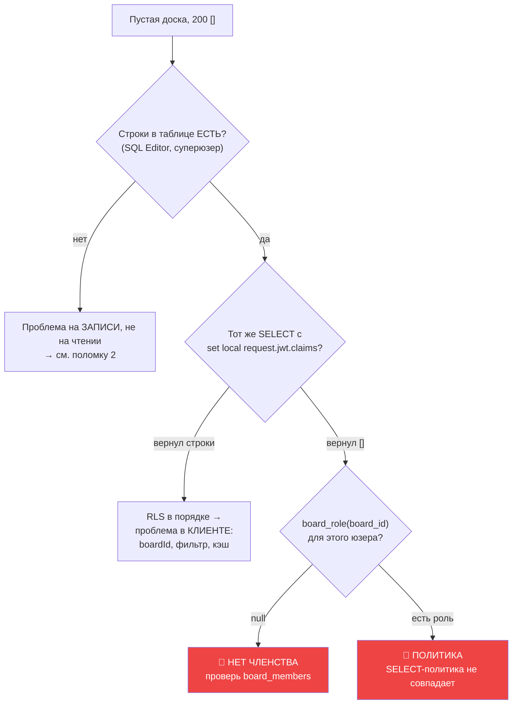
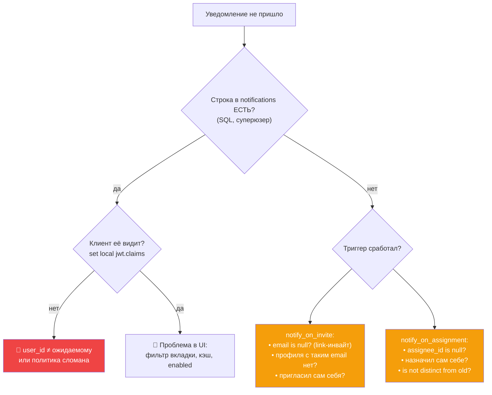
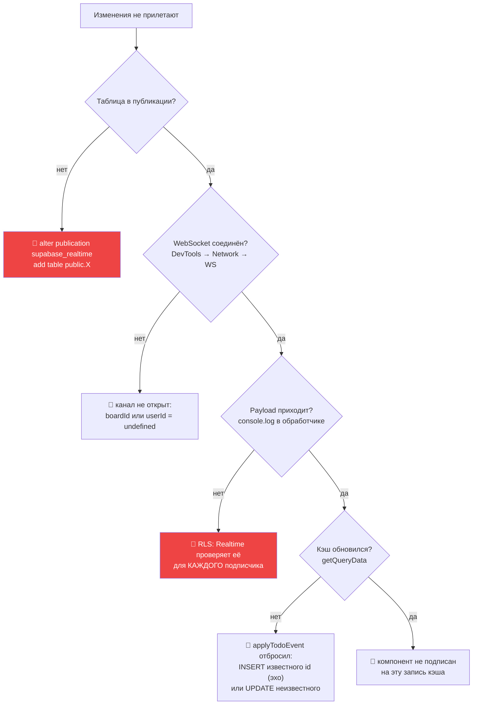
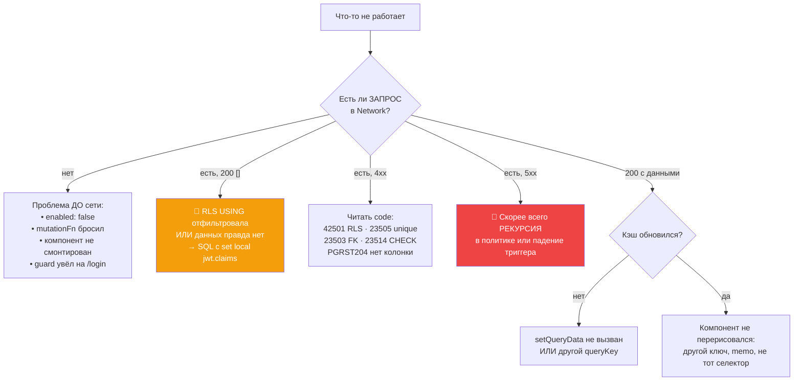

# 29 · Школа отладки

[← 28 · Вопросы с собеседования](28-interview-questions.md) · [Оглавление](README.md) · [Далее: 30 · Глоссарий →](30-glossary.md)

---

## 🧒 LEVEL 1

> Отладка — это **сужение области поиска**, а не угадывание.

Плохо: «попробую поменять вот это». Хорошо: «разделю систему пополам и выясню,
в какой половине проблема».

**Универсальный вопрос:**

> **Где именно правда перестаёт быть правдой?**

```
Пользователь  →  UI  →  Хук  →  Кэш  →  Сервис  →  Сеть  →  PostgREST  →  RLS  →  Таблица
     👁                                                                            📊
   что видно                                                                  что на самом деле
```

Найди **первое место слева направо**, где значение уже неправильное. Дальше
искать не нужно.

---

## 🧰 Инструменты Veylo

| Инструмент | Что показывает | Когда |
|---|---|---|
| **DevTools → Network** | реальный запрос, статус, тело ответа | всегда первым |
| **React Query DevTools** | ⚠️ **не установлены** — используй `queryClient.getQueryData()` в консоли | состояние кэша |
| **Supabase SQL Editor** | выполнить запрос как суперюзер | «а что реально в таблице?» |
| `set local request.jwt.claims` | выполнить **от имени пользователя** | 🔑 «а видит ли ЭТО пользователь?» |
| `supabase migration list` | local ↔ remote попарно | «применена ли миграция?» |
| `npm run build` | **единственный** typecheck | «почему в CI красное?» |
| `console.error` в fallback | оригинальный SQLSTATE | ошибки, скрытые обобщением |
| `scripts/verify-m3-16-role-matrix.sql` | 105 случаев прав | «сломал ли я политику?» |

### 🔑 Главный приём: выполнить запрос от имени пользователя

```sql
begin;
  set local request.jwt.claims = '{"sub":"<uuid пользователя>"}';
  set local role authenticated;

  select id, title from public.todos where board_id = '<uuid доски>';
  -- ⬆️ ровно то, что увидит ЭТОТ пользователь
rollback;
```

**`set local role authenticated` обязателен.** Без него запрос идёт от
суперюзера, у которого RLS обойдена **и** все гранты есть — то есть проверяется
ничего.

---

# 🔴 Десять реальных поломок

---

## 1 · «Доска пустая, ошибок нет»

**Симптомы:** карточек нет, спиннера нет, тоста нет, в консоли чисто.
Network показывает `200 OK` и `[]`.

**Почему это самый коварный класс:**

> Отказ `USING` в RLS **не является ошибкой ни на одном слое**. PostgREST
> вернёт `200 []`. Ни тоста, ни ретрая, ни лога.



**Пошагово:**

```sql
-- 1. Строки вообще есть?
select count(*) from public.todos where board_id = '<uuid>';

-- 2. Видит ли их пользователь?
begin;
  set local request.jwt.claims = '{"sub":"<user uuid>"}';
  set local role authenticated;
  select count(*) from public.todos where board_id = '<uuid>';
rollback;

-- 3. Какая у него роль?
begin;
  set local request.jwt.claims = '{"sub":"<user uuid>"}';
  select public.board_role('<uuid доски>'), public.is_board_member('<uuid доски>');
rollback;

-- 4. Есть ли доска в списке доступных?
begin;
  set local request.jwt.claims = '{"sub":"<user uuid>"}';
  select * from public.accessible_board_ids();
rollback;
```

**Частые причины:**

| Причина | Признак | Фикс |
|---|---|---|
| Нет строки в `board_members` | `board_role` → `null` | добавить членство через RPC |
| **Владелец без членства** | `accessible_board_ids` возвращает доску, но `board_role` = `null` | триггер `boards_add_owner_membership` не сработал |
| Клиент шлёт не тот `boardId` | Network: другой uuid | `useBoardId()` / маршрут |
| Фильтр в UI скрыл всё | `total` > 0, `todos` = 0 | заголовок покажет «0 из 57» |
| Кэш пустой под другим ключом | `getQueryData` возвращает `undefined` | ключ `boardId` = `undefined` |

**🎯 Проверка на «владельца без членства»** — самый частый нетривиальный
случай: `accessible_board_ids()` возвращает доску через `owner_id`, поэтому
доска **открывается**, но все write-политики читают `board_role`, который
возвращает `null` — и владелец не может **писать** в свою доску.

---

## 2 · «Карточка появляется и исчезает после F5»

**Симптомы:** создал задачу, она на экране; F5 — её нет. Ошибки нет.

**Диагноз:** оптимистичное обновление сработало, запись — нет.

> Это **ровно тот баг**, ради которого существует `MutationCache.onError`:
> *«a rejected write and a successful one looked identical — an RLS policy could
> deny every insert and the only symptom would be cards that vanish on
> refresh.»*

**Проверка:**

```
1. DevTools → Network → фильтр по "todos"
2. Найти POST/PATCH
3. Смотреть СТАТУС и ТЕЛО
```

| Ответ | Диагноз |
|---|---|
| `403` + `{"code":"42501"}` | 🎯 RLS `WITH CHECK` отверг вставку |
| `409` + `{"code":"23503"}` | 🎯 composite FK: колонка не из этой доски |
| `400` + `{"code":"23514"}` | 🎯 CHECK: `todos_date_range_check` или неверный `type`/`priority` |
| `400` + `PGRST204` | 🎯 колонки нет в схеме — **типы не перегенерированы** |
| **Запроса нет вообще** | `mutationFn` бросил до сети (нет `boardId`) |

**Если `42501` на вставке:** роль ниже editor. `usePermissions` должен был
скрыть кнопку — значит, роль загрузилась **после** рендера или ростер вообще не
пришёл.

---

## 3 · «Регистрация возвращает 500»

**Симптомы:** `signUp` падает с 500 или «Database error saving new user».

**🎯 Диагноз почти всегда один: упал триггер `handle_new_user`.**

Он выполняется **внутри** вставки в `auth.users`. Любое исключение откатывает
регистрацию целиком.

```sql
-- Что могло упасть внутри:
--   • available_username вернула имя, не проходящее profiles_username_shape
--   • search_path не пустой → таблица не найдена
--   • нарушение profiles_username_lower_key
```

**Проверка:**

```sql
-- 1. Функция вообще существует?
select proname, prosecdef, proconfig from pg_proc
 where proname in ('handle_new_user','available_username','provision_user');
--     ⬆️ prosecdef = true (SECURITY DEFINER)
--        proconfig должен содержать search_path=

-- 2. Триггер навешан?
select tgname, tgrelid::regclass from pg_trigger where tgname like '%new_user%';

-- 3. Воспроизвести генератор имени
select public.available_username('проблемное_имя', 'seed');
```

**Почему `handle_new_user` не имеет права падать** — записано в коде:
*«Must never raise: it runs inside the auth.users insert.»* Отсюда
`on conflict (id) do nothing` и `available_username`, который **подбирает**, а
не отказывает.

**Смежный симптом:** регистрация прошла, но доски нет.

```sql
-- Провижининг идемпотентен — можно просто вызвать снова
begin;
  set local request.jwt.claims = '{"sub":"<user uuid>"}';
  select public.provision_new_user();
rollback;   -- уберите rollback, если хотите починить по-настоящему
```

Это **и есть** ремонтный путь, который `signIn` выполняет на каждом входе.

---

## 4 · «Уведомление не приходит»



**Три ранних выхода каждого триггера — это не баги, а спецификация.** Прежде чем
искать поломку, проверь, не попал ли случай в один из них:

```sql
-- Есть ли профиль с таким email?
select id, email from public.profiles where lower(email) = lower('<email>');

-- Менялся ли assignee на самом деле?
select id, assignee_id from public.todos where id = '<uuid>';
```

**Частый ложный след:** уведомление о назначении **самому себе** не создаётся
намеренно (`new.assignee_id = v_actor` → выход).

---

## 5 · «Drag & drop сломался»

**Пять разных симптомов, пять разных причин:**

| Симптом | Причина | Где смотреть |
|---|---|---|
| Карточка не берётся | `dndDisabled` — активна сортировка вида или swimlane | `useBoardView.dndReason` |
| Карточка не берётся (2) | `canEdit` false — роль ниже editor | `usePermissions` |
| Синей линии нет | коллизий нет: курсор дальше 80px от колонки, **или** `touchesActive` отбросил зазор | `useKanbanDnd.collisionDetection` |
| Карточка садится **не туда** | `resolveDropIndex` получил не тот `visible` | `useBoardDragEnd` |
| Карточка прыгает **вниз** | `rankBetween` вернул `null` → оптимистичной записи не было | `useTodoDrop.resolveRank` |
| Всё дёргается | обычно **производительность**, не логика | [глава 23](23-performance.md) |

**Диагностика зазоров:**

```js
// в консоли, во время удержания карточки — сколько зазоров зарегистрировано
document.querySelectorAll('[id^="todo-gap:"]').length
```

**Проверка исчерпания рангов:**

```sql
select id, title, rank from public.todos
 where column_id = '<uuid>' order by rank;
-- Соседние значения различаются меньше чем на 1e-10? → нужен ребаланс
select public.rebalance_column_ranks('<uuid колонки>');
```

**Симптом «карточка вернулась на место»:** мутация упала. Смотри тост от
`MutationCache` и Network — там будет `42501` (нет прав) или `23503` (колонка не
из этой доски).

---

## 6 · «Realtime не обновляет»



**Проверка публикации:**

```sql
select schemaname, tablename from pg_publication_tables
 where pubname = 'supabase_realtime';
-- Ожидаем: todos, columns, comments
-- ⚠️ notifications и activities там НЕТ — это ожидаемо, не баг
```

**Про presence отдельно:** если `presenceState()` пуст, проверь
`config.presence.enabled: true`. Без флага realtime-js не запрашивает начальный
снимок, и **ни одно событие не срабатывает** — при том что binding существует.

---

## 7 · «RLS возвращает пустоту, хотя роль правильная»

**Пять причин, от частой к редкой:**

```sql
-- 1. Политика вообще есть? RLS включена?
select tablename, policyname, cmd, qual, with_check
  from pg_policies where tablename = 'todos';

select relname, relrowsecurity, relforcerowsecurity
  from pg_class where relname = 'todos';
--     ⬆️ relrowsecurity = true

-- 2. Грант есть? (частая причина, которую путают с политикой)
select grantee, privilege_type from information_schema.role_table_grants
 where table_name = 'todos' and grantee = 'authenticated';

-- 3. Помощник видит членство?
begin;
  set local request.jwt.claims = '{"sub":"<uuid>"}';
  select public.board_role('<board uuid>');
  select * from public.accessible_board_ids();
rollback;

-- 4. auth.uid() резолвится?
begin;
  set local request.jwt.claims = '{"sub":"<uuid>"}';
  select auth.uid();       -- вернуло null? claims заданы неверно
rollback;
```

**5. Рекурсия.** Если получаешь **500**, а не пустоту — политика читает ту же
таблицу, на которой висит. Отсюда правило: membership-политики зовут
`SECURITY DEFINER` помощники.

**Ключевое различие, которое экономит часы:**

| Симптом | Что это |
|---|---|
| `200 []` | 🎯 политика **`USING`** отфильтровала |
| `403 42501` | 🎯 политика **`WITH CHECK`** отвергла |
| `401` / `PGRST301` | 🎯 JWT просрочен или отсутствует |
| **500** | 🎯 рекурсия в политике |
| `42501` **без политики** | 🎯 нет **гранта** — это не RLS |

---

## 8 · «Миграция не применяется»

```bash
# Первым делом — всегда:
supabase migration list
# Local ↔ Remote попарно. Расхождение видно сразу.
```

| Симптом | Причина | Фикс |
|---|---|---|
| `db:diff`/`db:pull` падает | **Docker не запущен** — им нужна теневая БД | запустить Docker Desktop |
| Миграция применена, но её нет в Git | применили руками в SQL Editor | `db:pull` или написать файл вручную |
| Миграция в Git, но не в БД | забыли `db:push` | `npm run db:push` |
| `create trigger` падает при повторе | у `create trigger` **нет** `or replace` | `drop trigger if exists` перед |
| `alter publication` падает при повторе | таблица уже в публикации | обернуть в проверку `pg_publication_tables` |
| Constraint падает | существующие строки нарушают правило | сначала data-миграция, потом constraint |
| `CREATE INDEX CONCURRENTLY` падает | CLI оборачивает миграцию в **транзакцию** | вне миграции, вручную |

**Порядок применения:** если миграция ссылается на функцию, которой ещё нет, или
триггер пишет значение, которого нет в CHECK, — она упадёт. Правило:
`SECURITY DEFINER` функции **до** политик, которые их зовут; CHECK **до**
триггера, который пишет новый тип.

---

## 9 · «Сборка падает, а `npm run dev` работает»

**Это ожидаемо.** `npm run dev` **стирает** типы, а не проверяет их.
`npm run build` = `tsc -b && vite build`.

| Ошибка | Причина |
|---|---|
| `TS6133: 'X' is declared but never read` | 🎯 `noUnusedLocals` — неиспользуемый импорт. Dev не жалуется |
| `TS2339: Property 'X' does not exist` | 🎯 **типы не перегенерированы** после миграции |
| `TS1149` | 🎯 два файла различаются только регистром (`timelineGrid.ts` / `TimelineGrid.tsx`) |
| Ошибка **в тесте** | `*.test.ts` не исключены из tsconfig — тест разошёлся с предметом |
| `Property 'meta' has no ... index signature` | `ErrorMeta` объявлен `interface` вместо `type` |

```bash
npm run db:types    # после КАЖДОЙ миграции
npm run build       # ловит рассинхрон
```

**Асимметрия рассинхрона типов:**
- добавили колонку, не перегенерили → **ошибка компиляции** ✅ поймали;
- удалили колонку, не перегенерили → **компилируется**, ломается в рантайме
  (`PGRST204`) 💥.

---

## 10 · «Деплой прошёл, ссылки не работают»

| Симптом | Причина | Фикс |
|---|---|---|
| Прямая ссылка `/boards/:id` → 404 | нет SPA-rewrite | `vercel.json` с `rewrites` |
| F5 на вложенном маршруте → 404 | то же | то же |
| Ссылка сброса пароля ведёт на **корень** | 🎯 домен не в **redirect allow-list** Supabase | добавить в Auth → URL Configuration |
| Подтверждение почты на превью не работает | 🎯 нет wildcard превью-домена в allow-list | `https://*-team.vercel.app/**` |
| «Missing environment variable» в консоли | переменные не заданы в Vercel | добавить + **пересобрать** |
| Переменную поменяли, ничего не изменилось | 🎯 Vite **инлайнит на сборке** | пересобрать, не передеплоить |
| Аватары не загружаются | бакет `avatars` не создан | создать в панели Storage |

**Ловушка с allow-list — самая тихая:** ошибки нет, логов нет, пользователь
просто оказывается на главной. Из кода: *«a missing entry is why a link silently
lands on the site root instead»*.

---

## 🎯 Универсальный алгоритм



**Три вопроса, которые сужают поиск быстрее всего:**

1. **Запрос вообще ушёл?** → Network. Делит проблему пополам.
2. **Что вернул сервер?** → статус + `code`. Делит оставшееся пополам.
3. **Видит ли это пользователь в SQL?** → `set local request.jwt.claims`.
   Отделяет клиент от базы окончательно.

---

## 🚨 Пять симптомов, которые обманывают

| Выглядит как | На самом деле часто | Как отличить |
|---|---|---|
| «Данных нет» | 🎯 отказ RLS `USING` | SQL с claims пользователя |
| «Сохранилось» | 🎯 оптимистично, запись упала | F5 или Network |
| «Приглашение битое» | 🎯 баг RPC (`42702` был именно таким) | `console.error` в fallback |
| «Медленно» | 🎯 широта ре-рендеров, не размер DOM | профайлер, не догадки |
| «Кнопки нет» | 🎯 ростер ещё грузится | `usePermissions.isLoading` |

**Про третий — история проекта:** `accept_invite` уехала в релиз, падая с
`42702` на **каждом** вызове, а единственным симптомом было вежливое «попробуйте
ещё раз», потому что SQLSTATE отбрасывался. Отсюда `console.error` в
fallback-ветке `inviteErrorMessage`.

---

## 🧪 Мини-квиз

<details>
<summary><b>1.</b> Доска пустая, ответ <code>200 []</code>. Первые два шага?</summary>

(1) `select count(*)` в SQL Editor как суперюзер — строки вообще есть?
(2) Тот же запрос с `set local request.jwt.claims` и
`set local role authenticated` — видит ли их **пользователь**? Это отделяет
«данных нет» от «RLS не отдаёт», а дальше — `board_role()` и
`accessible_board_ids()`.
</details>

<details>
<summary><b>2.</b> Почему <code>200 []</code> опаснее, чем <code>403</code>?</summary>

Потому что `200 []` — **не ошибка ни на одном слое**: нет тоста, нет ретрая, нет
лога, компонент рисует пустое состояние. `403 42501` виден сразу. Отказ `USING`
фильтрует молча — именно поэтому SQL-харнессы проверяют **форму** отказа (`[]`),
а не «не упало».
</details>

<details>
<summary><b>3.</b> Регистрация даёт 500. Первое подозрение?</summary>

Упал триггер `handle_new_user`. Он выполняется **внутри** вставки в
`auth.users`, поэтому любое исключение откатывает регистрацию целиком.
Проверять: `prosecdef` и `proconfig` (должен быть `search_path=`), навешан ли
триггер, и воспроизвести `available_username('имя', 'seed')` напрямую.
</details>

<details>
<summary><b>4.</b> Карточка есть на экране, после F5 исчезла. Что случилось?</summary>

Оптимистичное обновление сработало, запись — нет. Смотреть Network: `42501` (RLS
`WITH CHECK`), `23503` (composite FK — колонка не из этой доски), `23514`
(CHECK). Это ровно тот баг, ради которого добавили `MutationCache.onError`:
раньше отказ и успех выглядели одинаково.
</details>

<details>
<summary><b>5.</b> Пользователь — владелец доски, но не может создать задачу. Гипотеза?</summary>

**Владелец без строки в `board_members`.** `accessible_board_ids()` возвращает
доску через `owner_id`, поэтому она **открывается**; но все write-политики
читают `board_role()`, который смотрит **только** в `board_members` и вернёт
`null`. Значит, триггер `boards_add_owner_membership` не сработал.
</details>

<details>
<summary><b>6.</b> Realtime молчит. Три проверки по порядку?</summary>

(1) Таблица в публикации: `select … from pg_publication_tables where pubname =
'supabase_realtime'`. (2) WebSocket соединён (DevTools → Network → WS) — канал не
откроется без `boardId` **и** `userId`. (3) Payload приходит, но кэш не
обновился → `applyTodoEvent` отбросил событие: `INSERT` известного id (эхо) или
`UPDATE` неизвестного (потерянный INSERT, чинит ресинк).
</details>

<details>
<summary><b>7.</b> Сборка падает с <code>TS2339</code> на поле, которое точно есть в БД. Что забыли?</summary>

`npm run db:types`. Типы генерируются из **живой схемы**, и после миграции их
надо перегенерировать. Обратный случай опаснее: удалили колонку, не
перегенерили — код **скомпилируется** и упадёт в рантайме с `PGRST204`.
</details>

<details>
<summary><b>8.</b> Ссылка сброса пароля приводит на главную. Причина и почему это тихо?</summary>

Домен не в **redirect allow-list** проекта Supabase. `redirectTo` строится из
`window.location.origin`, но Supabase honors его только для разрешённых URL —
иначе молча использует Site URL. Ни ошибки, ни лога. Та же проблема ломает
подтверждение почты на превью-деплоях без wildcard.
</details>

---

[← 28 · Вопросы с собеседования](28-interview-questions.md) · [Оглавление](README.md) · [Далее: 30 · Глоссарий →](30-glossary.md)
