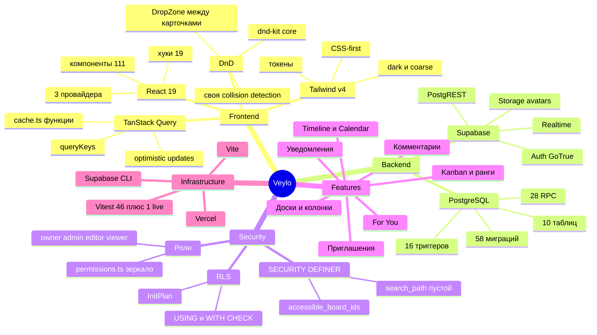
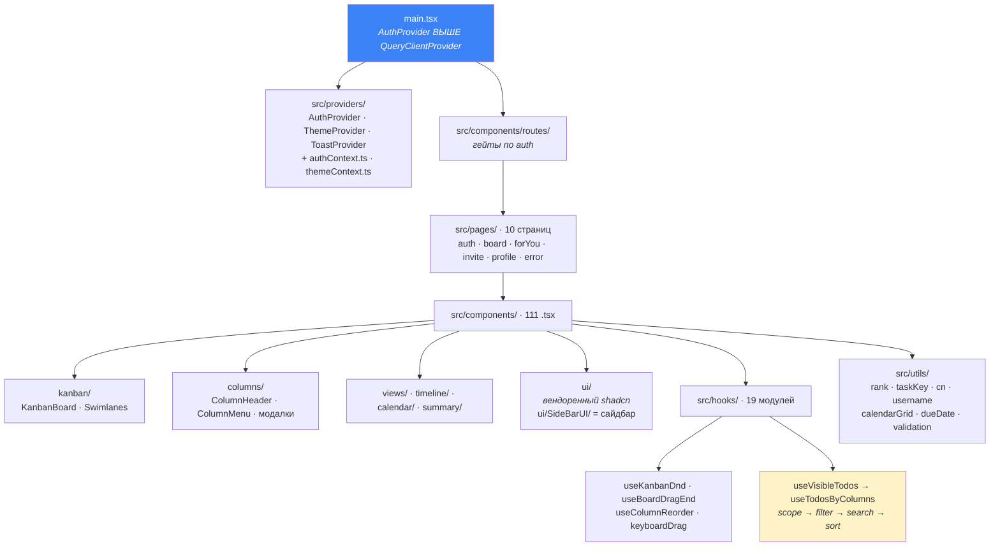
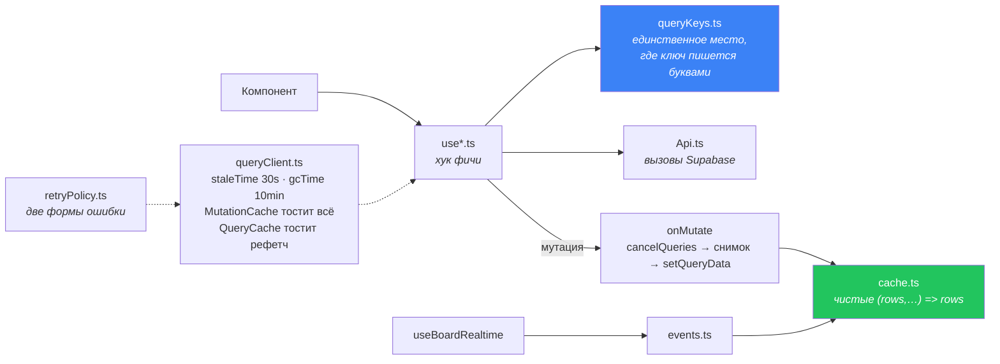
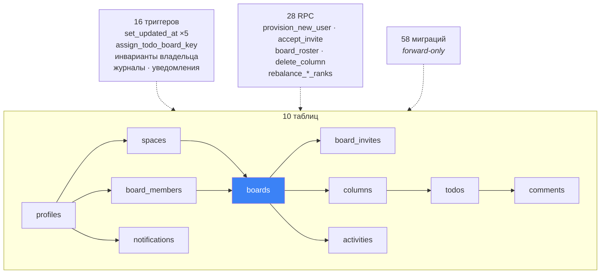
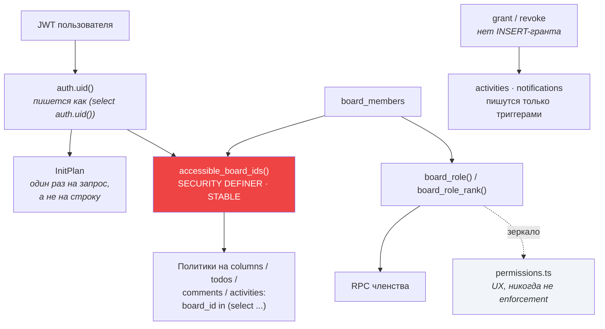
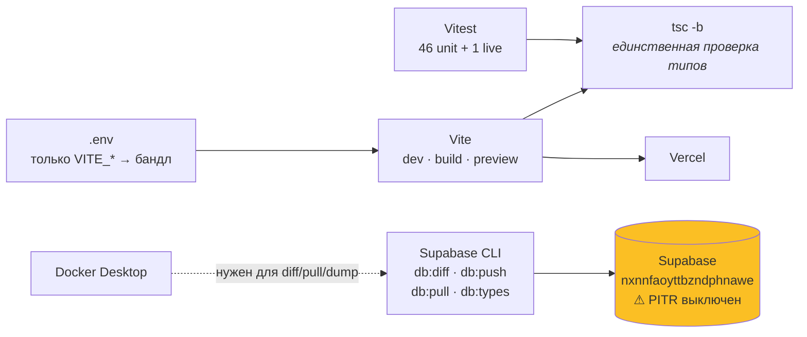
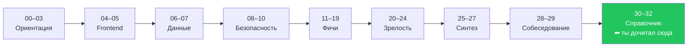

# 32 · Карта знаний

[← 31 · Практические задания](31-exercises.md) · [Оглавление](README.md)

---

Последняя страница курса. Здесь нет нового материала — здесь всё уже прочитанное,
разложенное так, чтобы стало видно **где ты**, **что связано с чем** и **что осталось
непонятым**.

---

## 🗺 Veylo одной картинкой

---

## 🌳 Дерево проекта по областям

### 🎨 Frontend

**Что стоит помнить про эту половину:**

| Факт | Почему так |
|---|---|
| Баррелей нет | импорт по прямому пути; единственный `index.ts` — в `i18n/` |
| Контексты в отдельных файлах | Fast Refresh не обновляет модуль, где компонент + другой экспорт |
| `AuthProvider` выше `QueryClientProvider` | поэтому он импортирует `queryClient` как модуль, а не через хук |
| `ErrorBoundary` на список **каждой** колонки | одна битая карточка стоит одного списка |
| React Compiler выключен | измерено: 2.7× сборки, +25 % к чанку доски |

---

### 📊 Слой данных

**Зелёный узел — ключ ко всей архитектуре.** Функции `apply*` вынесены из замыканий
мутаций именно затем, чтобы realtime мог применить **те же** преобразования к тому же
массиву, когда изменение пришло от другого клиента. Колбэк канала не может залезть
внутрь `onMutate`.

---

### 🗄 Backend

---

### 🔐 Безопасность

**Красный узел — точка расширения.** M3 расширил доступ с «владелец» до «участник»,
поменяв **одну функцию** и не тронув ни одной политики. Если поймёшь только это из всей
главы 08 — уже много.

---

### 🧩 Фичи

| Фича | Где живёт | Одна вещь, которую надо помнить |
|---|---|---|
| Доски и колонки | `services/boards/`, `services/columns/`, `components/columns/` | `restrict` на `todos.column_id` диктует UI удаления |
| Kanban | `components/kanban/`, `hooks/useKanbanDnd.ts`, `utils/rank.ts` | двигается только `DragOverlay`; ход = одна строка |
| Timeline | `components/timeline/`, `services/views/timeline.ts` | тащит, но пишет **даты**, не `position` |
| Calendar | `components/calendar/`, `services/views/calendar.ts` | то же самое: `canReorder: false` |
| Комментарии | `services/comments/`, `components/comments/` | `board_id` пришпилен составным FK |
| Уведомления | `services/notifications/` | только триггеры; `read_at`, а не `is_read` |
| Приглашения | `services/invites/`, `components/invites/` | токен = пропуск; только RPC |
| For You | `services/forYou/` | не board-scoped: фильтр — сама RLS. **Starred нет** |
| Участники | `services/members/` | `permissions.ts` — зеркало `board_role_rank` |
| Представления | `services/views/registry.ts` | ровно один вид пишет порядок, и это тест |

---

### 🔧 Инфраструктура

---

## 🧭 Ты здесь

Если ты попал сюда, пройдя всё подряд, — вернись к [31 · Упражнениям](31-exercises.md) и
проверь себя делом. Если пришёл коротким маршрутом из README — чек-лист ниже покажет,
что пропущено.

---

## ✅ Чек-лист самопроверки

> Правило: галочка ставится, только если ты можешь объяснить это **вслух, без
> подсматривания, минуту связного текста**. «Примерно понимаю» — это не галочка.

### Ориентация

- [ ] Могу объяснить, **что такое Veylo** и зачем он — [00](00-overview.md)
- [ ] Могу нарисовать **все слои** и провести запрос от клика до БД и обратно — [01](01-architecture.md)
- [ ] Могу сказать, **где что лежит** и почему нет баррелей — [02](02-project-structure.md)
- [ ] Могу защитить **каждую зависимость**: зачем она и что было бы вместо — [03](03-stack.md)

### Frontend

- [ ] Могу объяснить, почему **контексты в отдельных файлах** — [04](04-react.md)
- [ ] Могу описать **`onMutate` → `onError` → `onSettled`** и зачем снимок — [05](05-data-flow.md)
- [ ] Могу объяснить, почему **`apply*` не мутируют вход** — [05](05-data-flow.md)
- [ ] Могу объяснить разницу **`staleTime` и `gcTime`** — [05](05-data-flow.md)
- [ ] Могу назвать, **что решает `queryKeys.ts`** и почему `boardId` обязателен — [05](05-data-flow.md)
- [ ] Могу объяснить, **где живёт порядок карточек** и почему сортировка одна — [12](12-kanban.md)
- [ ] Могу описать **маршруты** и что такое URL как состояние — [17](17-routing.md)
- [ ] Могу объяснить, зачем **токены** и почему нет `text-[12.5px]` — [18](18-design-system.md)
- [ ] Могу сказать, что делает **`coarse`** и почему мобильный ≠ уменьшенный десктоп — [19](19-mobile.md)

### Данные

- [ ] Могу перечислить, **что из Supabase Veylo реально использует** — [06](06-supabase.md)
- [ ] Могу назвать **все 10 таблиц** и связи между ними — [07](07-database.md)
- [ ] Могу объяснить **составной FK** `(column_id, board_id)` — [07](07-database.md)
- [ ] Могу объяснить **частичный индекс** на непрочитанных — [07](07-database.md)
- [ ] Могу рассказать, как **триггер выдаёт номер KAN-** и почему проверяет `exists` — [07](07-database.md)
- [ ] Могу расписать **expand → backfill → contract** на конкретном примере — [21](21-migrations.md)
- [ ] Могу объяснить, почему миграции **forward-only** и что это значит для отката — [21](21-migrations.md)

### Безопасность

- [ ] Могу объяснить **RLS** так, чтобы понял не-технарь — [08](08-security.md)
- [ ] Могу объяснить разницу **`USING` и `WITH CHECK`** — [08](08-security.md)
- [ ] Могу объяснить **`SECURITY DEFINER`** и чем он опасен — [08](08-security.md)
- [ ] Могу объяснить, зачем **`set search_path = ''`** — [08](08-security.md)
- [ ] Могу объяснить **InitPlan** и почему `(select auth.uid())` — [08](08-security.md)
- [ ] Могу объяснить, что даёт **`accessible_board_ids()`** как точка расширения — [08](08-security.md)
- [ ] Могу описать **регистрацию и подтверждение почты** по шагам — [09](09-auth.md)
- [ ] Могу объяснить **гонку username** и почему её решает только `unique index` — [10](10-usernames.md)

### Фичи

- [ ] Могу объяснить, почему **Space — не область прав** — [11](11-spaces-boards-tasks.md)
- [ ] Могу объяснить **дробные ранги** и когда нужна перебалансировка — [12](12-kanban.md)
- [ ] Могу объяснить, почему DnD **самодельный**, а не `@dnd-kit/sortable` — [12](12-kanban.md)
- [ ] Могу описать математику **дата → колонка → пиксель** — [13](13-timeline.md)
- [ ] Могу объяснить, почему уведомления **пишутся только триггерами** — [14](14-notifications.md)
- [ ] Могу описать **жизненный цикл приглашения** и роль токена — [15](15-invitations.md)
- [ ] Могу объяснить, почему у For You **нет фильтра по доске** — [16](16-for-you.md)
- [ ] Знаю, почему **вкладки Starred нет** — [16](16-for-you.md)

### Зрелость

- [ ] Могу объяснить, **что тестируется и что нет**, и почему нет RTL — [20](20-testing.md)
- [ ] Могу проследить **путь ошибки** от Postgres до тоста — [22](22-errors.md)
- [ ] Могу назвать, **где Veylo замедлится** первым — [23](23-performance.md)
- [ ] Могу объяснить, почему забытая env — это **пересборка**, а не передеплой — [24](24-deployment.md)

### Синтез

- [ ] Могу провести **любой из 13 сценариев** от клика до БД — [25](25-user-journeys.md)
- [ ] Могу сказать, **в каком порядке строил бы это сам** и почему — [26](26-rebuild-from-zero.md)
- [ ] Могу назвать **альтернативу и цену** для 5 ключевых решений — [27](27-architecture-decisions.md)
- [ ] Могу ответить на **вопросы по архитектуре и безопасности** — [28](28-interview-questions.md)
- [ ] Могу разобрать поломку по схеме **симптом → гипотеза → фикс** — [29](29-debugging.md)

### Справочник

- [ ] Знаю **все термины** из своей области — [30](30-glossary.md)
- [ ] Прошёл **Easy и Medium** целиком — [31](31-exercises.md)
- [ ] Прошёл хотя бы **два Expert** — [31](31-exercises.md)

---

## 🎯 Порог «объясню CTO»

Не весь чек-лист. Вот эти двенадцать:

| # | Утверждение | Глава |
|---|---|---|
| 1 | Граница безопасности — RLS, а не React | [08](08-security.md) |
| 2 | `accessible_board_ids()` — одна точка расширения модели прав | [08](08-security.md) |
| 3 | `(select auth.uid())` — это про InitPlan, а не про стиль | [08](08-security.md) |
| 4 | `permissions.ts` — UX, и никогда не enforcement | [08](08-security.md) |
| 5 | Ход карточки — **одна** строка, потому что ранг дробный | [12](12-kanban.md) |
| 6 | `id` минтит клиент — отсюда и оптимистичность, и подавление эха | [05](05-data-flow.md) |
| 7 | Составной FK делает «чужую колонку» непредставимой | [07](07-database.md) |
| 8 | Инварианты живут в триггерах, потому что писатель не один | [07](07-database.md) |
| 9 | `activities` и `notifications` — свидетельство, а не заявление клиента | [14](14-notifications.md) |
| 10 | Один пайплайн `useVisibleTodos` — потому что два разошлись бы | [05](05-data-flow.md) |
| 11 | Миграции только вперёд, и PITR выключен | [21](21-migrations.md) |
| 12 | Каждое «нет» в проекте (RTL, React Compiler, sortable) — измеренное решение | [03](03-stack.md), [20](20-testing.md) |

Можешь развернуть любые двенадцать по минуте — курс сделал свою работу.

---

[← 31 · Практические задания](31-exercises.md) · [Оглавление](README.md)
