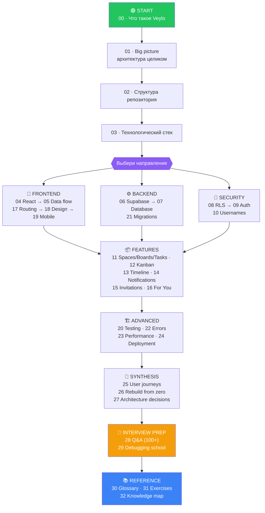

# Veylo — Complete Engineering Guide

> **Это не README. Это курс.**
>
> Цель — довести тебя от «я вижу код» до «я могу объяснить Veylo техническому
> директору, защитить каждое архитектурное решение и переписать половину проекта
> без чужой помощи».

---

## Как устроен этот курс

Каждая сложная идея объясняется **в трёх слоях**:

| Слой | Кому | Что даёт |
|---|---|---|
| 🧒 **LEVEL 1 — «восьмилетнему»** | всем | аналогия, которая застревает в голове |
| 👷 **LEVEL 2 — «разработчику»** | тебе за клавиатурой | реальный код, точные термины |
| 🏛 **LEVEL 3 — «архитектору»** | тебе на собеседовании | почему так, альтернативы, риски, цена |

Правило точности: **всё, что здесь написано про Veylo, проверено по репозиторию.**
Если факт установить не удалось — так и написано: *«Repository evidence is
insufficient to determine this.»* Ничего не выдумано.

---

## 🚦 START HERE — маршрут обучения

---

## 📖 Оглавление

### Уровень 0 — Ориентация (читай первым, ~1 час)

| # | Глава | О чём | Время |
|---|---|---|---|
| 00 | [Что такое Veylo](00-overview.md) | продукт, метафора, 30-секундный питч для босса | 15 мин |
| 01 | [Big Picture Architecture](01-architecture.md) | все слои + 5 полных трассировок «клик → БД → UI» | 30 мин |
| 02 | [Структура проекта](02-project-structure.md) | карта папок, архитектурные границы, кто кого импортирует | 20 мин |
| 03 | [Технологический стек](03-stack.md) | каждая зависимость: что делает, зачем здесь, альтернатива | 25 мин |

### Уровень 1 — Frontend

| # | Глава | О чём | Время |
|---|---|---|---|
| 04 | [React в Veylo](04-react.md) | компоненты, хуки, провайдеры, композиция — на реальных примерах | 45 мин |
| 05 | [TanStack Query и поток данных](05-data-flow.md) | query, mutation, cache, optimistic updates — самая важная глава фронта | 60 мин |
| 17 | [Роутинг](17-routing.md) | защищённые/публичные маршруты, URL как состояние, push vs replace | 25 мин |
| 18 | [Дизайн-система](18-design-system.md) | токены, шкала типографики, почему нет `text-[12.5px]` | 25 мин |
| 19 | [Мобильная архитектура](19-mobile.md) | почему мобильный ≠ «десктоп поменьше», `coarse` variant | 20 мин |

### Уровень 2 — Backend и данные

| # | Глава | О чём | Время |
|---|---|---|---|
| 06 | [Supabase](06-supabase.md) | Auth, PostgREST, RPC, Realtime, Storage — и что из этого Veylo реально использует | 35 мин |
| 07 | [База данных](07-database.md) | ER-диаграмма, 10 таблиц, ключи, индексы, триггеры | 50 мин |
| 21 | [Миграции](21-migrations.md) | 58 миграций, expand→backfill→contract, что пошло не так | 35 мин |

### Уровень 3 — Безопасность

| # | Глава | О чём | Время |
|---|---|---|---|
| 08 | [RLS и модель безопасности](08-security.md) | 🔥 **сильнейшая глава**. Политики, SECURITY DEFINER, привилегии | 60 мин |
| 09 | [Аутентификация](09-auth.md) | регистрация, подтверждение, вход, сброс пароля, JWT, sequence-диаграммы | 45 мин |
| 10 | [Система username](10-usernames.md) | нормализация, race condition, уникальный индекс | 30 мин |

### Уровень 4 — Фичи

| # | Глава | О чём | Время |
|---|---|---|---|
| 11 | [Spaces / Boards / Tasks](11-spaces-boards-tasks.md) | иерархия, «Unfiled», каскады удаления | 30 мин |
| 12 | [Kanban и Drag & Drop](12-kanban.md) | 🔥 самодельный DnD, fractional ranks, алгоритм перемещения | 55 мин |
| 13 | [Timeline](13-timeline.md) | математика: дата → колонка → пиксель, drag/resize/create | 45 мин |
| 14 | [Уведомления](14-notifications.md) | триггеры, типы, unread, почему токенов там нет | 30 мин |
| 15 | [Приглашения](15-invitations.md) | полный жизненный цикл, безопасность токена | 35 мин |
| 16 | [For You](16-for-you.md) | персональная лента, 4 вкладки, «Viewed» в localStorage | 25 мин |

### Уровень 5 — Инженерная зрелость

| # | Глава | О чём | Время |
|---|---|---|---|
| 20 | [Тестирование](20-testing.md) | 46 unit-тестов, live-suite, SQL-харнессы | 30 мин |
| 22 | [Обработка ошибок](22-errors.md) | путь ошибки: Postgres → Supabase → hook → пользователь | 30 мин |
| 23 | [Производительность](23-performance.md) | где Veylo замедлится, что уже оптимизировано | 30 мин |
| 24 | [Деплой](24-deployment.md) | Vercel, env vars, что где должно лежать | 25 мин |

### Уровень 6 — Синтез

| # | Глава | О чём | Время |
|---|---|---|---|
| 25 | [Полные user journeys](25-user-journeys.md) | 13 сценариев от клика до БД и обратно | 50 мин |
| 26 | [Как бы я построил это сам](26-rebuild-from-zero.md) | 12 фаз, что знать перед каждой | 40 мин |
| 27 | [Почему мы сделали так](27-architecture-decisions.md) | 25 решений: причина, альтернатива, компромисс | 45 мин |

### Уровень 7 — Подготовка к собеседованию

| # | Глава | О чём | Время |
|---|---|---|---|
| 28 | [Вопросы с собеседования](28-interview-questions.md) | 🎤 **126 вопросов** с сильными ответами | 90 мин |
| 29 | [Школа отладки](29-debugging.md) | 10 реальных поломок: симптом → гипотеза → фикс | 40 мин |

### Справочник

| # | Глава | О чём |
|---|---|---|
| 30 | [Глоссарий](30-glossary.md) | 112 терминов в трёх слоях |
| 31 | [Практические задания](31-exercises.md) | 40 упражнений: Easy 12 · Medium 12 · Hard 10 · Expert 6 |
| 32 | [Карта знаний](32-knowledge-map.md) | всё дерево проекта одной картинкой |

---

## ⏱ Реалистичный план обучения

```mermaid
gantt
    dateFormat X
    axisFormat %s
    title От нуля до «объясню CTO»

    section Неделя 1 — Ориентация
    Главы 00-03 (ориентация)        :0, 4
    Главы 04-05 (React + Query)     :4, 8

    section Неделя 2 — Данные
    Главы 06-07 (Supabase + БД)     :8, 12
    Глава 08 (RLS)                  :12, 15
    Главы 09-10 (Auth + usernames)  :15, 18

    section Неделя 3 — Фичи
    Главы 11-13 (Boards/Kanban/Timeline) :18, 23
    Главы 14-16 (Notif/Invites/ForYou)   :23, 27

    section Неделя 4 — Зрелость
    Главы 17-24                     :27, 33
    Главы 25-27 (синтез)            :33, 38

    section Неделя 5 — Собеседование
    Глава 28 (126 вопросов)         :38, 43
    Главы 29-31 (debug + практика)  :43, 48
```

**Итого ≈ 45–50 часов вдумчивого чтения + практики.**

Если времени мало — **минимальный маршрут за 6 часов** (чтобы не опозориться на
демо перед боссом):

1. [00 · Overview](00-overview.md) — 15 мин
2. [01 · Architecture](01-architecture.md) — 30 мин
3. [05 · Data flow](05-data-flow.md) — 60 мин
4. [08 · Security / RLS](08-security.md) — 60 мин
5. [12 · Kanban / DnD](12-kanban.md) — 55 мин
6. [25 · User journeys](25-user-journeys.md) — 50 мин
7. [28 · Interview Q&A](28-interview-questions.md), разделы «Безопасность» + «Архитектура» — 90 мин

---

## 🧪 Как проверять себя

В конце каждой главы есть **мини-квиз**. Правило одно:

> Сначала ответь вслух. Потом раскрой ответ.
> Если ты «примерно понял» — ты не понял.

Формат:

<b>Вопрос:</b> почему валидация на фронте не может гарантировать уникальность username?

Потому что между проверкой и вставкой проходит время, за которое другой
клиент может занять то же имя. Гарантию даёт только `unique index` в базе —
он атомарен на уровне транзакции. Фронт лишь сокращает число неприятных
сюрпризов. Подробно — [глава 10](10-usernames.md).

---

## 📊 Что внутри курса

Всё посчитано по файлам на диске, не на глаз.

| Метрика | Значение |
|---|---|
| Глав | **33** + эта страница |
| Строк документации | **~19 800** |
| Mermaid-диаграмм | **86** |
| Таблиц | **199** |
| Вопросов для собеседования (гл. 28) | **126** |
| Терминов в глоссарии (гл. 30) | **112** |
| Практических упражнений (гл. 31) | **40** (Easy 12 · Medium 12 · Hard 10 · Expert 6) |
| Мини-квизов в главах | **213** |
| Разобранных user journeys (гл. 25) | **13** |
| Архитектурных решений с разбором (гл. 27) | **28** |
| Внешних учебных ссылок | **26**, каждая с заданием «что отсюда взять» |

### Проверенные числа о самом проекте

Эти цифры используются по всему курсу — они пересчитаны по репозиторию:

| Метрика | Значение |
|---|---|
| Файлов `.ts` / `.tsx` в `src/` | 320 |
| React-компонентов (`.tsx` в `components/`) | 111 |
| Страниц (`src/pages/`) | 10 |
| Модулей в `src/hooks/` | 19 (+ 2 файла тестов) |
| Сервисных папок (`src/services/`) | 16 |
| SQL-миграций | 58 |
| Таблиц в схеме `public` | 10 |
| RPC в схеме `public` | 28 (+ служебная `graphql` в `graphql_public`) |
| Триггеров | 16 |
| Файлов тестов | 47 = **46** unit (гейт CI) + **1** live |
| SQL-харнессов прав | 4 (209 проверенных случаев) |

---

## ⚠️ Дисклеймер о точности

Курс написан по состоянию репозитория на ветке `main`, коммит `19ee1fa`.

Три документа в `docs/` частично устарели относительно кода — это отмечено
там, где важно:

- `docs/ARCHITECTURE.md` и `docs/DATABASE.md` местами описывают **планируемые**
  таблицы (`attachments`, `labels`, `todo_labels`), которых в схеме **нет**.
- `docs/IMPLEMENTATION_PLAN.md` — это исторический журнал, доведённый до M20.
  Работы после него (usernames, notifications, production polish) в нём не
  отражены, но есть в git-истории и в коде.
- `CLAUDE.md` ссылается на `src/types/database.types.ts`; реальный файл —
  `src/types/database.ts`.

Курс описывает **код, а не планы**.

---

**Начинай отсюда → [00 · Что такое Veylo](00-overview.md)**
